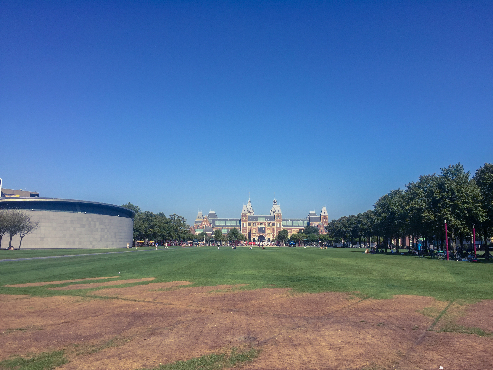
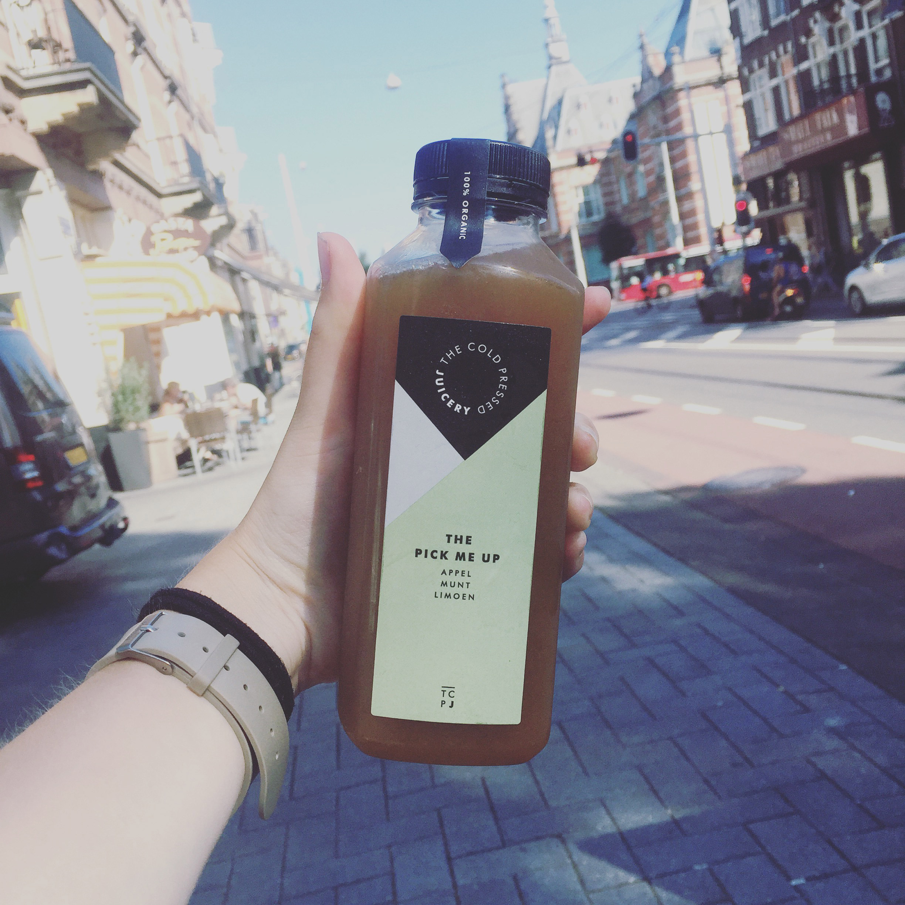

Nous sommes seulement à notre deuxième jour sur place et pourtant, au moment ou j’écris (Clémence), **j’ai l’impression que nous y sommes depuis plus d’une semaine.** Nous ne faisons pas tant de grosses journées, dans le sens où nous nous permettons de nous lever après 8h. Pour autant, le fait de continuellement devoir s’exprimer en anglais avec les gens, de marcher énormément pour se déplacer (j’ai bien hâte d’avoir un vélo !), la chaleur assez accablante mais aussi le fait d’être toujours dans la découverte (nouvelles rues, nouveaux magasins, nouvel arrêt de Tram, nouvel appartement visité, ...), les journées sont exténuantes et je dors comme un bébé le soir.

Cette deuxième journée passée à Amsterdam fut pleines de surprises et c’est pourquoi nous l’avons nommée « la journée What the Fuck ? » !

## Des visites, toujours des visites

Au programme, trois visites d’appartement. 10h30, 11h15 puis 17h. La première est vraiment chouette, l’appart est génial, joliment meublé (il y a même un lit parapaluie pour bébé LOL), le quartier aussi. Nous envoyons le dossier par mail, reste plus qu’à attendre.
La seconde est complètement à l’opposé de la première. Tout d’abord, nous sommes dans Bos en Lommer, le seul quartier d’Amsterdam dont nous ayons entendus des mauvais échos car forte concentration de logement sociaux. Pour autant, le parc juste à côté est bien sympa ... Nous visitons un appartement en même temps que 2 autres personnes avec deux agents immobilier. On a trouvé ça un peu bizarre. Et l’appartement, bien qu’il possède un jardin, est totalement vieillot, non meublé, le jardin à l’abandon (avec deux belles grosses toile d’araignées), les installations « rustiques », cuisine non équipée,... Bref pour 1250 euros par mois, on trouve ça largement abusé et nous ne donnons même pas notre dossier.

## « May I ? »

Il fait une fois de plus très chaud aujourd’hui! Je suis bien contente de pouvoir profiter de mon bronzage encore un peu et porter short / débardeur. C’est un peu le prolongement des vacances en Croatie, la mer en moins ...
Pour éviter de couler au soleil, nous prenons le tram pour rejoindre le centre en quête d’un magasin Vodafone. Enfin bon, je devrais plutôt dire le four plutôt que le tram ! Nous nous dirigeons vers une place assise à l’arrière, et là BAM ! Pas le plus grand des hasards, nous croisons Mathis et Madjid (copains Gobelins). Eux aussi sont en train de s’installer sur Amsterdam et commencent à travailler début Octobre. C’était vraiment drôle. La coïncidence tellement improbable. Mais cela fait du bien de croiser quelques visages familier !

## +31 6 21   **

C’est après avoir fait 3 magasins Vodafone différents que **nous pouvons enfin dire que nous avons un numéro de téléphone DUTCH !** Youhou, nous commençons à quitter la case « touriste » pour la case « local » ! C’est pour l’instant une simple carte pré-payée mais lorsque nous aurons un logement, un BSN et un compte en banque, nous pourrons garder le même numéro cette fois-ci avec un véritable abonnement. Ce sera désormais plus simple pour nous de joindre des agences / propriétaires et inversement.

17h arrive et avec la troisième et dernière visite de la journée. C’est selon l’annonce un appartement meublé, disponible immédiatement, seulement 33m3 et sans balcon, dans un quartier plutôt chouette (à seulement 10 min à pied de ma future agence).
Nous le visitons, l’appartement est sympa, c’est plutôt propre et neuf, mais contrairement aux autres, j’ai beaucoup plus de mal à m’y projeter. Je m’y sens moins chez moi. L’odeur de cigarette ambiante y est surement pour quelque chose ... Le propriétaire nous explique qu’il faut donner une décision très rapidement car quelqu’un arrive à 19h en étant sûre de le prendre mais qu’il préférerait le louer à un couple (car plus cher à cause de je ne sais trop quelles charges). Dans ma tête tout est secoué. Ce n’est pas que je ne n’aime pas l’appartement. Mais il est plus petit que ce qu’on avait et il n’y a pas de balcon alors que c’était un critère qui nous tenait à coeur. C’est plutôt joli et bien neuf, entièrement meublé. Et pourtant, je ne m’y sens pas bien. Je demande à Alexis d’aller faire un tour pour y réfléchir. Je suis intérieurement en plein dilemme avec moi même car malgré tout, je sais que c’est une grosse connerie de refuser un logement lorsque nous en trouvons enfin un. Rien n’est sûre pour les autres dossiers déposés. On ne peut pas se permettre de passer à côté ... Après une discussion non moins des plus chaleureuse, je prend sur moi et j’accepte d’accepter de prendre cet appartement.
Nous y retournons, avec en tête, signer un contrat de location.
Le gars semble content de notre décision et commence à nous parler du loyer et de la caution. Comme nous ne souhaitons y aménagement qu’à partir de vendredi, il nous explique qu’il demande alors une petite caution pour « acter » la location. Nous ne le remarquons pas tout de suite, mais à aucun moment il ne nous a questionné sur nos revenus, ce qui est un peu la question de base pour tout loueur. Nous déchantons et commençons à comprendre l’entourloupe lorsqu’il explique ne pas vouloir faire de contrat écrit, qu’il n’en a pas, qu’à Amsterdam ça se fait beaucoup de louer « verbalement ». bla bla bla. Et ce qui nous arrête définitivement, c’est cette phrase :**« so, to be sure you will rent the apartment, I need you to give 500€ of guarantee cash because you don’t have a dutch bail account yet »**. Là je regarde Alexis et lui dit en français « C’est mort, on se casse ». Il essaie de parlementer rapidement avec nous, qu’il nous laisse son permis, son ID, en guise de garantie etc ... Non ça ne marcheras pas, et nous partons aussi vite que nous sommes arrivés.

On a eu peur pendant un moment que le gars devienne violent mais il n’a pas trop insisté et nous a laissé partir sans soucis.
Après coup en y repensant, il y avait plusieurs incohérence dans son discours :
- il le loue soi-disant en attendant sur Airbnb mais nous ne l’avons pas trouvé,
- il dit être propriétaire et le loue car il a repris ses études, à besoin d’argent et à décider d’habiter avec sa copine. Pourquoi aller payer un deuxième loyer ?
- Dès le premier contact par message, il avait mis en place une forme de pression « you need to decide fast » et cela aurait du nous alerter tout de suite.
Qu’à cela ne tienne, nous le saurons pour la prochaine fois et le principal reste que nous ayons toujours nous 500 euros dans notre compe en banque et pas le sien. Pour évacuer la montée d’adrenaline, nous marchons jusqu’à mon agence, que je n’ai encore jamais vue en vrai ! Les bâtiments ont l’air super jolis vu de l’extérieur !

## Salvatorica

Nous terminons notre journée en nous octroyant le plaisir d’un restaurant. Mais surtout pas n’importe lequel. L’italien dans le Jordaan que nous avions découvert par pur hasard l’année dernière et que nous avions adoré. C’est une espèce de « cantine » toute simple ou ils fabriquent des pâtes et des raviolis frais l’après-midi qu’ils servent le soir accompagné d’une sauce. La carte changent régulièrement. Pour nous aujourd’hui, ce sera 2 tagliatelles au pesto et 2 tiramisu! **C’était, une fois de plus un vrai délice, et on a hâte de vous y emmener lorsque vous viendrez 😉**
