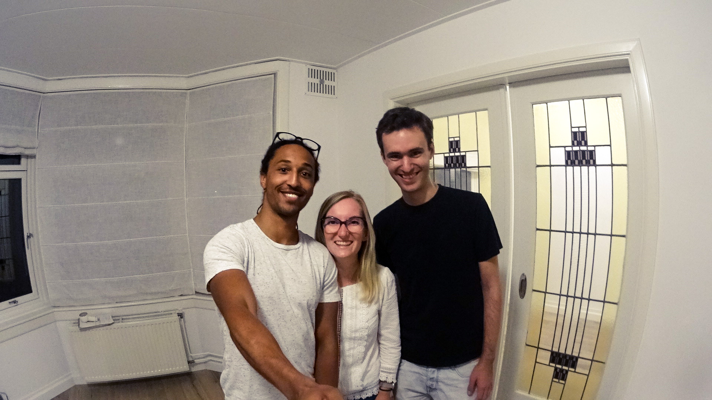
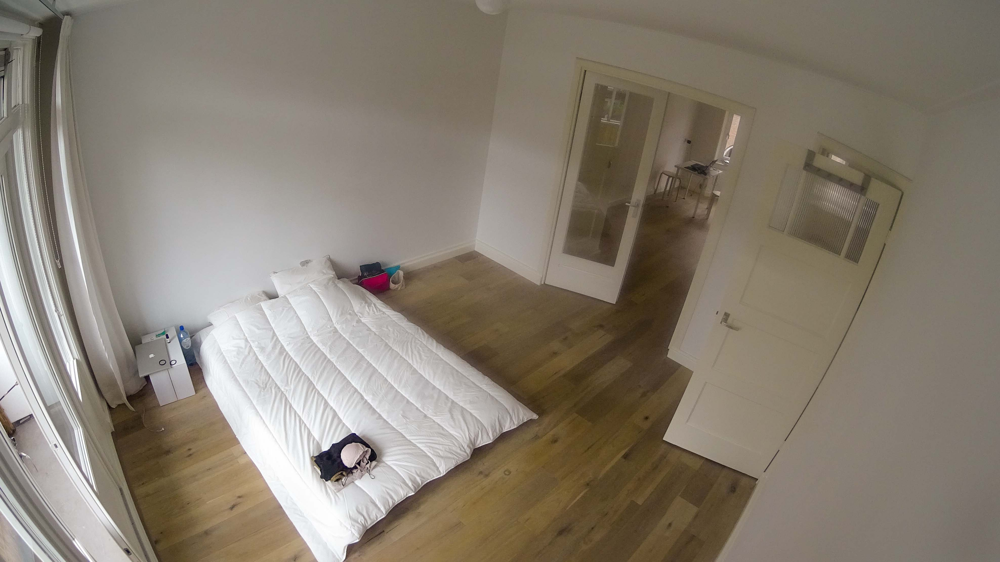
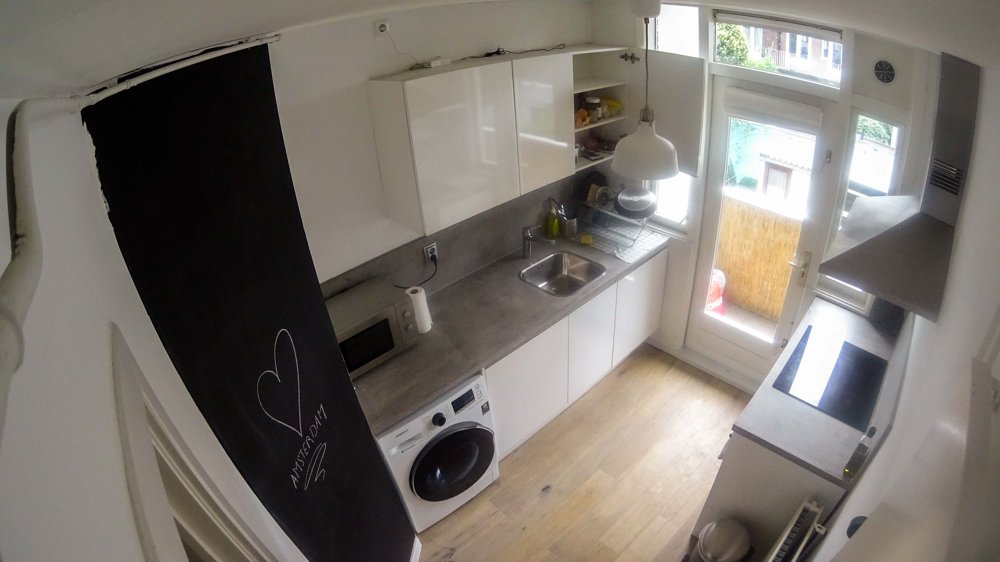
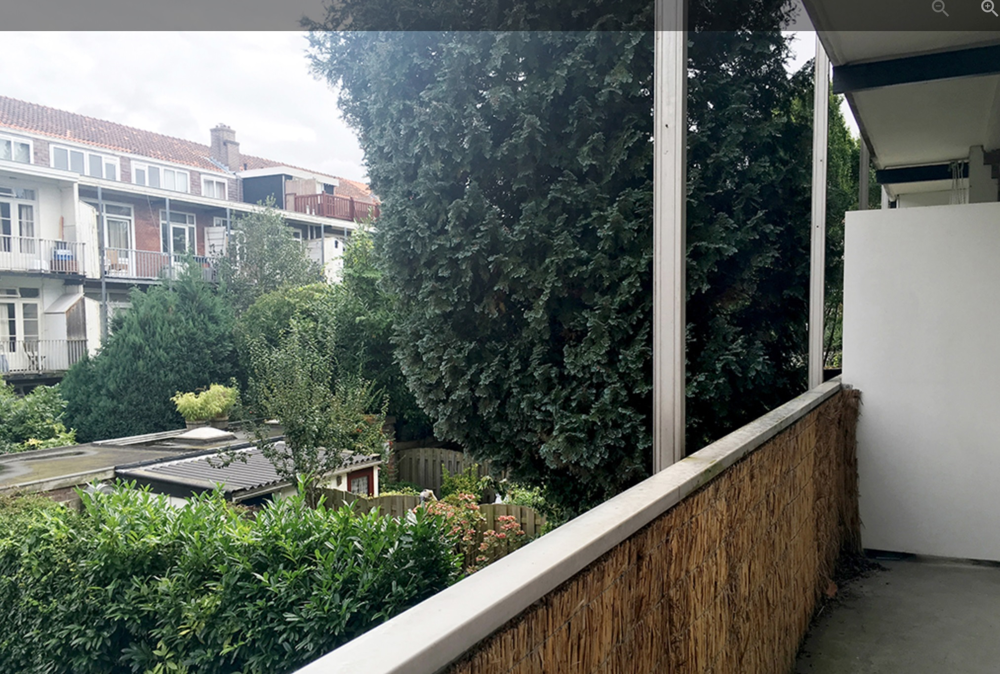
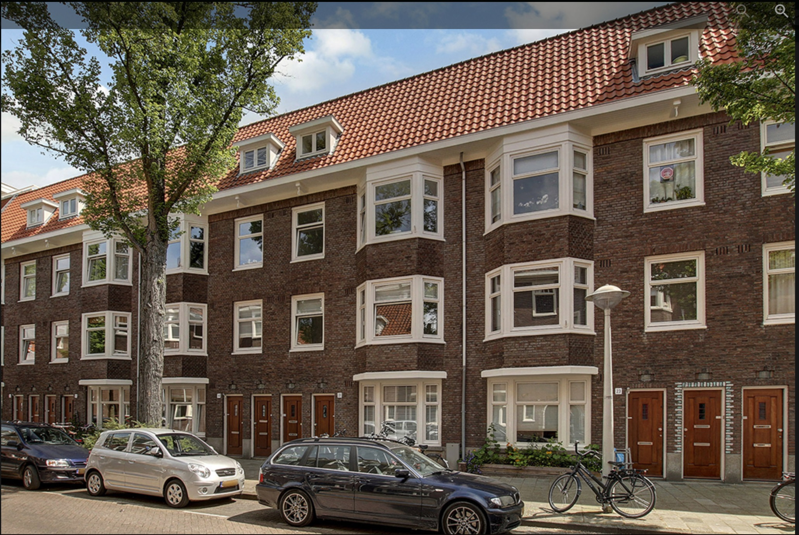
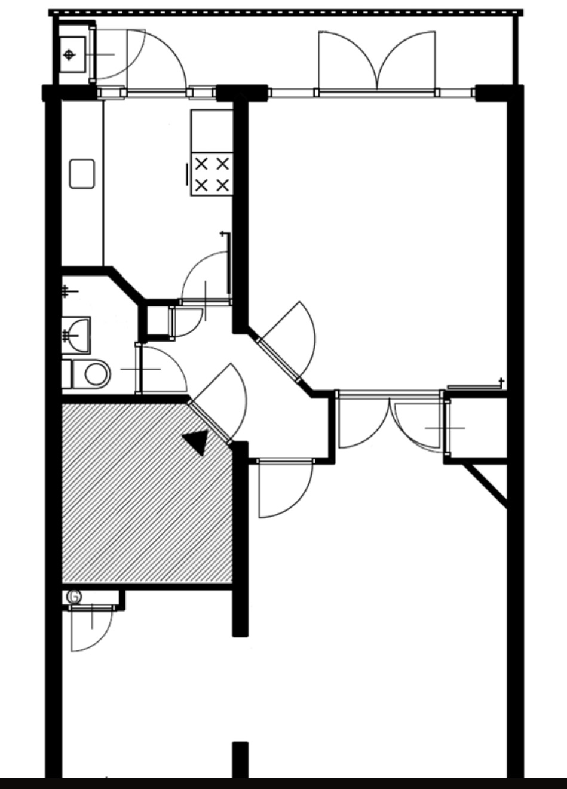

C’est avec une immense joie que j’écris ce troisième article depuis **chez nous !** Et oui, depuis le 17 septembre 2016, nous pouvons officiellement dire que nous habitons Amsterdam. Nous vous emménagé dans **notre appartement**. C’est juste trop génial et on va vous raconter un peu comment ça s’est passé, parce qu’honnêtement, ça n’a pas été de tout repos ! Et pardonnez la longueur du texte 🙂

## Visite - Leiduinstraat - 21

Après la mésaventure de la dernière fois (le gars qui nous demandait 500€ pour soit disant réserver l’appartement, cf article précédent), comme on dit par ici les « scam » (comprendre « arnaque »), nous appréhendions beaucoup les autres visites programmées. On était limite devenu un peu parano (enfin, surtout Alexis). Et puis, faut dire que nous étions sans nouvelles des autres appartements visités. On commençait un peu à s’inquiéter...

Ce mercredi 14 septembre, nous n’avions qu’une seule visite de prévu. Et, même si c’était une erreur au départ de ma part, j’y avais placé beaucoup d’espoir en me disant que ce serait surement la bonne.
Nous avions RDV en début d’après-midi mais nous devions aussi y retourner le soir pour rencontrer la copine du propriétaire. En fait, c’est un jeune couple germano-dutch qui ont acheté 2 appartements récemment. Ils vivent au deuxième étage et souhaitent louer le premier. Comme les futurs locataires seraient aussi leur futurs voisins, ils souhaitaient et c’est bien normal, les rencontrer ensemble. Forcément, même si il n’est pas meublé (mais cuisine complète), l’appartement nous plait. Pour ma part, c’est presque exactement ce que j’imaginais : balcon, exposition traversante est/ouest, refait à neuf, petite alcove, ... Le jeune propriétaire, âgé d’une trentaine d’année, est vraiment super gentil, très souriant et amical.

Pour la seconde visite, j’ai une sensation de stress. Comme si je savais par avance qu’elle était importante. Nous avons rdv à 21h30. Nous sommes un peu en avance et décidons donc de faire un tour dans le voisinage. C’est un quartier très calme, résidentielle, tout mignon, proche d’un canal et du tram. Le petit hic est que nous ne voyons pas de magasins à proximité. Sauf peut être une mini-supérette.
Nous y sommes à 21h28. Mais aucune lumière allumée depuis les fenêtres donnant sur la rue, dans aucun des deux appartements. On trouve ça bizarre. On sonne, personne ne répond non plus. À 21h31, toujours rien. On se dit « bah merde, on va encore finir la journée sur une mauvaise note ». Et puis, nous apercevons une jeune dame arrivant dans notre direction avec une valise. Il se trouve que c’est la fameuse copine qui vient à peine de rentrer de vacances. Au même moment, le gars, qu’on avait rencontré plus tôt, arrive en vélo. OUF ! Ils ne nous ont pas fait faux-bon, on était juste un peu à l’avance.

Ils nous invitent à rentrer chez eux. On constate qu’ils sont en fait à peine installé, avec seulement un canapé dans le salon et deux trois poufs. Nous discutons pendant plus d’une heure. De manière très « friendly ». D’où nous venons ? Pourquoi Amsterdam ? Que faisons-nous dans la vie ? Depuis combien de temps nous sommes ensemble ? Si nous avions déjà visité d’autres appartements ? etc ... Bref, ils avaient envie d’en savoir plus sur nous. Lui est musicien-violoniste professionnel. Elle est designer graphique ! La conversation se termine plus ou moins sur un « vous n’êtes pas obligés de nous donner une réponse ce soir, réfléchissez-y cette nuit et faite-le nous savoir demain ». On avait un peu du mal à y croire mais la manière dont ils le disaient résonnait beaucoup comme « si vous voulez l’appartement, il est à vous ! ».

## Kadaster - ou la transparence totale à Amsterdam

Contrairement à ce qu’on aurait pu croire, on était loin d’être heureux. Enfin moi si, j’avais envie d’y croire, **j’adorais l’appartement** et je vendais presque la peau de l’ours avant de l’avoir tué comme on dit. Par contre, je n’ai jamais vu Alexis aussi angoissé ! De retour au Airbnb, impossible pour lui de dormir. Il veut trouver un moyen de vérifier si ce n’est pas une arnaque une fois de plus. Pour cela, nous nous rendons sur le cadastre néerlandais. Pour 10 euros environ, vous pouvez savoir immédiatement qui est le propriétaire de tel appartement à telle adresse, quels sont les plans et meme les différents prêts qui ont pu être fait pour acheter le bien. C’est un peu représentatif de la pensée à Amsterdam je trouve : la transparence et le « je n’ai rien à cacher ». Les deux appartements sont bien possédés par la même personne, et cette personne étant celle que nous avons rencontré dans la journée. C’est déjà rassurant. Mais il ne s’arrête pas la et on _s’amuse_ à le « googeliser ». Paranoia quand tu nous tiens ... La personne est on ne peut plus normale et a même des concerts prévus jusqu’en Avril 2017. Nous pouvons donc envoyer en toute tranquillité un mail annonçant que « oui », nous sommes d’accord pour louer l’appartement, ainsi que les pièces justificatives qu’ils avaient demandé le soir même. On peut dormir sur nos deux oreilles.

## Jeudi 15 septembre. Le lendemain. « We have a deal! »

Je crois que cette journée a été d’une lenteur infinie. Nous n’attentions qu’une chose, qu’il réponde à notre mail ou nous appelle pour confirmer. Le sms tant attendu arrive enfin vers midi. Il a bien reçu le mail, il rappelle dans l’après-midi. Soit, nous attendrons encore. Pour patienter nous allons nous balader jusqu’au lac de Amsterdam Bos, la foret d’Amsterdam. Là bas, on y trouves des zones de baignade aménagées avec des plages d’herbe et de sable. C’était encore une journée très chaude, et les quelques chanceux qui ne travaillent pas, ou pas encore, viennent s’y baigner et profiter des dernières chaleur d’été. C’est vraiment un endroit très jolie et relaxant. Nous y reviendrons volontiers.

Gidéon, notre nouveau propriétaire, nous appelle enfin, et est heureux de nous nommer comme étant **ses nouveaux voisins** ! Il va ainsi travailler sur l’écriture du contrat et nous tiendra au courant de ses avancées. En tout cas, il nous dit **« wonderful, so we have a deal you can relax now! »**. C’est assez incroyable, on a du mal à y croire. Tant qu’on sera pas dans l’appart en tout cas.

La journée du jeudi passe. Celle du vendredi aussi. Et toujours pas de contrat de location reçu par mail ... Nous avions une ultime visite d’une autre appartement vendredi après-midi que nous décidons de faire malgré tout, car bon, on ne sait jamais hein ce qui pourrait se passer avec l’autre ! ... Enfin, passons les détails, car ces deux jours ont surtout était remplis d’attentes. Avec des pics d’Adeline à chaque sonnerie de téléphone pensant que c’était enfin le mail... Une semaine de plus et je crois que nous aurions tous les deux fait un AVC !

## Champaaagne !

Bref, nous voilà samedi soir, au Leiduinstraat 21-1, pour signer notre bail de location et faire l’état des lieux de l’appartement.
Le contrat est en anglais et en Dutch. Même si ce n’est que cette dernière version qui prévaut pour la lois, Gideon a pris le temps de trouver une version traduite pour nous faciliter la lecture. Un gars sympa, je vous l’disais ! Nous l’avons lu bien attentivement et aucunes clauses ne nous semblent anormales. Vraiment, je me demande comment on a pu douter. Notre nouveau propriétaire est quelqu’un de très prévoyant, souhaitant faire les choses dans les règles, arrangeant, et bienveillant ! Ils nous a même fait la surprise de mettre une bouteille de champagne dans notre frigo pour fêter ça !!

## Voilà, nous avons les clés, nous sommes chez nous !

Que dire de plus si ce n’est qu’en faite, c’est vraiment **l’appartement de nos rêves.** Il est neuf, avec un parquet magnifique. Un grand balcon donnant sur des jardins intérieurs. Il est juste super grand !! On a même encore du mal à savoir comment nous allons agencer exactement les choses. La cuisine est parfaite. Machine à laver-séchante (neuve de 1 jour), plaque à induction, lave-vaisselle, mur avec peinture à craie, ... Enfin, trêve de bavardage, les photos sont bien plus parlantes !

---

## Ikea Amsterdam

N’étant pas meublé, nous ne pouvions y dormir dès la première nuit, c’est pourquoi aujourd’hui, dimanche, nous sommes aller faire un tour dans notre magasin préféré aka IKEA ! Bon pas pour faire une razzia, juste histoire d’avoir de quoi (sur-)vivre : un matelas, une couette, quelques couverts & assiettes et une petite table avec deux tabourets. Ça devrait suffire pour l’instant.
Rien de très surprenant, Ikea Amsterdam ressemble en tout point à Ikea France. À noter qu’il est accessible en métro en 30 min depuis la maison et ça c’est plutôt chouette. 🙂

## En conclusion

C’est assez dingue et on a encore un peu de mal a y croire. On est sur un petit nuage. Pendant tout l’été, j’ai tellement souhaité trouver un appartement avant de commencer à travailler, que je n’en revient pas que ce soit enfin la réalité. Demain matin, j’irai à mon premier jour de boulot depuis chez moi. Et ça c’est tellement rassurant ! Je pense aussi qu’on a été chanceux de tomber sur un jeune couple de propriétaire. Finalement, ça s’est beaucoup fait au feeling. Ils n’ont pas insisté sur notre situation financière. Je crois qu’ils cherchaient avant tout des nouveaux voisins sympas eheh.
En tout cas, je sais qu’on va être bien ici et que **la vrai vie Amstellodamoise peut enfin véritablement commencer** à partir de ce soir.

## Bonus, le petit paragraphe d’Alexis

Finalement après la signature du contrat nous avons demandé au propriétaire pourquoi nous avoir choisi nous. La réponse fut très simple : nous avons été les premiers à répondre à l’annonce ainsi que le seul couple à y avoir répondu, les autres demandes étant faites par des colocataires. Je ne me projette jamais dans les belles histoires comme celle que j’ai pu lire sur internet (“Arrivé jeudi, visité vendredi et lundi, signé mardi”) par sécurité, mais finalement nous pourrons en écrire une également.
Certains diront que nous avons eu de la chance, est-ce vraiment le cas ? Je ne sais pas. Nous avons pris un abonnement Premium sur le site de petites annonces (pour avoir accès en exclusivité aux dernières publications) malgré tous les commentaires négatifs, nous avons formalisé un mail complet de notre situation prêt à être envoyé à chaque fois et, comme beaucoup de monde, nous avons largement dépassé l’envoi de 30 ou 40 e-mails pour au final faire seulement 6 visites, dont une arnaque et un truc délabré, et n’avoir que 2 réponses positives... Oui, 2 ! Car nous avons reçu un mail ce lundi d’une agence nous anonçant que la propriétaire ayant un papa Français (et ayant était encore une fois les premiers à visiter) nous choisissez pour l’appartement. Heureusement, il était beaucoup moins bien que celui pour lequel nous venons de signer ! 🙂
