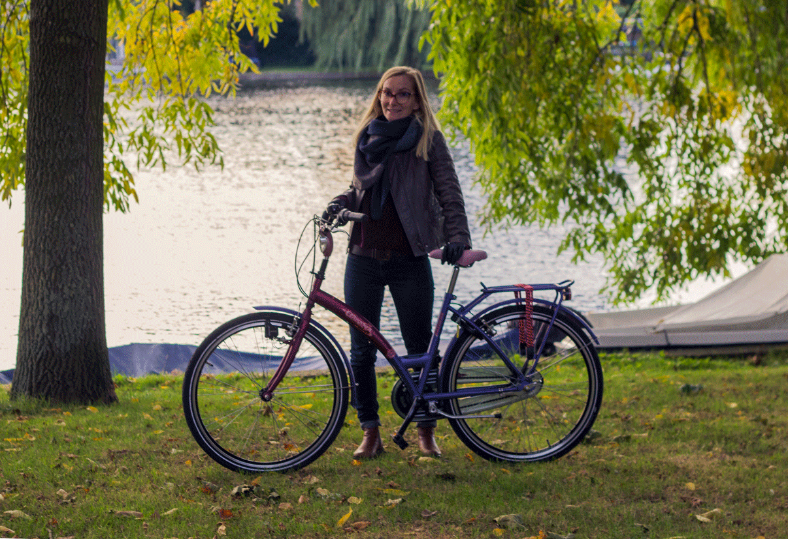

Cela fait maintenant plus d’une semaine que je n’utilise plus les transports en commun pour me rendre à Mobgen. Non je n’y vais point à pied, mais bien en vélo, comme tout le monde en faite. **Petit bilan de cette première semaine riche en coup de pédales.**

Mon vélo et moi-même avec le joli canal à côté de la maison

## La petite Reine, ou pourquoi tout le monde roule en vélo ici

À Amsterdam c’est bien connu, tout le monde, ou presque, roule en vélo. **Le hollandais et le vélo ne font véritablement qu’un.** Cela va au delà du mode de transport, c’est un véritable mode vie.

De nombreuses raisons, généralement historiques, expliquent le succès du vélo aux Pays Bas. Parmi elles, entre autre, un certain retard sur la voiture dans les années 30. Mais le vélo doit aussi son succès à la famille royale qui utilisait volontiers ce mode de déplacement “proche du peuple”. Ainsi, l’expression “la petite reine”, qui désigne aujourd’hui la bicyclette, tient son origine en 1898. C’est le surnom que l’on donna à la reine Wilhelmine, grande amatrice de vélo, lorsqu’elle fut de passage à Paris. C’est désormais une tradition royale que de s’afficher publiquement à vélo.

Lors de nos premiers déplacements, nous marchions beaucoup et il faut dire que nous avions un peu l’impression d’être des extraterrestres parfois. **Ce n’est vraiment pas une chose normale de marcher ici.** Il faut dire aussi qu’Amsterdam c’est tout plat (Pays Bas ...) et relativement petit : tout reste très facilement accessible en seulement quelques coups de pédales.

## Tram VS vélo

Les transports en commun sur Amsterdam sont assez pratiques, mais très chers par rapport à Paris. À notre arrivée, nous avions acheté des cartes rigides rechargeables mais le système est très different. Le prix d’un aller diffère selon le trajet de chacun. Une personne faisant 4 stations ne va pas payer le même prix qu’une personne voyageant 10 stations. Ce qui reste plutôt logique. En revanche, à chaque trajet, peu importe la distance que vous allez faire, vous payer automatiquement 0,89 euros de frais d’utilisation. S’ajoute ensuite à cela le prix de votre distance, ce qui revient en général au total entre 1 et 3 euros si votre trajet est très long. Aussi, il est très important de badger sa carte **en entrant ET en sortant,** le bip de sortie permettant de déterminer la durée de votre trajet et donc le prix. Si par malheur vous oubliez de passer votre carte, et bien votre crédit continue à s’épuiser, tout simplement. Cela nous est arrivé une fois la première semaine. Heureusement nous nous en sommes rendus compte tout de suite et nous avons pu monter dans un autre tram pour badger une nouvelle fois en entrant et en sortant.

Mon trajet Maison-Mobgen coûte 1,35 euros, soit environ plus de 60 euros par mois. Et je ne compte pas les trajets annexes du week end ou après le travail. Cela n’est pas très économique et on reste malgré tout dépendant d’un horaire ou d’un circuit imposé. Alors, **même si l’achat d’un vélo d’occasion peut coûter une certaine somme, ce dernier est au final très vite amorti.**

## Trouver le bon vélo quand on fait 1m58

Je me suis donc lancée dans **la quête du vélo “parfait”** pour moins de 150 euros. Easy non? Trouver un vélo ne semble pas la chose la plus difficile au monde sur Amsterdam. Vous croiser des “Fiets corner” à tous les coins de rues. J’ai même lu que si vous restiez immobile pendant plus de 5 min au niveau du quartier rouge, vous pouvez être certain que quelqu’un vienne vous en vendre un, volé assurément. Il existe aussi de nombreux groupes Facebook où les personnes revendent des vélos d’occasion à tous les prix. **Trouver un vélo s’avère donc plutôt facile.**

**Trouver un vélo, lorsqu’on mesure 1m58. Un peu moins.** Parce qu’il faut savoir que **les Hollandais sont grands.** Et **leurs vélos le sont encore plus.** Après une semaine d’utilisation du tram pour me rendre au travail, nous nous sommes arrêtés dans deux magasins de vélos assez proche de la maison. Le premier n’avait rien en dessous de 200 euros, même en occasion. Le second me proposait 1 vélo potentiellement à ma taille pour 135 euros. Je dois avouer que visuellement le vélo ne me disait rien de bon. Mais ce n’était rien de spécial en soit. Il était de couleur “acier”, assez abimé, la chaîne, les vis et les pignons plutôt bien rouillé (mais bon ça avec la pluie c’est inévitable), mais il roulait. Moi qui avait lorgné dans mes rêves sur les **Cortina et autre Gazelle** (LES marques de beaux vélos Dutch), je dois dire que j’ai vite déchanté en voyant celui-ci. Mais comme il me fallait absolument un vélo, je l’ai essayé. La première sensation est bizarre. Cela devait faire un moment que je n’étais pas montée sur une bicyclette. Mais comme on dit **le vélo, ça ne s’oublie pas** et je retrouve immédiatement mon équilibre. En revanche, pour m’arrêter c’est une autre histoire. Je touche à peine le pied au sol et je suis donc obligée de “sauter” de ma selle en avant pour poser un pied à terre pour m’arrêter. J’ai beau essayer et encore essayer pendant 5 min, je ne me sens pas franchement à l’aise. Je laisse tombé pour celui là, j’en trouverais bien un autre ailleurs...

J’ai donc passé mon week end à scroller sur les annonces Facebook. Il y a énormément d’annonces mais la plupart pour des vélo 28” (la taille pour une personne de 1m80 environ). Mais j’ai quand même **RDV le lundi midi à la Gare Central** pour essayer et potentiellement acheter un petit vélo. Il se trouve que le vélo me va parfaitement. Il est un excellent état, pas du tout rouillé. C’est un ancien vélo de location, coûte 135 euros (négocié à 125 euros), possède des pneus neufs, deux lumières dont une à dynamo, un porte bagage à l’arrière, un bloc roue ET des freins aux poignets + un frein un rétropédalage. Car oui, une autre particularité des vélos Dutch c’est le rétropédalage pour freiner et non les freins aux guidons comme nous avons l’habitude en France. Pour deux raisons. D’une part, cela permet de libérer les mains pour porter un parapluie, un sac de course, un portable ... D’autre part, en cas de pluie le rétropédalage est plus efficace que les freins “classiques” où la roue pourrait glisser à cause de l’eau. Cela m’arrangeait grandement donc d’avoir les deux, moi qui n’est pas du tout l’habitude du rétropédalage.Le seul détail c’est qu’il est bleu/violet/rouge et possède une selle rose... Pas très sexy. (Mais Alexis m’a fait la promesse de le repeindre en vert mint et d’acheter une selle marron 😀 ). Mais bon pas de chichi, il est tellement bien mieux que l’autre. **Adjugé, vendu.** Je possède désormais **mon vélo.**

## Trouver le bon antivol

Nous sommes peut être au **pays du vélo**, les vols n’en sont pas moins fréquents. Du coup, hors de question d’utiliser mon vélo sans avoir d’antivol. Certes, le vélo possède un bloc-roue _(un petit système qui permet de bloquer la roue arrière en 5 secondes, pratique si l’on doit s’arrêter justes quelques minutes dans un magasin)_, mais cela est loin d’être suffisant. Je vous passe les nombreuses recherches qu’Alexis a mené sur internet, mais il a commandé une énorme chaîne + un “U”, chacun de la marque Kryptonite, marque possédant des **certifications anti-vols**. En gros, pour couper ces chaînes, il faut au minimum une très grosse pince de un mètre, être bien portant et pouvoir s’appuyer sur le sol (ou utiliser une scie électrique). Je n’ai donc pas intérêt à perdre mes clés... La taille de la chaîne est un peu démesurée vis à vis de la taille de mon vélo et une personne dans la rue s’est déjà gentiment moquée de moi en me disant que j’avais là une bien grosse chaîne ahah. Au final, **les antivols coutent quasiment aussi chères que le vélo** en lui même... Mais c’est un vrai investissement en vue d’acheter un peu plus tard **un vélo neuf,** qui sera la nouvelle prunelle de mes yeux.

<gallery>

</gallery>

## Je n’ai pas encore mon permis vélo mais ...

De part la taille et la lourdeur de la chaîne, je mets quasiment autant de temps à faire du vélo qu’à enlever et remettre mes chaînes.. J’exagère à peine. Il faut prendre le pli et plus les jours passent, plus ma **“routine antivol”** devient plus rapide.

Il y a **4km entre le travail et la maison.** Mais comme je passe par le **Vondelpark,** cela fait 4,5km, ce qui fait environ 15-20 min de vélo pour aller à Mobgen. De porte à porte je compte 30 min. Je fais donc plus de **8km de vélo tous les jours** et mes cuisses l’ont bien senti (surtout avec les **4 kilos de d’antivols** sur le vélo) !

Même si il fait froid le matin, et d’autant plus à vélo avec la vitesse (je suis d’ailleurs bien contente d’avoir retrouver mes gants et mes écharpes !), c’est **tellement agréable de pédaler au milieu du parc**. C’est vraiment **énergisant** et ça me met dans une **bonne dynamique** de bon matin.

La ville est dessinée pour se déplacer à vélo et possèdent de nombreuses pistes cyclables, ce qui rend le trajet très agréable. Il y a encore quelques carrefours où je galère à comprendre comment ça marche et j’ai dû couper la route à deux trois personnes jusqu’ici sans vraiment le vouloir, mais je commence à prendre les bons réflexes et d’ici un mois, je saurais bien appréhender la route.

Au final, je n’utilise que très peu les freins aux guidons. **Le rétropédalage est quelque chose de très intuitif**. Cela permet de bien doser sa vitesse et de ne pas avoir les mains collées au guidon. Il faut juste prendre le plis pour le démarrage car on ne peut pas “remonter” la pédale dans le côté que l’on préfère, mais à force, je m’y fais bien.

Il ne me manque plus qu’**un petit panier** ou une caisse à poser sur mon porte bagage arrière car pour l’instant j’accroche mon sac ou mon tote bag avec l’élastique. C’est même déjà arrivé qu’il tombe une fois en roulant et c’est surtout beaucoup moins pratique...

## Le cas d’Alexis

Alexis a longuement hésité à s’acheter lui aussi un vélo de ville. Il possède un vélo de course mais il craint de se le faire plus facilement voler malgré les bons antivols.
Après un premier rdv fantôme sur la place du Dam (la personne n’est jamais venue), il en a finalement acheté un pour 100 euros via le même groupe Facebook que moi, tout noir, on ne peut plus basique, et possédant une caisse à l’avant. Mais après quelques déplacements, il ne se sentait pas du tout à l’aise dessus et le trouvait finalement trop grand. Par chance, nous avons pu le revendre directement à Madjid (copain Gobelins) qui en cherchait un et qui était parfaitement à sa taille.

Au final, Alexis reste pour l’instant majoritairement à la maison et ne se déplace pas régulièrement comme moi. En attendant et pour faire des économies, il fera avec son vélo de course et le rentrera chaque soir pour le stocker sur le balcon et non dans la rue comme le mien, et comme tous les autres vélos en faite.

Pour ma part en tout cas, le bilan de cet achat est beaucoup plus positif que négatif et je me sens chaque jour un peu plus Amstellodamoise qu’étrangère 😉
