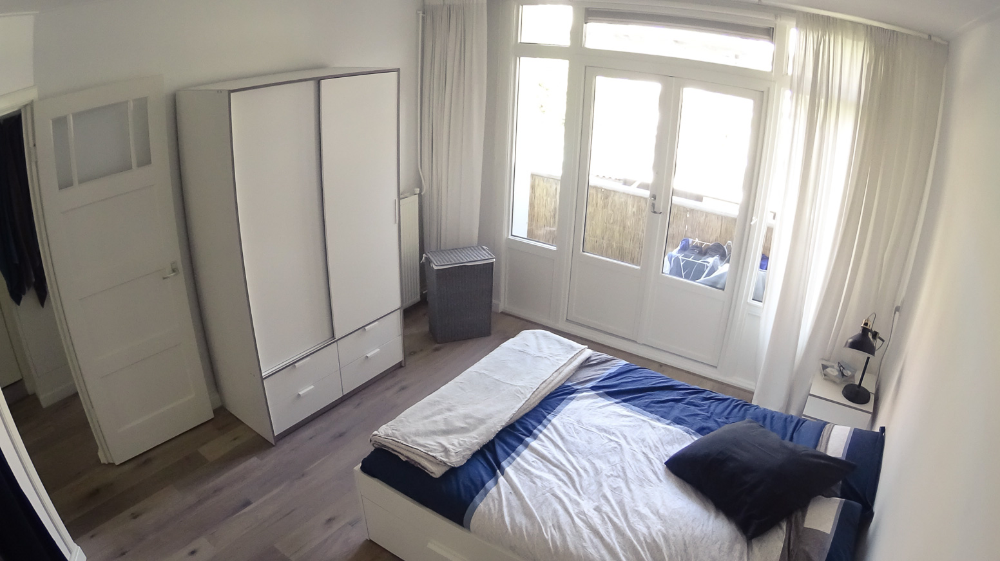
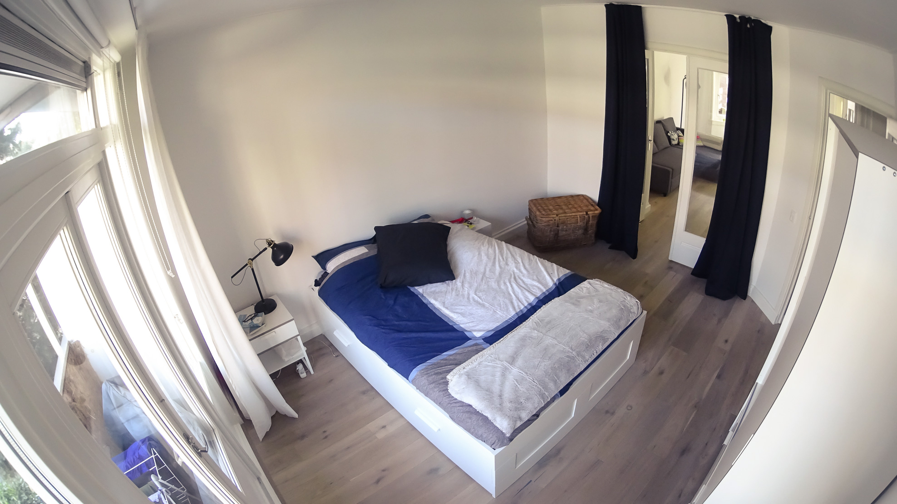
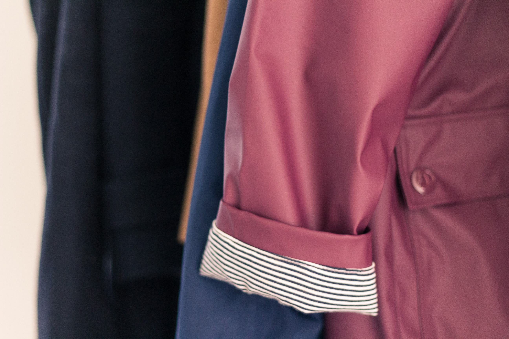
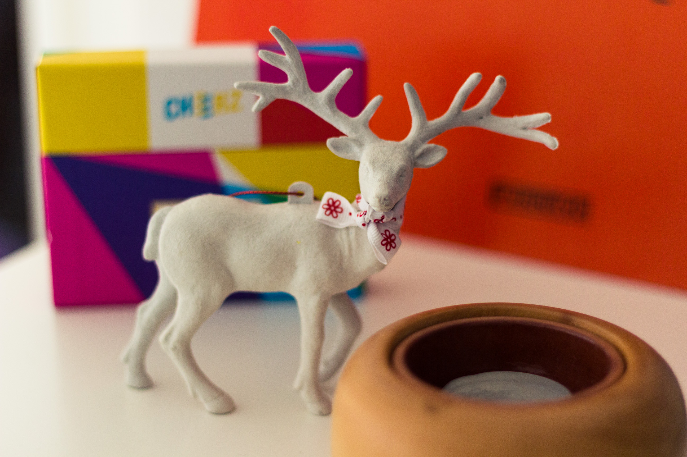
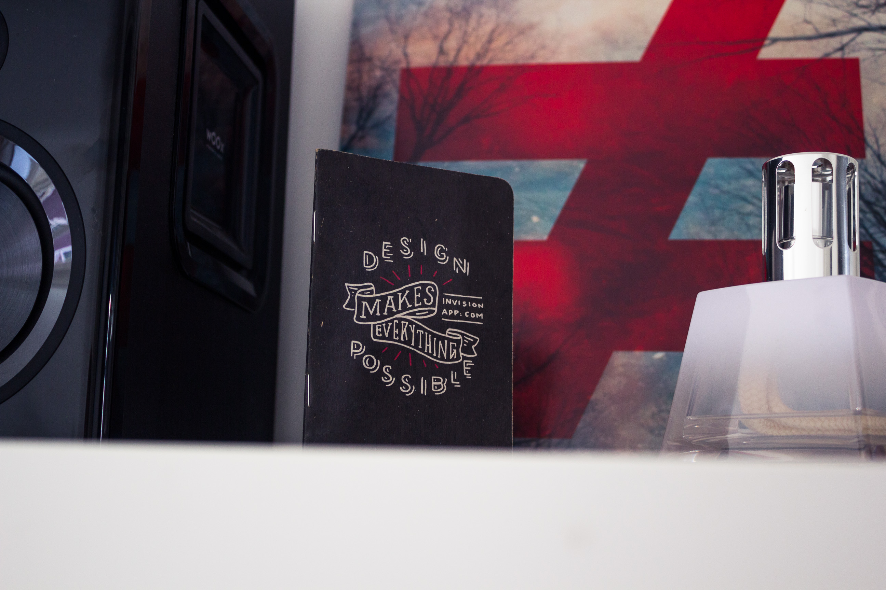

Il y a un peu plus d’un mois, nous vous écrivions pour la première fois depuis notre nouveau chez nous amstellodamois. Depuis, nous nous sommes plutôt bien installés. C’est l’occasion parfaite pour vous partager quelques nouvelles photos.

## Avant / Après : 55m2 vide, 55m2 un peu moins vide

Rappelez-vous de [cet article ici](bienvenue-chez-nous/). Nous vous faisions découvrir avec beaucoup de joie les premières photos de notre nouvel appartement, **complètement vide !**
Depuis presque deux semaines maintenant, nous avons pu récupérer toutes nos affaires restées encore en France (pour les retardataires, [ça se passe ici](vlog-demenagement/)). Mais le plus gros changement arrivé dernièrement, fut l’achat de **nos meubles** chez notre bon vieil ami **IKEA** ! Désormais, les pièces paraissent beaucoup moins vides et un **joli univers cosy** commence à se faire sentir. (Surtout avec notre énorme canapé) ((depuis je rêve de plaids et de coussins en pagaille)).

Après avoir passé une très longue après-midi à écumer **Pinterest** et autre source d’inspiration déco, j’ai fais mes petites propositions de moodboard pour chaque pièce à Alexis et nous avons pu ensuite élaborer une liste de tous les meubles que nous voulions. Tout d’abord sans compter. Ensuite il a fallu sélectionner, compter et se poser les bonnes questions. De toute évidence, nous ne pouvons pas nous permettre de tout acheter d’un coup, dans les moindre détails. Il faut faire un choix. Qu’avons nous besoin en priorité ? Quel meuble ou quel accessoire peut attendre ? (d’ailleurs, par définition, un accessoire peut toujours attendre ...) Avons nous vraiment besoin de deux bureaux ? Un seul ne peut-il pas convenir pour commencer ? Quels rangements pour la chambre ? Bref, **être réaliste** et **ne pas avoir les yeux plus gros que le ventre**. Nous avons donc décidé, pour ce premier “investissement”, de n’acheter qu’**un seul bureau** construit à partir d’une planche, d’un tréteau et d’une console, mais aussi **un lit** à tiroir, **une armoire**, une seconde **chaise**, **un canapé**, **une bibliothèque** et **une table de chevet**. Nous nous sommes tout de même autorisé **deux lampes** pour habiller et rendre le tout plus cosy, à savoir une lampe de bureau servant pour l’instant de lampe de chevet et une lampe à pied pour le salon. Enfin, nous avons aussi commandé de quoi monter **des rideaux** sur rail pour la porte vitrée de la chambre donnant sur le salon afin de créer **plus d’intimité** et d’être d’avantage dans le noir la nuit.

Pour éviter tout soucis, nous avions décidé de commander les meubles sur internet et de nous les faire **livrer directement à la maison**. La question de louer un camion ne s’est plus vraiment posée à partir du moment où l’on a vu les poids et dimensions des colis du canapé : 3 cartons de 42kg chacun, mesurant environ 2,3 mètres. Un canapé de compet’ ! La livraison vaut définitivement son prix rien que pour ce confort-là. Pour aussi éviter des frais inutiles, nous avons décidé de tout centraliser chez Ikea pour l’instant et de ne pas aller voir sur d’autres e—shop d’ameublement et décoration.

La commande terminée, la livraison était prévue pour le lundi 10 octobre. Nous ne l’avons pas remarqué immédiatement, mais quelques jour plus tard, des panneaux temporaires ont été posés dans notre rue, juste en face de la maison, pour réserver deux places pour le camion de livraison. De cette manière, les livreurs n’auront pas à gêner les autres voitures en étant garé sur le côté et non en plein milieu de la rue. Intelligents ces Néerlandais !

Nous n’avions pas commandé tant de meubles que ça, et pourtant, avec tous les cartons (papa, si tu lis ce lignes, tu serais jaloux de tous ces morceaux de cartons parfait pour allumer la cheminé pendant tout un hiver au moins ! ^^), il n’était plus possible de se déplacer correctement dans le salon. Cela a pris environ **trois jours** entiers à Alexis **pour monter tous les meubles !** J’ai quand même donné ma petite contribution en montant la lampe et la table de chevet 😉
Une fois les meubles montés, il fallait **tout ranger**. Je me suis occupé du “dressing”, Alexis de la bibliothèque. Et finalement, une fois tout rangé, **le salon me parait encore tellement grand !** Ce n’est pas pour autant que nous allons le remplir de fond en comble, mais c’est vraiment **agréable** de savoir qu’il reste de **l’espace vide** !

On vous l’annonce, **notre canapé est convertible**. Alors, on vous voit venir avec vos “ouais convertible, mais c’est pas confortable bla bla bla”. Détrompez-vous, c’est un **Vrai convertible** avec un **Vrai matelas** avec deux **vrais places** comme dans un **Vrai lit**. Voilà c’est dit. On l’a en parti choisi **pour vous** (pour toi maman), pour pouvoir vous **recevoir confortablement** dans notre nid douillet. Et si cela ne suffit pas à vous faire venir, alors je ne sais plus quoi faire ! 😉

Trèves de plaisanteries, place aux photos. Tout d’abord, quelques photos d’ensemble du salon et de la chambre qui sont les deux seules pièces ayant eu besoin d’être meublées. Ensuite, quelques photos de petits détails

## Les vues d’ensemble

<gallery>

</gallery>

## Les jolies petits détails

<gallery>

</gallery>

## Et ensuite

Les prochains éléments que j’aimerais acheter rapidement seraient un tapis et une table basse pour habiller un peu plus notre salon. J’ai bien envie aussi de trouver **une jolie guirlande lumineuse** pour poser autour de la fenêtre en saillie du salon ou bien de la bibliothèque. Nous ne pouvons malheureusement pas trop faire de trous dans les murs mais j’aimerais bien trouver une alternative pour poser quelques affiches / posters / photos (rayer la mentions inutile). Ensuite, pourquoi pas une chouette table à manger ronde et des jolies chaises. Ou bien même un fauteuil tout doux pour lire prêt du radiateur en hiver. Enfin bref, c’est pas pour tout de suite non plus.
En tout cas, nous n’avons pour l’instant rien pensé pour le balcon. Cette partie attendra au moins le printemps et le retour des beaux jours. Car pour le moment, c’est d’avantage **les gros pulls, les écharpes, les infusions et les plaid tout doux** qui m’intéressent. D’ailleurs on se retrouve bientôt pour un petit article découverte du **Noordermarkt**, le marché dans le Jordaan, qui sentait bon l’automne samedi dernier !
