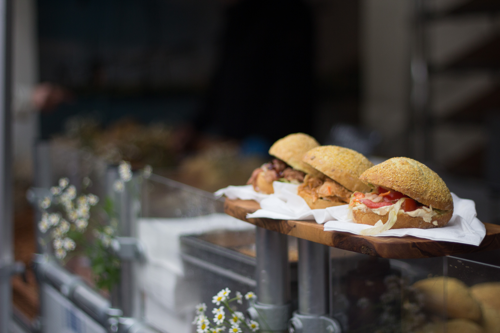
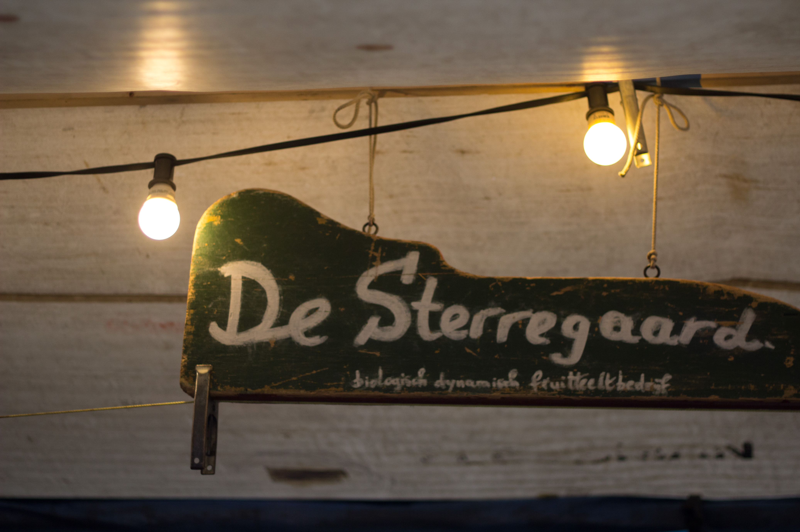
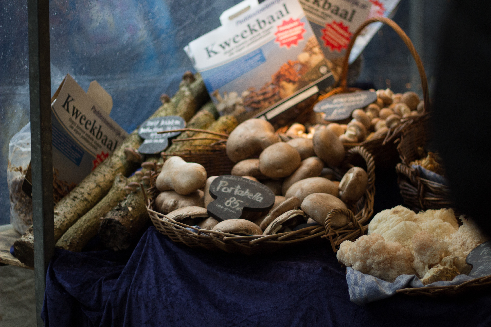
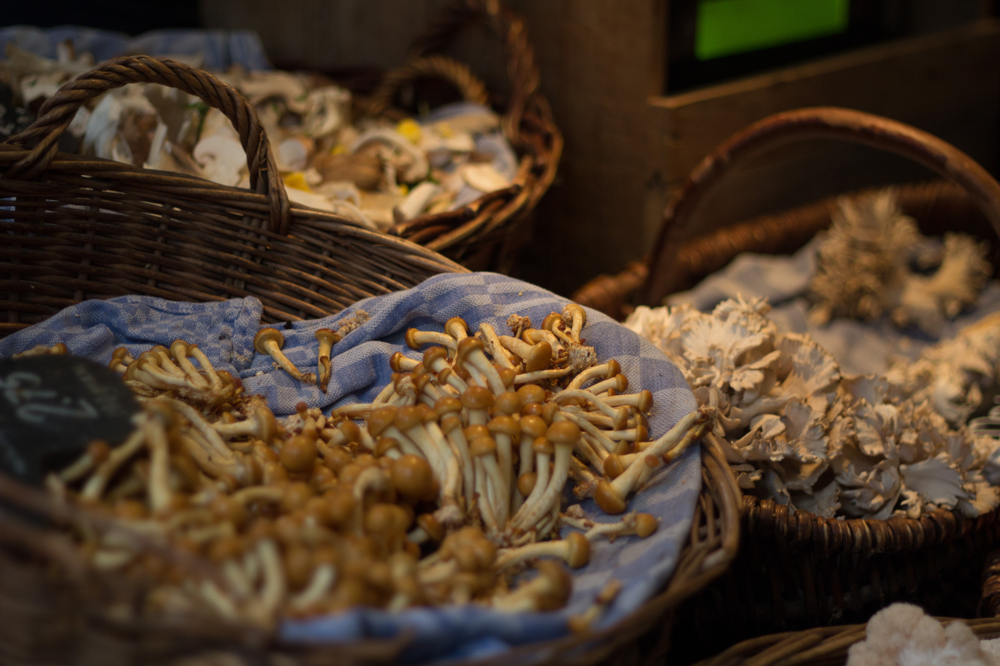
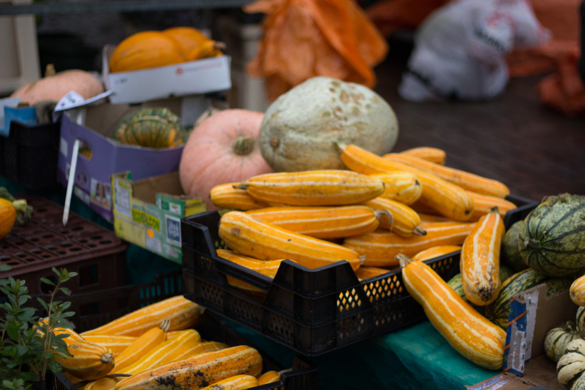
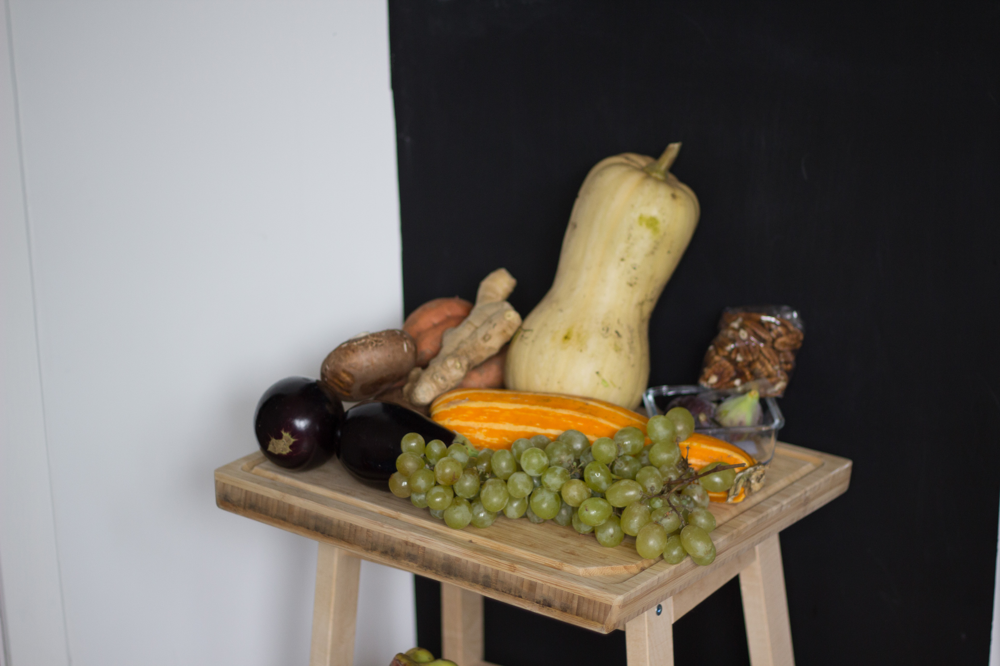
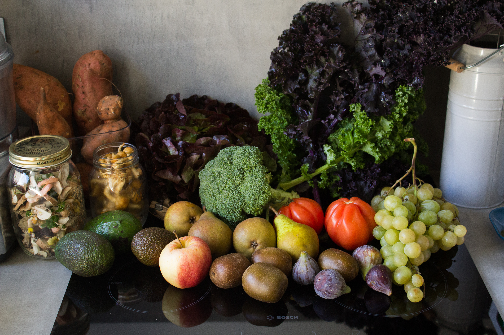
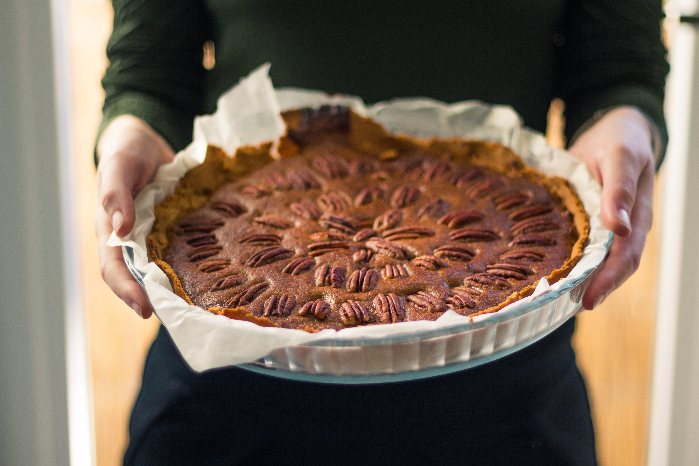

Après avoir fait le tour des supermarchés aux alentours de la maison, il y avait une autre chose qui me tenait à coeur de découvrir : le marché.

## Faire le marché

Sur Paris ou même sur Lyon, ce n’était vraiment pas une habitude pour nous de faire le marché. Sur Lyon, j’ai du m’y rendre 3 fois en 3 ans et sur Paris, peut être 3 fois en 2 ans, bien que ce dernier se tenait dans la rue adjacente à notre appartement.. La raison pour laquelle nous n’allions pas faire le marché sur Paris était surtout parce que ce dernier n’était pas bien. Nombreux étaient les stands de fruits et légumes, mais si tous sont en provenance de Rungis, je n’y vois plus trop d’intérêt ... Autant les acheter à Casino, où nous pouvions en plus utiliser nos tickets restaurant, chose impossible au marché, et cumuler des points sur notre carte fidélité, eheh! Sur Lyon, la raison était surtout budgétaire. Manger bio et budget étudiant, c’est jamais simple (enfin, tout dépend de votre vision du budget étudiant bien sûre,... 😉 )

Pourtant, j’adore le marché. Je trouve ça vraiment plaisant de se dire, “je prend mon petit panier et je vais acheter mes fruits et légumes pour la semaine”. (#cliché du marché). Lorsque je rentre sur Embrun, j’adore quand maman rentre du marché avec des salades bien fraîches, du bon fromage et quelques bons fruits et légumes, pas forcément tous bio, mais tous provenant de la région. D’ailleurs, certains producteurs du département ne sont pas officiellement estampillés bio afin d’éviter toutes les nombreuses démarches administratives, et pourtant leur agriculture est raisonnée voire quasiment bio. Oui parce que, au delà de manger bio, c’est bien voire même mieux de rester local. Finalement, faire le marché est, je trouve, un geste citoyen, écologique et économique si l’on sait choisit les bons stand et les bons produits. L’autre point positif du marché est de manger d’avantage de saison. Plus question d’être tenté par des tomates en plein hiver puisque celles-ci ne seront pas voire très peu disponibles sur les stand, et si elles le sont, elles seront très chers. Un geste éco-citoyen !

## Le compromis parfait : Le Noordermarkt

Donc voilà, trouver le meilleur supermarché du coin c’est bien, trouver un bon marché local et bio, c’est mieux. Et il se trouve que chaque samedi, de 09h à 17h, a lieu, dans le joli quartier du Jordaan, le Noordermarkt. En Dutch, c’est le « Boerenmarkt op de Noordermarkt » qui se traduit très basiquement par le « marché Paysan du Noordermrkt », autrement dit, un marché frais et bio. Le tout à 15 min en vélo de la maison. C’est un petit marché pour une capitale telle Amsterdam et pourtant c’est l’un des plus populaire, après l’Albert Cuypmarkt (que nous avons d’ailleurs bien moins aimé).

Ici vous trouverez de tout. Des fruits et des légumes bio évidemment. Mais aussi d’autres produits habituels tels que du fromage traditionnel dutch, des oeufs, des épices et autre fruits à coques, de la viande et du poisson frais. Vous pouvez aussi acheter votre pain et autres cakes, gâteaux et petits biscuits. Durant l’automne, un magnifique stand de champignons trône pour le plaisir de nos yeux et de nos papilles ! Il y en a de toutes les formes et de presque toutes les couleurs. D’ailleurs, j’ai enfin pu gouter les délicieux Portobello, ces gros champignons géants, mais aussi découvrir qu’en réalité les champignons de chez Picard dit « de Paris » n’ont pas tellement beaucoup de goût et qu’il existe de nombreuses autres espèces comestibles bien plus savoureuses ! Autre chose, qui est une chose que je n’ai encore jamais vu nul part ailleurs, c’est le stand « Raw food ». Sur ce stand, vous y trouverez tout un tas de compléments alimentaires, de « superfood » et autres produits « raw » (=cru). C’est toujours bon à savoir qu’ici on peut facilement trouver des produits comme de la spiruline, de la poudre de baobab ou bien même des fèves de cacao, bio évidemment. À coté de ça, vous trouvez plusieurs stands très divers de type brocante, vide grenier. Et entre les deux, des fleuristes et des vendeurs de gaufres, pancakes ou bien de sandwich chaud. Aussi, si un petit creux se fait sentir à la fin de vos emplettes, c’est l’occasion parfaite pour aller faire une petite pause et déguster LA, soit disant, meilleure tarte aux pommes d’Amsterdam au Winkel 42 Café, adossé à la place. Et je l’avoue pour l’avoir gouter qu’elle est franchement délicieuse.

Pour ce premier jour de marché, nous avons décidé de tout acheter au même stand pour plus de facilité. Et, regarder moi ce beau panier frais de saison ! Bon, nous nous sommes permis de racheter encore quelques courgettes et aubergine, mais promis c’est la dernière fois ! Et ces courges ! Tellement grosses, tellement bonnes, tellement orange. Tellement peu chères (3 euros les deux grosse courges). C’est le premier stand que nous avons fait. Un stand rempli de courges, de toutes les tailles, de toutes les formes, de toutes les couleurs, de toutes les saveurs ! LE stand qui sent bon l’automne !

<gallery>

</gallery>

En rentrant à la maison les sacs à dos remplis de bonnes choses, j’ai vraiment ce sentiment d’avoir fait quelque chose de bien et ça c’est quand même bien gratifiant. Quitte à changer de ville, autant aussi changer ses habitudes et ainsi commencer à aller au marché régulièrement pour acheter ses fruits et légumes. Et cela fait déjà trois semaines à la suite que nous y retournons. 🙂

Pour finir, voici quelque images de deux plats cuisinés entre autres avec ces belles provisions :

