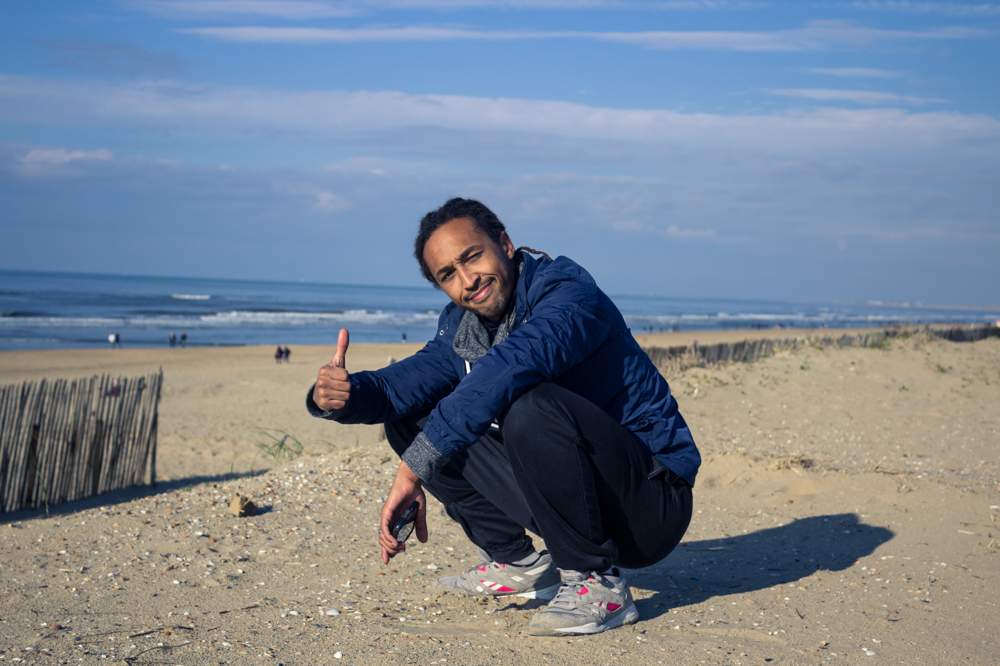
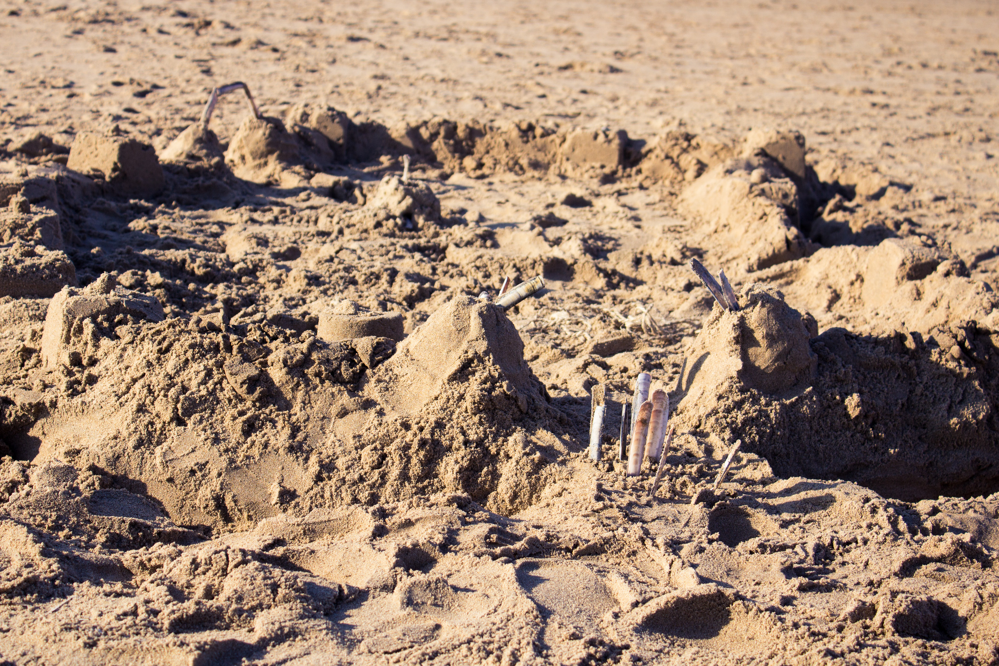

L’avantage d’en avoir finit avec l’école, c’est que désormais les week end semblent plus long et sont surtout plus riche en temps libre. Il y a deux week end de cela, nous avons donc sauté sur l’occasion de profiter de la météo clémente et avons décidé de passer notre dimanche à la plage. Oui oui, à la plage. Nous nous sommes rendus à Bloemendaal Aan Zee, dont l’équivalent français serait le Touquet-Paris-Plage pour les Parisiens.

## Bloemendaal Aan Zee.

_Bloemendaal Aan Zee_, à côté de Zaandvort, est une station balnéaire qui se situe seulement à une vingtaine de kilomètre à l’ouest d’Amsterdam. Accessible en à peine une demi heure par le train via Haarlem, il parait qu’en été, dès les premières chaleurs, les plages sont remplies d’Amstellodamois. D’après les quelques photos que j’ai pu voir sur internet, ce sont de longues étendues plages de sables et de dunes donnant sur la mer du nord. La météo annonçant un dimanche sans pluie et, qui plus est, ensoleillé, nous décidons d’en profiter pour nous y rendre. Mais pas en train, non. _En vélo !_ La Maison - Bloemendaal Aan Zee faisant 26 km, soit un peu plus d’1h30 en vélo selon Google Maps. 1h30 ce n’est pas grand chose et cela nous permettra de _découvrir les alentours d’Amsterdam_.

_Ce fut une merveilleuse idée_ (même si mes cuisses clament le contraire). En à peine 15 min nous étions déjà à l’extérieur d’Amsterdam, en pleine campagne ! _Les paysages d’automne_, entièrement plats, sont magnifiques, chaque arbre commençant à se parer de couleurs rouges, dorée et orangée, pour le plus grand plaisir de nos yeux. La route que nous indique le GPS est agréable et même en plein milieu de la campagne, il est possible de rouler sur des pistes cyclables. Nous prenons notre temps et nous traversons Haarlem après une bonne heure et quart de vélo. Du peu que nous avons pu en voir, Haarlem est une très jolie ville, elle aussi bordée de canaux et de maisonnettes toutes plus charmantes les une que les autres.

Après Haarlem, nous entrons dans la commune de Bloemendaal. Et la première image qui nous vient en tête, à Alexis et moi, c’est celle du Touquet. C’est, à peu de choses près, la même chose. Des énormes villas, plus ou moins cachées sous les arbres de la foret environnante, avec au bout, la mer. À la différence que, juste avant d’atteindre la mer, nous traversons une petite partie du Parc National de Zuid Kennemerland, qui se compose principalement de dunes et de marais. C’est très beau et je pense que nous reviendrons nous y balader aux printemps.

Nous atteignons enfin la plage de _Bloemendaal Aan Zee_ après 1h45 de temps passer à pédaler, ce qui veut dire que de 1: nous allons faire une pause, pour le plus grand bonheur de mes jambes, et de 2, que nous allons enfin manger, pour le plus grand bonheur de mon estomac. Pile pour notre arrivée, les nuages se sont enfuis et ont laissé la place à un _beau soleil_ et _grand ciel bleu_. _Parfait._ Nous découvrons aussi que nous sommes loin d’être les seuls à avoir eu cet idée d’excursion. Je me doute bien qu’en été, ce doit être bien rempli. Il y a beaucoup de familles venues se balader avec leur enfants mais aussi des touristes (ah tiens, ça parle français à ma droite, espagnol à ma gauche) et évidemment beaucoup de Dutch. Malgré la fatigue d’avoir pédalé 26km, on décide de marcher le long de la côte. Ici, les churros traditionnels des plages méditerranéennes laissent place aux « kibbeling », des petits morceaux de poisson frits servis avec de la mayonnaise. Mais si le poisson ne vous tente pas trop, vous pouvez toujours déguster un bon cornet de frite 😉

Je crois que je pourrais rester des heures à observer la mer. C’est tellement ... _relaxant_. Nous décidons de repartir après quelques heures, l’esprit rafraîchit et détendu... Quand tout à coup, je me souviens des 26km à faire avant de pouvoir m’affaler dans mon canapé avec un plaid et une infusions bien chaude ... Aller, un coup de pédale donné, c’est un coup de pédale en moins à faire. Étonnamment, nous atteignons un peu plus rapidement la campagne qu’à l’aller et nous profitons une dernière fois de la lumière déclinante et les lacs environnants.

<gallery>

</gallery>

**♪♪♪
Avec la mer du Nord pour dernier terrain vague
Et des vagues de dunes pour arrêter les vagues
Et de vagues rochers que les marées dépassent
Et qui ont à jamais le cœur à marée basse
Avec infiniment de brumes à venir
Avec le vent de l’est écoutez-le tenir
Le plat pays qui est le mien ...
♪♪♪**

<gallery>

</gallery>

Ce fut un dimanche à la fois très fatiguant et très relaxant, mais ça en valait définitivement la peine, ou devrais-je dire, les coups de pédale ;-).
_Un dimanche d’automne parfait avec un merveilleux temps d’automne où les rayons de soleils viennent vous réchauffer doucement le visage._

<gallery>

</gallery>
