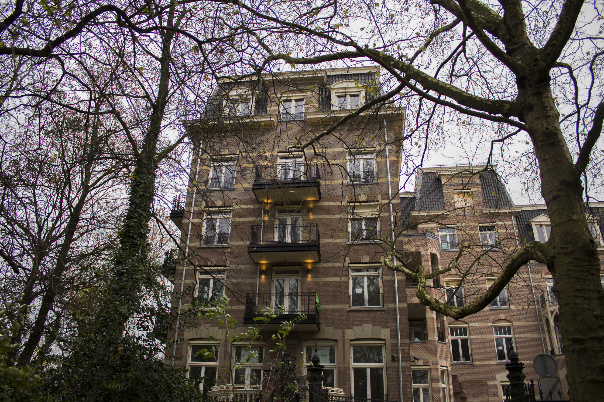
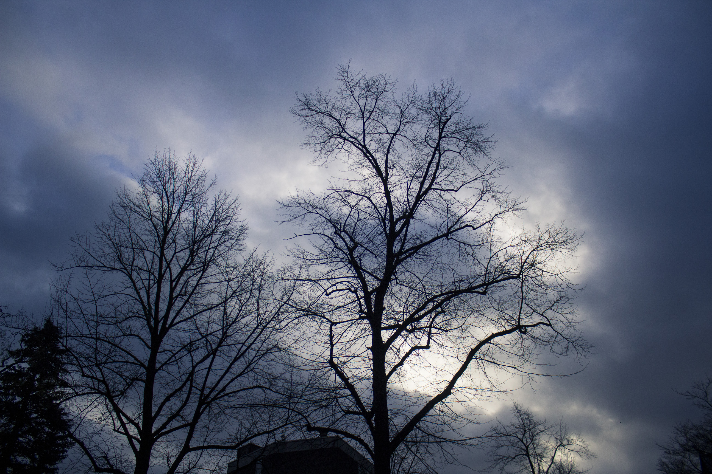
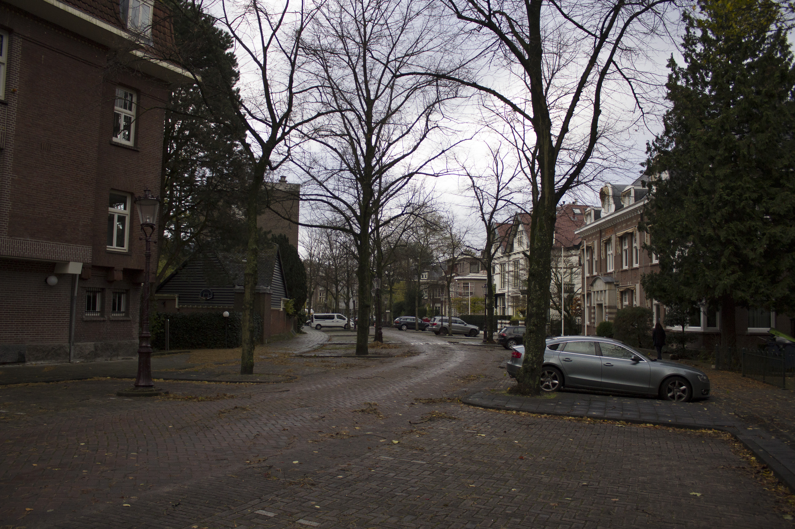
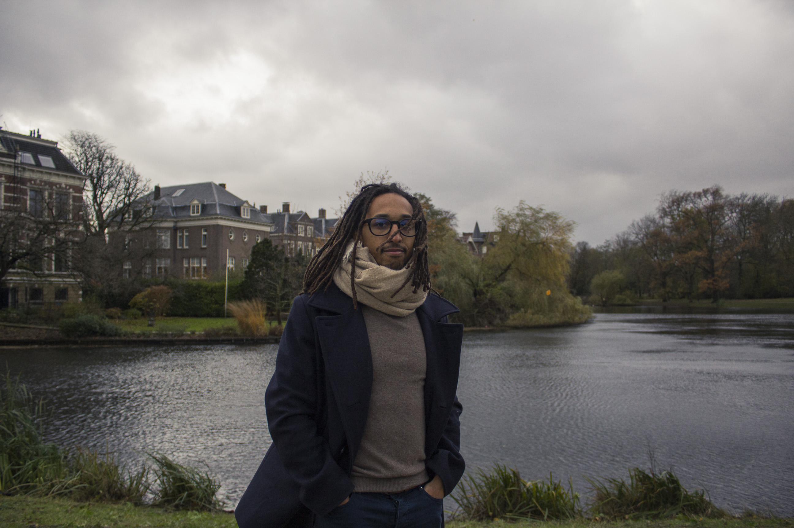
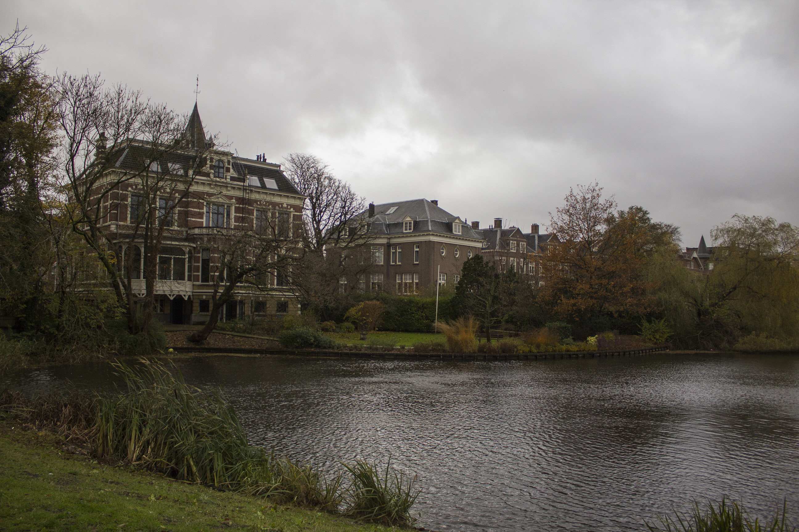

Après plus de trois semaines et demi de silence radio sur le blog et après un article bilan en demi-teinte pour certains, voici quelques nouvelles sur le blog. Non, nous n’avons pas littéralement disparu de la surface internet et puis pouf, d’un coup ré-apparu. Simplement, moins de temps à consacrer pour écrire des articles et surtout, pas suffisamment de choses intéressantes pour pouvoir les remplir correctement.

Dernièrement les jours passent et se ressemblent un peu trop. L’effet « mois de décembre ». Désormais le soleil se couche aux alentours de 16h30 et c’est dans la peine-ombre que je me rend désormais au travail le matin. Nous n’avons pas rien fait, seulement il est vrai que ces dernières semaines s’enchainent plutôt rapidement, et chaque vendredi je me dis, punaise, déjà la fin de la semaine, time runs so fast ! Mais globalement, l’ambiance à la maison est loin d’être morose. On est même bien content de rentrer dans son petit nid douillet. Et puis avec le mois de Décembre et Noël qui approche, les fenêtres du quartier se parent toutes peu à peu de jolies guirlandes lumineuses et d’énormes sapins. D’ailleurs, je n’ai pas vu un seul Père Noël suspendu et les décorations lumineuses sont loin de ressembler à celles un peu kitsch que l’on peut croiser en France. En tous les cas, cela évite de tomber dans la routine du trajet à vélo, et chaque soir c’est l’occasion de découvrir une nouvelle fenêtre décorée 😉

**Voici donc, un peu en pagaille, une liste des dernières nouvelles 😀**

Fin Novembre avec Mobgen, a eu lieu le Christmas Trip 2016 de l’agence. L’année dernière, ils étaient partis 3 jours à Andorre pour les sports d’hiver. Cette année, l’O-experience team (le « BDE » de Mobgen) a choisi une destination tout à fait à l’opposé puisque nous sommes partis 4 jours à Fuerteventura, une des iles canaries. Cela tombait à pic, avec les jours qui raccourcissent, de pouvoir faire un petit bain de soleil. C’était vraiment chouette ! 20-22 degrés dans la journée, 17-19° degrés le soir mais avec du vent frais. Assez chaud pour passer ses journées en short et débardeur et lézarder au soleil. Mais loin de là le repos. Ce fut plutôt 4 jours de fêtes, de fun et de manque de sommeil 😉 Honnêtement, sur 4 jours, j’ai du dormir à peine 20h au total ... Et ceux qui me connaissent savent à quel point ça à du être dur pour moi ^^ D’ailleurs, mon corps au retour n’a pas pu endurer plus et je suis tombée malade en atterrissant sur Amsterdam. Autrement, c’était vraiment AWESOME comme ils diraient. Il y a eu un gala organisé dans une salle magnifique, des activités telles que Kayak, Yoga, planche à voile, surf, plongée au tuba ... J’ai pour ma part fait du kayak et l’eau de l’océan n’était vraiment pas si froide que ça pour un mois de Novembre. Bon, je ne me suis pas risquée à m’y baigner non plus mais certains ne se sont pas gênés. Nous avons aussi passé toute une après-midi à manger, danser et boire sur deux énormes catamarans. Et j’ai même pu tester un tour de Jetski. Assez fou ! Bref, des bons moments et vous pouvez avoir un petit aperçu en regardant “l’after-movie” vidéo ici 🙂

<iframe width="560" height="315" src="https://www.youtube.com/embed/HhzPwVaMCfo" frameborder="0" allow="accelerometer; autoplay; encrypted-media; gyroscope; picture-in-picture" allowfullscreen></iframe>

Autre évènement d’entreprise, après le Christmas Trip, il y a la Christmas party vendredi dernier. Il y a même un concours organisé entre les différents open-space : le plus joliment décoré remporte un cadeau ! Mais attention, la contrainte cette année, malgré les 50 ou 100 euros de budget par team, est de dépenser le moins, pour décorer le plus. Recycler, ré-utiliser, inventer ... Ma design team a choisi d’organiser un marché de Noël international pour célébrer les différentes nationalités au sein de l’équipe. Il y en a plus de 15 différentes ! Pour ma part j’ai décidé d’improviser une raclette avec du fromage plus ou mois Français (impossible de trouver du fromage à Raclette ici). C’était quand même très bon et ma petite raclette à eu un franc succès : en 1h tout était parti !! ET, roulement de tambour .... Le jury a tranché, nous avons gagné !! 😀

Dernier évènement récent à l’agence, un peu moins joviale, je me suis fait volé, parmi 3 autres, mon Macbook Pro du travail à l’agence ... 2 semaines de travail de perdu ... La consolation dans cette histoire c’est qu’ils nous ont commandés les tous nouveaux avec la barre tactile. Bon ça ne fera pas revenir mon projet, mais ça aide ... 😉

Qui dit mois de Décembre, dit calendrier de l’Avent. Cette année avec Alexis nous avons acheté le calendrier de l’Avent du Palais des Thés. Chaque jour un nouveau thé à découvrir. C’est tout de même mieux que le chocolat 😉 Et jusqu’ici on en est très content. Hormis 1 thé qu’on a détesté, tous les autres sachets étaient très bons.
À côté de cela, je me suis en même temps lancée dans un challenge personnel sur Dribbble. L’idée est de publier un post chaque jour, tout au long du mois de Décembre. Pour les curieux, [c’est ici](https://dribbble.com/_clemsss). L’objectif de ce challenge est avant tout pour moi de me « forcer » à pratiquer de mon côté, de me créer des projets personnels et de faire des choses que j’aime, quand parfois à l’agence je pourrais me retrouver avec des sujets ou des projets un peu moins motivants.

Vous connaissez surement la fête des Lumières à Lyon, pour le 8 décembre. Et bien sachez qu’il existe le même type d’évènement à Amsterdam. Depuis 5 ans maintenant a lieu, tout au long du moins de Décembre et Janvier, l’Amsterdam Light Festival. Nous n’avons pas encore eu l’occasion de réellement nous balader mais nous avons entr’aperçu quelques installations. On aimerait bien louer un petit bateau pour pouvoir se balader sur les canaux et prendre pleins de photos à notre guise. Affaire à suivre !

Une balade qu’on a fait en revanche fut celle du quartier de Willemspark dans Oud Zuid, il y a deux weekends de cela. Après avoir fait le tour de Hoofdorppleinbuurt, notre quartier, nous avons continuer notre exploration en remontant la ligne de tram 2 jusqu’au Museumplein, la place, ou devrais-je dire plaine, où se situe le Rijksmuseum, le Musée Van Gogh, le Stedelijk Museum (musée d’art moderne) mais aussi la très belle salle de concert de l’orchestre royal Het Concertgebouw. Nous avons déambulé jusqu’à remonter vers le VondelPark. C’était vraiment tout mignon, très verdoyant, respirant. Oud Zuid est sans doute l’un des plus beau quartier « local » d’Amsterdam à mon sens, le Jordaan étant magnifique mais bondé de touristes. Alexis dit toujours que pour juger l’échelle social d’un quartier, il suffit de regarder le type de voiture garée dans la rue. Et honnêtement, je n’ai jamais vu autant de voitures aussi chères de ma vie : Jaguar, Tesla, grosse BMW, Ferrari ... De toutes les jolies rues que nous avons vues, le quartier de Willemspark possède sans doute les plus belles de Oud Zuid. Chaque maison, ou devrais-je dire Hôtel particulier, possède un charme fou. Vue imprenable sur le Vondelpark et grands jardins, ces maisons sont gigantesques, et certaines possèdent même un accès direct sur les étendues d’eau du parc. Cela donne une bonne idée de la richesse du quartier. Nous ne sommes pas si loin de l’agitation touristique de Museumplein et pourtant, il n’y a presque personne dehors. Ce quartier semble être un véritable havre de paix pour les familles les plus aisées d’Amsterdam ... Quelque photos, même si la tempête de vent au moment même n’a pas aidé, pour vous laisser un petit aperçu.

<gallery>

</gallery>

Il ne me semble pas l’avoir déjà écrit ici, mais notre voisin du dessus, qui est aussi notre propriétaire, est musicien professionnel de violon-celle. Il ne passe pas un jour sans qu’Alexis ou moi-même ne l’entendions s’exercer chez lui. Du coup, nous nous sommes toujours dit qu’un jour ce sera sympa d’aller le voir jouer lors d’un de ses concert. Et il se trouve que ce jour est déjà arrivé ! Il nous a proposé deux billets pour lundi 12 décembre au soir au musée de l’Hermitage à Amsterdam. À l’occasion d’un festival de musique classique russe sur 3 jours, Gidéon, le violoncelliste, y performait, accompagné d’un pianiste et d’une violoniste. Nous sommes donc allés, lundi soir, écouter pendant presque deux heures, de la musique de chambre russe : Dmitri Sjostakovitsj, Sergej Rachmaninov & Anton Arenski. C’est déjà très beau quand on l’entend pratiquer au dessus du salon. Mais alors, en concert, accompagné d’un piano et d’une violoniste, cela prend tout son sens et c’est magnifique ! On a adoré. On a même eu l’occasion de visiter rapidement le musée de l’Hermitage avant le concert, juste après la fermeture officielle. (( Pour la petite anecdote, je pense que nous avons fait baisser la moyenne d’âge du public présent ;-)))

Parler de notre propriétaire, je me permet d’enchainer sur une très chouette nouvelle que nous avons eu ce week end pour notre appartement. Lorsque nous avons signé, le contrat était à l’origine un bail de 1 an seulement car la co-propriété n’était pas réellement ok pour louer cet appartement. La location était légale mais par exemple notre propriétaire préférait attendre avant de pouvoir poser nos noms sur la boite aux lettres. Hors, pour différentes raisons connues et non connues, la co-propriété a accepté d’étendre notre contrat de location sur deux ans. Pour cela, nous allons signer un nouveau bail prenant date au mois de décembre 2016 et courant jusqu’en décembre 2018. Cela veut donc que nous restons officiellement pour encore deux ans et qu’il n’y aura pas de nouveau un déménagement à prévoir cet été. C’est un véritable soulagement. Désormais c’est bon, les choses sont officielles et acceptées pour tout le monde. Nous pouvons enfin nous présenter en tant que voisins !

Et c’est dores-et déjà la fin de cette petite mise à jour. Pour les fêtes, nous rentrons en France le 22 décembre. Nous resterons à Embrun jusqu’au 31 pour Noël et nous reviendrons sur Amsterdam pile pour la soirée du jour de l’an. Rien n’est encore pour l’instant prévu, surement un bon petit repas bien préparé, mais si on en croit certaines vidéos, le feu d’artifice d’Amsterdam semble être assez fou et les Amstellodamois semble savoir bien profiter de l’autorisation de tirer des feux d’artifice un peu partout dans la ville, un peu n’importe comment ... On a (hâte) de voir ça.
