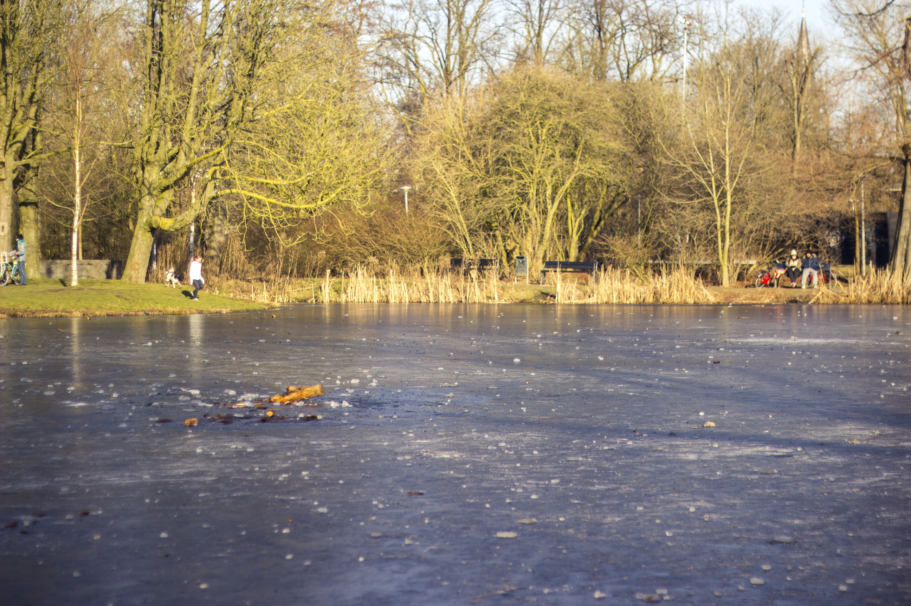
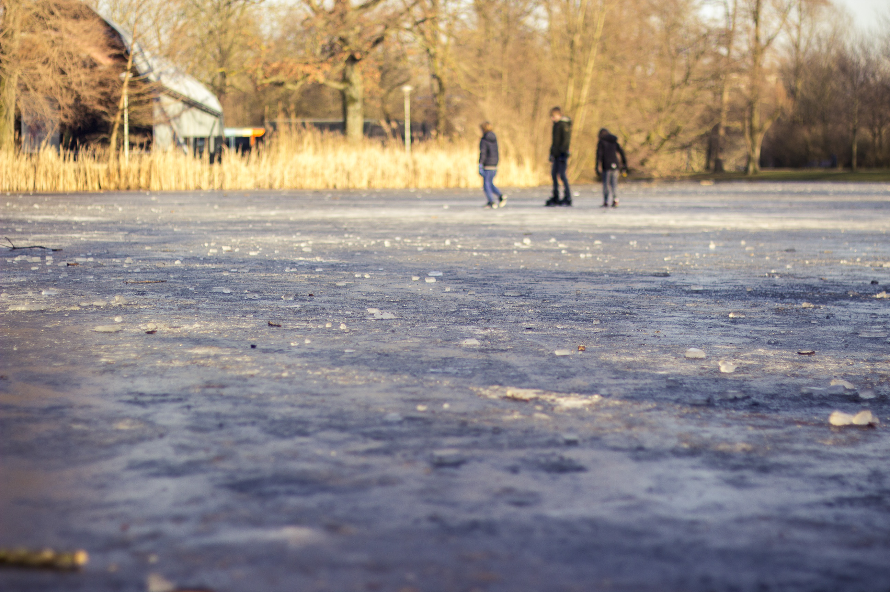

_Winter is finally here !_

L’hiver a enfin pointé le bout de son nez. Je commençais un peu à désespérer de ne pas vraiment avoir froid le matin en sortant. Alors certes, je ne sortirais pas en t-shirt, mais pour autant, avec manteau, bonnet et gants, après quelques coups de pédales, j’en suis presque à me demander si je n’enlèverais pas un voir deux de ces accessoires d’hiver.
Il se trouve que depuis deux bonnes semaine maintenant, les températures ont largement chutés. Il gèle la nuit et durant la journée, le mercure peine à remonter au dessus de 5. Merci à la vague de froid qui a traversé l’Europe. De fait à Amsterdam, nous avons même eu le droit, à deux reprises, déjà, à un peu de neige. Assez pour que cela recouvre d’une fine pellicule blanche les rues, les toits et les arbres. Bon, c’est joli 5 min et après évidement, la plupart est déjà fondue. Mais ce n’est pas grave, c’est déjà assez pour faire mon bonheur le matin au réveil, ouvrir les rideaux et s’écrier d’un “Oh! C’est tout blanc”, et commencer la journée de bonne humeur. 🙂

D’ailleurs au moment où j’écris ces phrases, je me trouve dans un train direction La Haye pour le boulot. Le train traverse la campagne, et c’est magnifique. Tout est tout blanc, tout gelé. Malheureusement, cela ne se voit pas vraiment sur aucune de mes photos prises avec mon iPhone. C’est encore plus beau dans le Vondelpark. Le givre sur les arbres et dans le parc tient d’avantage et les lacs sont complètement gelés! Malheureusement la chaleur et la pollution de la ville font qu’à la sortie du parc, tout est fondu.

Semble-t-il que certaines années, il a fait assez froid pour que les canaux soient complètement gelés, bien assez même pour faire du patin à glace dessus! La dernière fois que cela est arrivé, c’était durant l’hiver 2012. Et depuis, tout le monde à tendance à prendre pour acquis que les canaux gèlent en hiver, alors que pas du tout... Mais depuis que je suis au courant de cela, je n’ai qu’une envie : que cela arrive à nouveau ! Non pas que je sois une fan de patin à glace (il me faudrait d’abord en louer pour pouvoir en faire) mais bien parce que cela doit vraiment être magnifique à voir et très particulier. Les canaux gelés, un peu comme si le temps c’était gelé pendant quelques instants ...

Pour autant, je ne pense pas que cela va arriver cette année. À moins que les températures baissent encore d’avantage, même avec des -4, -5, les canaux sont toujours aussi liquide, faute à la pollution et chaleur urbaine, comme je vous le disais. Et à plus de -10 degrés, je pense que je n’aurais plus vraiment le courage de sortir pour aller voir en réalité ! Bon et puis si vraiment j’ai envie de patiner, il suffit de me rendre à Museumplein, devant le Rijksmuseum, où ils ont installés une patinoire et un joli petit pont miniature du fameux Pont Maigre d’Amsterdam!

Dernière nouvelle, nous habitons enfin “chez nous”. Un petit écritaux avec nos noms a enfin été posé sur la porte! Et nous avons enfin rencontré nos voisins du dessous, autrement que par l’intermédiaire d’un colis. C’est aussi un jeune couple et, funny fact, la fille travaille chez Accenture. Deux choses l’une : soit le monde est vraiment petit pour que ce genre de coincidence arrive souvent, soit Accenture est vraiment une très très grosse boite qui rachète toutes les autres. En tout cas, ils sont vraiment très sympa et nous ont déjà invité pour de futurs barbecue party dans leur jardin cet été. J’ai déjà hâte. Mais d’abord, place à l’hiver 😉

