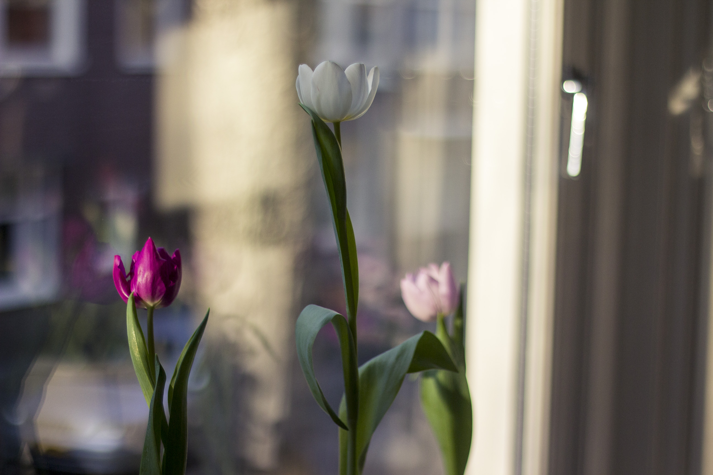
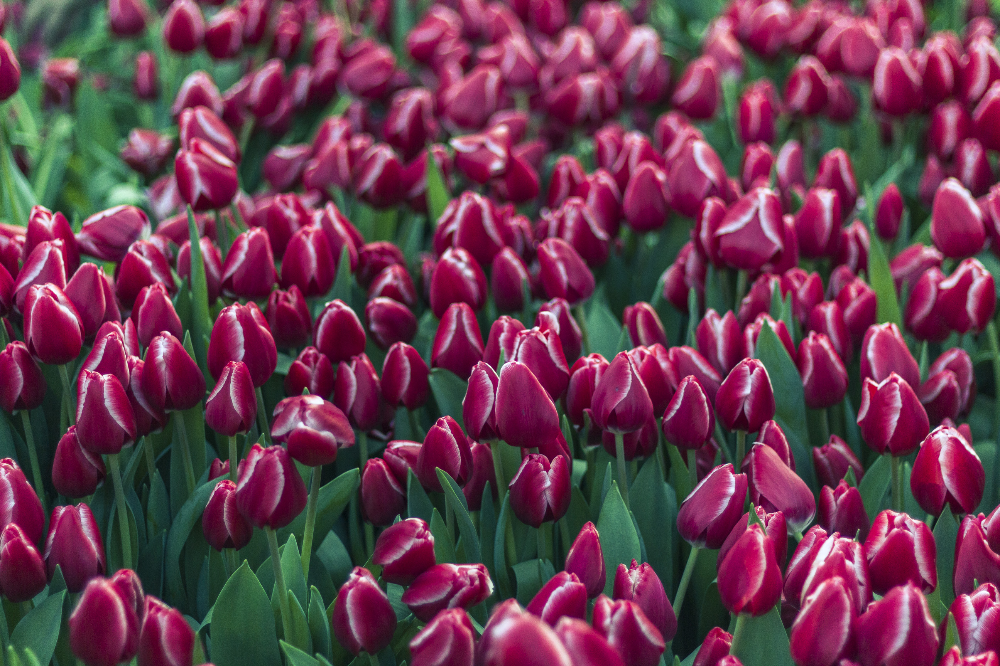
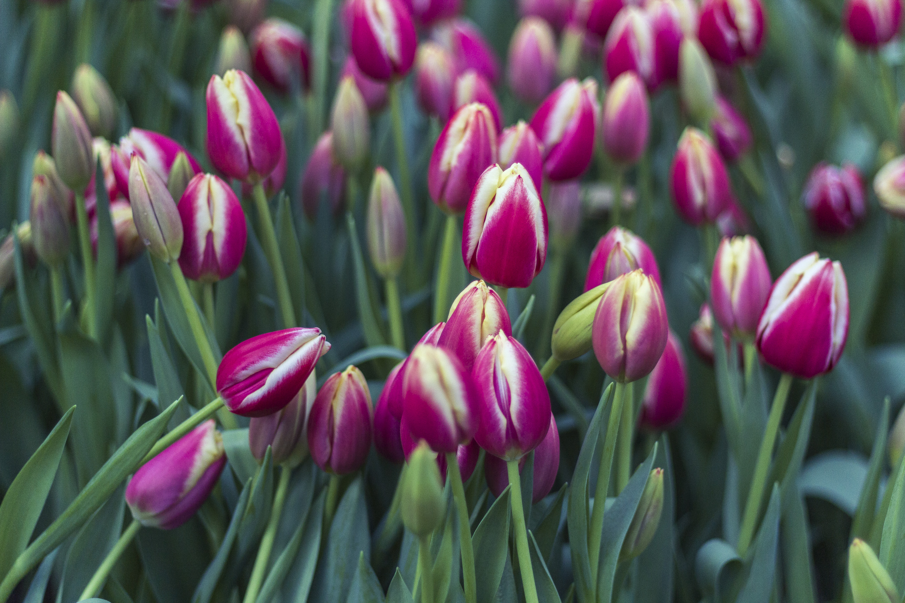
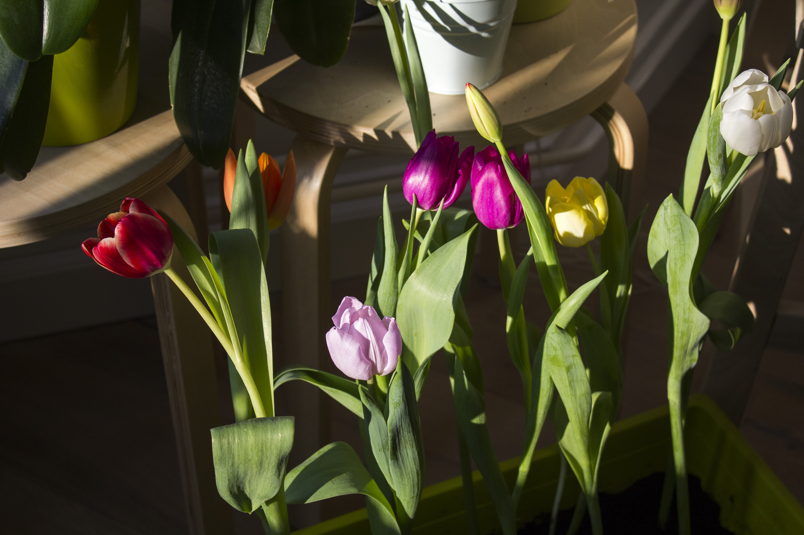
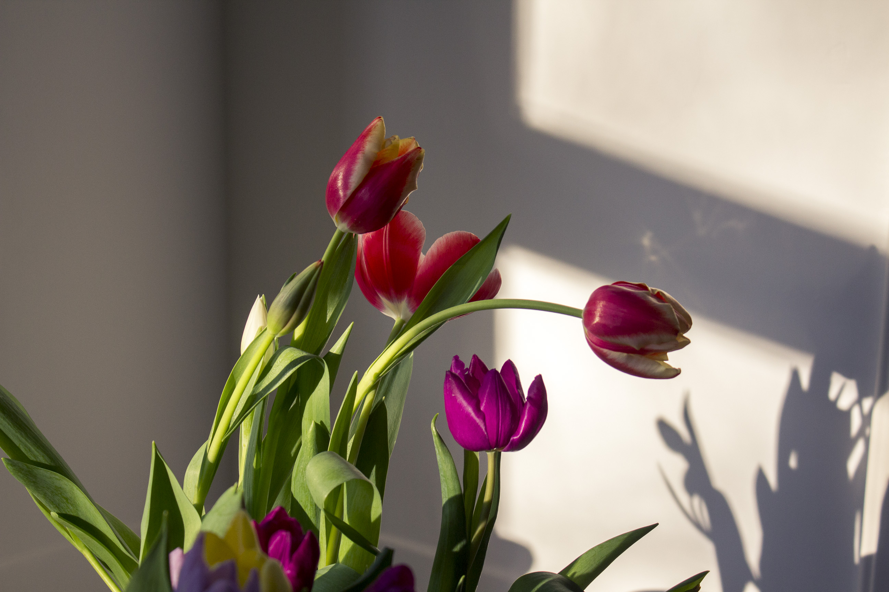
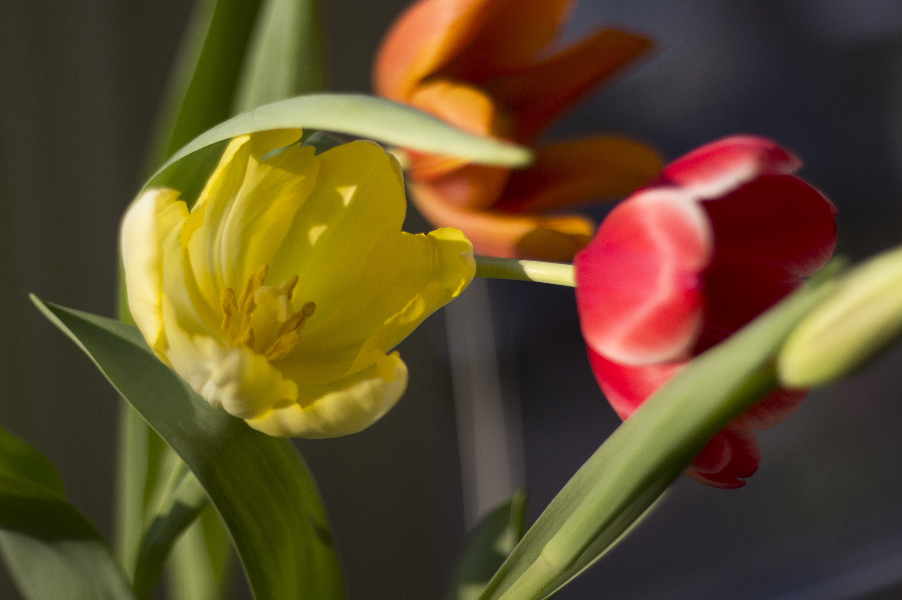
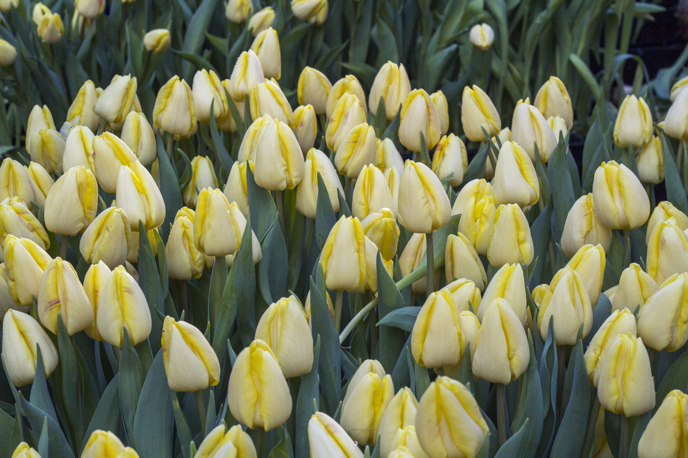

Samedi 21 janvier, nous fêtions le National Tulip Day.

Au Pays-Bas, il existe une chose qui n’existe nulle part ailleurs (je crois) : la journée de la Tulipe. Oui, au même titre que la journée de la femme ou encore la journée du câlin, ici nous avons aussi le privilège de fêter la journée nationale de la Tulipe. Cet évènement est plutôt récent puisqu’il a lieu chaque année le troisième week end du mois de janvier, depuis seulement janvier 2012. Cela se déroule à Dam Square, l’une des fameuse places d’Amsterdam. Durant cette journée spéciale dédiée à la fleur emblématique, un jardin éphémère composé de plus de 200 000 tulipes se dessine sur la place. L’installation dure toute une matinée, et à partir de 13h, le jardin ouvre et yous pouvez venir librement y récupérer les tulipes. Cette évènement célèbre donc l’ouverture de la saison des Tulipes aux Pays Bas. Non pas que vous trouverez dès ce jour des tulipes en fleurs dans les champs. Les tulipes en fleur à cette période étant généralement des tulipes cultivées sous serres pendant l’hiver, les champs étant réservés pour les bulbes plantés à l’automne d’avant. Mais dès de jour, vous trouverez d’avantage de Tulipes dans les magasins, sur les marchés et de nombreux fleuristes lancent leurs offres sur cette fleur si cher à la culture Dutch.

Violette, rouge, orange, blanche, lavande ... Il y en a de toutes les couleurs ! Toutes les Tulipes provienne de la région « Noord Holland », c’est à dire, venant de tous les champs ou serres à proximité, dans les environs d’Amsterdam.

Nous nous sommes donc rendus samedi dernier, à Dam Square, par curiosité au départ mais aussi dans l’espoir peut être d’avoir la chance de récupérer quelques Tulipes pour fleurir l’appartement un certain temps. (Vous comprendrez vite que le mot _“quelques”_ était complètement inapproprié).
Nous sommes arrivés vers 15h sur la place. C’était une journée magnifique avec un beau ciel bleu et un soleil d’hiver venant vous réchauffer les joues quelques instants.
Lorsque nous sommes arrivés vers 15h, il y avait une file d’attente qui longeait le mur derrière la place. Nous nous y insérons et prenons notre mal en patience. Il se trouve que nous avançons plutôt régulièrement et somme toute “assez vite”. Finalement en voyant toutes les Tulipes restantes, nous nous prenons au jeu d’attendre pour pouvoir rentrer dans le jardin. Nous atteignons finalement l’entrée au bout d’une heure de queue environ.

Il y en a de PARTOUT ! Et les gens sont un peu fous. Enfin, il y a de tout. Il y a ceux qui poussent tout le monde de peur de pas avoir LEURS tulipes, ceux qui sont venus en famille et dont les enfants courent partout, et ceux un peu comme nous, qui veulent juste récupérer quelques fleurs tranquillement. Ils y a ceux qui n’en ramassent que deux ou trois et ceux qui ont carrément ramener leur cabas et les remplissent jusqu’à rebord.
Il faut savoir que les Tulipes possèdent encore toutes leur bulbe. L’idée est donc de les replanter dans son jardin ou même dans un pot une fois arrivé chez soi. Ce ne sont pas 200 000 tulipes cultivées et ensuite coupées et distribuées. On évite le gaspillage svp, même si je pense que malheureusement de nombreuses personnes les jeterons ...

À l’entrée ils fournissent des sacs plastique de très bonne qualité qui retiennent parfaitement l’eau. Nous prenons une tulipe par ci, une tulipe par là. Et de fil en aiguille, nous nous retrouvons avec deux sac plastique remplis de tulipes de toutes les couleurs.
Ce n’est qu’une fois arrivé à la maison que nous nous rendons compte du volume des fleurs. On en a vraiment pris BEAUCOUP ! Il a fallu nous rendre a l’évidence que nous ne pourrons pas toute les replanter, par manque de pots et de terre. Nous en avons donc replanter 10 en jardinière, et d’autres dans des petits pots individuels. Pour le reste, nous avons coupés les bulbes et mis les fleurs dans deux vases. Nous en avons aussi donné une bonne dizaine à notre voisin-propriétaire car ça faisait vraiment beaucoup trop de Tulipes d’un coup dans la maison ! x)

En tout cas, après une semaine, les fleurs sont toujours en bonne états et même celles que nous avions cueillies fermées, ce sont ouvertes depuis ! La maison est bien fleuries mais je crois qu’après ça j’ai eu ma dose de tulipe pour un bon moment 🙂

