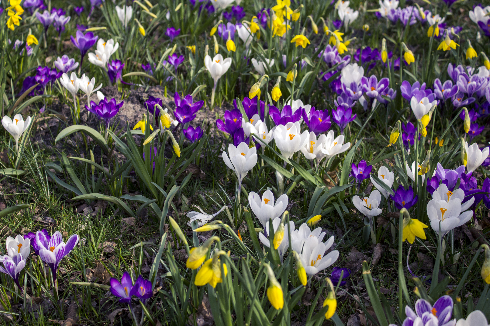

Hello la compagnie.

Des nouvelles météorologiques du plat pays. Ici, je crois que le printemps commence à pointer le bout de son nez (mais seulement le bout). Les jours rallongent. Et c’est quand même super agréable de sortir de l’agence alors qu’il fait encore jour dehors. Les températures semblent remonter tout doucement aussi. Les arbres bourgeonnent petit à petit. Et lors de mes trajets Amsterdam - La Haie pour le travail, je prend désormais plaisir à observer les champs de tulipes, que je traverse en train, se parer de milles et une couleurs. Vendredi dernier, avec la lumière du petit jour, c’était magnifique à voir! Bref, toute l’ambience générale commence à sentir bon le printemps et même les barbecues sont de nouveaux autorisés dans le Vondelpark. Le matin, je troque de plus en plus mon manteau d’hiver contre mon blouson en cuir ou ma doudoune légère. Enfin, si je devais être honnête, je devrais plutôt dire que je troque mon manteau d’hiver contre mon joli ciret de pluie. Car oui, qui dit printemps ici dit aussi pluie malheureusement ! Depuis que nous sommes ici, je crois que février a été le mois le plus endurant. Très froid, très pluvieux et surtout très venteux ! Décembre et Janvier furent relativement doux comparé à Février. Disons que le froid sec de l’hiver a désormais laissé place au vent et à la pluie printanière.

Ce qui me fait penser que malgré tout ici, la pluie n’est pas un problème en soit. Ce n’est pas agréable, c’est sûre. Mais à partir du moment ou tu es équipé correctement, la pluie n’est pas un obstacle en soit. « Équipé correctement », ça veut dire, oublier le style et s’en battre totalement de ne ressembler à pas grand chose. Ici, la logique vestimentaire est simple. Il pleut. Je me déplace à vélo. Je n’ai pas envie d’être tremper. Voilà. Fin de la logique. (comprendre: kway et capuche recouvrant entièrement la tête et pantalon de pluie of course).
On pourrait aussi résumer le style Amstellodamois à « c’est avant tout pratique ». Déjà d’une, tout le monde ou presque possède un sac à dos. Parce que oui, c’est tellement plus pratique sur un vélo. Croyez-moi, je l’ai vite adopté moi aussi. Si tant est que mes sacs à mains ne sortent presque plus jamais du placard sauf si je ne me déplace pas à vélo! Ce qui est devenu assez rare.
Amsterdam c’est aussi le pays de la sneakers. Il suffit de se balader à Kalverstraat pour s’apercevoir qu’il y a au minimum 3 ou 4 magasins de baskets à la ronde. Et, oui, une fois de plus, les baskets c’est tellement plus pratique à vélo! Rares sont les filles que je vois avec des talons, encore moins des talons aiguilles !

Avec le recul, je trouve ça assez drôle d’observer les différences entre les habitudes vestimentaires. Désormais je peux réellement l’affirmer, il existe bel et bien un style parisien! Même moi, alors que je suis loin de me considerer comme LA parisienne irréprochable d’un point de vu style, il suffit que je mette un short bien coupé avec des collants, un joli gros pull blanc et surtout du rouge à lèvre rouge et BIM, me voilà que 3 ou 4 personnes dans la journée me disent « Hey Clémence, you look parisian today! » Incroyable mais vrai. Je trouve ça drôle et surtout je m’étonne aussi moi même d’accepter parfois de sortir dans des « « états » (pas de fond teint pendant 2 mois au moins, car le mien était terminé et impossible de trouver le même ici! Je progresse niveau confiance en soi et acceptation de soi!)

Enfin bref, ce week end marquait clairement le retour du printemps. C’était le premier week end de vrai beau temps depuis le début de l’année et croyez-moi les Amstellodamois l’on bien remarqué! À tel point que ce fut le sujet de conversation numéro un lundi matin à l’agence. En même temps, il faisait vraiment beau et nous en avons aussi profité dimanche pour se balader le logn d’un canal au soleil, comme tout le monde en fait ! Ce que cela était agréablement agréable ! Alexis peut en témoigner, je m’extasiais à chaque petit coin de rue au soleil, comme si cela faisait 10 ans que je n’avais pas vu la lumière du jour..! Mon plus grand plaisir du week end fut sans doute aussi de pouvoir aérer les fenêtres en grand, la lumière du jour baignant la chambre, l’air frais du matin mais pas trop, rentrant dans la maison.

J’aime le printemps. Ce sentiment de re-nouveau après l’hiver durant. De changement. Les sourires béas des inconnus dans la rue. Les gens lézardant en terrasse. Remettre ses lunettes de soleil. Observer les premiers crocus et autres tulipes écloses dans les parcs. Commencer à en avoir marre de mettre des gros pull alors qu’Alexis sait à quel point j’adore ça. Rêver de chevilles découvertes et de cou dégagé. Partir sous la lumière du soleil. Revenir alors qu’il fait encore jour.

Et apprécier tous ses petits bonheur que la vie nous offre.
Jusqu’ici tout va bien.

Ps : Je raconte tout ça mais je n’ai toujours pas acheté de pantalon de pluie. Je n’ai pas encore tout à fait passer ce cap. Alexis oui, étonnement. Mais c’était évidemment et avant tout pour des raisons pratiques ... 😉

Pps : Il suffit que j’écrive cette phrase pour que le lendemain je me retrouve désormais en possession d’un magnifique pantalon de pluie en toile ciré bleu marine. J’ai hâte ! (#ironie)

