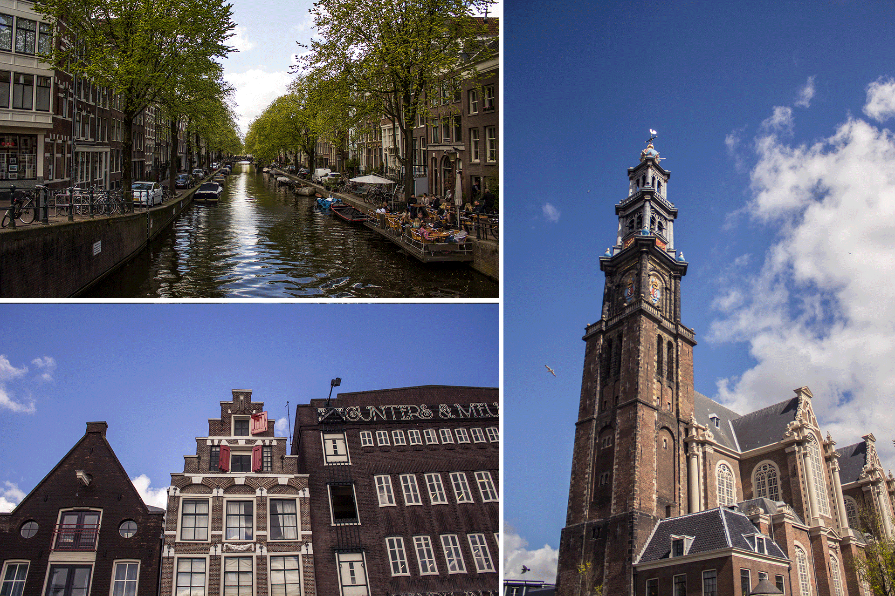
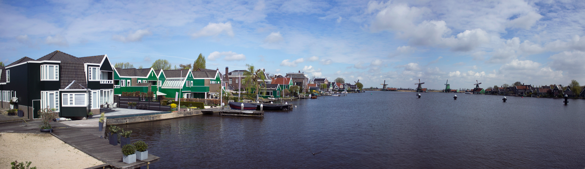
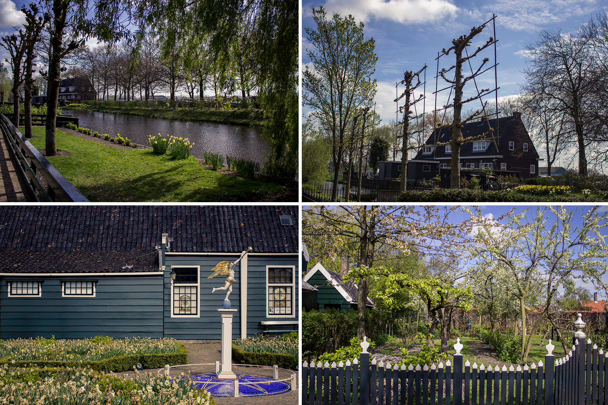
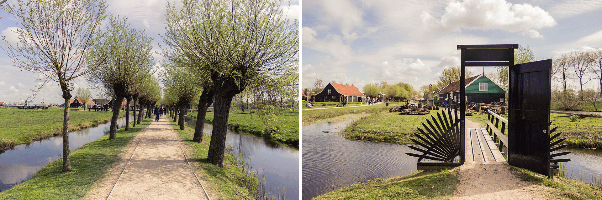
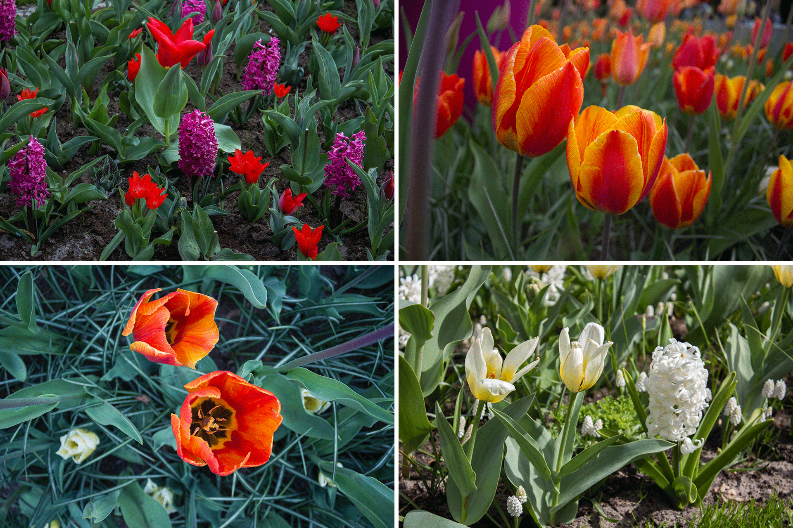
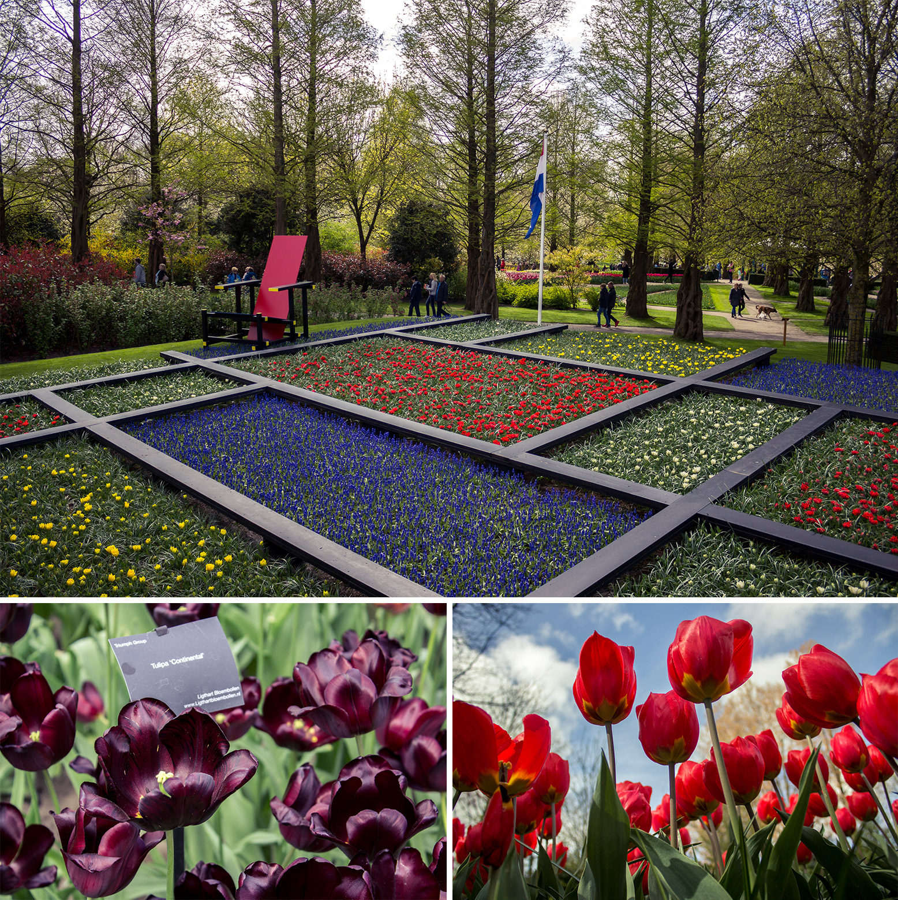
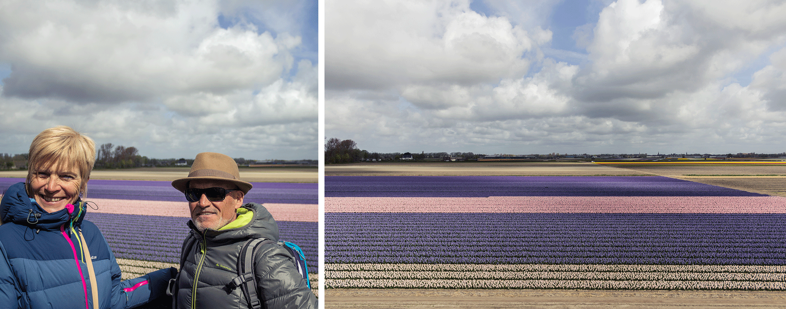
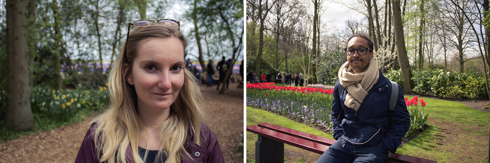

Coucou.

On vous retrouve après une semaine de vacances prises pour profiter de la venue de Papa, Maman et des Silve sur Amsterdam! Ce fut une semaine bien remplie en marches, ballades et escapades, loin d’être de tout repos, et je suis bien contente d’avoir encore eu mon lundi de Pâque férié pour reprendre un peu mon souffle avant la reprise.

## Dimanche

Le premier dimanche, nous avons accueilli la tribu sous un magnifique soleil comme on en avait jamais vu encore à Amsterdam! Nous avions prévu de faire le repas de midi à la maison tous ensemble, mais c’était sans compter les soucis d’électricité survenus le matin même... Résultat, ça s’est fini en sandwich jambon / fromage ... ^_^ Qu’importe. Nous avons profiter du beau temps à la place.
Car un tel temps ne pouvant s’ignorer, maman et moi avons accompagné les Silve jusqu’à leur AirBnB à pied. Nous en avons profité pour traverser le Rembrandt Park. Il devait faire plus de 25 degrés, vraiment beau et chaud. Tout le monde dans le parc est en débardeur / short / maillot de bain à bronzer et faire des barbecues !! C’était assez incroyable, comme si, ces jours de beau temps étaient tellement rare qu’il faille ne surtout pas les rater pour en profiter à fond!

## Mardi

Mardi matin, le temps s’est beaucoup rafraîchi comparé à dimanche dernier. Mais au final, je pense qu’ils ont eu de la chance car nous avons évité la pluie de toute la semaine quasiment, alors qu’elle s’annonçait au départ très pluvieuse. Il faisait frais, voire froid, certes, mais plutôt beau et sec !

Mardi donc, nous nous sommes rendus à Zaanse Schans. Située au nord-ouest d’Amsterdam, en 20 min en train depuis la gare centrale, ce “village” nous plonge dans le Pays-Bas rural et industriel du 18e et 19e siècle. À l’époque, la région de Zaan, nom de la rivière, était une zone industrielle riche et productive, composée de plus d’une centaine de moulins, broyant graines de lin, de moutarde, de cacao, des moulin à papier, et bien d’autres encore. Désormais musée à ciel ouvert, le village comprend aussi une reconstruction de l’un des tout premiers magasin Albert Heijn (aujpourd’hui la plus grande enseigne de magasin alimentaire des Pays-Bas).

Nous baladons au milieu des maisons traditionnelles, des ateliers, des champs et des moulins! Il n’en reste que 6 en “activité” et certains se visitent même, moyennant des frais d’entrée. C’est vraiment très mignon, charmant & relativement pittoresque, si l’on omet les bus de touristes en fond de paysage ... Quel dommage qu’il y est autant de monde ! Zaanse Schans est une véritable attraction touristique et je plains les quelques résidants à l’année! Mais bon, je pense que le lieu vaille tout de même le détour, si vous restez plus de 3 jours sur Amsterdam, en témoigne les jolies photos ! 😉

Au retour des moulins, j’ai guidé la troupe au travers des rues centrales en direction du marché aux fleurs. Nous sommes passé par quelques rues du quartier rouge, histoire de, mais je dois dire que de jour, je trouve ça moins impressionnant, moins “ tape-à-l’oeil”, sans toutes les vitrines éclairées de rouge et de rose. Arrivés au bout du Singel, nous faisons le tour du Bloemenmarkt avant de rentrer se poser à la maison, repos bien mérité après cette journée remplie !

## Mercredi

Mercredi, le ciel est tout gris. Météo “parfaite” pour aller se restaurer aux FoodHallen. En pleine semaine, le midi, histoire d’être sûre d’avoir une grande table pour 6! Le Foodhallen ou le paradis de la bouffe street & hipster. Situé dans Oud West, à coté de Kinkerstaart, pas forcément le plus bel endroit d’Amsterdam, les Foodhallen sont en faite un ancien grand dépôt de trams transformé en halles. Vous y trouverez les FoodHallen donc, mais aussi un petit cinéma tout mignon, le FilmHallen et d’autres petits magasins de “créateurs / artisans”.

Aux FoodHallen le principe est chouette et plutôt simple. Vous vous asseyez à une des tables ( si vous arrivez à en trouver une de libre après 5 tours ...) et chacun va commander la nourriture qu’il souhaite. Il y en a pour tous les gouts : japonais, burger, pizza, Hotdog, cuisine “dutch”, viande, poisson, asiatique etc ... Tout est TROP bon! Avec Alexis nous avons déjà testé et approuvé The Butcher et leur succulents burger ainsi que leur Fish & Chips. Cette fois-ci nous avons choisi de tester les Hot Dogs de chez The Bulls and Dogs. Ça parait petit mais en faite, ça cale bien. C’est juste très chiant à manger sans couverts! Pour le dessert, nous avons craqué pour un nouveau stand de gaufres en cornet avec de la glace. Hmmmm!
Maman et Marijo ont choisi une salade printanière à base d’asperges. Papa et Thierry ont quant à eux choisi la traditionnelle côte de boeuf à la française, au Pays Bas ... Cherchez l’erreur ahah!

## Jeudi

Jeudi nous avons décidé de louer une voiture pour nous rendre aux jardins du Keukenhof. (Et c’est bibi qui a conduit!). Situé dans la commune de Lisse, à environ 30 km au sud-ouest d’Amsterdam, Keukenhof est aussi connu sous le nom de “Jardin de l’Europe”. Littéralement Keukehnof veut dire “jardin potager”. Ces jardins d’environ 32 hectares servent de vitrine à l’industrie florale des Pays-Bas. 7 millions de bulles y sont plantés de manière décalée afin d’assurer une floraison permanente durant toute l’ouverture du jardin, de mars à mai. Vous l’aurez compris donc, le Keukenhof, c’est des tulipes à perte de vue. Plus de 800 sortes à en croire les panneaux. Nous avons pic-niqué au milieu des fleurs avant de repartir pour Amsterdam.

Nous terminons la journée dans le Pijp, un quartier très cosmopolite et populaire d’Amsterdam, réputé pour ces nombreux bars et restaurant mais aussi ses boutiques vintage et son marché, l’Albert Cuyp Markt, soi-disant le moins cher de la capitale.

C’est au bar le Gollem que nous nous retrouvons, un bar à bière assez typique et plutôt sympa, qui possède différentes adresses. Ici, vous avez le choix entre plus de 50 bières différentes! Ils organisent même des dégustations de bières pour les amateurs, accompagné de fromage et d’un bon jeu de société.
C’est en fou rire (8,5% degrés la Delirium Tremens bonjour!) que nous regagnons la maison 😉

## Vendredi

Pour ma part, je suis restée à la maison vendredi pour cause de projet en freelance. Alexis travaillait aussi toute la journée. En revanche, maman et les Silves en ont profité pour aller se balader un peu en solo, sans leur guide VIP 😉 De ce que j’en retiens, ils sont allés du coté de Museumplein, sont rentrés dans le très beau Hall du Rijksmuseum pour ensuite se diriger vers Dam Square qui est en ce moment bien animé par une fête foraine. Je sais aussi qu’ils en ont profité pour retourner au Fish and Chips, les Silve n’ayant pas encore eu l’occasion de gouter. C’est définitivement une excellente adresse puisqu’ils ont eux aussi adoré!

## Samedi

Samedi, dernière journée avant leur départ. Nous avons décidé de nous rendre dans le Jordan au marché du Noordermarkt, puis dans les Negen Straatjes. Dans ce quartier, dont le nom signifie “les 9 rues”, les rues portent toutes des noms qui rappellent le commerce des peaux : Reestreat pour cerfs, Hartenstraat pour Chevreuils etc ... Vous l’aurez compris, à l’époque ce quartier faisait profit dans la peausserie. Aujourd’hui, tous les commerces ont été remplacés par une myriad de petit cafés et de boutiques plus “hyppe” de vêtements, maroquinerie, bijoux, boutique de créateurs etc ...
Ces neufs ruelles forment un petit rectangle de rue coincées entre les grands canaux principaux de Prinsengracht (canal du Prince), Keizersgracht (canal de l’empereur), Herengracht (canal du Gentleman) et Singel. Bien moins bondée que le Dam Square et le quartier rouge, bien qu’assez populaire, les 9 straatjes reste un de nos endroits favoris, avec Alexis, pour flâner et y faire un peu de shopping. 🙂

Le soir, nous mangeons chez les “Silve” dans leur AirBnb, une très bonne salade, parfait après une semaine à ne manger que des Stroopwaffels et du chocolat x)

## Dimanche

La semaine est d’ores et déjà passée et voilà que Papa & Maman doivent reprendre l’avion du retour. C’était une chouette semaine et je suis super contente que la pluie fut repoussée, car cela aurait été bien dommage de devoir visiter les parapluies en l’air ...!

Je suis aussi contente car avec toutes ces ballades, je me rend compte qu’en à peine 7 mois, nous connaissons déjà bien la ville, bien plus que Paris, et certaines anecdote aussi! Encore plus Alexis, qui, avec toutes ses livraisons, sillonne Amsterdam à vélo de fond en comble!
