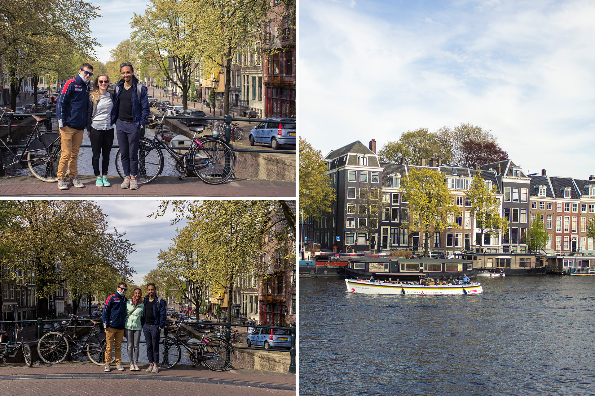
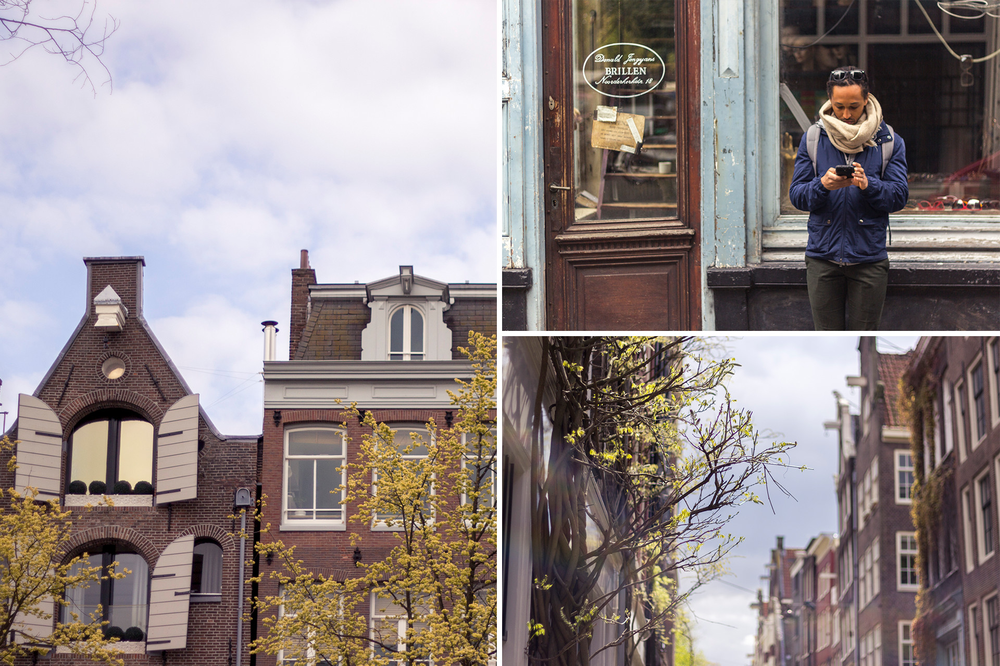

Plus d’un mois s’est écoulé depuis notre dernier article. Que s’est t-il donc passé depuis dans notre Amsterdam adorée?

## 01

Après la visite de mes parents et des Silve, nous avons eu la chance de recevoir Amandine et David le temps d’un week end. Le temps fut encore meilleur que la semaine précédente et c’était on ne peut plus agréable que de pouvoir se balader, sans avoir ni trop chaud, ni trop froid. Nous avons beaucoup marché. Amsterdam West, Centrum, 9 Straat, Oud Zuid, et même un peu jusqu’à Amsterdam Oost. Nous avons aussi bien mangé et notre petite dégustation de fromages Dutch a fait son effet ;-).

## 02

Nous avons aussi vécu notre premiere “Fête du Roi”. LE jour férié à ne pas rater aux Pays-Bas où globalement tout le monde se déguise en orange (la couleur nationale en référence à la famille royale dutch Orange-Nassau), boit de la bière sur un bateau dans les canaux et fait la fête en l’honneur du roi (sous prétexte de son anniversaire). Le centre est littéralement une fête géante mais aussi et malheureusement une déchèterie à ciel ouvert. Du côté du Vondelpark, c’était la grande braderie des enfants. Je n’ai jamais vu le parc aussi rempli!

## 03

Nous avons voté aussi. Car oui, nous sommes toujours français, jusqu’à preuve du contraire. Et voter c’est important. Le second-tour fut assez impressionnant. Nous avons dû faire 1h30 de queue au consulat d’Amsterdam avant de pouvoir glisser notre bulletin dans l’urne. C’était drôle aussi de se retrouver au milieu de gens parlant tous français. Drôle de comprendre les discussions des gens autour de soi !

## 04

Au mois de mai, nous avons travaillé aussi. Car oui, contrairement à la France, nous n’avons pas la chance d’avoir des jour fériés en pagaille. Au mois de mai, seul le 25 mai, l’ascension, est férié. Pour l’occasion, mon agence faisait le pont du 26. Du coup, nous en avons profité pour partir en long long week à Fruges chez la maman d’Alexis. Le temps fut radieux. Je crois que nous n’avons jamais eu aussi beau temps à Fruges ! Nous avons eu le plaisir de descendre en voiture, une très sympathique DS3. Nous n’avons malheureusement pas eu le temps d’aller faire un tour à la plage du côté du Touquet pour cause de travail Freelance de mon côté, jardinage et bricolage du côté d’Alexis, mais ce n’est que partie remise!

## 05

Lundi prochain, le 4 juin, le lundi de Pentecôte sera le dernier jour férié avant trèeeees longtemps pour nous. Le prochain n’étant pas avant Noel... Pour ce long week end de 3 jours, nous avons le plaisir de recevoir Claire-Lise et Alexis. Amsterdam city guide tour et BBQ sont prévus à l’occasion 😉 Ensuite, ce sera au tour de ma copine Julie d’arriver avec Louis pour 5 jours sur la capitale. Que de week end qui s’enchainent ! On croise les doigts pour que le temps reste au beau fixe car je dois dire que nous avons eu le droit à un mois de mai particulièrement doux voire parfois très chaud !

## 06

Et sinon, et sinon.
Cela fait maintenant plus de 8 mois que nous avons posé bagages à Amsterdam et c’est toujours le big love entre nous ! Cette ville est tellement agréable à vivre. Le printemps fut doux et tellement mignon avec toutes ses tulipes, mais le mois de mai l’est encore plus. La douceur du soleil s’est ajouté à la douceur de vivre. Et, c’est drôle car, il suffit d’un rayon de soleil pour que tous les Amstellodamois soient en terrasse ou en train de bronzer dans un parc. En faite c’est ça. Ce que j’aime ici c’est que chacun sait apprécier les petites choses, les petits bonheurs de la vie, sans trop se soucier du lendemain. Voir les gens sourire sur le vélo, être heureux. Ça déteint forcément un peu sur soit. Qu’il est doux de faire du vélo tous les jours dans le Vondelpark. Qu’il est doux de rentrer le soir en profitant encore de la lumière du jour. Je crois que je ne m’en lasserais jamais. Et ce n’est pas plus mal !

## 07

8 mois déjà. 8 mois seulement. Souvent les gens nous demandent “et alors, vous comptez rester combien de temps?”. Mais si l’on devait être tout à fait honnête, je crois que la question ne nous a jamais réellement traversé l’esprit. Enfin personnellement, pas une seule fois je me suis imaginée re-partir. Ça peut paraître bizarre et je considérerais toujours la France comme “chez moi”, “mon pays”. Pourtant, ici aussi c’est devenu finalement un peu chez moi, chez nous. Pour l’instant, pas vraiment de date de retour. Je sais bien que nous ne resterons pas ici toute notre vie (qui-sait ?), mais quant à la question de combien de temps, ce n’est vraiment pas d’actualité. Encore moins depuis que mon contrat chez Mobgen est passé en contrat indéterminé (alors oui, parmi les dernières nouvelles il y a celle là tient !). Autant vous dire, que la (fausse) dead-line a totalement disparue !

À très vite pour des nouvelles sentant bon l’été !
