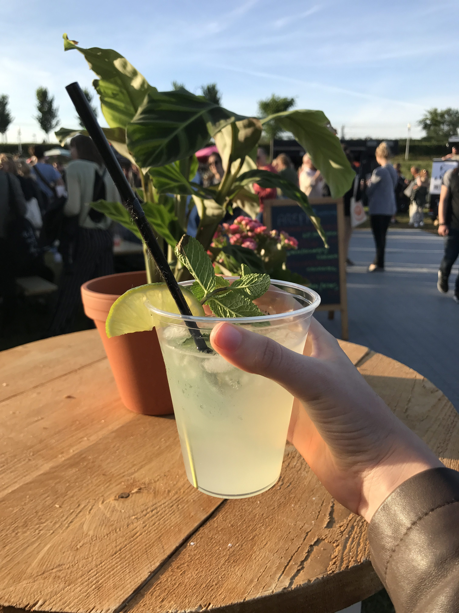

Amsterdam nous aimons la découvrir de deux manières : en nous promenant, ou bien en mangeant. Pour une fois, c’est en mangeant que nous vous emmenons découvrir une nouvel facette local de la vie amstellodamoise.

## De rollende keukens - Food truck Festival

Pour le pont du Jeudi de l’Ascension avait lieu le Rollende Keukens Amsterdam, l’un des plus grands festivals de Food Truck d’Amsterdam. “Rollende Keukens” signifie littéralement “cuisines roulantes”. Plus de 100 Foodtruck réunis en un seul et même endroit pendant 5 jours au Westerpark. _Manger_. Nous nous y sommes rendu le Mercredi 24 mai au soir avec les copains Robin et Marie. Et il se trouve que ce soir là avait aussi lieu la final de l’Europa League avec l’Ajax (équipe d’Amsterdam) jouant face à Manchester et pour l’occasion 8 écrans “géants” étaient installé un peu au quatre coins du festivals _party_,

Lorsque nous sommes arrivés sur place, je ne m’attendais pas à autant de foodtruck. 100 c’est VRAIMENT énorme et pas facile en matière de choix. Il y a de tout. Même un stand à insectes grillés. Ambiance festive et très relax. Malgré l’ampleur de l’événement, on a pas du tout la sensation de “foule”. On a de la place pour marcher. De la place dans l’herbe pour se poser un peu partout. Parfois la queue aux Food truck mais ça reste raisonnable. Après nous sommes venus un soir en pleine de semaine, veille de long week end, soir de match. Je n’ose imaginer le festival le samedi, où il a fait d’ailleurs extrêmement chaud sur Amsterdam (plus de 30 degrés en pleine après-midi). Ça devait être bien blindé quand même.

_Tacos, Flamekuche, Vins, Bière, Bitterballen, Burger, Poulet frie à la koreanen, Pizza au feu de bois, Pita, Bao, Mojito, Nouille asiatique, HotDog, Spécialités indiennes, Poisson fris, Churros, Poffertjes, Bouillabaisse, Glace, Gâteau, Limonade, Jus frais, Fraises, Grillade argentine, Stand venge, stand vegan. Il y en a pour tous les gouts._

Nous avons du faire le tour à deux reprises avant de nous décider ! Nous avons donc opter pour une petite dégustation de bitterballen, LE snack Dutch. Ce sont des petites boulettes fries traditionnellement à base de viande. Nous avons choisi un panaché de 5 différentes : Boeuf, “Bouillabaisse” (comprendre poisson en faite), Fromage de chèvre, Truffe et un dernier dont je ne me souviens plus. Je dois avouer que ce n’était pas ouf du tout hormis celle à la truffe. Ils raffolent tous de ça ici mais je ne dois pas être une vraie Dutch car je n’y ai vu rien de très exceptionnel ahah.

Pour continuer, nous nous sommes arrêter au Stand “everything on a Stick” qu’Alexis avait découvert en livrant Deliveroo. Nous y avons pris deux brochettes de poulet “teriyaki”. C’était plutôt bon !

Ensuite, nous sommes passé devant un stand faisant une barquette de pomme de terre fries avec salade, poivron, calamar fris et autre qui avait bien l’air bon. V’la ti pas que je m’arrête 2 min pour regarder que le cuisinier un peu fou nous dit aller, zou j’vous fais une barquette. Un peu contraintes et forcée lol, mais la barquette était relativement bonne.

Alexis avait encore faim. Moi je commençais à être bien rempli. Lui & Robin voulaient des frites. (Les pommes de terre n’ont pas suffit semble-t’il ^^ ) Et, chose incroyable. Nous avons tourné 3 fois, et n’avons trouvé aucun stand faisant des frites !! Tout sauf des frites, dingue. Du coup ils se sont rabattue sur des churros. Tout aussi bon. Pour ma part, j’ai continué dans la tradition Dutch en me prenant une barquette de Poffertje, des mini pancake aux beurres avec toppings. J’ai pris topping chocolat et c’était délicieux!! Très gras en beurre aussi, mais super bon!

Le festival a lieu chaque année au mois de Mai et pour sûre nous y retournerons l’année prochaine !!

<gallery>

</gallery>
