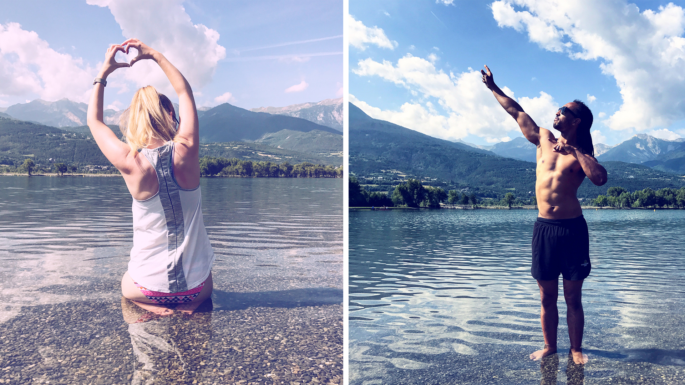
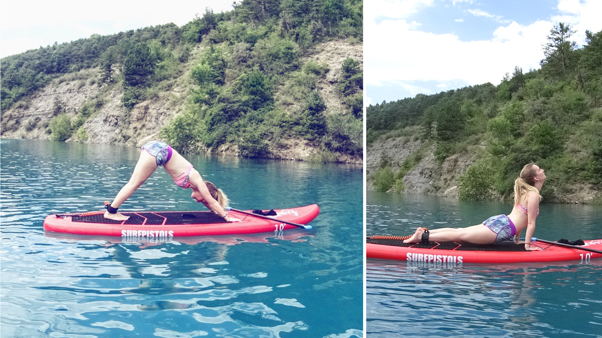

Quoi de mieux qu’un 14 juillet pour parler de notre semaine de vacances en France !

Cette année, nous avons décidé de passer la plupart de l’été sur Amsterdam en nous accordant tout de même 1 semaine de vacances fin juin sur Embrun, ce qui me change radicalement de l’année dernière où avec toutes les histoires de déménagements, nous avions pu profiter de plus d’un mois et demi de vacances d’été !

Il y a déjà (déjà !) maintenant deux semaines donc, nous sommes partis pour quelques jours de vacances sur Embrun, dans le but de se reposer avant-tout ! Ça peut paraître bête, mais pour moi c’était très important de réussir à faire une pause pendant quelques jours car je commençais à atteindre un niveau de fatigue mental très insoutenable. La raison était bien simple : en ce moment et ce depuis fin mai, en plus du boulot, je bosse sur un projet freelance qui me prend beaucoup de temps, aka la plupart de mes week-end. Ça ne m’était jamais arrivé avant, mais j’ai vraiment ressenti à un moment une sensation de “j’ai atteint ma limite d’endurance, je n’en peux plus”. Du coup, première fois aussi dans ma vie, j’ai décider de partir en vacances sans ordinateur ! Bon pas si vite, j’avais quand même mon iPhone. Mais ne pas avoir d’ordi, ça voulait vraiment dire aucune tentation de travailler sur quoique ce soit. Ne recevant pas non plus mes mails pro de l’agence sur mon tel, c’était la garantie d’être totalement déconnectée du travail !

Comme à mon habitude sur Embrun, j’avais envisagé de passer la plupart de mes après-midi au lac à faire trempette / bronzer tout en alternant avec une ou deux petites randonnées et pourquoi pas quelques ballades. Malheureusement, nous avons eu une semaine de mauvais temps. 3 jours sur 5 de pluie.. Nos seules vacances de l’été, nous les avons passés sous la pluie. Autant dire, que j’étais quand même bien dégoutée (même si je savais pertinemment que ça ne changerait rien de râler). Du coup petite anecdote, n’ayant pas d’ordinateur nous nous sommes mis à faire des partie d’échecs. Avec pour ma part l’objectif simple de mettre au moins une fois Alexis échec et mat avant la fin des vacances. Et je suis très fière de pouvoir dire que j’ai atteint mon objectif 😉

En tout cas, nous avons essayé de profiter au maximum des 2 petites journées de soleil qui nous ont été accordés.

Arrivés le dimanche après-midi, il faisait très chaud, très beau. Ni une ni deux nous sortons au lac profiter du soleil. Le lundi, seconde journée de soleil (quoique gros oranges vers 16h) était prévue mon activité favorite depuis l’année dernière : le Stand Up Paddle Yoga. Cette fois-ci, c’était combiné avec 1h de marche nordique + 1h de yoga paddle. C’était super chouette. Le cadre est tellement magnifique, en témoignent les quelques photos. Au calme, accompagné par le chant des oiseaux. Parfais pour la relaxation yoga sur le paddle. Nous en avons profité aussi pour faire un picnic sur place, avant de rentrer s’abriter de la pluie et des orages. Le mardi, lever un peu tôt pour une fois de plus profiter du soleil avant la pluie de l’après-midi. Pour cela, nous avons opté pour un petit run, à savoir 1 tour du plan d’eau en courant + 1 tour en marchant à vive allure.

ET .... ce fut finalement les seules activités extérieures que nous ayons eu le temps de faire car le vendredi nous prenions déjà la route en direction de St Etienne en vu du week-end des cousinnades. Quel week-end d’ailleurs ! Plus de 70 personnes de la même famille réunis en seul et même endroit sur 2 jours. C’est fort dommage une fois de plus que le soleil ne fut point au rdv, mais ce n’est que partie remise pour l’année prochaine 🙂

Au final, ce fut des vacances sommes-toutes assez fatigantes dû aux nombreux trajets que nous avons pu faire : Lyon —> Embrun. Embrun —> St Etienne. St-Etienne —> St-Julien-Chapteuil. St-Julien-Chapteuil —> Paris. Paris —> Amsterdam. Ça en fait des kilomètres. Et c’est fou comment ne rien faire dans une voiture peut être à ce point fatiguant !! J’ai personnellement mis une semaine à m’en remettre. Et j’ai eu cette vilaine sensation de me sentir encore plus fatigué qu’au départ. Heureusement pour moi, je commence à voir le bout du tunnel pour le projet en free. Ce qui veut dire que je vais pouvoir à nouveau prendre mon temps le week end. Et quite à passer l’été ici, j’ai aussi entrepris d’aménager un petit nid douillet sur notre balcon pour pouvoir profiter du soleil au maximum, (soleil qui n’a pas beaucoup pointé le bout de son nez d’ailleurs depuis notre retour ...). Et qui dit aménagement, dit excursion Ikea ahah ! Je vous ferais surement un petit article quand ce sera finis. Une chose est bien sûre : j’ai hâte 🙂

Edit : L’article étant posté un peu en retard, je vous écris ces quelques dernières phrases depuis justement mon balcon. Et c’est tout simplement parfait. Il reste encore deux trois petites choses à aménager (mettre des plantes dans les pots par exemple ..) et je ferais des photos ensuite. On est trop content du résultat et on en profite déjà au maximum ! À très vite !

