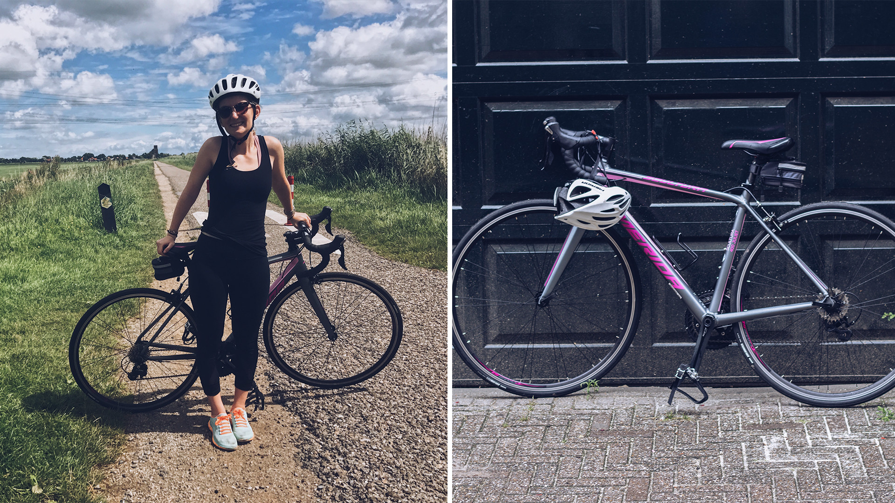
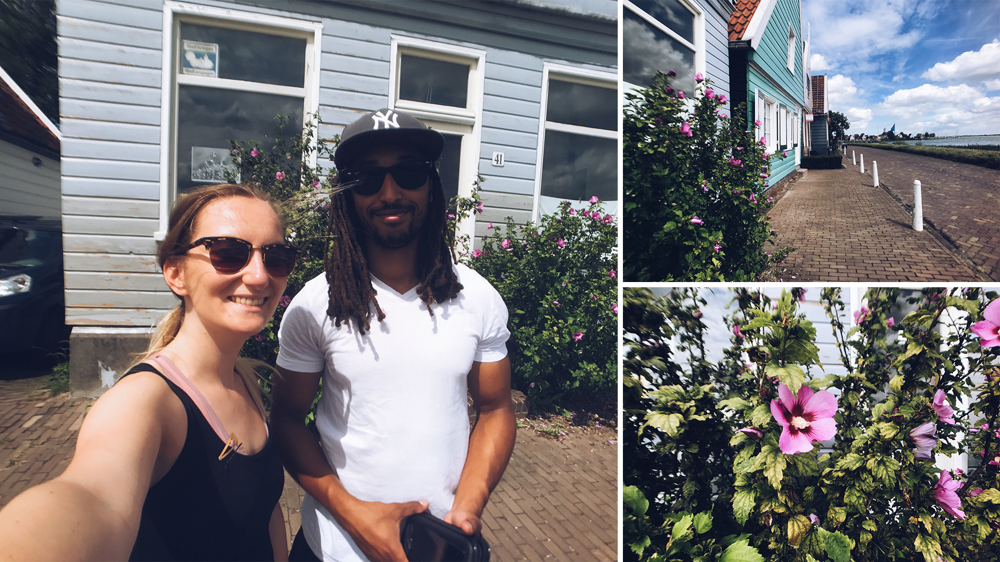
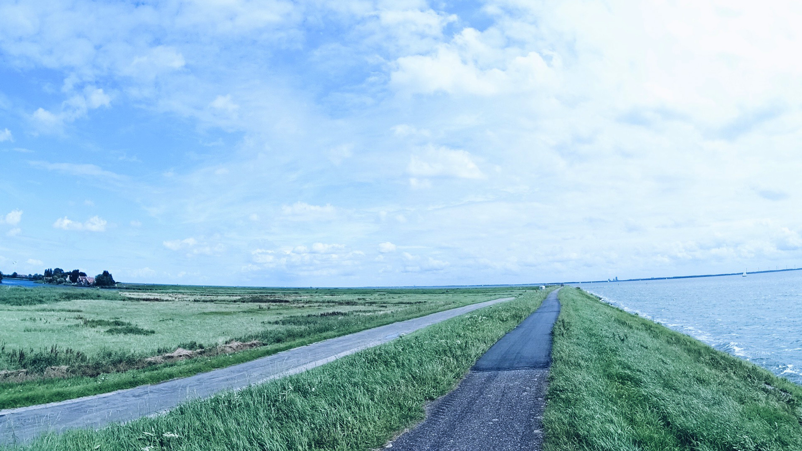
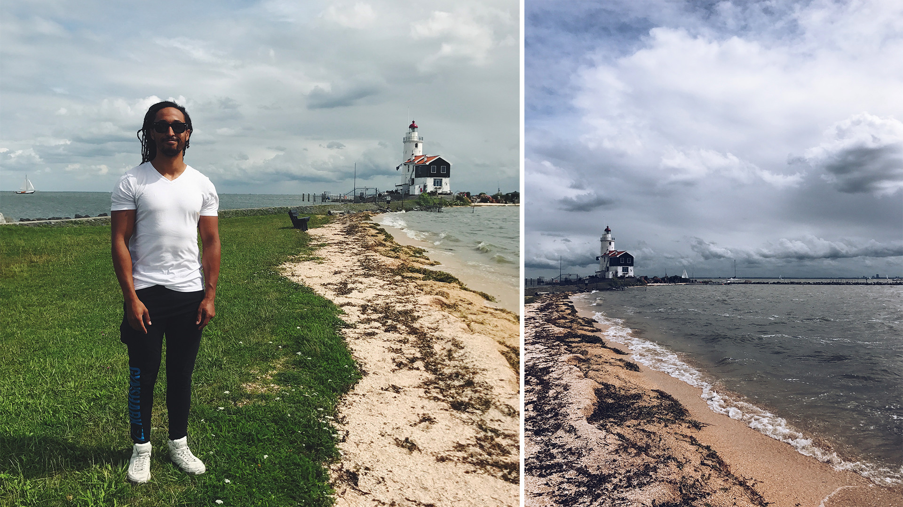

Samedi dernier, nous avons décidé d’aller visiter les alentours d’Amsterdam. Cela faisait un petit moment déjà que je souhaitais aller voir Marken, une “presqu’île’ situé à environ 20 km au Nord-Est d’Amsterdam, dans une région que l’on appelle le Waterland.

Nous avons décidé d’allier plaisir et sport en décidant de nous y rendre à vélo. Je nous ai donc préparé une “petite” boucle partant d’Amsterdam Centraal, allant jusqu’à Marken, en passant par la côte Est et les villages de Durgerdam & UItdam à l’aller ; Volendam, Monnickedam & Broek in Waterland au retour. Un programme bien chargé avec plus de 60 km annoncés ! Pour que cela soit plus agréable / moins fatiguant pour moi, nous avons loué un vélo de route. N’ayant jamais roulé avec un vélo aux roues fines, type vélo de route, j’avais un peu peur mais je savais qu’un vélo léger et rapide serait bien plus commode pour avaler tout ces km. En plus de cela, nous avons pris des pédales avec des clips au bout, ce qui permet un gain d’énergie énorme dans le mouvement. Au final, j’ai dû mettre 5 bonnes minutes à m’y habituer : j’avais tendance à reculer en rétro-pédalage pour ralentir / freiner ... Mais après ça, j’étais comme un poisson dans l’eau (ou devrais-je dire comme Amstrong dans son maillot jaune lol) : une sensation de légèreté et de rapidité sans effort tellement agréable. Et surtout, surtout, l’impression infinie d’être une fille ultra sportive ahah.

Une fois le vélo récupéré dans le Jordaan, nous attaquons notre ballade avec pour première étape : Amsterdam Centraal. Pour la première fois depuis que nous sommes sur ici, nous avons enfin pris le Ferry qui rejoint la rive Nord d’Amsterdam. La traversé dure à peine une minute. De là, nous nous laissons plus ou moins guidé par le GPS, censé nous amener vers Durgerdam, seconde “étape” du tour. Non sans nous perdre un petit peu, nous nous retrouvons au bout de 30 min dans la campagne hollandaise. Le paysage est au delà de mes attentes. C’est tout simplement merveilleux. Nous sommes entourés de verdures, de champs, d’oiseaux, d’eau et parfois même de vaches, de chevaux ou encore même de mouton. Un véritable bol d’air frais.

Nous continuons donc notre ballade, allure correcte, sans trop se fatiguer, d’autant plus que nous avons le vent dans le dos. Nous faisons des petites pause, par-ci, par là. Durgerdam et son joli petit port emplis de voiliers est le premier petit village que vous traversons. Puis nous retrouvons les champs de campagne en direction de Marken. La route est aucunement dangereuse puisque c’est une piste cyclable, en hauteur sur une digue longeant la côte. Aucun besoin de se soucier des voitures ! À certains moment, nous sommes même complètement entouré d’eau. Il n’y que cette petite digue de terre pour nous protéger. C’est incroyable. Nous traversons ensuite Uitdam quand nous apercevons enfin au bout, la fameuse digue reliant Marken à la terre ferme.

Marken est, comme beaucoup d’endroits aux Pays-Bas, un ancien village de pêcheurs. Au XIIIe siècle, le village fut séparé du continent à coups de fortes tempêtes ce qui obligeât les habitants à construire leurs maisons sur pilotis, mais aussi de vivre de manière autonome grâce à la pêche, étant désormais coupé des autres villages environnants par l’eau. Ce n’est que bien, bien plus tard, dans les années 1950, qu’une digue fut construite pour rattacher le village à la terre, transformant Marken en presqu’île. Pour autant, même si la pêche n’est plus l’activé principale, le village a gardé quasiment intacte l’ambiance de l’époque : toutes les constructions sont en briques avec du bois noir, bleu marine ou vert bouteille, le tout joliment surligné de blanc. C’est un mini village de “poupée” comme certains aiment à le dire. Malgré la digue, le village ne se visite qu’à pied, ou en vélo : les voitures et les bus ont obligation de se garer à l’entrée, ce qui rend la découverte de l’île encore plus authentique et agréable !

Nous ne passons finalement pas par le village et préférons remonter à l’extrême pointe orientale de l’ile jusqu’au Phare, où nous décidons de (enfin) s’arrêter pic-niquer sur la jolie petite plage. Nous prenons une pose bien mérité de 45 minutes environ, le temps de manger correctement, mais aussi de faire quelques photos ;-). Le vent se lève de plus en plus et malheureusement les nuages commencent à remplir le beau ciel bleu. Finalement, nous décidons “d’écourter” notre ballade en ne prenant pas le ferry menant à Volendam mais de directement faire demi-tour en direction de Monnickendam au risque de revenir complètement trempé sous la pluie.

Le chemin du retour fut bien plus dur qu’aller, puisque cette fois-ci nous nous prenons le vent complètement de face ! Surtout sur la digue de Marken. Je suis bien bien contente d’avoir un vélo de route léger. À Monnickendam, je voulais que nous nous arrêtions visiter le chateau, qui sur les photos avait l’air vraiment chouette. Sauf qu’une fois arrivé sur place, impossible de le trouver ... Ce n’est qu’après verification sur google que l’on réalise que je me suis trompé et ai confondu avec le château de Muiden, qui n’est pas du tout au même endroit. Ce n’est pas très grave, au moins nous aurons découvert à quoi ressemble les villes campagnardes hollandaise (à des villes dortoirs faites de maisons, de pistes cyclable et de canaux lol).

Le temps et le vent se gâtent réellement. Nous décidons de rentrer sur Amsterdam sans passer non plus par Overleek, où j’aurais souhaité m’arrêtait gouter au bord d’un lac. De toute façon, nous n’avons pas très faim. La route retour est franchement bien moins agréable et je l’ai surtout trouvé moins jolie qu’à l’aller. Nous nous sommes retrouvé pendant 15 min à pédaler à coté d’une nationale avant de retrouver une petite route plus calme longeant un canal. Nous atteignons Amsterdam Noord et le ferry pile au moment où il commence à pleuvoir. Timing presque parfait puisque nous devons encore rendre le vélo et rentrer à la maison.
Nous arrivons finalement trempé car la pluie s’est mise à tombé fort entre temps et nous nous sommes arrêtés à Stach pour s’acheter un petit gouter ainsi que notre repas du soir.

Ce fut somme toute une journée géniale. Les paysages du Waterland sont vraiment magnifiques est la région porte vraiment bien son nom. Je suis vraiment ravie que l’on ai fait cette balade malgré le temps incertain car si l’on devait attendre après le soleil, on ne ferait plus grand chose ici ... Le temps était limite (hormis le vent) presque parfait. Ni trop chaud, ni trop froid. Au final, nous avons fait une boucle de 70km environ, ce qui n’est pas rien et j’en suis plutôt fière ! Mon seul regret serait que nous n’avons finalement pas pris énormément de temps pour visiter les petits villages. Nous n’avons fait que les traverser. Qu’à cela ne tienne, ce sera l’occasion de louer un vélo à nouveau pour faire les choses non faites. 🙂

À très vite ❤️
