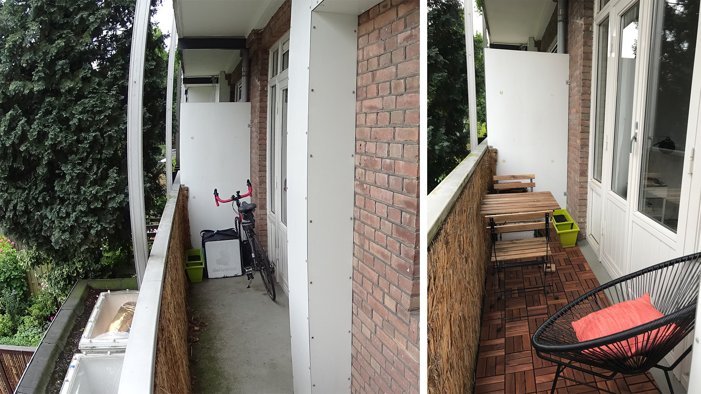
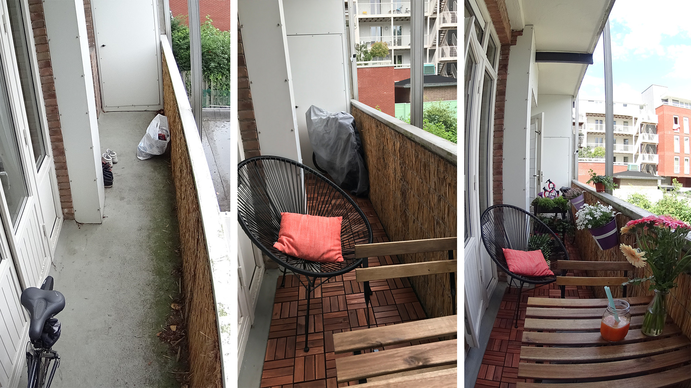
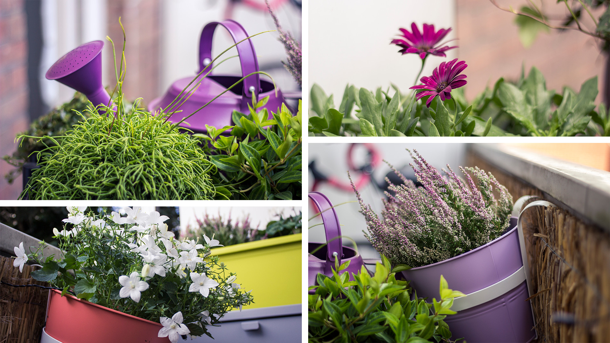
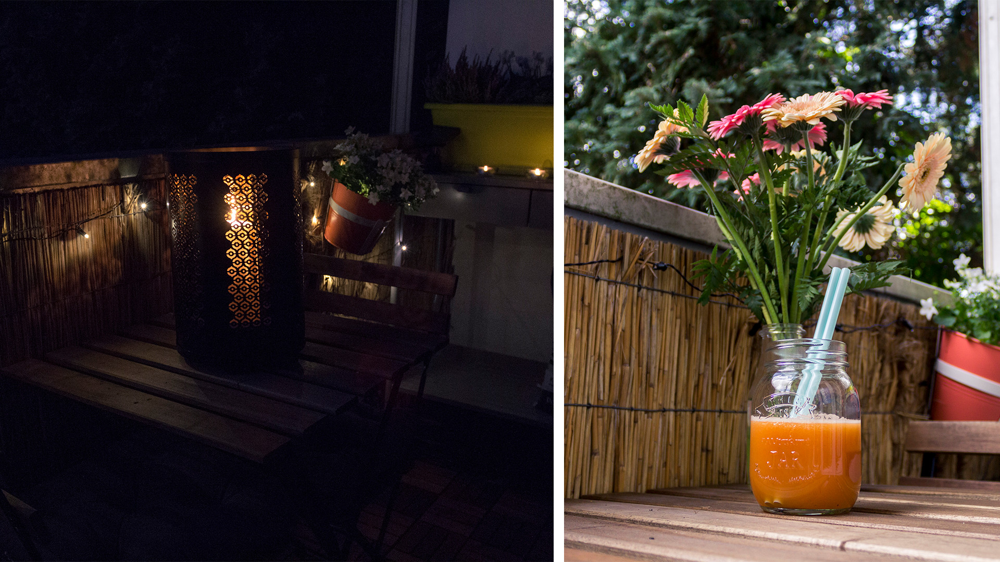

Je vous en parlais dans cet article. Au mois de Juillet, nous avons enfin pris le temps d’aménager notre balcon. C’est sûrement l’un des premiers endroits que je voulais décorer, mais ayant aménagé mi-septembre, on aurait dû attendre tout l’hiver avant de pouvoir commencer à en profiter.

À notre retour de vacances, le temps de plusieurs jours, je me suis inventée designer d’espace. Je me suis amusée à préparer moodboards d’ambiance et images d’inspirations, présenté mes idées à Alexis (tableau excel à l’appui), et de là, j’ai écumé l’e-shop IKEA et liste toutes les choses utiles dont nous avions besoin d’acheter. Parce que c’est ça le problème avec IKEA : tu ressors toujours avec des imprévus. Et quand tu as un budget non illimité, ça peut vite poser problème. Bon, malgré la liste, on est tout de même ressorti avec deux choses non prévues : un grand étendage et des poubelles pour le tri sélectif. Ce qui reste correct puisque ce sont des choses dont nous avions effectivement besoin depuis longtemps ! Mais, mais, pour le reste, tout est rentré dans le budget ET dans la liste !

Notre balcon fait un peu moins de 6m2, exposé est, mais rapidement à l’ombre dû à un énorme arbre chez la voisine de droite. C’est un genre de couloir faisant 5,9m de long sur moins d’un mètre de large. Il faut donc faire preuve d’imagination et être astucieux pour réussir à aménager le tout sans trop encombrer le passage. L’idée c’était avant tout de végétaliser, de créer un petit coin de verdure. Un endroit cosy, où il ferait bon d’y prendre le temps de déjeuner le matin, mais aussi d’y lire un livre le week-end. Rendre le tout confortable, agréable et chaleureux.

Ce qui a créé le plus gros changement visuellement, ce sont les caillebotis en bois. Ils ont complètement transformé l’aspect visuel du balcon, l’ont rendu propre et donné une impression d’agrandie en dessinant la surface du sol. Et ce fut tellement facile à poser. Ça donne un coup de neuf en un rien de temps! Ensuite, nous avons opté pour une table et 2 chaises pliables par pur gain de place. Même si je dois dire qu’au final la table n’est jamais pliée, ce sera mieux pour les protéger cet hiver. Il y a aussi ce meuble gris qui permet de ranger quelques affaires de jardinages, mais aussi le sac Deliveroo d’Alexis. J’ai craqué pour le fauteuil dit “Acapulco”. En revanche, je n’avais pas prévu qu’il prenne autant de place. Mais je l’adore. Contrairement à ce que l’on pourrait penser, c’est super confortable ! Et je pense même le rentrer cet hiver dans le salon, accompagné d’un joli plaid tout doux pour les longues soirées cocooning ! Enfin, bien sûr direz-vous, des plantes ! Mais aussi des fleurs. La desserte sur roulettes fait office de “mur végétal” portable. Nous avons aussi mis du lierre dans l’espoir, un jour peut-être, qu’il entoure une partie du balcon, et agrémenté le tout de fleurs dans des jardinières.

Malheureusement, nous n’avons pas trouvé d’attaches suffisamment larges pour les accrocher à la rambarde. Donc pour l’instant elles restent soit sur le meuble gris, soit au sol, soit sur la table. Mais je ne perds pas espoir d’en trouver un jour ! Dans les jardinières, il y a des marguerites (qui ont beaucoup souffert du transport par livraison), des cyclamens, des campanules blanches, et des Erica Carnéa roses, aussi appelées Bruyères des Alpes. Sur la desserte se trouvent des peperomias et du lierre. Il y a aussi un pot de menthe qui se cache derrière. Pendant deux week-ends d’affilés, j’ai du m’inventée apprentie jardinière : j’ai rempoté mes jardinières, pris soin de mes plantes et surtout cherché des infos sur comment prendre soin d’elles !

La touche finale? La guirlande lumineuse et une lanterne. Je suis trop contente de ses deux derniers objets. La guirlande a le gros avantage de fonctionner via l’énergie solaire avec un petit capteur. Du coup, c’est plutôt écolo comme système (entre guillemets hein, ça reste du plastique) puisqu’il n’y a aucune consommation d’électricité ou de piles. Je peux l’allumer autant que je le souhaite sans culpabilité. Et enfin la lanterne avec une grosse bougie, c’est juste trop joli quand elle est allumée le soir. Mon seul regret pour l’instant est que nous n’avons pas changé le brise vue qui est d’origine, mais qui fait désormais un peu vieux et sale comparé au reste. Ce sera sûrement un achat pour le printemps prochain, car en vrai, ce n’est pas ce qui nous empêche de profiter de notre balcon dès que le temps nous le permet !

Je suis plutôt satisfaite des photos avant / après. La transformation est réussie. On a une véritable pièce supplémentaire à la maison. Et quel bonheur que de prendre le petit-déjeuner avec les premiers rayons de soleil du matin. Quoi de mieux pour commencer sa journée ? 😉

