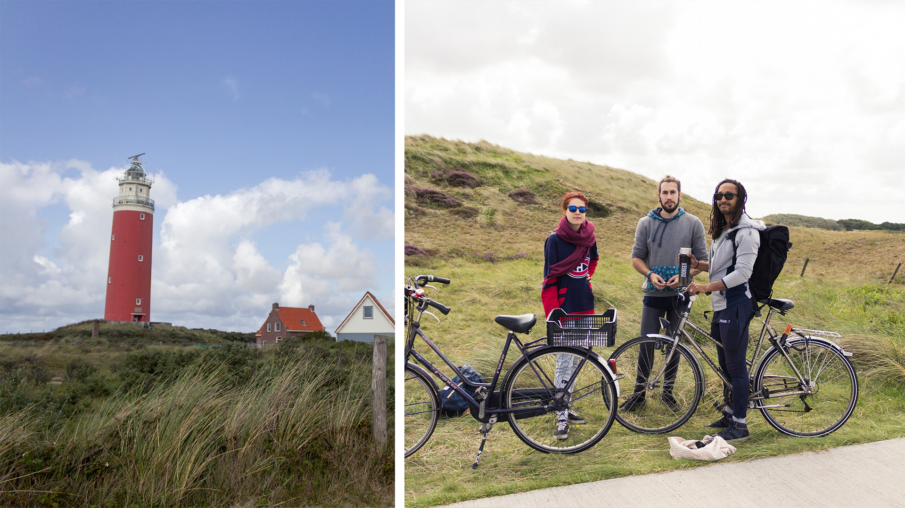

Nouveau week-end, nouvelle découverte.

Après notre expédition à vélo jusqu’à l’île de Marken, nous nous sommes cette fois-ci rendus avec les copains Marie & Robin au nord-ouest, sur l’île de Texel. Située à une heure et trente minutes d’Amsterdam en train puis vingt minutes de traversée en ferry du continent, Texel, prononcé « tessel », est la plus grande des îles de la mer des Wadden.

Nous avons pris un train intercité depuis Amsterdam Centraal jusqu’à Den Herder, où nous avons embarqué sur un ferry pour rejoindre l’île. J’ai été époustouflée par l’organisation pour l’embarquement du ferry. En moins de 5 minutes chrono, voitures, passagers & cyclistes sont chargés dans le bateau, prêt à partir, à l’heure.

À peine le ferry quitte la côte que l’on aperçoit déjà les contours verdoyants de Texel et l’on parvient à distinguer les grandes étendues de dunes de sable à l’ouest de l’île. Au-delà de son parc naturel de dunes, Texel est aussi réputée pour sa faune. J’ai lu d’ailleurs que durant l’hiver, des oies sauvages viennent séjourner sur l’île. En été, c’est aussi une destination très touristique pour les Hollandais. Sur place, le paysage me fait vaguement penser à un mix entre la Camargue et le Touquet.

Une fois arrivés sur l’île, nous avons décidé de directement pédaler en direction de la pointe nord, où se situe le phare, très connu de l’île. Je n’arrive pas à savoir si nous avions le vent de face ou non. Du moins, il était légèrement de côté. Nous pédalons à côté de champs à perte de vue, parsemés par-ci par-là de points blancs cotonneux, les moutons, ou plus sombres, les chevaux. D’ailleurs, ça sent la ferme partout. Nous longeons une des seules grandes routes principales de l’île et régulièrement des voitures nous “doublent”, ce qui enlève un peu de charme au dépaysement autour de nous. Dommage.

Au bout d’une grosse heure (je crois), nous commençons enfin à apercevoir le fameux phare rouge. La piste cyclable quitte enfin la route départementale pour terminer le trajet dans les bois puis dans les dunes. Cent fois plus agréable.

Nous avons mangé sur place dans le seul restaurant / snack-bar des environs. J’avais un peu peur de tomber sur un truc un peu attrape touriste, mais au final les fish and chips étaient excellents – c’était de véritables filets de poisson pané – et les desserts excellemment servis avec une boule de glace et de la chantilly en bonus. Nous repartons, repus, en direction de la plage du phare.

Comme à Zaandvoort, comme au Touquet, nous faisons fasse à une magnifique étendue de sable blanc et fin. Il y a aussi beaucoup, beaucoup de vent et de nombreux cerf-volantistes s’en donnent à cœur joie. Nous sommes chanceux, car le soleil brillait et venait réchauffer notre visage malgré le vent frais.

Nous restons à marcher et faire quelques photos une petite heure avant de repartir en direction du ferry, déjà. Car, je le savais d’avance, le chemin du retour ne fut pas des plus simple. Nous sommes passés par les dunes. Le paysage était magnifique, Telle la garrigue. Sauf que je vous garantis, cette fois-ci, nous avions bien le vent de face !! Et avec mon vélo de ville et non un vélo de course, je l’ai bien senti !! En plus, nous avons dû extrêmement rusher sur la fin, car à 2 min près nous pouvions rater le ferry. Cela aurait été dommage de le voir partir et de l’attendre 30 min ; sans compter le train derrière censé nous ramener sur Amsterdam. Je n’avais plus de souffle. Mes cuisses brûlaient. Mais nous ne devions surtout pas nous arrêter. Alexis nous poussait à tour de rôle, Marie & moi. Mais, mais, nous l’avons fait. Et nous sommes montés sur le ferry moins de 5 min avant le départ. Hourah ! Rebelote pour le train. Seulement 10 min depuis le port pour rejoindre la gare. Mais nous l’avons aussi eu. Je crois que cela nous a fait gagner presque 1h30 d’attente au total sur notre trajet du retour. Ce n’est pas rien !

Quel chouette dimanche avec une fois de plus une météo très clémente ! C’est vraiment une belle île et je comprends pourquoi les Hollandais aiment y venir en vacances. Je pense que l’on reviendra pour explorer davantage les dunes ! J’aime bien ces petites journées d’excursions à vélo le week-end. Ça permet de découvrir un peu les Pays-Bas sans pour autant devoir louer une voiture. En plus, il est tout à fait possible de prendre le train avec son vélo, ce qui ouvre encore plus le champ des possibles ! Par contre, une chose est sûre, la prochaine fois, ce sera avec un vélo de route et non mon vélo de ville. Mes fesses me diront merci 😉

