**Summer time. Heading to Nice for the weekend.**

Nous n’avions pas prévu de repartir en vacances après Embrun, mais finalement, nous nous sommes accordé, presque à la dernière minute, le plaisir d’un long weekend à Nice avec mes parents, histoire de faire une pause ensoleillée avant la fin du mois d’août.

À seulement 2h de vol d’Amsterdam, Nice est une ville que nous ne connaissions absolument pas. Personnellement, je n’avais encore jamais dépassé la ville de St Tropez sur la Côte d’Azur et j’ai toujours entendu dire qu’il y faisait toujours chaud et beau et que la mer y était chaude, contrairement vers Marseille ou Cassis où le Mistral vient parfois la rafraîchir. Et puis, on dit aussi que Embrun est “la petite Nice des Alpes”. Il fallait bien un jour que j’aille voir à quoi ressemble sa grande sœur 😉

Nous sommes arrivés le vendredi matin tôt dans la matinée et repartis le lundi suivant vers midi, ce qui nous laissait quasiment 3 jours pleins pour visiter, se balader et surtout, surtout, profiter du soleil et de la plage. Il a fait beau et chaud tout le weekend. Je ne pouvais pas demander mieux.

Le weekend fut à la fois relaxant, mais aussi bien actif ! Nous avons beaucoup marché et même pris le temps, le samedi matin, d’aller courir le long de la Promenade des Anglais, comme de véritables niçois. Un seul petit bémol dont nous n’avions pas vraiment conscience, c’est que la plage de Nice est faite de galets et non de sable comme vers Montpellier par exemple. Un mal pour un bien puisque le sable c’est parfois un peu chiant.

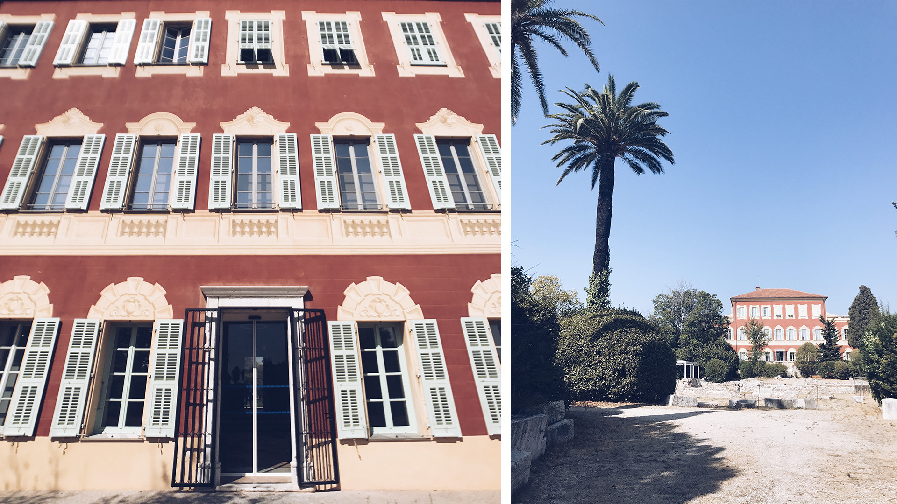

——

## La Ville

La promenade des Anglais est vraiment une très belle avenue côtière où l’on aime se promener le long de la mer d’un côté, les nombreux palaces de l’autre. Le vieux Nice possède aussi un certain charme pittoresque. La mer est d’un bleu azur et turquoise magnifique et il y a des villas et des immeubles assez incroyables un peu partout dans la ville. On remarque particulièrement l’influence italienne et toscane sur l’architecture ! En revanche, et ça m’attriste de le dire pour une si jolie ville, les rues sont sales. Très sales. Et ça sent le pipi un peu partout. C’est franchement dommage.

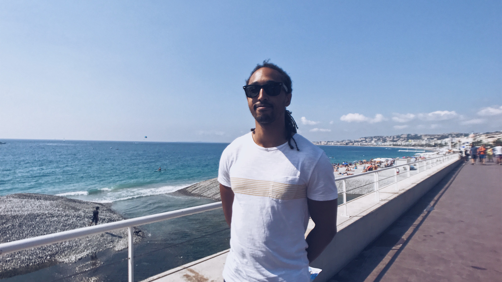
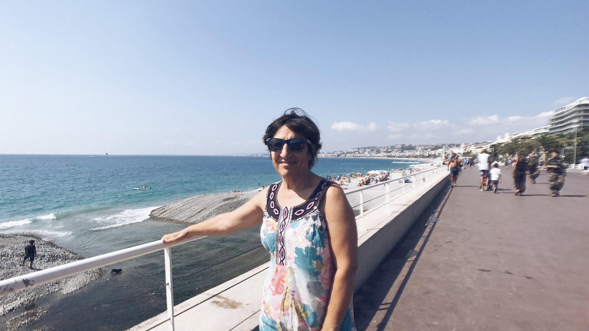
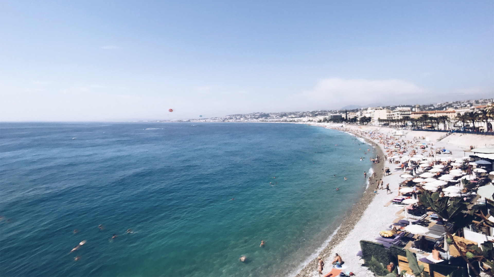

## La Plage

Pour éviter de voir toujours la même portion de plage, nous sommes allés une après-midi à Villefranche-sur-mer, à 15 minutes en voiture de Nice, sur la plage des Marinières, qui soi-disant est la plage de sable la plus proche. Par sable, il faut entendre petits graviers. Mais ça ne faisait pas du tout mal aux pieds ! La baie de Villefranche est aussi bien abritée du remous et l’eau y était bien tiède. C’était bien.

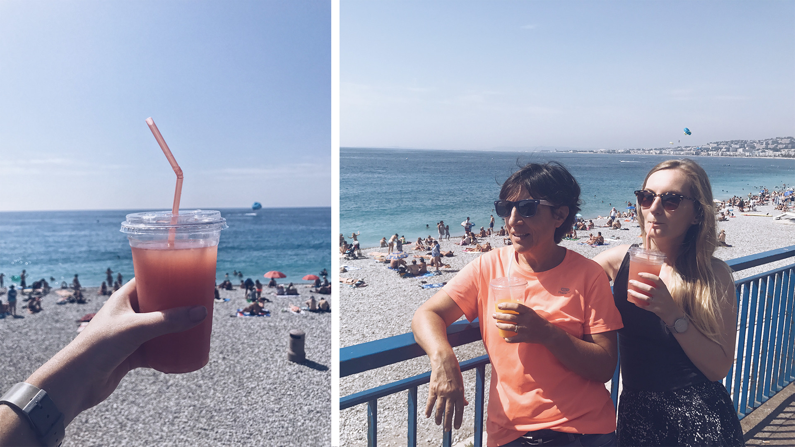

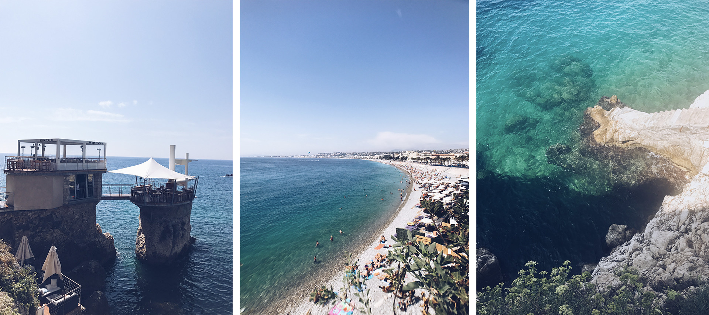

## La Ballade

Le samedi, nous avons longuement marché depuis le Airbnb jusqu’au sentier du littoral, rejoignant la ville de Nice à Villefranche. Nous avons longé la Promenade, pour remonter, puis dépasser le port Nice avant d’enfin, arriver au début de ce sentier qui, soit dit en passant, fait parti de ce que l’on appelle le sentier des Douaniers. Le sentier longe la mer en plein soleil. Au bout d’un certain temps de marche, le sentier s’arrête. Il faut alors remonter de longs escaliers, marcher un peu sur la route nationale et redescendre sur la côte pour continuer la ballade jusqu’à Villefranche. C’est ici que nous avons décidé après, je pense, 3 bonnes heures, de prendre un bus pour rentrer manger. La paresse à la plage l’après-midi fut bien méritée.

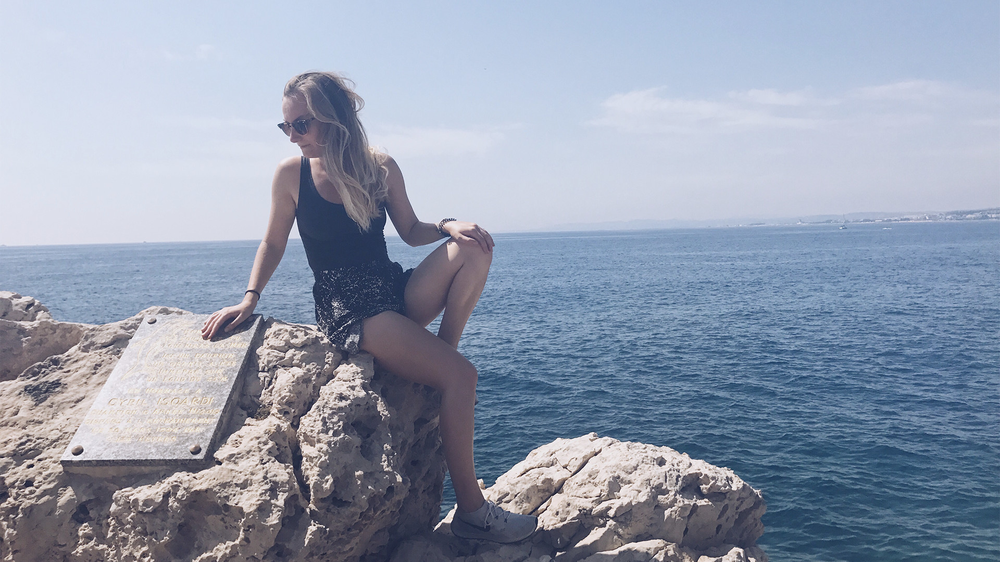
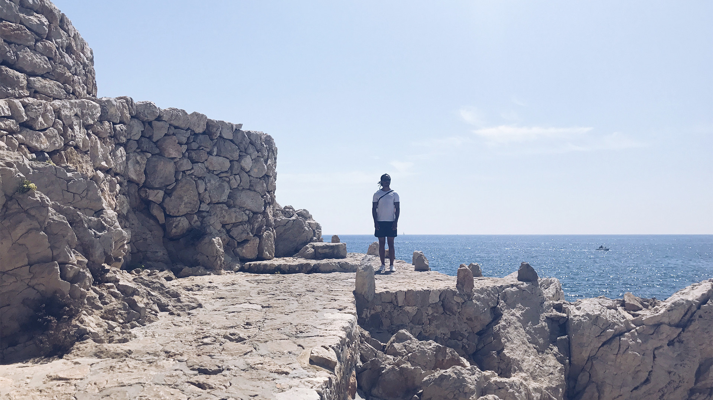

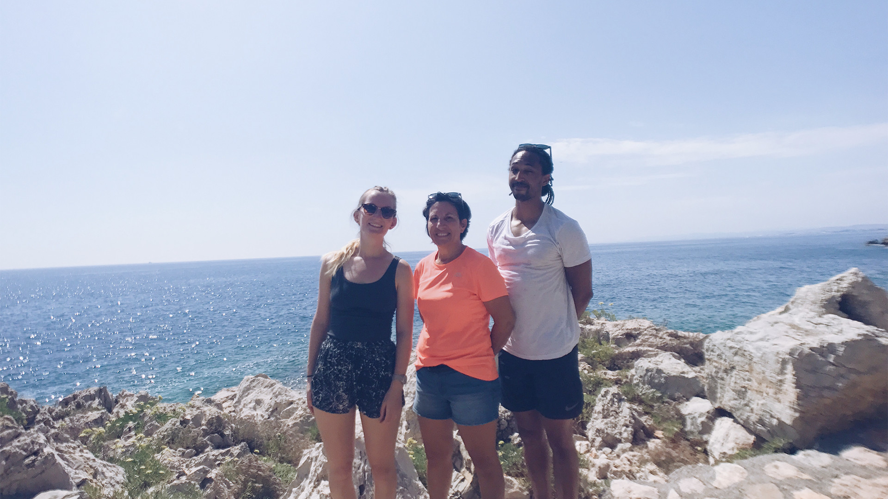

## Le brunch

Enfin le dimanche, nous sommes allés bruncher dans le vieux Nice au [Makassar](https://www.tripadvisor.fr/ShowUserReviews-g187234-d2000938-r149745472-Le_Makassar-Nice_French_Riviera_Cote_d_Azur_Provence_Alpes_Cote_d_Azur.html). Impossible de finir nos assiettes tellement c’était copieux ! Malheureusement, je n’ai pas pris de photos (vous me pardonnerez ;-)) Nous repartons le ventre bien rempli, mais cela ne m’a pas empêché de vouloir manger une énorme glace en fin d’après-midi. Que serait un week-end à la mer sans une bonne glace? 😉

**À très vite ❤️**

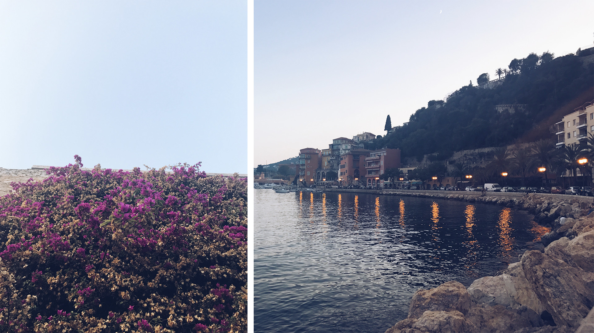
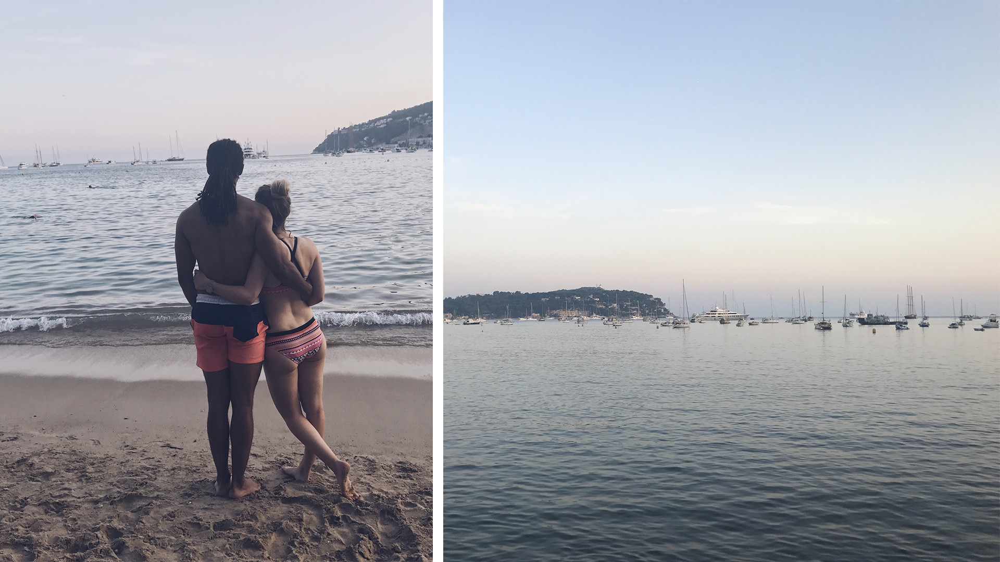
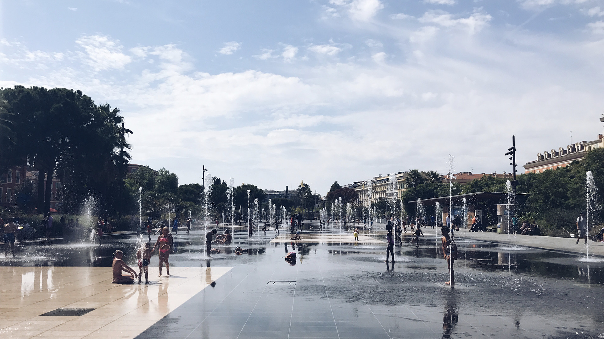
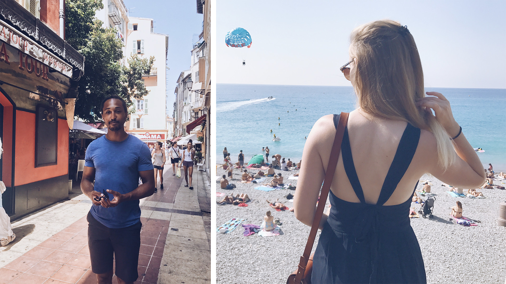

