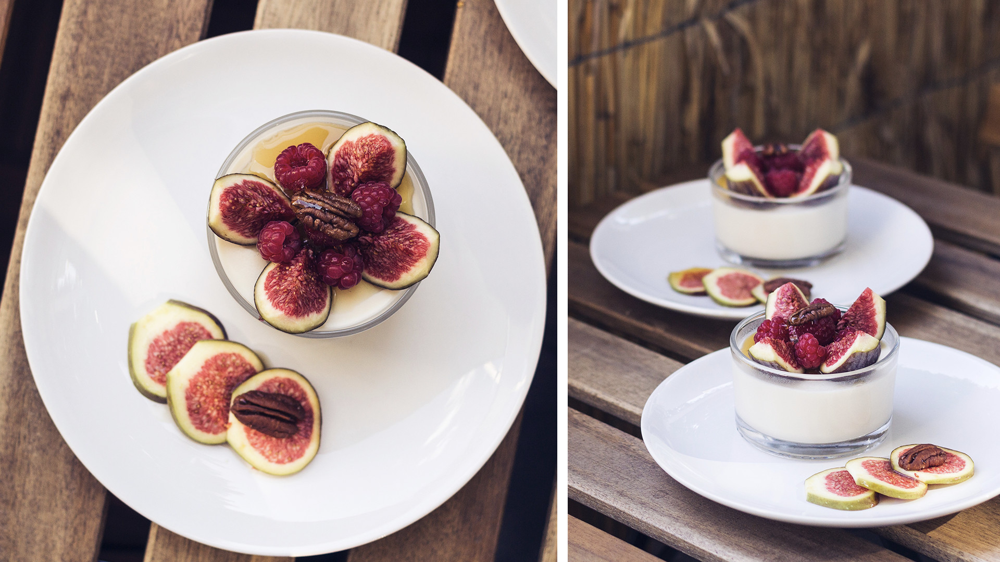

## J’adore le mois de septembre.

Je crois que j’ai toujours aimé le mois de septembre. La période de la rentrée des classes. L’achat des fournitures scolaires. La découverte ~~(et parfois la déception, oups)~~ de sa nouvelle classe, de son emploi du temps. J’ai toujours aimé l'énergie de nouveau départ qui règne à cette période, encore plus forte que celle de la nouvelle année. Maintenant, pour moi, l’école c’est fini. Je ne connaîtrais plus vraiment l'effervescence de la “rentrée”, encore moins si l’on décide de partir en vacances en été hors vacances scolaires. Pour autant, cela ne m’empêche pas d’aimer toujours autant ce mois de septembre. Le dernier mois de l’été. Celui de la transition vers l’automne, où l’on ressort petit à petit ses gros pulls doudou pour se lover dans un plaid le week-end en regardant la pluie dehors.
—
J’aime aussi septembre pour _les figues_. **LES FIGUES**. Ce doit être la rareté de la saisonnalité de ce fruit qui le rend si attrayant. Ce côté “je n’ai que quelques semaines pour en profiter”. Du coup, au mois de septembre, je deviens un peu _gaga de la figue_. **Figues fraîches**, bien évidemment, mais aussi **figues sèches**, **confiture de figues**, j’en passe et des meilleurs. Je profite aussi des débuts des longs week-end pluvieux pour me mettre aux fourneaux et décliner la figue autant que je le peux. Ce mois-ci, je me suis donc essayée à trois nouvelles recettes à base de figues + un petit-déjeuner complètement de saison.

### Figolu

Ok. Qui ne se souvient pas de ce biscuit sablé fourré à la figue. Moi en tout cas, je m’en souviens. Encore plus depuis que l'on est sur Amsterdam, parce qu’ici les rayons biscuits se résument à “stroopwaffels”, “speculoos”, “petit biscuit sablé sans gout” & petite gaufre. Pour les cookies et les Figolu, vous repasserez ... C’est donc en tombant sur une des nombreuses idées recettes Pinterest que l’idée et l’envie ultime de confectionner des Figolu m’a prise. Et il se trouve que la recette est hyper simple ! Il faut d’abord s’occuper de la pâte sablée (220g de farine, 125g de beurre, 125g de sucre, 1 oeuf, sucre vanillé, pincée de sel). Ensuite, rien de plus simple, à l’aide de mon super blender, j’ai mixé 200g de figues sèches avec trois cuillères à soupe généreuse de miel. J’étale ma pâte et forme des rectangles d’environs 10x20cm. Sur chaque rectangle, j’étale au milieu le fourrage de figues et je referme de chaque côté, de sorte à obtenir des longs boudins fourrés à la figue, que je découpe ensuite en petits biscuits. La touche finale : à l’aide d’une fourchette, j'appuie légèrement pour dessiner la forme si particulière des Figolu. Hop, ni une, ni deux, on enfourne pour 10 à 20 minutes au four, jusqu’à ce que les biscuits soient bien dorés. C’était juste **terriblement bon !** Ils ont aussi eu leur petit succès à Mobgen & chez Cocotte. Ils ont tenu, je crois, 3 jours. J’en referais volontiers, car pour le coup, pas besoin d’attendre septembre avec les figues sèches !

### Panna Cotta Coco-Figue

**Le Panna Cotta est l’un de mes desserts préférés**. Après la crème brulée et le tiramisu framboise spéculoos de maman ♥. À Noël, on avait voulu faire des panna Cotta Coco-Mangue. Malheureusement ... l’agar-agar n’avait pas pris et c’était complètement raté. J’ai tout de même voulu retenter l’expérience avec le lait de coco, mais cette fois-ci en utilisant des feuilles de gélatine (j’ai fait chauffer le lait avec le sucre et de la vanille, puis j’ai ajouté du yaourt grec et la gélatine, préalablement ramollie dans de l’eau chaude). Résultat, tenue impeccable ! Le seul truc “non-positif” dans l’histoire c’est qu’il y en avait trop. Sept ramequins généreux au total pour seulement nous deux .. J’ai vu un peu gros. La prochaine, soit je diminue les quantités, soit j’invite les copains à manger à la maison.
Toujours est-il que c’était excellent. Je les ai servis avec une figue fraîche coupée en quatre, posée sur le dessus, un peu de confiture de figues en dessous, quelques framboises et du sirop d’érable. J’ai même pu les déguster sur le balcon, au petit matin d’un week-end ensoleillé de début septembre.

### Quiche Figue - Chèvre frais - Miel

Bon les desserts, c’est bien gentil, mais il faut aussi manger dans la vie. Je me suis donc entreprise dans la confection d’une quiche sucrée / salée à base de figue et de chèvre frais. Et comme trouver de la pâte tout prête ici, c’est plutôt un challenge, j’ai même fait ma propre pâte brisée à base d’huile d’olive. (250g de farine, ici un mélange de sarrasin et d’épeautre, une cuillère de sel, une cuillère d’herbes de Provence, 60ml d’huile d’olive, 120ml d’eau) Pas la plus compliquée des pâtes à faire me direz-vous. En 10 min top chrono, elle était prête.
Ensuite, il faut s’attaquer à la garniture. J’étais tellement dans l’empressement de la mettre à cuir au four pour la manger, que j’en ai oublié de faire revenir les échalotes pour l’incorporer à l’appareil de la quiche. _Tanpis._ Pour le reste, c’est trois oeufs battus avec 15cl de crème de soja, un peu de sel, un peu de poivre. Vous y ajoutez le fromage de chèvre frais (environ 100g) et on remue énergiquement le tout, histoire que le fromage soit bien répartit. On dépose l’appareil sur la pâte dans un plat à tarte et on ajoute l'ingrédient principal dessus, les figues fraîches coupées en rondelles fines. On y ajoute un peu de miel pour le plaisir et on enfourne, telle une quiche lorraine. Au moment de servir, j’ai ajouté du basilic frais fraichement coupé. La pâte brisée était peut-être un peu trop cuite, mais globalement c’était très bon !

### Granola frais - Petit Déjeuner

Pour finir cet article, pas de véritable recette, mais plutôt ma façon préférée de déguster les **figues** : quand elles sont **bien fraîches** et **bien mures**, le matin, au petit-déjeuner, avec mon petit fromage grec et mon granola. Je l’accompagne soit de bananes, soit de kiwi jaune et de sirop d’érable. **Le bonheur.** Rien de mieux pour bien démarrer la journée. Je fais le plein de bons nutriments et de vitamines et je fais même encore un peu durer l’été en le dégustant sur le balcon (enfin, maintenant, je crois que le balcon le matin, ça devient très juste !). Pour le granola, je fais plutôt ma paresseuse puisque que l'on en achète un déjà tout fait. Mais je vais profiter des longs week-end d’automne qui arrivent pour en re-préparer à nouveau.

_À très vite ♥_
