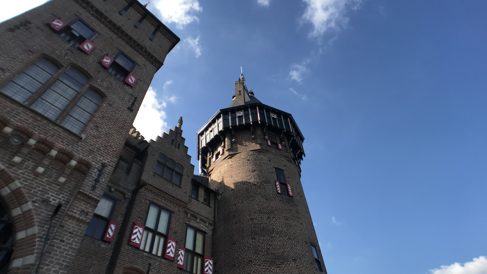
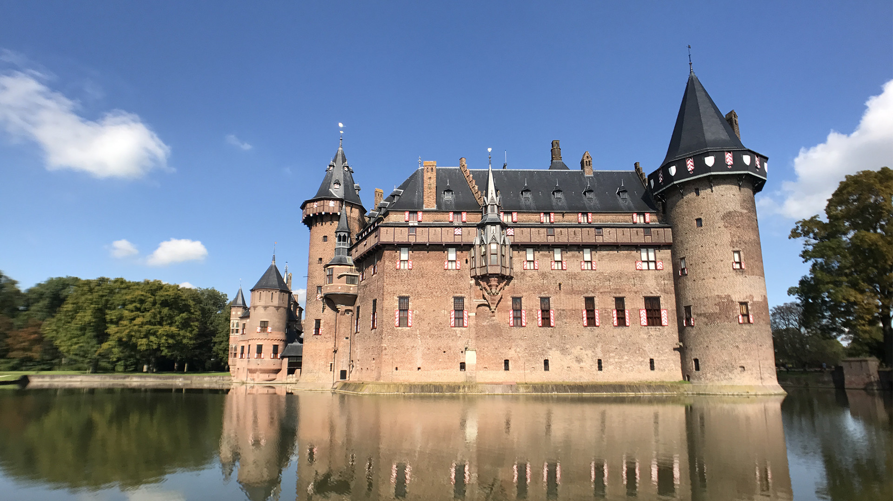

Il y a deux semaines de cela, nous avions prévu de passer le week-end dans le Sud oriental des Pays-Bas, à Sittard. Non pas que le lieu en lui-même est grand-chose de très attractif, mais nous souhaitions simplement aller au spa, histoire de faire une pause détente le temps d’un week-end.

Pourquoi aller si loin me direz-vous ? Aucune apparente. Simplement pour l’aspect dépaysant de faire deux heures de route à travers les Pays-Bas.

### La voiture

Nous avons donc loué une voiture pour le week-end. Je crois que nous avons un truc avec les concessionnaires de voitures. Après l’entreprise inexistante pour le camion de déménagement (cf article), voici désormais l’offre alléchante qu’on nous refuse de payer. Pour la faire courte, ici aux Pays-Bas, les cartes de _débit_ type Maestro ou Visa Electron, sont extrêmement répandues. Hors pour réserver des billets d’avion, de train, un hôtel, louer une voiture, bref faire des choses de grands, il faut une carte de _crédit_. Pour nous, pas de soucis, pour ce genre de choses, nous utilisons nos Visa françaises. Or, pour je ne sais quelle raison, l’employé nous a refusé nos cartes en proclament que ce n’était pas des cartes de crédit... Bon, on a pas cherché par quatre chemins, on leur a gentiment dit d’aller se faire voir et on s’est rendu chez le voisin Sixt qui commence à bien nous connaître depuis le temps. Bizarrement chez eux, aucun de soucis pour payer ... Enfin, bref, la personne à l’accueil qui nous reconnait, explique que c’est chose commune avec les touristes français et nous propose même d'être surclassé en payant le prix d’une Golf, mais en obtenant une Mini Countryman automatique, voiture plutôt haut de gamme. Génial, mais au final avec ces histoires de réservation de dernière minute la note reste un peu salée malgré la jolie voiture. Désormais, c’est fini, on s’en tiendra toujours à Sixt, avec réservation et paiement à l’avance. That’s all.

### De Haar

Nous nous mettons enfin en route, avec un ciel bleu magnifique. C’est **le parfait week-end d’automne**. Ayant un peu de marge devant nous avant d’arriver à l’hôtel, nous décidons de faire une escale par le Château De Haar, aux environs de Utrecht.

Ce château est relativement connu, car il fut construit par l’architecture Pierre Cuypers, à qui l’on doit principalement le Rijksmuseum et Amsterdam Centraal Station. Nous n’avons pas pris le temps de visiter l’intérieur et avons préféré profiter du soleil en nous baladant dans les jardins et la forêt ET j’ai pu donner à manger à des Bambi tout mignons. Enfin, plutôt des cerfs. J’étais telle une enfant au paradis. Le château est vraiment très mignon et très réussi. Il ne dégage pas ce “surplus” de décoration de certains châteaux de la Loire. C’est un bâtiment au style Nordique, petit et très charmant.

### Le SPA

Nous arrivons à l’Hôtel SPA en fin d’après-midi et terminons la journée par un repas copieux au restaurant. Le lieu en lui-même n’est vraiment pas charmant. C’est en bordure de Sittard, proche d’une zone industrielle. Aucune vue exceptionnelle à signaler. Mais soit. On n'est pas venu pour la vue, mais bien pour le SPA.

Le SPA donc. Un “petit” détail que je ne vous ai pas encore mentionné. Ici, **les spa sont 100 % sans maillots de bain**. Oui. Pas de maillots. Pour tout le monde. Adultes et enfants. Ça peut paraître choquant à première vue, mais il faut savoir que ça fait vraiment parti de leur culture et qu’il n’y a rien de bizarre (pour eux) à être tout nu dans une piscine ou un sauna, avec d’autres personnes toutes nues. Bon, on ne passe pas non plus notre temps les fesses à l’air. **Hors de l’eau, chacun porte sa serviette ou son peignoir pour se balader.** Au final, ça ne paraît pas si terrible.

Soyons honnêtes. C’était **vraiment** bizarre. Première chose. Il n’y a pas de cabine pour se changer dans les vestiaires. De toute façon, vous allez être nu. Moi qui n’ai jamais fait de topless à la plage, me mettre nue devant plusieurs inconnus relevait du challenge. Car au final, le plus “gênant » pour moi ne fut pas d’être entouré de personnes, de tout âge, dans leur plus simple appareil (et de ne pas les fixer, surtout), mais plutôt de réussir à ôter ma serviette et aller me baigner.

La gène s’est estompée au fur et à mesure de la journée et nous avons quand même réussi à profiter de notre journée détente. Heureusement, car la **météo** du dimanche était **parfaite**. Après un bon petit-déjeuner d’hôtel comme je les aime, nous avons pu pleinement profiter des bains chauds, saunas et du soleil avec la piscine extérieure. Avec du recul, je ne sais pas si on sera prêt à le refaire. Je me dis, quitte à faire 2h de route, autant descendre jusqu’en Belgique, où les maillots de bain sont autorisés (ça dépend où). Peut-être aussi qu’il s’agit d’une simple habitude à prendre. En tout cas, je suis contente que nous ayons tenté l’expérience. Réussi ou non, ça ferait toujours des souvenirs marrants à raconter à nos enfants. 😉

_Alexis :_
_Réserver un spa, en sachant pertinemment que le maillot de bain n'est pas autorisé, peut paraître bizarre. Voir même très étrange. Nous avons hésité plusieurs jours avant de réserver. Mais nous sommes venu dans un pays étranger, découvrir une culture différente, et un point culturel sur ce sujet me paraît essentiel._

_Le maillot de bain n'est pas autorisé dans tous les spa des Pays-Bas. Il n'est en rien question de nudisme, naturisme ou encore exhibitionnisme, loin de là. C'est une question d'hygiène et c'est la forme traditionnelle de se rendre au hammam ou sauna (garder sa serviette est bien entendu possible). Tous les pays nordiques ont cette habitude, avec plus ou moins de mixité. Le maillot est parfois autorisé, 1 fois dans la semaine généralement, mais sans que cela soit obligatoire ce jour-là._

_Partant de ce constat, nous avons donc décidé d'essayer. Si c'est la norme ici, que certains ne voient pas de soucis à y aller entre collègues (oui oui, à ce point là)(mais à contrario, il y en a quand même qui ne s'imaginent pas y mettre une fois les pieds), alors nous y survivrons. Par exemple, en arrivant aux Pays-Bas, cela nous semblait bizarre de vivre les rideaux ouverts la journée. Finalement nous nous y sommes bien accomadé._

_Pour autant, bien que cette expérience ne nous a pas tués, et que c'est bien plus simple d'essayer quand on ne connait personne autour de soit, je ne sais pas si l'on refera. Cela reste particulier et un peu déroutant pour nous qui n'avons pas grandi avec cette culture._

**À très vite ♥**

_Ps: Je m’excuse du manque de photos, mais les SPA étant sans maillots, il est bien évident, pour des raisons de respect que les photos étaient interdites. De toute façon, aucun appareil électronique n’était autorisé dans l’enceinte du spa. Pas même les liseuses._ 🙂

