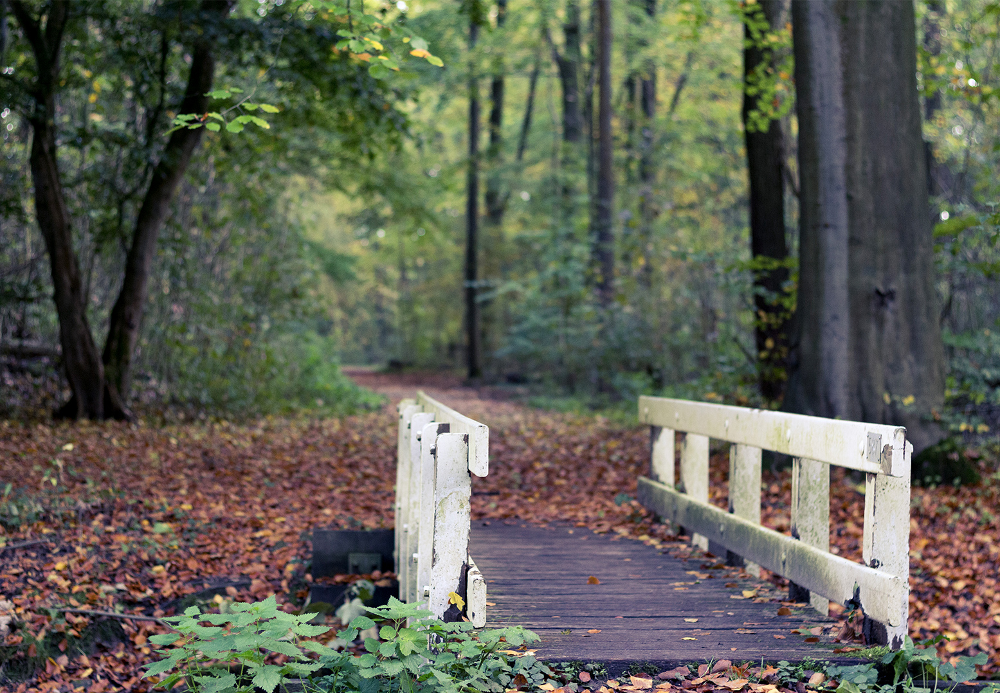
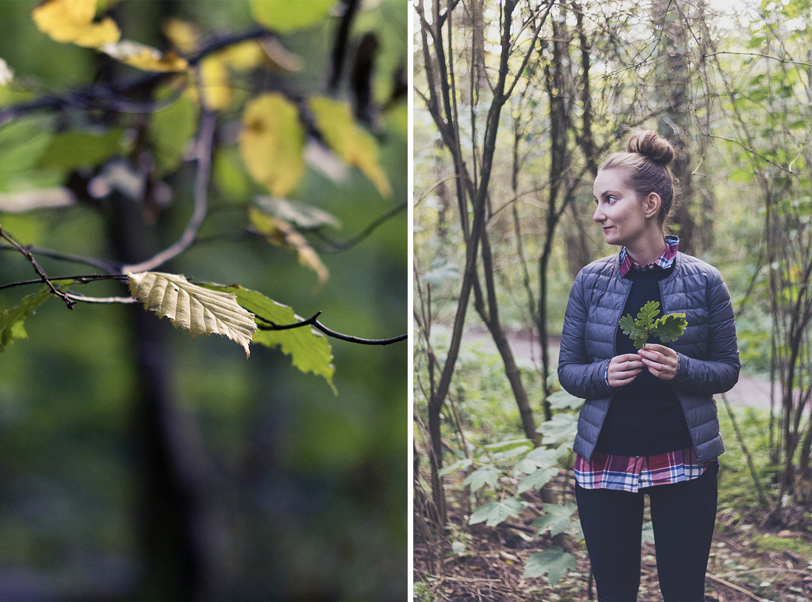
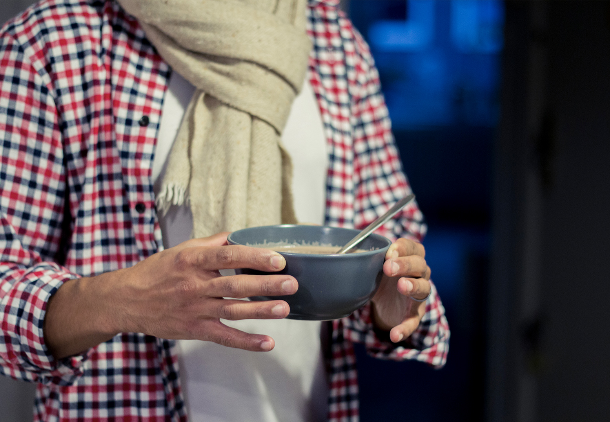

**10:00**
Je n’ai pas encore envie d’ouvrir les yeux. Non j’attends encore un peu. On est si bien sous la couette, lorsque le lit est encore chaud et si douillet. J’en profite. C’est si doux, pour une fois, de ne pas avoir de réveil. C’est que, nous étions bien fatigués tous les deux. Après ce week-end et cette semaine marathon, je crois que l’on en avait vraiment besoin. C’est si doux. Encore quelques instants. C’est trop bon. J’ouvre un oeil. Puis l’autre. La lumière perce les rideaux, mais la chambre est encore sombre. Je sens la chaleur de son corps à mes côtés. Il est déjà réveillé depuis plusieurs instants. Comme toujours. Il me regarde, je lui souris. “Bonjour, tu as bien dormi ?”. Mes yeux lui répondent un grand oui tandis que mon corps est encore enveloppé de coton.

**11:00**
Pour une fois, nous décidons d’aller courir. Il fait frais dehors, mais pas froid. La course nous réchauffe vite le corps. On court vite, plus vite que d’habitude. Mon souffle a du mal à suivre, mais ce n’est pas grave. La fraicheur de l’air ambiant envahit nos narines. L’automne est là. C’est tellement joli, le VondelPark. Et puis, ça fait du bien de courir, de se sentir vivant.

**12:00**
Au petit-déjeuner ce matin-là, des cupcakes maison à la crème de marrons. C’est si bon la crème de marrons. Et puis, il faut en profiter, on prend le temps de la déguster, c’est si dur d’en trouver ici. C’est délicieux. Un peu trop même, il ne faudrait pas en abuser. Et puis de cette façon, on en garde pour le gouter, toute à l’heure lorsqu’on sera rentré du bois. J’en déguste un, en buvant mon thé et en observant les quelques passants dans la rue. Ils sont vraiment bons ces cupcake. Et les fruits aussi ! Toujours des fruits.

**14:00**
Tu prends le parapluie. J’ai enfilé mes jolies bottes de pluie, parfaites pour une balade en forêt, un samedi à demi-pluvieux du mois d’Octobre. Nous voilà fins prêts. Je te regarde et je me dis que tu es si beau dans ton manteau. Si les gens nous voyaient, ils rigoleraient avec nos deux chemises à carreaux assorties. Mais on aime bien, nous, être assorti. On se sent plus fort, plus amoureux. Parce qu’à deux, c’est toujours mieux, pas vrai ?

**15:00**
Amsterdamse Bos, nous t’atteignons enfin. Tu es grand ! Tes arbres flamboient de toutes les couleurs. C’est si beau. L’automne est arrivé et avec la promesse de journées raccourcies, de pluie et de températures plus fraîches. Mais les nombreuses couleurs des feuilles réchauffent l’air et le vent frais ambiants. Nous marchons, le nez en l’air, pour ne pas en perdre une miette. Il n’y a pas de mots pour décrire le sentiment de pleine satisfaction que je ressens à l’instant présent. Toi & moi, se baladant main dans la main, à la faveur de l’automne. Il est temps de rentrer. La pluie nous a rattrapé et si l’on ne veut pas se faire trop mouiller, nous remettons le cap vers la maison.

**17:30**
Mon petit canapé. Un livre dans une main. Un chocolat chaud au lait d’amande dans l’autre. Le bruit de la pluie dehors. Tu me regardes d’un air bien vaillant. Je te souris et tu comprends. Pas besoin de mots. On est bien chez soi. On est bien tout court. Et l’on a qu’une envie. Celle de recommencer **cette magnifique journée**.

**♥**

