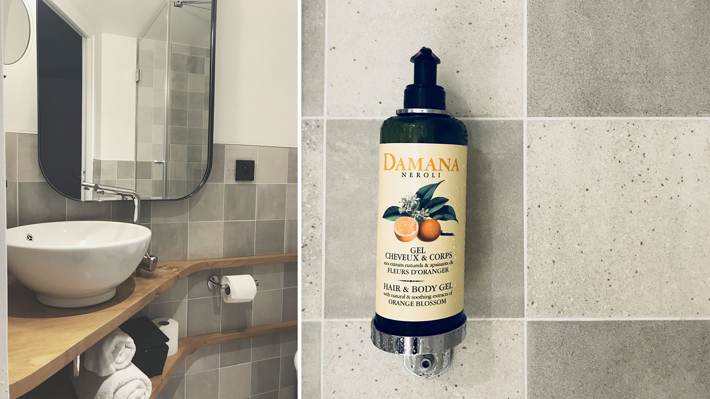

Mon frère. Mon cousin. Nos amis. Son papa. Beaucoup de personnes de notre entourage habitent sur Paris. Ayant nous-mêmes vécus deux années sur là-bas, nous n’avons jamais eu de difficultés à nous loger pour chacun de nos déplacements dans la capitale. Début octobre avait lieu ma cérémonie de remise de diplôme Gobelins dans un théâtre parisien. Pour une fois, Alexis et moi avons décidé de ne déranger personne en choisissant de dormir une nuit à l'hôtel. Ce serait par là l'occasion même de découvrir un nouveau lieu à _Paris_, mais aussi et surtout, de profiter d’un merveilleux petit-déjeuné d’hôtel (car avouons-le, les petits dej d’hôtels, c’est toujours trop bon !).

Le problème avec les hôtels parisiens, c’est qu’on ne sait jamais trop à quoi s’attendre. Tu paies souvent assez cher la nuit et tu te retrouves dans des chambres un peu miteuses, plutôt vieillottes. Pareil pour les Airbnb. Fort heureusement, je connaissais un hôtel dont j’étais quasiment certaine qu’il serait parfait, puisqu’ayant ouvert, après totale remise à neuf, il y a un peu plus d'un an seulement. **[L’hôtel du Petit Cosy](https://www.lepetitcosyhotel.com/)** Je le connaissais pour de bonnes raisons, puisque Sweet Punk, mon ancienne agence, a conçu et réalisé le site web de l’hôtel. En plus, nous y avions dîné avec toute l’équipe pour fêter l’ouverture et cela avait été délicieux. L’hôtel apparaissait donc comme une **bonne valeur sûre**.

**L’hôtel**
Situé dans un bâtiment au style parisien, **l’hôtel du Petit Cosy** se compose de 22 chambres qui ont entièrement été rénovées. L’hôtel se veut clairement intimiste et porte parfaitement son nom. Les chambres sont de véritables cocons à la déco chic et soignée. Ni trop, ni trop peu, avec un mobilier contemporain et confortable. J’ai eu un coup de coeur pour les lampadaires en suspension au style industriel, de chaque côté du lit, dont la couleur orange contraste parfaitement avec le bleu nuit intense du mur. Aussi, j’ai adoré comment la peinture du mur & plafond réussissait à créer un véritable espace nuit pour le délimiter du reste de la chambre, somme toute petite, mais qui finalement réussisse à agrandir visuellement l’espace. C’est très réussi et le bleu est magnifique. La salle de bain est extrêmement propre et j’ai apprécié le fait de ne pas avoir de miniatures de shampoings et après-shampoing ou savon. Non, à la place vous avez à disposition, dans la douche et à côté du lavabo, du gel de douche en pot avec poussoir. Hyper pratique et surtout bien plus écolo : beaucoup moins de gaspillage et de production de produits plastiques. Nous ne l'avons pas testé, mais chaque chambre possède une petite TV murale, face au lit. Ce dernier était d’ailleurs très confortable et nous avons littéralement dormi comme des bébés. Enfin, chacune des chambres se présente avec un petit bureau / guéridon et d’une chaise. Pratique si vous avez besoin de travailler sur votre laptop — _le wifi étant gratuit_.

**Le restaurant / Petit-déjeuner**
Le petit déjeuner est servi dans le restaurant attenant au **Cosy**, le matin jusqu’à 10h environ. Nous y accédons par une jolie arrière court, réservée aux clients de l’hôtel. C’est un petit buffet à volonté rempli de bonnes choses : viennoiseries type croissant et pain au chocolat, muesli et céréales, charcuteries et fromages, compotes de pomme et fruits frais, pains perdus et baguettes fraîches, gâteaux au chocolat et thé vert matcha / amande et du jus d’orange ou de pamplemousse. En plus de cela, vous avez droit à une boisson chaude et vous pouvez aussi demander à avoir des oeufs brouillés ou au plat ou bien de la saucisse de volaille ou encore du bacon.
Pour notre part, nous sommes restés seulement sur le sucré. Le pain perdu et les deux gâteaux fait maison étaient **dé-li-cieux**. C’était aussi très appréciable d’avoir du jus fraichement pressé maison et non du jus en brique insipide ou, pire, en poudre, comme certains hôtel pourraient proposer ... En somme, le petit-déjeuner est plus que copieux et vraiment, vraiment bon! Par expérience, je sais aussi que le menu du restaurant est vraiment bon et si vous en avez l’occasion, n’hésitez pas à tester leur formule brunch le week-end, lui aussi, excellent !

**L’expérience**
Enfin, nous avons été vraiment super bien accueilli et l’expérience globale de notre nuit au **Petit Cosy** est plus que positive. Pour sûre, si nous devons retourner le temps d’un week-end sur Paris, nous savons où nous irons. En plus, l’hôtel est idéalement situé à côté de Nation et donc à « proximité-distante » de nombreux pôles parisiens de part la présence du RER A et des lignes de métro 6 et 2. Le quartier de Picpus reste quant à lui plutôt calme et c’est tant mieux. En bref, nous avons été très ravi et nous ne pouvons que vous conseiller d’aller passer une nuit et même plus, à **l’Hôtel du Petit Cosy**.

---

_Le petit bonus_ : N’hésitez pas à reserver votre séjour via [leur site](https://www.lepetitcosyhotel.com/) et leur propre plateforme de réservation en ligne, vous y trouverez les prix les plus bas, moins cher que Booking.com ou Hotel.com par exemple. En plus, le site web est joli, ça vaut deux fois plus le coup 😉

**♥**

• [Le site web](https://www.lepetitcosyhotel.com/)
• [La page Facebook](https://www.facebook.com/LE-COSY-1182454788435263/?fref=ts/)
• [La page Instagram](https://www.instagram.com/lepetitcosyhotel/)

