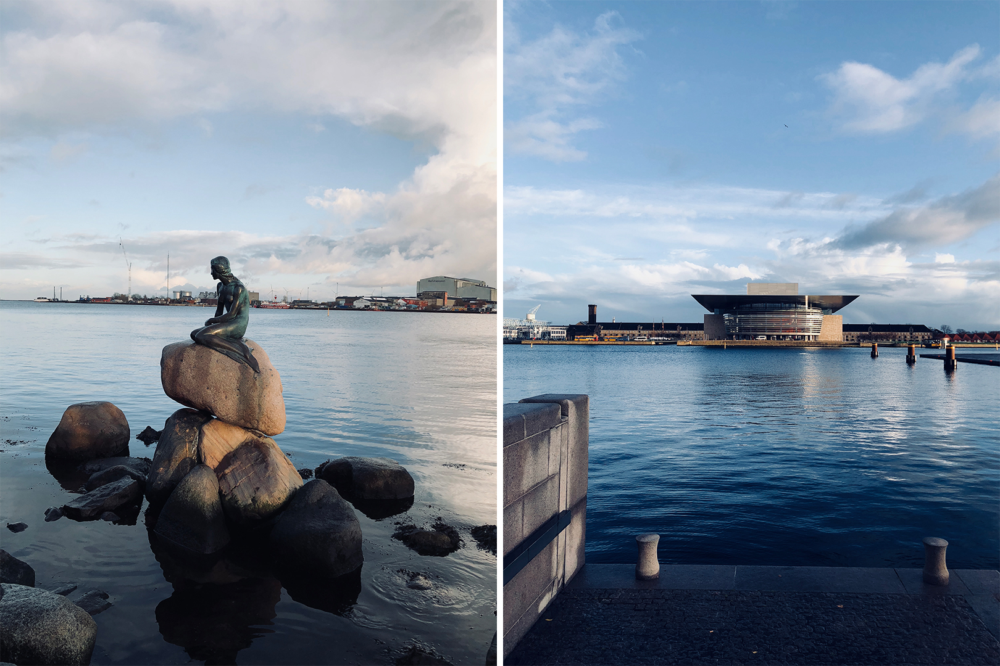
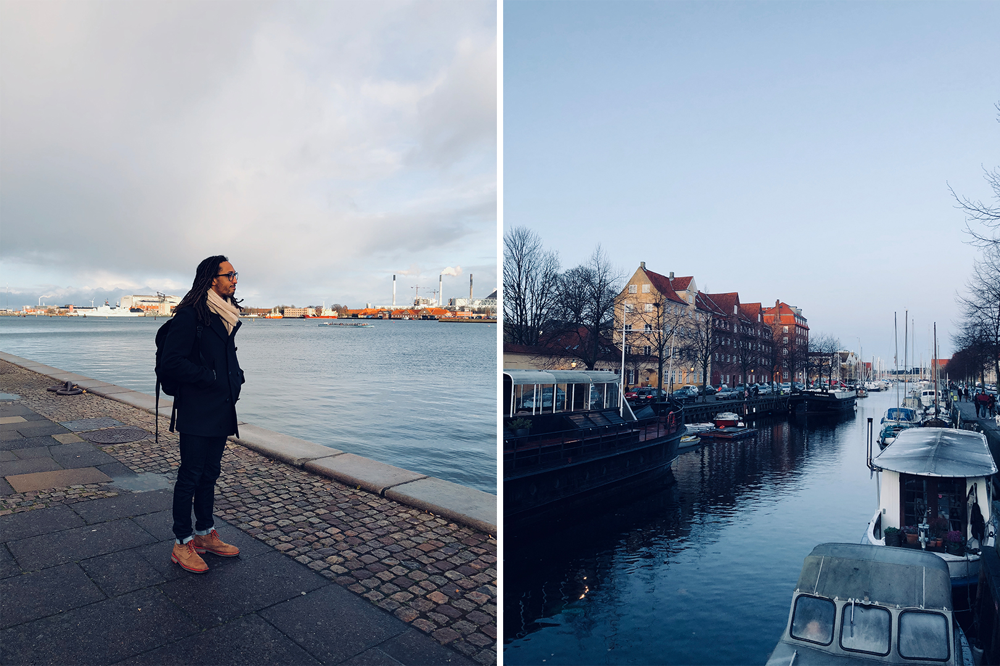
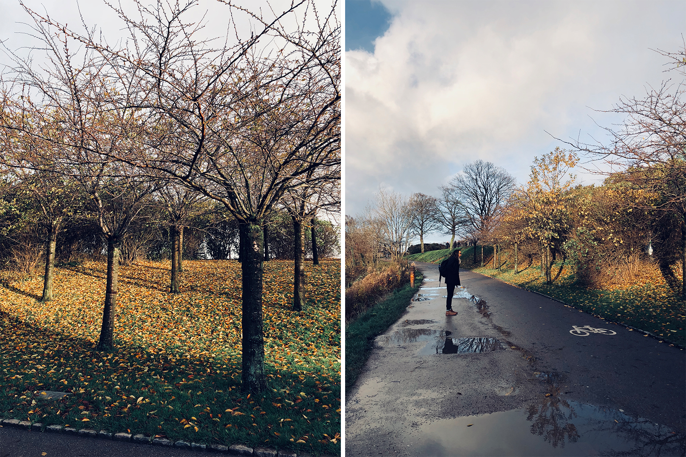
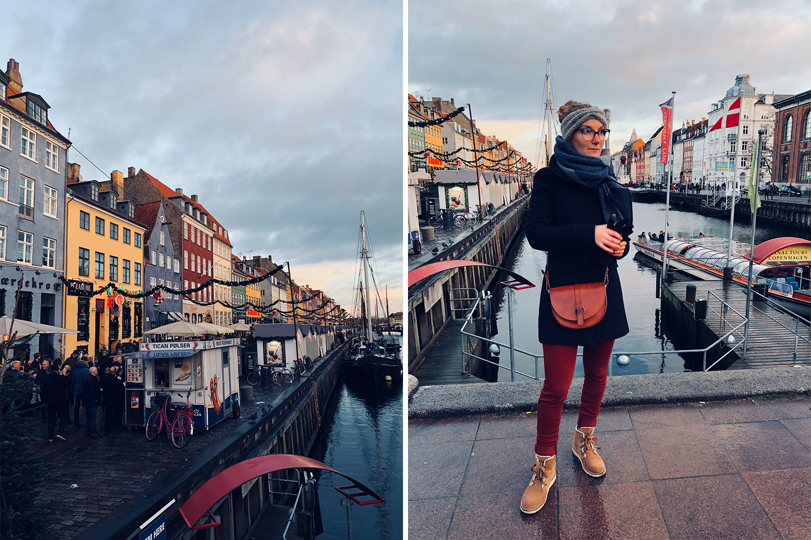
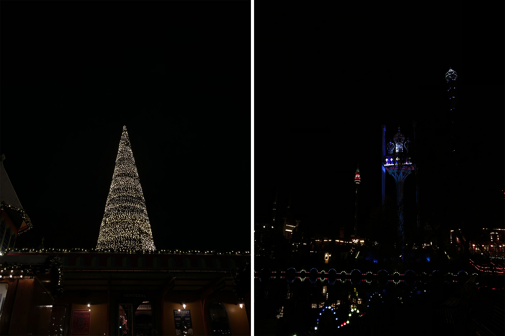
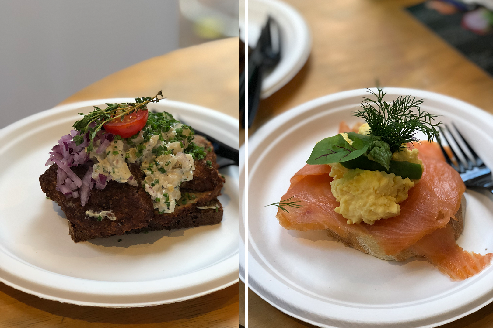

_Après un premier essai raté en février 2016, nous avons enfin pu profiter de la capitale danoise le temps d’un court week-end. Arrivés sur place dans la matinée, pour repartir le lendemain en fin d’après-midi. Cela nous laissait donc 36h sur place pour une visite la ville._

Pour nous éviter bien des soucis, nous avons décidé de voyager en mode minimaliste, avec un sac à dos comme seul bagage. C’est, je crois, la première fois que je voyage aussi léger et pourtant ça m’est tombé sous le sens : pas la peine de transporter trois paires de chaussures pour si peu de temps sur place ; totalement inutile et encombrant.

---

## Day 1

Nous commençons la journée par le point le plus central de la ville, à savoir la station de métro **Kongens Nytorv**, qui se situe dans le centre historique appelé **Indre By**. Ayant atterri aux alentours de 11h et la faim se faisant sentir, nous nous engouffrons la plus longue rue commerçante d’Europe ; **la rue Strøget**. Sur les conseils de ma tante Paula, nous voulions nous poser au **Norden Café**. Malheureusement, la réputation du lieu, l’heure du moment et sa position très centrale ont fait que nous n’avons pas pu nous y installer. À la place, nous avons déambulé dans le marché de **Noël** avoisinant et en profitons pour grignoter un hot-dog à la saucisse grillée, des chips de pommes de terre maison et des churros. Le “repas” typique des marchés de Noël quoi !

Nous faisons un détour par la **Hay House**, une marque de design danoise au style scandinave très connue, simplement pour la beauté des yeux. Enfin, nous redescendons un peu la rue en direction d’une des fameuses boutiques **Søstrene Grene**. Nous étions limités en bagages, heureusement, car sinon j’aurais dérobé le magasin en décorations de Noël tellement tout est mignon et pas excessivement cher. Je repars simplement avec trois petits sapins de Noël en céramique si mignons.

En chemin, nous passons devant **l’Hôtel Chocolat** dont Marie nous avait tenu deux mots. C’est une chocolaterie premium dans laquelle elle nous avait chaudement conseillé de goûter à leur chocolat chaud fait maison. Le petit truc en plus de la boutique est de pouvoir choisir son pourcentage de cacao dans son chocolat. Pour ma part, j’ai goûté la version spéciale fêtes de fin d’année à base de chocolat et caramel salé. Alexis a opté pour un café-chocolat chaud, 100 % pur cacao. Et bien, franchement, c’était drôlement bon.

Nos ventres étant désormais bien remplis, nous pouvons enfin commencer la visite de la ville à proprement parler. Pour cela, nous décidons de remonter jusqu’à l’emplacement de la statue de la petite sirène, en passant par la très grande place du **palais d’Amalienborg**, résidence d’hiver de la famille royale du Danemark. Tel à Buckingham, des gardes revêtus de hauts chapeaux poilus patrouillent sur la place. En face se situe le très beau Opéra National. Le soleil étant déjà couchant, nous profitons d'une luminosité parfaite, le bâtiment se reflétant à merveille dans l’eau de la mer. Beaucoup disent être déçus par **la Petite Sirène**, mais j'ai trouvé un certain charme à cette statue posée au milieu de nulle part, en fond de zone industrielle et dont l’histoire du conte auquel elle est associée en a sûrement fait rêver plus d’un !

Nous continuons notre route en direction des remparts de la **citadelle de Kastellet**. C’est un bâtiment remarquable pour sa construction puisqu’en forme d'étoile. Bien sûr, cela ne se voit qu’en vue aérienne, mais la ballade sur les remparts est très agréable et nous croisons de nombreux coureurs. Il est à peine trois heures et demie, mais le soleil est déjà presque couché. Nous nous dépêchons alors d’atteindre le port de **Nyhavn** afin de profiter des derniers rayons de lumières (et de la foule). **Nyvahn**, c’est LE lieu le plus connu, du moins, le plus photographié de la capitale. **Nyavhn** est à Copenhague ce que la tour Eiffel et à Paris ; un cliché. Et pour cause, ce petit port est tellement charmant avec toutes ces maisons colorées bordant le canal. C’est aussi ici que vécu en grande partie l’écrivain **Hans Christian Andersen** à qui l’on doit les fameux contes de “La Petite Sirène”, “Le vilain petit canard”, “La Bergère et le Ramoneur” ou bien encore “La Reine des neiges”.

Par la suite, nous mettons cap vers le “fameux” quartier de **Christiania**, quartier autoproclamé « ville libre de Christiania ». C’est assez facile en fait, il suffit de suivre la foule ... Le quartier est connu pour son aspect “libertaire” très extraordinaire, mais reste assez controversé puisque la vente de cannabis y est totalement libre. Il y a même une rue dédiée, le “green light district” en écho certain à notre “Red Light District”. Nous nous attendions à croiser de nombreux vieux personnages hippies, plutôt cool et pas méchants. Mais, nous nous retrouvons à la place à ce que l'on décrit comme le marché de Noël d’une cité du 93 ... Autant vous dire que l’on ne fait pas long-feux.

Il fait désormais bien nuit et il nous reste une dernière chose prévue sur le programme de cette première journée : **les jardins de Tivoli**. Il s’agit en fait d’un parc d’attractions, situé en plein coeur de \***\*Copenhague\*\***. Le parc est notamment connu pour avoir inspiré Disney Land à Walt Disney. Normalement fermé en période d’hiver, le parc venait tout juste de rouvrir, exceptionnellement pour la période des fêtes de Noël et je dois dire que c’était complètement magique. Il y avait de la (fausse) neige recouvrant chaque bâtiment, des sapins de Noël à chaque recoin et des illuminations pour agrémenter le tout. On a eu l’impression de passer la soirée dans un monde parallèle. C’était vraiment **magique**.

Nous rentrons à l’hôtel des paillettes dans les yeux et les kilomètres pleins les jambes !

---

## Day 2

Nous commençons cette seconde et dernière journée par un bien bon petit déjeuner. L’hôtel où nous avons dormi est vraiment très cozy, ressemblant davantage à une grande maison qu’un véritable hôtel. La tenante est tout aussi gentille qu’accueillante. Malheureusement, le beau temps de la veille a disparu et les quelques éclaircies de lumière alternent avec de grosses averses, du crachin bien pourri, le tout accompagné d’un vent fort et glacial. Pas idéal lorsque l’on sait que l’on est censé passer la journée à crapahuter dehors ...

Qu’à cela ne tienne, nous tentons de braver le froid. Nous commençons par le château et les jardins de _Rosenborg_ qui furent au final difficiles d’apprécier, la pluie étant à nouveau au rdv. Je passe ce moment assez éprouvant. Finalement, au bout d’un moment, la pluie semble cesser et c’est à ce moment-là que nous décidons de remonter la longue avenue de _Nørrebrogade_ vers le _parc Superkilen_, un lieu urbain graphique imaginé par l'architecte danois Bjarke Ingels mais ... je ne sais pas si les 30 minutes de marche en valaient la peine .. Nous rebroussons donc chemin et faisons un détour par le _parc / cimetière Assistens_. C’est un lieu assez atypique pour un cimetière et semble-t-il très apprécié des résidants pour leur ballade et leur footing. C’est aussi ici qu’est enterré Hans Christian Andersen. L’aspect cimetière est totalement différent de ce que l’on connait en France et les tombes se fondent complètement dans le paysage. Alexis trouve ça glauque, moi je trouve ça beau, du moins, j’aime **l’ambiance automnale** qui se dégage du lieu et je le trouve bien plus charmant que nos cimetières français.

En redescendant vers le centre, nous traversons les _lacs de Copenhague_, des bassins artificiels séparant le quartier _Nørrebro_ du centre historique. Au passage, nous achetons un énooorme cinnamonroll et du **Rugbrød** dans une boulangerie, le fameux pain “noirs” danois, servant de base au **smørrebrød**, le déjeuner traditionnel danois. C’est justement ce que nous envisageons de manger pour ce midi en nous dirigeant vers les _Torverhallerne_, un grand marché couvert, un peu dans l’esprit des Foodhallen, les tables communes en moins. Nous dégustons donc nos deux Smørrebrøds, le classique à base de saumon fumé et un second à base de boulettes de viande à la mode “Ikea” et de galettes de pomme de terre. Ce n’était pas mauvais et très bien présenté !

Notre ballade touche à sa fin et n’ayant plus le courage de ressortir braver le froid, nous décidons de nous poser dans un café histoire de patienter autour d’une boisson chaude avant de repartir pour l’aéroport. Je crois que je n’ai jamais bu un aussi bon chai latte ! Mais c’est aussi à ce moment-là que nous nous rendons compte que la vie est véritablement plus chère ici. Pour deux grandes boissons chaudes et un muffin, nous avons payé l’équivalent de 18 euros. Si l’on compare avec les prestations de Starbuck, nous en aurions eu pour 5 euros de moins minimum !

---

Au final, **Copenhague a des airs d’Amsterdam**, les canaux et les petites rues en moins. C’est une capitale que nous avons trouvé plutôt **charmante**, surtout Tivoli qui nous en a mis plein les yeux, sans pour autant désirer y rester plus “longtemps”. Pour ma part, je crois que j’aimerais tout de même y retourner un week-end d’été afin de profiter d’une luminosité plus longue et de pouvoir se promener sans trop avoir froid. Ce fut un week-end largement appréciable, mais surtout, le premier véritable week-end à deux depuis qu’Alexis a décidé de quitter Cocotte. **Et ça fait du bien !**

**♥**
