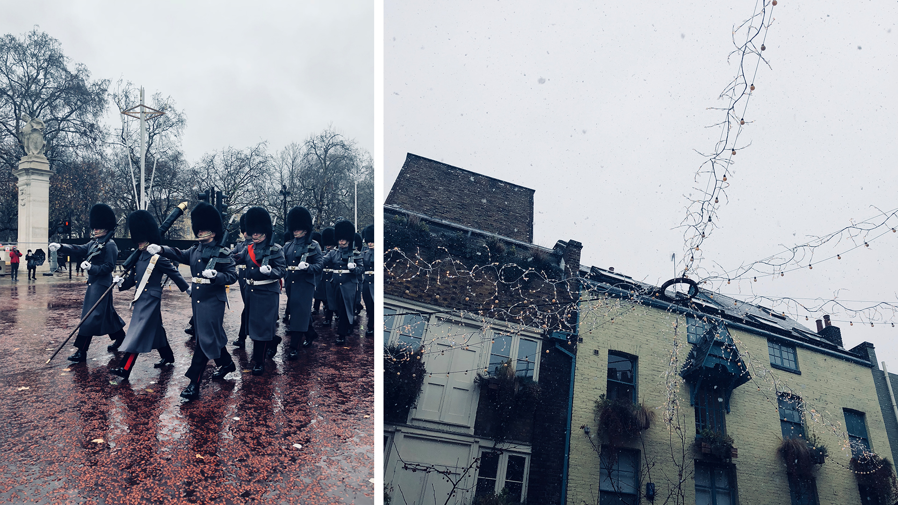
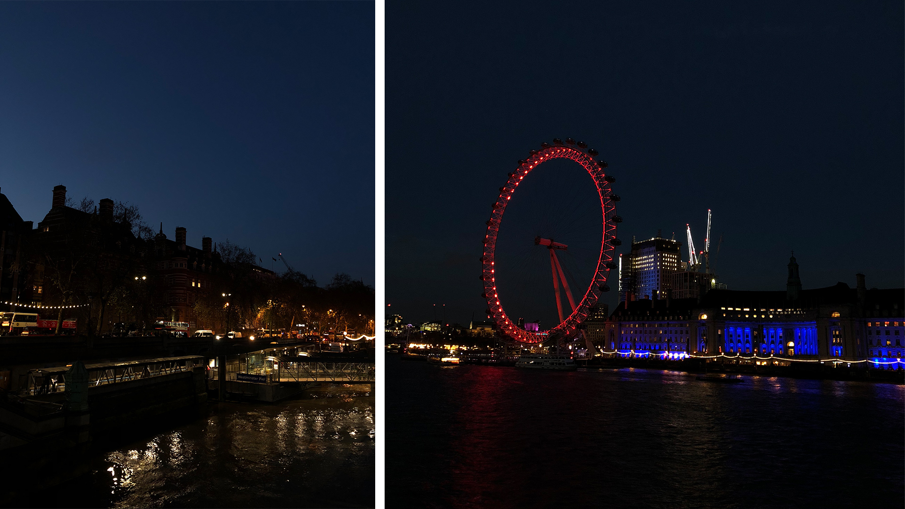

Hello la compagnie & **joyeuses fêtes** !

On se retrouve aujourd’hui pour un nouvel épisode de _“Où partons-nous ce week-end ?”_. Cette foi-ci, c’est à **Londres** que nous nous sommes rendus au début du mois de décembre.

C’était une première pour tous les deux. Enfin, moi non pas vraiment, j’y étais allée passer une après-midi lors d’un voyage linguistique en Angleterre, mais pour être honnête, je ne me souviens que de la pluie et du bus en panne sur l’autoroute ... Une première donc, pour tous les deux. Le week-end s’annonçait magique, sous le signe des fêtes de Noël. Londres en décembre, je pense que c’est quand même l’une des plus belles périodes pour visiter cette si grande ville. Moi qui adore les décorations de Noël et me balader au milieu des marchés de Noël, j’ai été servie !

Pour cette première expérience de l’ambiance londonienne, nous avons joué la carte touriste en choisissant sur la carte de passer par la plupart des grands points d'intérêts connus de la ville. Une fois de plus, nous avons beaucoup marché, mais à Londres, obligé de passer aussi par la case métro tant la ville est gargantuesque ! D’ailleurs en parlant du métro, une chose est sûre, ça ne nous avait pas manqué ! J’ai trouvé les couloirs étriqués et l’espace de certains wagons relativement petit comparé à Paris que je n’ose imaginer les heures de pointe. On est bien mieux à Amsterdam avec nos vélos, même sous la pluie !

Lorsque l’on pensait aux éventuelles villes où l’on aimerait vivre à l’étranger, à l’époque, Londres ne faisait pas partie de nos choix. Réputée pour être bien trop chère et bien trop grande, et déjà que Paris à nos yeux nous paraissait grand, alors Londres, non merci, ce n’est pas pour nous ! Pour autant, une fois sur place, je peux comprendre l’engouement que certains peuvent avoir pour cette ville. Ça bouge. Littéralement. Ça bouge de partout. J’ai eu le sentiment que cette ville ne dort jamais. Et puis, c’est quand même une belle ville. Certes, le charme de nos canaux ne pourra jamais être égalé, mais j’ai été complètement séduite par Covent Garden, le grand magasin Harrods et les alentours de Westminster. C’est vrai que l’ambiance Christmas y a joué pour beaucoup. Surtout le dimanche, dans les sept rues du Seven Dials, avec la neige tombante, c’était simplement magique et magnifique !

Cela aura aussi eu un certain prix ... Pour ceux qui n’auraient pas suivi l’histoire, notre avion a été annulé, deux fois, à cause de la neige tombée sur Londres & sur Amsterdam et nous avons finalement dû rentrer en bus deux jours plus tard... Ce fut clairement l’aventure ! En tout cas, cela ne nous a pas empêché d’apprécier ces quelques heures passées dans la capitale britannique. Bien trop grande pour tout voir en une seule fois, je suis quasiment sûre d’y revenir plus tard pour aller me balader le long des maisons colorées de Nothing Hill et faire un croché par les studios de Harry Potter pour faire rêver la grande enfant qui sommeille en moi 😉

---

Je vous laisse sur ces quelques photos qui tentent, tant bien que mal, de retranscrire **la magie de Noël à Londres**. Et on se retrouve vite en 2018 !

**♥**

