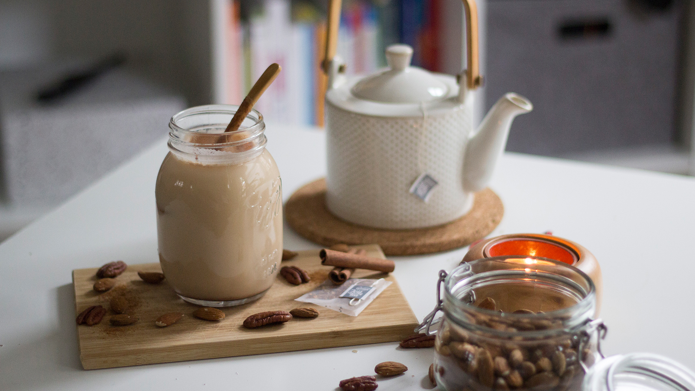
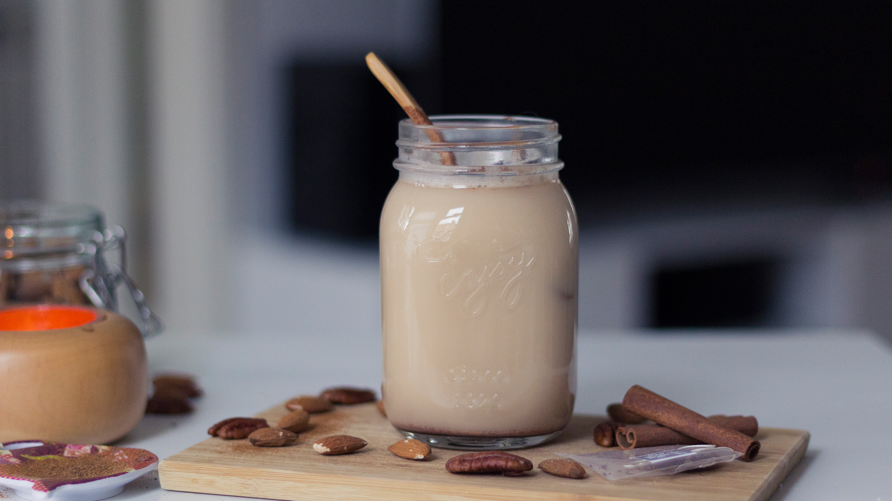
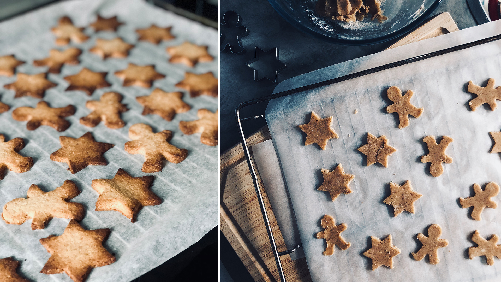
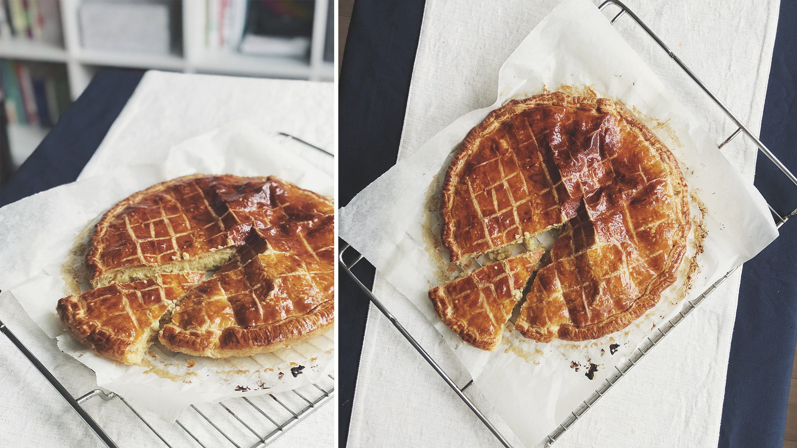

Et si nous commencions l’année sur une note **gourmande** ! J’avais envie de partager avec vous quelques petites gourmandises que j’ai pris plaisir à préparer durant les dernières semaines et qui sont parfaitement dans le thème de l’hiver. Après la ferveur de la figue en automne, l’hiver me donne envie de douceur, réconfort et toujours plus de gourmandises. C’est **la saison du cocooning** par excellence. Celle où l’on privilégie les sentiments de confort, de chaleur & de convivialité. Alors cet hiver, on se fait plaisir et surtout on prend le temps de **partager ces petites gourmandises avec les gens qu’on aime !**

---

### Chai Latte & Apple Chai Cider

Quand je travaillais à Mobgen, j’ai découvert la fameuse boisson américaine (bien que pas du tout américaine au départ), je parle bien du **Chai Latte**, car il m’arrivait plusieurs d’aller m’en cherchait un avec les collègue sur le temps de pause du midi. Le Chaï Latte est une boisson au départ indienne préparée à base de thé noir, d’un mélange d’épices, de sucre et d’un soupçon de lait. C’est juste délicieux & réconfortant à souhait. Du coup, j’ai voulu tester d’en refaire à la maison car ce n'est vraiment pas compliqué. J’ai fait plusieurs essais en testant avec du lait de vache et du lait d’amande ou bien encore du thé chai VS poudre à chai. On a aussi testé une chouette alternative à base de jus de pommes chaud au lieu de la traditionnelle eau chaude et je dois dire que le mélange cannelle-pomme est parfait !

Concernant la marche à suivre c’est très simple, il suffit de faire infuser le chai dans un peu d’eau chaude et du lait ou bien du jus de pomme. En fonction des goûts et des préférences, on ajoute de la cannelle et un peu de miel ou de sirop d'érable. Ma version préférée, que je n’ai malheureusement jamais réussi à refaire, reste celle d’un bar à Amsterdam, le BrandStof dont leur chai est juste délicieux et à la texture parfaite. Leur mélange à chai est excellent et la manière dont ils font mousser le lait à la vapeur rend la boisson ultra crémeuse ! Bref, vous pouvez être sûre qu’en 2018, il y aura du Chai Latte au rdv 😉

---

 

### Les sablés de Noël

Ce n’est que la seconde année où je m’attelle à confectionner des **petits biscuits de Noël**. Cette année, en plus des cadeaux principaux, j’ai offert un petit sachet à chacun, parce que les cadeaux fait-mains, c’est toujours plus authentique. Pour l’occasion, je me suis procurée deux emporte-pièces aux formes parfaite pour Noël : un en forme d'étoile et un autre en forme de petits bonhommes en pain-d’épices. Pour la recette, c’est une pâte sablée sucrée, à laquelle j’ai ajouté de la poudre d’amande et fait un mix farine d’épeautre - farine de coco au lieu de la basique farine de blé. Ils ont eu leur petit succès à la maison et chez le voisin aussi. Facile à faire, ça demande, juste, un peu de temps pour tous les confectionner, mais qui en vaut complètement la patience, surtout pour la douce odeur qui embaume la maison pendant la cuisson !

---

### La galette des rois

Enfin s'il y a une chose que j’aime au mois de janvier, en plus de mon anniversaire, c’est bien **l’épiphanie**. Pas de blues de janvier avec une bonne **galette des rois**. Malheureusement ici à Amsterdam, impossible de trouver de la pâte feuilletées toute prête en magasin. Il n'existe seulement que des pâtes brisées, et encore, elles sont à base de matières grasses hydrogénées et ne sont pas pur beurre ...

J’avais prévu le coup en ramenant deux pâtes feuilletés de France à Noël. Ma recette de frangipane est simple & classique mais 100% gourmande : c’est de la crème pâtissière mélangée à de la crème d’amande. Ce serait franchement difficile de la rater. Un jour il faudra que je teste de faire une frangipane au chocolat pour encore plus de gourmandise, même si la version classique est notre préférée à Alexis & moi (surtout Alexis ! ) D’ailleurs, il m’a promis de faire de la pâte feuilletée maison le week-end prochain pour une galette 100% homemade. J’ai hâte 😀

**♥**
