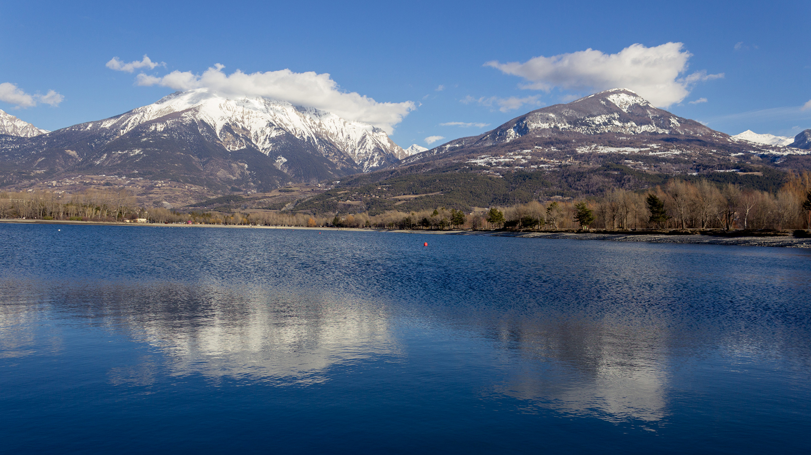
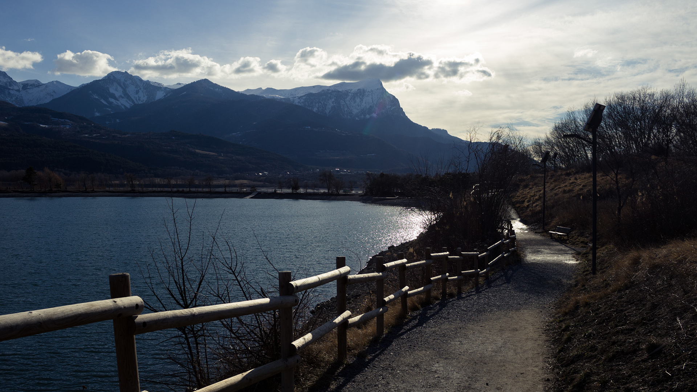
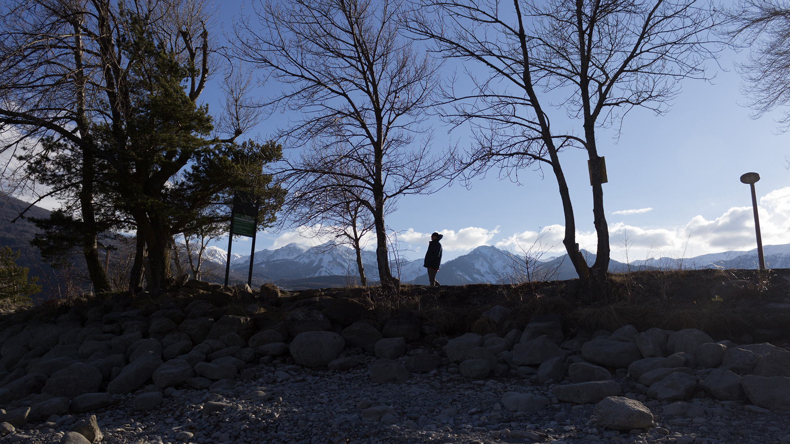
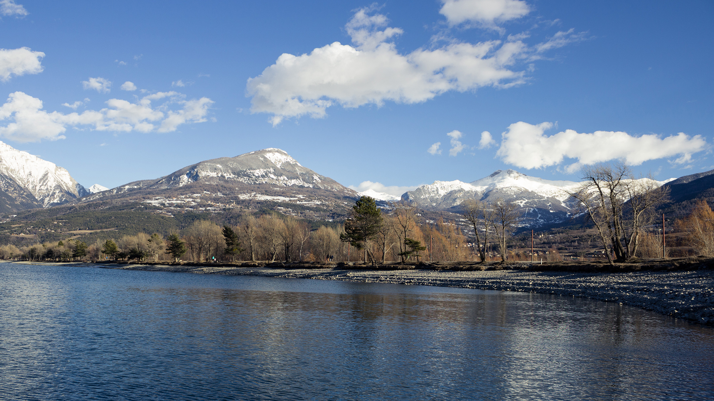
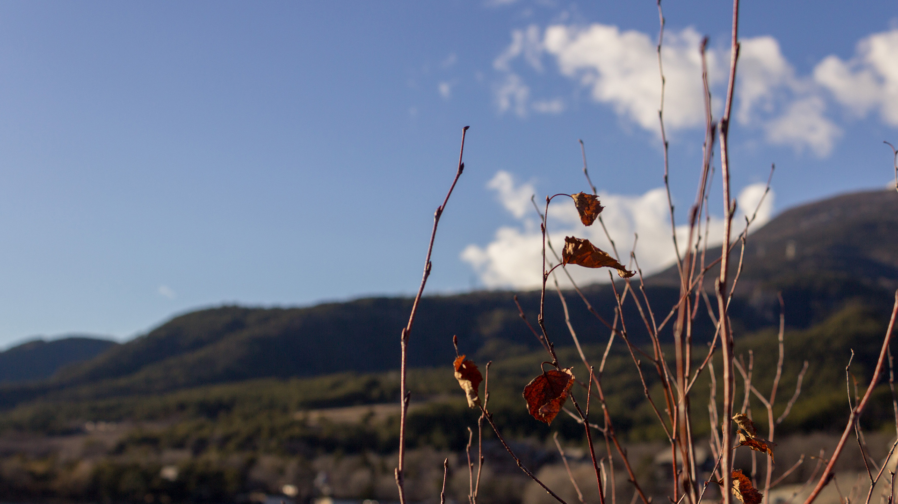
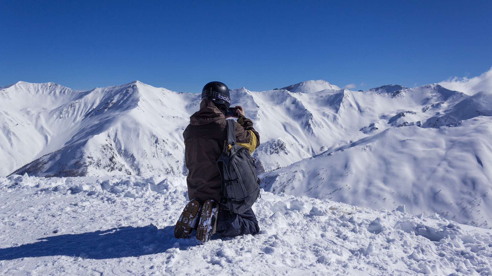
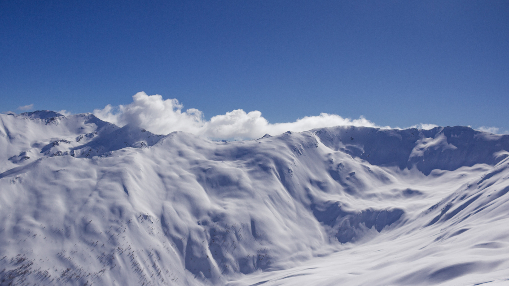

Je profite de cette semaine polaire pour vous partagez quelques photos d’Embrun, où je suis rentrée pour une semaine de vacances au grand air de la neige il y a quelques jours de cela. Alexis, ayant moins de possibilité de vacances, est resté à Amsterdam ; je suis donc rentrée toute seule pour retrouver papa & maman mais aussi mon frère, venu seul lui aussi, et ma soeur. Ça faisait un baille qu’on ne s’était pas retrouvé tous les 3. Sur les pistes qui plus est! C’était chouette. Ça faisait du bien.

Nous avons eu une semaine magnifique avec ciel bleu et grand soleil au rendez-vous. Au sommet, la vue est toujours à couper le souffle. J'ai beau la connaître par coeur, à chaque fois je suis impressionnée. Malgré les vacances, je trouve qu’il n’y a pas tant de monde que ça. C’est franchement agréable ! On enchaine les pistes. On apprécie la neige fraîche sur les côtés non damés. On coupe un peu par la forêt. On s’arrête pour faire quelques photos. On admire les paysages et les versants immaculés, encore tout blanc, les sapins encore bien chargés.

À chaque fin d’après-midi, je profite encore de la belle lumière pour aller marcher autour du plan d’eau. Une fois avec maman. Une fois avec Papa. Une fois avec Mélissa. Malgré la fatigue du ski dans les jambes, c’est plaisant de marché et d’admirer les sommets enneigés qui se reflètent sur l’eau. La “golden hour” fait la part belle à mes petits reflets roux et dorés dans les cheveux.

**Bref, c’était une belle semaine de vacances.**

À très vite ❤️
