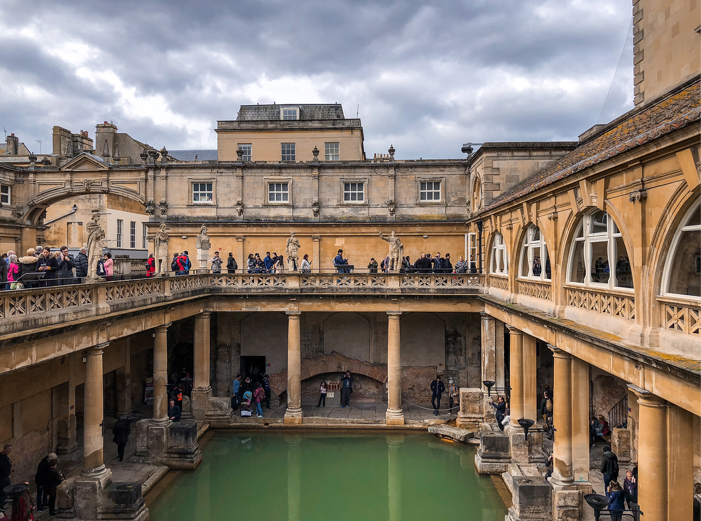
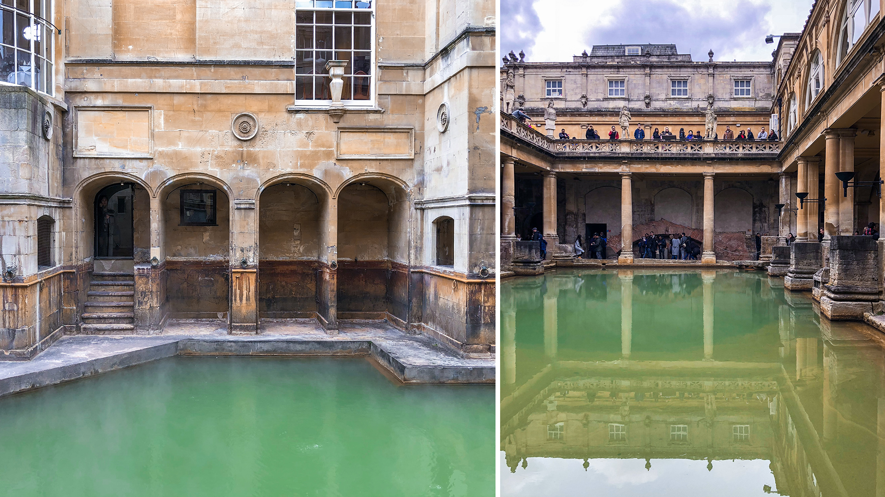
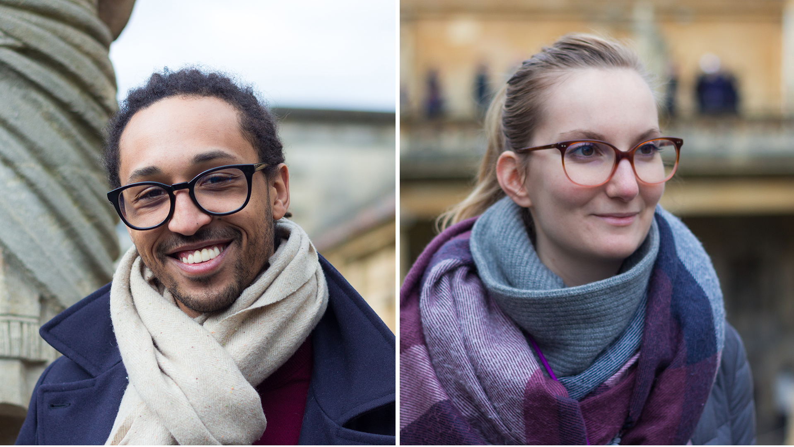
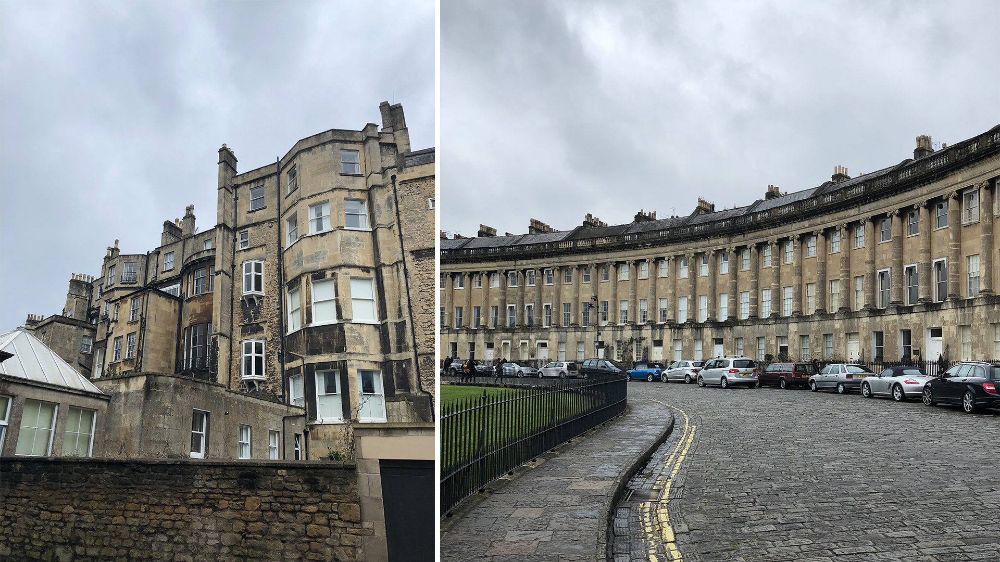
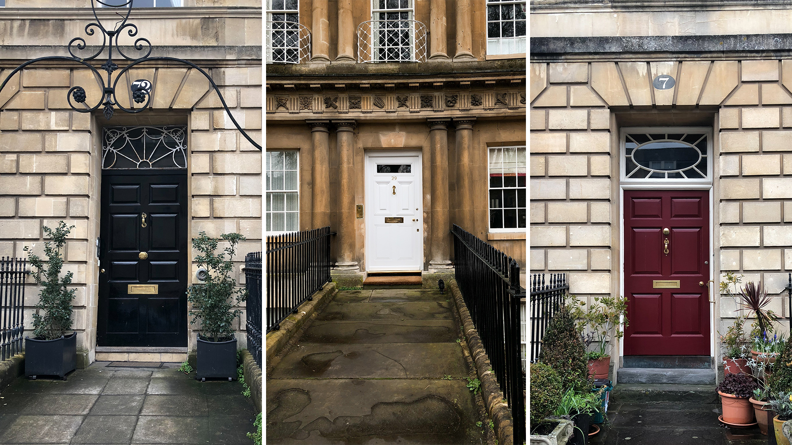
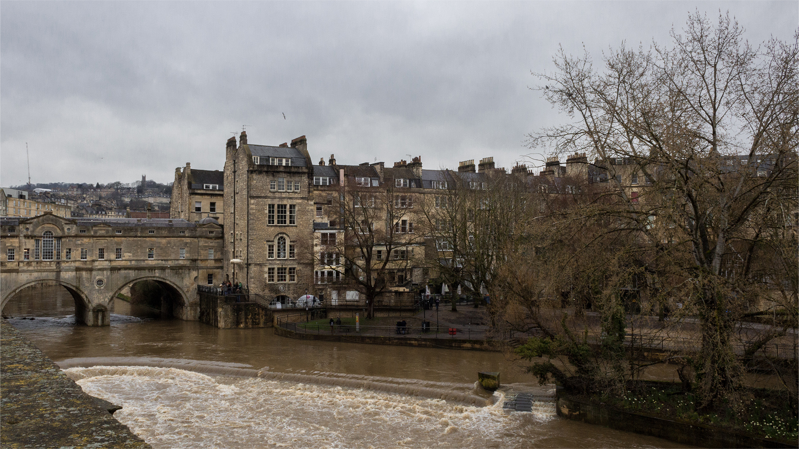
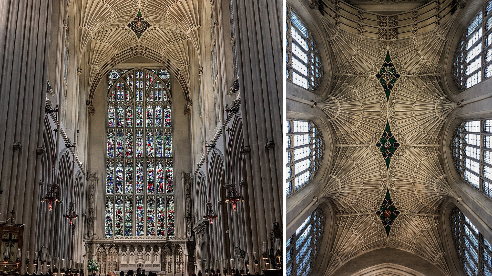
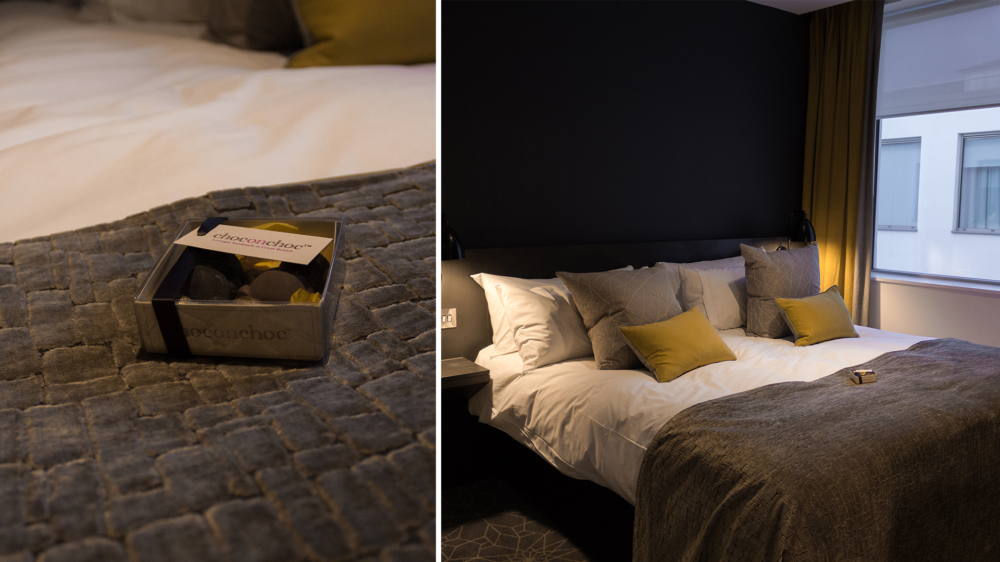
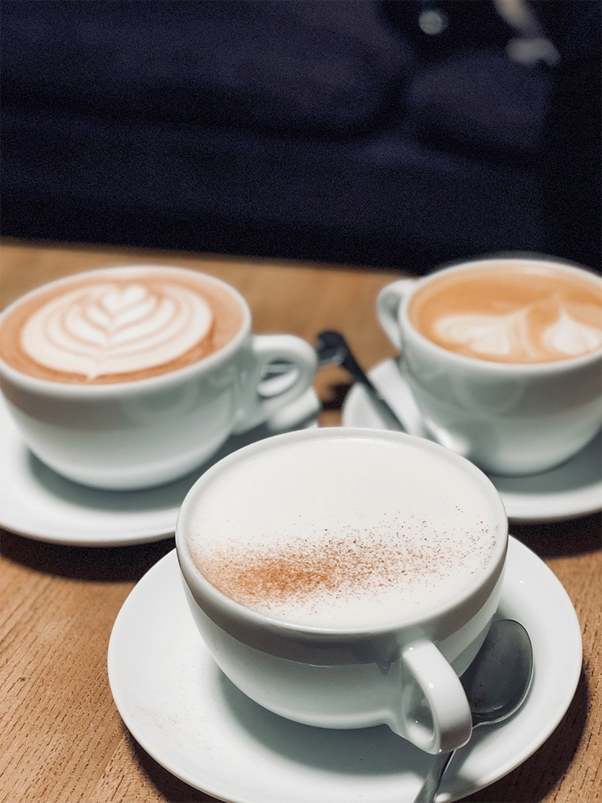

_Les longs week-ends sont faits pour s’évader de notre quotidien !_

Pour ce premier long week-end néerlandais, nous avions prévu de nous rendre dans la ville de Bath, en Angleterre, afin de faire un coucou à Claire-Lise, tout en profitant et visitant cette ville, dont, je l’avoue, je n’avais jamais entendu parlé avant. Nous sommes partis samedi matin, assez tôt, et revenu lundi soir en fin, fin de journée. Nous avons volé jusqu’à Bristol pour ensuite prendre un bus (environ 1h) amenant directement dans le centre-ville de Bath, depuis l’aéroport.

Côté météo, ce n’était pas le meilleur des week-ends. Il faisait plutôt humide et relativement frais avec moins de 8-10 degrés affichés. Mais, soyons honnête, il ne faut pas non plus s’attendre à 20 degrés en se rendant en Angleterre une fin de mois de mars. 😉

**Histoire**
Avec un peu plus de 80 000 habitants, Bath est une ville de taille relativement moyenne, mais est une véritable pépite historique anglaise qui attire chaque année des milliers de touristes. En effet, la ville de Bath fut construite sur l’emplacement de l’unique source d’eau chaude du pays. Grâce aux recherches archéologiques, on sait que la ville fut fondée en l’an 50 a.p J-C, à l'époque de l’Empire Romain, par les Romains eux-mêmes, qui y voyaient là un signe des Dieux. Ils en firent, au fil du temps, un véritable centre thermal baptisé “Aquae Sulis”, mais aussi un lieu de culte avec un temple dédié à la déesse Sulis-Minerve.

Après le retrait des troupes romaines vers le 4e siècle ap. J-C, la ville fut peu à peu laissée à l’abandon et la plupart des bâtiments, aussi incroyable que cela puisse paraître, furent recouvert par ensablement et enfouis dans la vase due aux nombreuses inondations dans la région. Ainsi, les thermes se trouvent aujourd'hui à 6 m sous le niveau des rues de la ville et les statues visibles au niveau des bains sont en réalité bien plus récentes. Le site archéologique fut découvert à la fin du 18e siècle, puis ouvert au public en 1897. C’est un véritable petit bijou de l’histoire qui permit à Bath d’être la seule ville anglaise inscrite au patrimoine mondial de l'UNESCO depuis 1987.

**The Roman Bath**
Les thermes sont l’attractions numéro 1 de la ville et nous n’avons pas dérogé à la règle. Sur les conseils de (et avec) Claire-Lise, nous avons visité les vestiges du site archéologique le dimanche. Située à côté de l’Abbaye de Bath, l’entrée des Bains se fait par un magnifique hall de réception victorien et la visite se déroule à l’aide un audio guide riche en informations et plutôt bien fait (dispo gratuitement à la fois pour les adultes & les enfants).

La visite débute par la terrasse surplombant le Grand Bain pour ensuite aller à la découverte de la “spring water”, la source d’eau chaude sacrée, naturellement à 46 degrés et très ferrugineuse ! Ainsi, tout au long de la visite, nous retraçons l’histoire des bains, et marchons sur traces des Romains venus, à l’époque, rendre hommage à la déesse Sulis-Minerve. Les bains étaient composés d’un grand bain extérieur, d’un caldarium (bain chaud), d’un trépidarium (bien tiède) et d’un frigidarium (bain froid), ainsi que de différentes pièces type « sauna ». Le lieu possédait, en plus du temple, aussi un gymnase et théâtre. La visite est rythmée tantôt par les bains, tantôt par des restes de fondation, mais aussi par de vastes collections archéologiques romaines qui ont permis de retracer la vie quotidienne des habitants de l’époque (loisirs, travail, religion, écritures, vie militaire, transport et voyages, vie après la mort, médecine, etc.).

J’ai été assez impressionnée par l’ingéniosité des Romains qui construisaient, déjà à leur époque, des tuyaux en plombs et ont ainsi créé tout un système de canalisations de transport de l'eau chaude. Je retiens particulière les salles chauffées grâce au “pilae”, le système de chauffage de l’époque : sous le sol, étaient ainsi disposées des piles de tuiles à travers lesquelles l’air chaud, chauffé par la source, circulait. La visite du site archéologique est somme-toute assez longue, mais je l’ai trouvé riche d’informations, d’autant plus que cette période de l’histoire, avec la mythologie grecque, me fascine beaucoup.

---

Clique pour aggrandir 🙂

---

Nous enchaînons avec la visite du musée de la mode qui retrace plus de 500 ans de mode à l’aide de 100 pièces ou objets de mode. C’est toujours drôle de revoir les robes d’époque, tellement différent de ce que l’on porte aujourd’hui. Pour les plus enjoué, il est même possible d’essayer quelques modèles à la fin de la visite 😉

---

**Architecture & Patrimoine**
En dehors des visites, Claire-Lise nous a fait découvrir la ville et son architecture remarquable ! Bath est un vrai musée à ciel ouvert.

L’abbaye de Bath, par exemple, est un joyau de l’architecture gothique avec ses arcs-boutants et son plafond de voûtes en éventail. Le reste des bâtiments de ville est de type architecture géorgienne. Les plus remarquables sont le Circus, une grande place, inspirée sans doute du Colisée, entourée de longs bâtiments formant un cercle quasiment parfait. Sur les bâtiments, on reconnaît les différents styles de colonne : dorique, ionique et corinthien, positionnés du bas vers le haut des colonnes. Ou encore, le magnifique Royal Crescent. Mais attention, il ne faut jamais se fier aux apparences : tandis que l'avant est totalement uniforme et symétrique, l'arrière est un mélange de hauteurs de toits, de juxtapositions et de fenêtres différentes, assez surprenant !

Nous avons aussi flâné dans le reste de la ville, et bien-sûr nous avons traversé le très mignon Pulteney Bridge, rappelant, à sa manière, le Ponte Vecchio à Florence. Malheureusement, dû à la crue de la rivière Avon, nous n’avons pas réellement pu admirer la “cascade » d’eau en escalier sous le pont.

---

---

**Hotel & Bonnes addresses**
Nous sommes restés à l’Apex Hôtel pour les deux nuits, et nous ne pouvons que le recommander. L’hôtel est flambant neuf et la chambre était agréablement confortable. Je me suis octroyé le plaisir de prendre un bon bain chaud dans la grande baignoire (avec Oliver lol) après nos deux premières journées dans le froid et la pluie, parfois. (Alexis ne saurait dire le contraire, j’adore prendre des bains - mon péché mignon). Le lit était vraiment méga grand, c’est à s’y perdre sous les draps, et surtout très confortable ; nous avons dormi comme des bébés. Enfin, nous avons eu la jolie surprise aussi de trouver un chocolat de Pâques à notre arrivée. Vraiment parfait !

---

Nous avons aussi, par simplicité au départ, et par envie la seconde fois, mangés les deux soirs au restaurant de l’hôtel. C’était vraiment délicieux et nous avons eu le droit à un super accueil ! Mon seul petit regret serait d’avoir oublié les maillots de bain et de ne pas avoir pu profiter de la piscine et du spa au niveau -1. Mais, nous n’étions pas là pour ça non plus. 😉

L'adresse coup de coeur du week-end ; le Society Cafe. Ils ont un Chai Latte délicieux qui est servi à parfaite température ! De même pour leur café d’après Alexis. Sinon, cliché, mais toujours aussi bon, le fish-and-chips. Nous avons dégusté celui-là chez “Seafoods Fish & Chips”, qui, à première vue, ne paye pas de mine, mais qui est considéré comme l’un des meilleurs de Bath. Et il est était franchement bon !

---

Ce fut un chouette week-end de Pâques passé au grand air et à remonter dans l’histoire. Je pense que le petit décalage horaire, après le passage en heure d’été, nous un peu déboussolé et je dois dire que nous sommes finalement revenu bien, bien fatigués. Nous allons apprécier les prochains week-ends, de rester à la maison, à simplement profiter de son chez-soi 😃
