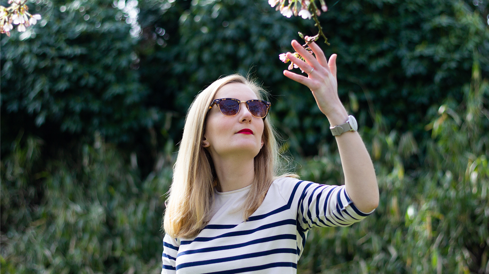
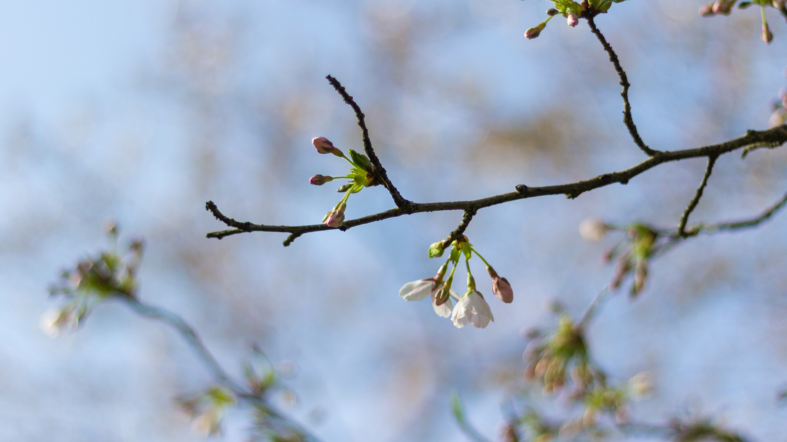

Il aura pris son temps, mais **le printemps** a enfin décidé de sortir le bout de son nez, et, avec, son lot de petits bonheurs.

• Ouvrir la chambre de fenêtre et faire rentrer l’air frais du matin.
• Rentrer à vélo du yoga sans lumières tant les jours rallongent, et rallongent encore !
• Mettre les gros manteaux d’hiver de côté et ressortir les vestes plus légères.
• Prendre le temps, le week-end, sur le balcon.
• Sourire bêtement en voyant le ciel bleu & le soleil au réveil.
• Manger des asperges.
• Planter des graines de radis et attendre le moment où je pourrais fièrement les manger.
• Aller au marché et acheter des bouquets de tulipes.
• Profiter de la luminosité. Toujours.

Rien que pour toutes ces petites choses, je pense que le printemps, avec l’automne (et l'hiver aussi lol) (et l’été quand même aussi), est l’une de mes saisons favorites.

---

Ici, le week-end dernier marquait vraiment l’arrivée de la nouvelle saison et des beaux jours. Il a fait une douceur incroyable qu’on se serait presque cru en été (l’été des Pays-Bas 😉 ). C’était le week-end parfait pour se faire une petite balade dans l’Amsterdamsebos et aller admirer les cerisiers en fleurs, que vous avions raté l’année dernière. C’est tout simplement magnifique. Nous avons eu la bonne idée d’y aller le matin et je n’ose imaginer la foule qu’il a pu y avoir l’après-midi ! C’est d'ailleurs devenu un évènement tellement important qu’ils appellent ça de “Cherry Blossom Festival”. Il y a une grande tente avec des festivités à l’intérieur et la plupart des gens viennent pic-niquer au milieu des arbres.

Nous avons aussi fait de nouveau quartier de notre balcon. Souvenez-vous [ici](balcon/), l’année dernière, je m’étais amusée à faire un petit avant/après. Quel bonheur de manger à nouveau sur notre petite table. Cette année, nous avons enlevé le brise-vue qui tirait un peu la gueule. À la place, nous allons poser un “[BalkonBar](https://balkonbar.com/)” et des suspensions pour faire pousser pleins de jolies petites plantes aromatiques et des fleurs. (edit: nous avons déjà le BalkonBar, il ne manque plus que la suspension -> photo ici ) En plus, la voisine a fait enlever son énorme arbre. Aussi triste que cela puisse être pour la faune qui l’habitait, nous avons désormais _beaucoup_ plus de lumière sur le balcon, et surtout plus longtemps ! On a toute de suite vu la différence dans la chambre. Tout de même, pour combler ce manque de végétation, nous avons acheté un petit paquet de graine spécial “........”. J’en ai planté une partie dans la grande jardinière. Cela met un certain temps à sortir. On verra bien ce que ça donne. J’en ai aussi profité pour faire un peu de jardinage (mamie Clémence). J’ai semé des radis, du basilic, de la menthe et de ciboulette ainsi que 2 graines de tournesols. Les radis sont déjà bien sortis et je dois désormais m’atteler à les éclaircir et/ou les repiquer. Le basilic et la menthe commencent eux aussi à sortir le bout de leur nez. Pour la ciboulette, on attend toujours 😉 Nous avions aussi ramené de notre week-end en France un **petit** plant de tomates cerises. Il a extrêmement bien grandi et fait pleins de petites fleurs, qui, normalement, laisseront place dans quelques semaines à de belles et bonnes tomates cerises. Pour l’instant, il reste à l’intérieur, dans le salon, mais j’ose espérer pouvoir le mettre d’avantage dehors au mois de mai.

<gallery>

</gallery>

---

C’est dingue de constater à quel point le changement de saison peut impacter notre humeur. Les gens sont globalement moins grognons. Plus souriant. Moi toute cette lumière et cette douceur, ça me donne des envies de tri. Alors je trie, je range. Les armoires, la penderie, les habits. Je mets de côté ce que je ne mets plus. Je ressors les petits hauts, je range les gros pulls. Je jette ce qui doit être jeté. C’est un peu comme si j’aérais ma tête et ça fait du bien.

💛
