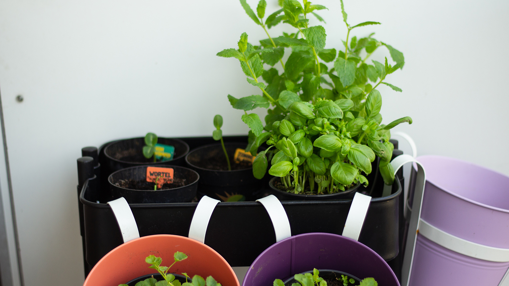

Il fait tellement beau en ce moment que je passe mes week-ends sur le balcon, alternant entre lecture, bronzette & jardinage. C’est d’ailleurs assez exceptionnel. Les températures sont dignes d’un beau mois de juillet mais malheureusement, la météo des prochains jours annoncent un retour de la fraîcheur et des nuages.

Lors de notre retour en France, nous avions profité de la voiture pour passer dans une jardinerie et faire le plein de terreaux, engrais et semis ! Les gelées se faisant désormais de plus en plus rare dans nos régions et les jours rallongeant, le printemps est la période idéale pour redonner vie à un balcon, une terrasse ou même un jardin pour les chanceux. C’est pour ma part ce que je me suis amusée à faire ces derniers week-ends et je me suis dit que je pourrais partager avec vous mes petites plantations, sait-on jamais si cela peut vous inspirer à faire la même chose ! 🙂

---

Changement notable cette année pour notre balcon : le gain de lumière. Souvenez-vous [ici](balcon/), une de nos voisines possédait un énorme if mesurant plus de 6 mètres de haut, qui abritait une partie de notre balcon à l’ombre, mais aussi du regard des voisins d’en face. Cette année, en février, elle a tenu à le faire enlever, ce qui a eu pour conséquence de doubler le temps d’ensoleillement de notre balcon ! En plus de cela, nous avons décidé d’enlever le brise-vu qui était bien abîmé par le temps, la pluie et le vent. Désormais, en ce moment, le balcon est ensoleillé de 7-8h, lorsque le soleil se lève et sort de derrière les bâtiments en face, jusqu’à presque 13h, ce qui est tout à fait correcte pour en profiter le matin en week-end et les plantes du balcon baignent dans d’avantage de lumière même en étant posée sur le sol.

---

## Les radis

J’ai ce souvenir d’enfance dans lequel je m’amusais à planter des graines de radis dans un pot dans le jardin et passais mon temps à les observer pousser chaque jour, jusqu’au moment venu où ils étaient fins prêts à être récoltés. Le plus drôle dans cette histoire, c’est que je n’aimais pas les radis quand j’étais petite. Je trouvais ça piquant et amère. Aujourd’hui, j’adore les radis, c’est frais et pétillant, mais je n’avais jamais retenté l’expérience d’en faire pousser moi-même, alors que c’est, selon moi, la chose la plus simple au monde.

Nous avons donc acheté des graines de radis Flamboyant 5, qui sont une espèce à développement rapide et facile et relativement peu piquante en goût. Je les ai semés mi-avril, environ 10-15 jours plus tard, ils sont déjà bien sortis et les fanes commencent à sortir. J’ai malheureusement fait une petite erreur lors du semis. J’ai semé les graines “à la volée” ce qui a eu pour conséquence de les disposer de manière TRÈS aléatoire. J’aurais dû les planter en rangs déjà espacés pour éviter de devoir “éclaircir” les plantes = en retirer beaucoup pour que chaque plant possède un espace suffisant a son développement. Autrement, le radis ne grossira jamais.

J’en ai repiqué certain dans les endroits où il n’y avait pas de graine. On verra bien ce que cela donnera. Il me reste encore pas mal de graines dans le sachet et je ferais certainement une seconde plantation après la récolte de celle-ci, en prenant, cette fois-ci, le soin de bien les espacer 🙂

---

## Le basilic & La menthe & La ciboulette.

Le must-have de tout balcon, terrasse et même appartement. Ces aromates se cultivent extrêmement bien en pot que ce soit en intérieur ou en extérieur. Chaque année nous avons au moins un pot de basilic et de menthe. Cette année, j’ai souhaité me challenger un peu en achetant non pas des pots, mais des graines, pour une culture 100% maison en me disant que cela prendrait juste un tout petit plus de temps, mais que ce serait tout autant gratifiant au moment d’utiliser du basilic pour un pesto maison ou de la menthe pour nos jus. (Pomme, Concombre, Citron & Menthe 👌 ).

Pour l’instant, la menthe et le basilic sont bien sortis. Ce dernier commence même à développer ses “vraies” feuilles. En ce qui concerne la ciboulette, soit j’ai fait un truc qu’il ne fallait pas, soit les graines étaient mauvaises, mais rien ne voit le jour encore. Je sais que cela peut prendre un certain temps à sortir alors je ne désespère point entièrement, mais je ne suis plus très convaincue.

Pour patienter, nous avons tout de même acheté un pot de basilic et de menthe histoire d’en profiter déjà 🙂

---

## Les tomates cerises

C’est une première pour moi. Le plant de tomates. Lorsque nous l’avons acheté, il mesurait à peine 30 cm de haut. Regardez maintenant ce que la “bête” est devenue après rempotage dans son pot définitif. Je ne prends pas le risque de la laisser dehors. Le pot reste bien au chaud dans le salon et baigne de lumière toute l’après-midi. J’ai tout de même espoir de pouvoir la mettre sur le balcon au mois de mai/juin, mais je ne suis pas encore sûre que cela soit une si bonne idée.

J’ai aussi planté des graines de basilic au pied de la tomate. Ce dernier une fois développé, donnera un meilleur goût aux tomates.
Le pied se développe vraiment bien et nous devons réfléchir à une solution pour tuteurer les branches avant que les tomates ne viennent les courber, et les casser, duent à leur poids. Certaines fleurs sont déjà tombées et nous pouvons désormais apercevoir de tous petits fruits encore bien vert. J’ai hâte ! _(Edit = nous avons ajouté un grand tuteur en bois de 1m50 et accroché certaines branches avec un peu de fil de coton. Le rendu est de suite meilleur, la plante fait moins “étalée”)_

---

## Concombre & Carotte & Tournesol

Chaque année, au moment de la période de printemps, Albert Heijn donne des petits pots contenant 1 à 3 graines d’un légume ou d’une fleur à semer dans le petit carreau de terreau fournis avec. Ils appellent cela Le “[moestuintjes](https://www.google.nl/search?q=moestuintjes&source=lnms&tbm=isch&sa=X&ved=0ahUKEwjF-omYtM7aAhXCZFAKHe6aB7IQ_AUICigB&biw=1440&bih=719)« . Côté graine, c’est un peu au petit bonheur la chance. Cette année, nous avons eu le droit à une graine de carotte, deux graines de tournesol, une graine de concombre et beaucoup de graines de tomates cerise. Je n’ai pas planté ces dernières, car comme vous avez pu le constater plus haut, niveau tomates cerises, on est déjà plutôt bien servis.

J'ai planté les autres par pure curiosité pour voir jusqu’où ces petites graines pouvaient aller. Je sais que les concombres sont gourmands en eau et prennent pas mal de la place. Quant à la carotte, si elle survit à ce premier rempotage, il faudra que je la rempote à nouveau dans un pot plus profond. En ce qui concerne le tournesol, je me fais moins de soucis. Je ne les laisse pour l’instant pas à l’extérieur en continu, mais seulement par temps chaud et beau (comme ce week-end par exemple). Autrement, je les rentre dans le salon et les pose prêt de la grande fenêtre. Voyons où cela nous mène. 🙂

---

## La jardinière de fleurs

Puisque l'if a été enlevé, ce balcon manque désormais cruellement de végétation. De plus, c’est tout un éco-système qui fut délogé et je suis sûre que de nombreux oiseaux ont dû se reloger. Pour remédier un peu à cela, nous avons trouvé [ce paquet de mélange de graines](http://www.gammvert.fr/2-1212-plantes-dexterieur/2-5006-graines-bulbes/3-1213-toutes-nos-graines/p-31521-prairie-fleurie-les-fleurs-de-lete-elegance-3m2) en jardinerie. C’est un mélange “prairie-fleurie” spécialement adapté pour les petits espaces et les jardinières. J’aurais aimé trouvé un mélange de fleurs mellifères mais j’ose espérer que celui-ci soit déjà bien pour les petits oiseaux et autres insectes. Le mélange est composé de 29 espèces différentes, avec parmi elle, du millefeuille, de la centaurée naine ou encore des petites pâquerettes. Ce mélange ne demande normalement que très peu d’entretient et peut même fleurir à nouveau au printemps prochain.

La pousse est longue. Il faut au moins attendre 8 semaines avant de voir les premières floraisons. Ensuite, celle-ci devrait s’étaler sur 3-4 mois. C’est pourquoi, si l’idée vous plaît, je vous conseille de ne pas trop tarder pour les planter, au risque de devoir attendre l’année prochaine pour les voir sortir et fleurir !

---

Le balcon reste malgré tout assez vide, mais il ne faut être trop gourmand d’un coup. Petit à petit, il deviendra plus fleuri et verdoyant. Dans un futur plus ou moins proche, j’aimerais investir dans un second Balcon pour poser d’avantage de jardinières fleuries et pourquoi les suspensions à trous pour y disposer pleins d’aromates et pourquoi pas aussi des plants de fraisiers ! _Miam_ ! En matière de fleurs, j’aimerais bien avoir de la lavande en pot, histoire d’avoir un petit coin de Provence sur le balcon ! J’adorerais aussi réussir à avoir un bougainvillier. J’aime tellement cette plante aux belles fleurs rose-magenta. Pourquoi pas aussi des petites campanules et quelques marguerites. Nous en avions l’année dernière, mais malheureusement, je n’ai pas eu le réflexe de les rentrer en fin d’automne, du coup, elles n’ont pas franchement survécues à l’hiver ... Que voulez-vous, on apprend en faisant 😉 D’ailleurs, je suis loin d’avoir la main très verte. J’essaie et j’apprends surtout de mes erreurs. Pour l’instant, mes plantations de cette année se portent plutôt bien. Aussi, comme tous les conseils sont bons à prendre, sentez-vous libre de les partager en commentaires 😉

On se retrouve d’ici plusieurs semaines pour suivre l’avancée des récoltes ? 😉
