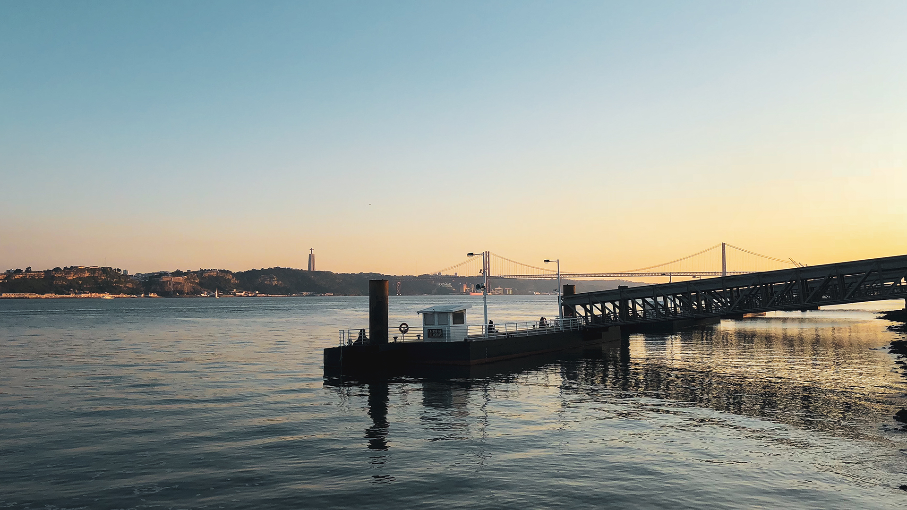
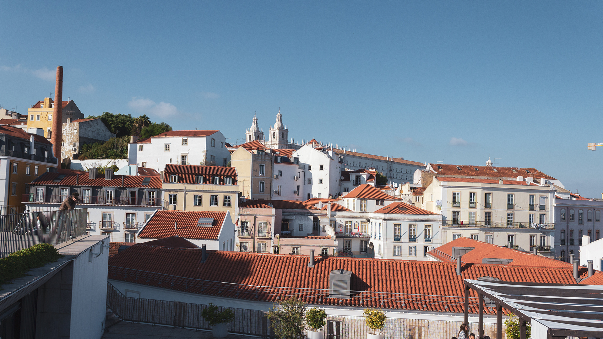
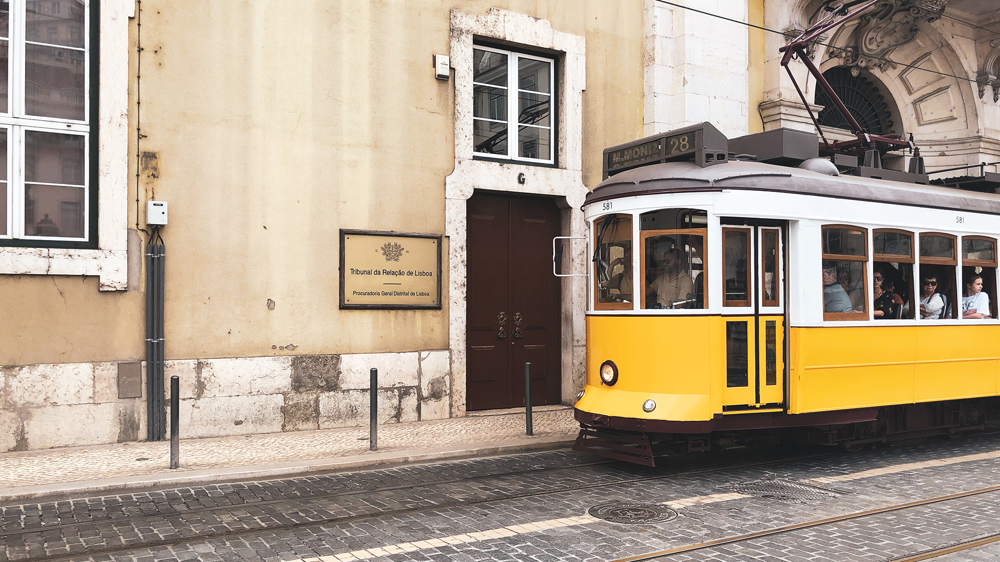
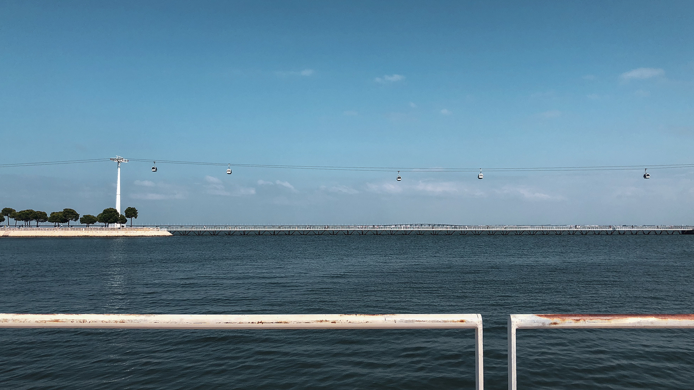

**Bom dia!**

Il y a à peine une semaine de cela, Alexis et moi sommes allés visiter la belle **Lisbonne** pendant 4 petits jours. Une première pour Alexis. Une troisième pour ma part. J’étais tellement heureusement quant à l’idée de lui faire découvrir cette ville et un peu de ce pays, cette culture qui représente finalement beaucoup pour moi.

## Jour 1 - Boa Tarde Lisboa

Pour pouvoir en profiter sans trop courir, nous avons décidé de prolonger le week-end, en restant 2 jours de plus sur place. Nous quittons Amsterdam le samedi après-midi sous une grosse chaleur et arrivons sur place aux alentours de 18h. Un taxi nous attendait à l’arrivée, ce qui fut très pratique pour rejoindre notre hôtel.

Il fait relativement beau, bien qu’un peu frais. Pour cette première soirée sur place, nous n’avions rien de prévu en particulier, c’est pourquoi nous décidons de nous rendre vers les quais du Tage qui se situent environ 10-15 min à pied depuis l’hôtel. Nous profitons du coucher de soleil pour marcher de long du Tage en direction de la “Praça do Comércio”, la fameuse place du commerce de Lisbonne. C’est dommage, une partie de l’arche est en rénovation, mais cela reste malgré tout une très belle et grande place. Cela fait à peine quelques heures que nous sommes ici, je m’émerveille déjà sur la beauté et la couleur des bâtiments. Sur la place, les immeubles attenants sont d’un jaune éclatant ! J’admire aussi les rues pavées, la calçada portuguesa, symbole fort de la ville.

Véritable symbole dans la culture portugaise, je ne vous apprendrais rien en disant que le football est une institution ici ! Il se trouve que ce soir-là, c’est la finale de la Coupe de la Ligue. LA coupe la plus prestigieuse dans le monde du football. Et devinez qui jouait. Real de Madrid contre Liverpool avec bien entendu le chouchou portugais Cristiano Ronaldo. C’était la fête dans la rue : des écrans dans tous les bar et des restaurant tous très remplis ! C’était une drôle d’ambiance, franchement authentique ! (Ps : pour ceux du fond, oui le Réal a gagné).

<gallery>

</gallery>

## Jour 2 - Lisbonne en long, en large et en travers

Pour cette seconde journée, nous décidons de nous lever tôt afin de profiter au maximum du beau temps, les jours suivant étant annoncés gris et pluvieux.

---

Nous sortons de l’hôtel aux alentours de 9h et commençons notre ballade, sans vraiment trop savoir où nous allons, nous errons au hasard du fil des rues. Nous remontons dans le Bairro Alto, admirons la vue depuis Miradouro de São Pedro de Alcântara, puis redescendons en direction de la Praça Dom Pedro IV, aussi connu sous le nom de place du Rossio, en passant la ligne de “l'ascenseur Gloria”. Ces fameuses lignes de funiculaires qui font l'image de la capitale, permettent donc de gravir les rues en pente, sans trop se fatiguer. Aussi surnommée la ville aux 7 collines, Lisbonne est une ville où ça monte et ça descend ! Concrètement, ça change d’Amsterdam et je ne m’aventurerais pas à faire du vélo ici 😉

Nous nous dirigeons ensuite vers le très fameux ascenseur de Santa Justa (oui encore un autre ascenceur !) Santa Justa est un ascenseur en fer forgé datant du début du XXe siècle, permettant de relier la Baixa pombalina au Bairro Alto. Il fut conçu par Raoul Mesnier du Ponsard et, contrairement à la croyance populaire, n’a aucun lien avec Gustave Eiffel. À notre arrivée, 1h de queue est annoncé pour monter. Je tire un peu la tête car je n’ai franchement pas envie de perdre mon temps à attendre. Un jeune homme nous voyant douter, nous aborde et nous explique qu’il est possible de prendre un autre ascenseur caché, gratuit, nous permettant de rejoindre la plateforme. De là, il est ensuite possible de monter sur le belvédère, accessible par un escalier en colimaçon, pour 2 euros seulement. Nous le remercions car c’est une super astuce nous permettant de gagner du temps (aucune d’attente) et de l’argent (4 euros dépensés au lieu de 10 !) Alors, c’est sûre, l’expérience de l’ascenseur d’époque n’est pas là, mais j’étais d’avantage intéressée par la vue que par la montée pour être honnête. La vue est magnifique. Une Vision 360 degré sur la capital portugaise : le château de Saint-Georges, la place du Rossio, la Baixa, le Tage et le couvent des Carmes, entre autre!

C’est vers ce dernier que nous décidons d’aller. Malheureusement, le couvent est fermé le dimanche. Pas de bol, nous reviendrons donc demain. Nous nous dirigeons donc vers le château, situé sur la colline en face. Nous traversons la Baixa, la ville basse, qui fut complètement détruite par le tremblement de terre de Lisbonne de 1755. Sa planification urbaine, un quadrillage de rues et des bâtiments semblables, est dus au marquis de Pombal. Le quartier, aujourd’hui en pleine réhabilitation urbaine, est le plus grand quartier commercial de Lisbonne.

Nous déambulons au gré des ruelles et des Azujelos. Les rues sont quasiment désertes. La ville nous appartient, un peu. Et soudain, une mer de gens. Nous voilà arrivés au Castelo de São Jorge. L’entrée n’est pas donnée mais le belvédère est très beau. Nous avons une vue directe sur le Pont du 25 avril et la statue du Christ. On se demande si nous ne sommes pas à San Francisco ou bien même Rio 😉 Ce n’est pas qu’une impression. Le Ponte 25 de Abril est bien jumeau du Golden Gate puisque conçu par le même architecte en 1966, pour relier Lisbonne avec la péninsule de Setúbal à travers le Tage. Anciennement connu sous le nom de pont Salazar, il a été rebaptisé après la Révolution des Œillets, qui le 25 Avril 1974, a pris fin à la dictature!

Nous redescendons vers la ville basse en passant le quartier de l’Alfama. C'est dans ce quartier pittoresques, aux rues étroites qu’est né le fado. Nombreux restaurant et café du quartier propose ainsi de venir, le soir, écouter ce style musical portugais, très souvent autour d'un verre de vin.

Pour terminer cette journée, nous prenons un bus nous amenant vers le Parque Das Nações, anciennement Zona de Intervenção da Expo (« Zone d’intervention de l'Expo »), le quartier de Lisbonne où s'est tenue l'Exposition internationale de 1998 sur le thème « les océans, un patrimoine pour le futur ». Le voyage en bus n’est pas des plus sexy ... Nous longeons de longues zones industrielles avant d’arriver dans une zone résolument moderne. Nous nous baladons le long du Tage avant de rentrer en métro jusqu’à la place Martim Moniz, lieu de départ pour monter dans le fameux Tram 28. Malheureusement, une partie de la ligne est en travaux. Nous décidons donc de faire le trajet à pied, tout simplement, et c’était une super idée !

<gallery>

</gallery>

---

Avec Alexis, comme à chaque fois que nous visitons un endroit inconnu, nous aimons parcourir la ville de long en large, pour ressentir son atmosphère, découvrir ses petits recoins, admirer ses couleurs, écouter ses habitants. Après ces deux journées sur place, Lisbonne ne m’a pas déçue. Les peintures qui s’écaillent, les rues un peu cabossées, les azulejos, les trams, et les petits vieux croisés dans les ruelles se mêlent à une jeunesse lisboète en quête de renouveau et donnent à cette capitale un charme fou. J’ai particulièrement aimé l’Alfama, bien sûr, quartier ancien en pente raide, marqué de dizaines d’escaliers et de chemins tarabiscotés. Et, au-delà de certaines places très touristique (comme dans de nombreuses capitales), Lisbonne en vaut vraiment la peine ; j’ai déjà la ferme intention d’y retourner une prochaine fois, c’est certain !

À très vite, pour la suite de nos aventures lisboètes !

---

_Avez-vous déjà visité Lisbonne ?_
