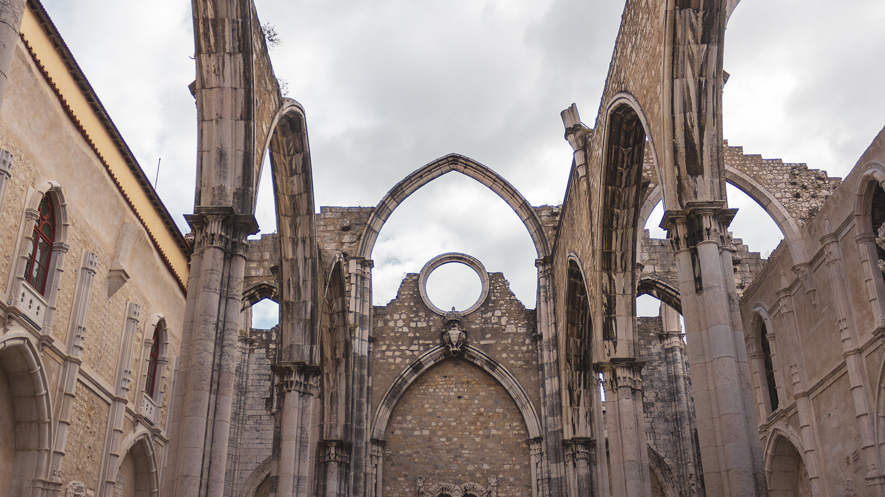
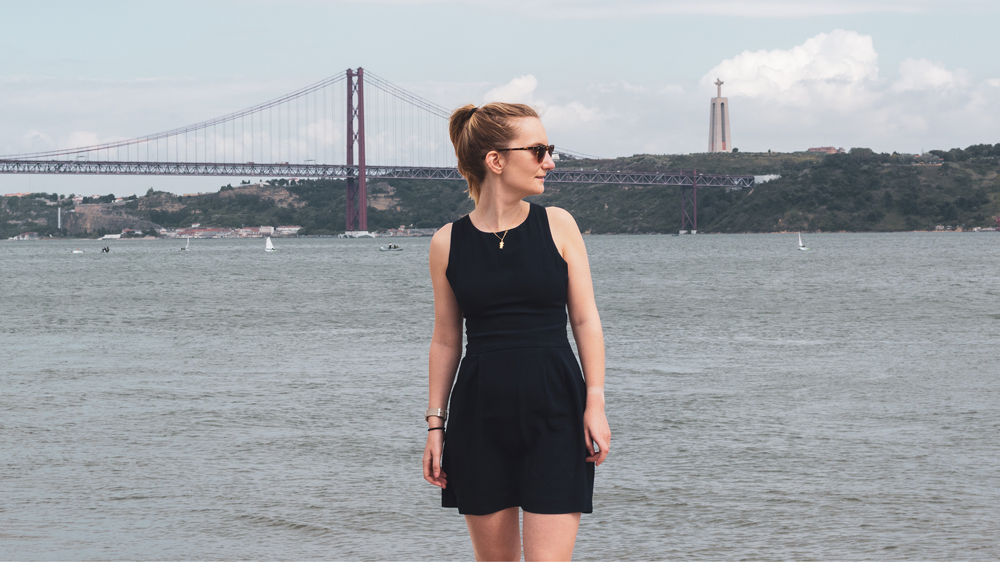
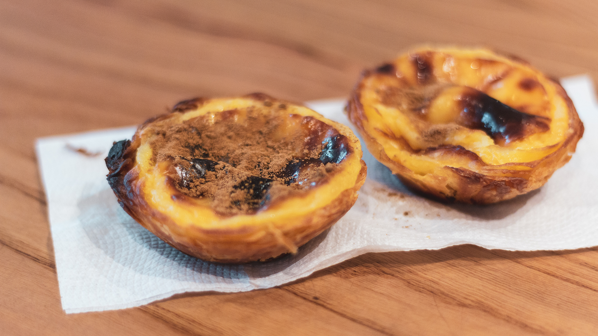
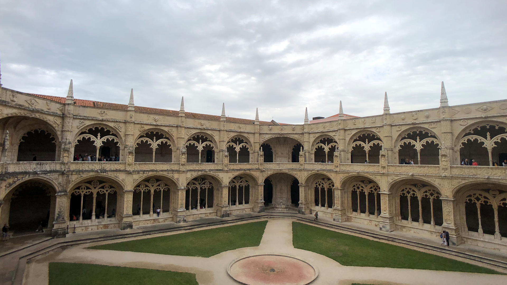
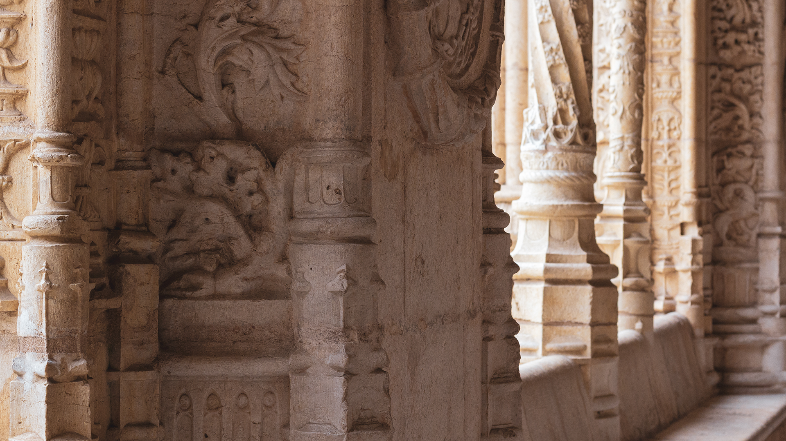
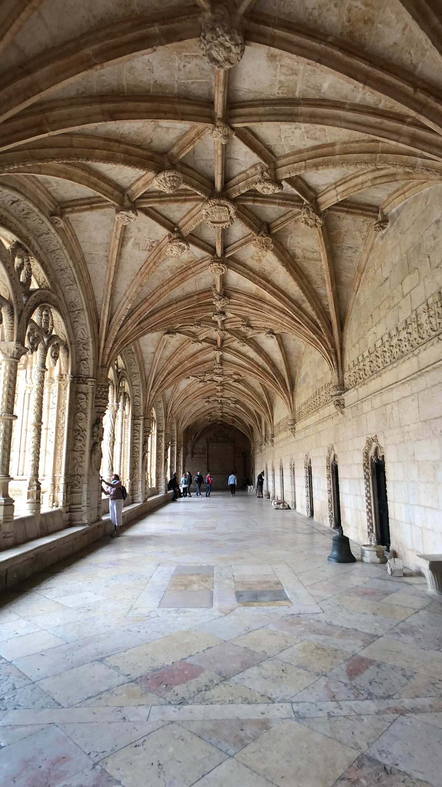

Je vous retrouve aujourd'hui pour la suite et la fin de nos aventures en territoire lisboète.

Pour retrouver la première partie de notre long week-end rdv [ici](lisboa-meu-amor/).

## Jour 3 - Le beau Belém

Après un dimanche magnifique à nous balader dans les ruelles, d'une colline à une autre, nous décidons de nous rendre dans le beau Belém quartier situé à l'extrême ouest de Lisbonne, situé au bout de l'estuaire du Tage. C'est depuis ces quais que partaient les navigateurs-explorateurs.

Mais avant cela, nous commençons avec la visite du Couvent des Carmes que nous n’avions pu voir la veille. Ces ruines sont ce qu’il reste de la plus grande église gothique de Lisbonne, après le destructeur tremblement de terre en 1755. Les ruines sont impressionnantes.Les lignes verticales sont imposantes. C'est spectaculaire de voir à quel point les arcs boutant ont su résister dans le temps malgré le tremblement de terre. C’est d'ailleurs intentionnellement que les autorités portugaises décidèrent de ne pas procéder à la reconstruction de l’Église du Carmo. Elle reste ainsi un témoignage majeur de cette terrible catastrophe, rappelant à tous les forces de la nature et la fragilité de la condition humaine. Ayant pour seule toiture la voûte céleste, cette église est aujourd'hui le théâtre de nombreux concerts et événements de musique classique, dont le e corps principal de l'église et le chœur abrite un petit musée d'archéologie.

Le tram 15 nous amène à Belém, longe de fleuve et passes sous le joli pont du 25 avril. Belém est connu pour ses nombreux monuments anciens, dont la tour de Belém et le monastère des Hiéronymites, un des plus beaux monuments de Lisbonne et des plus touristiques. C'est d'ailleurs ce dernier que je souhaitais voir le plus, ayant déjà vu la tour de Belém en 2004. Malheureusement, manque de bol ... le monastère est fermé le lundi. D'un point de vue organisation, on n'est vraiment pas au point sur ce coup-là.

Malgré un ciel gris et bien couvert, nous nous dirigeons vers le monument aux Découvertes. Le Padrão dos Descobrimentos est un monument érigé à la mémoire des navigateurs portugais des XVe et XVIe siècles et du prince Henri le Navigateur. Au sol, est représentée une géante rose des vents. Nous longeons les quais jusqu'à la fameuse Torre de Belém, ancienne tour de garde sur le Tage. Et voilà qu'il se met à bruiner. N'ayant emporté aucun vêtement de pluie dans la valise, je dois dire que la météo me met légèrement de mauvaise humeur (en plus, quand on sait qu'il fait actuellement 30 degrés sur Amsterdam, le monde à l'envers !).

Pour nous réconforter et nous réchauffer, nous faisons demi-tour en direction du magasin de Pasteis de Belém, histoire de goûter et de savoir par nous-même si ce sont vraiment les meilleurs Pasteis de Lisbonne. Nous en avions acheté la veille ailleurs pour avoir un point de comparaison. Franchement, y'a pas à dire, ils sont vraiment excellents. Une pate feuilleté croustillante et caramélisée, une crème onctueuse, encore un peu tiède. C'est délicieux !

La pause était bienvenue et le ciel se dégage à nouveau. C'est le moment parfait pour aller flâner dans dans les jardins Botaniques Tropical, se situant à quelques mètres de cela. Le jardin est très agréable et compte un lots de jolie fleurs et magnifiques palmiers. Cette oasis de verdure, très calme, est un petit bijou caché, endroit parfait pour faire une pause, non loin de la foule déchainer, et déguster 1 ou 2 pasteis, sous les doux rayons du soleil.

Malheureusement, le vent reste assez frais et nous commençons à avoir froid. Pour terminer cette journée moins épuisante que la veille, nous nous offrons un bon repas au restaurant « [Porter](http://www.corposantohotel.com/restaurante-bar) » proposant des spécialité portugaises dans un style « bistronomie ». Bachalau pour moi, entrecôte pour Alexis. Un verre de Vinho Verde pour accompagner cela. C'était excellent !

<gallery>

</gallery>

## Jour 4 - Sintra, ou pas.

Pour ce dernier jour, nous essayons de nous lever assez tôt, histoire de profiter a maximum de cette journée, avant le retour en avion sur Amsterdam le soir. Au programme, Monastère des Hiéronymites et escapade à Sintra pour la visite des châteaux. Côté météo, ce n'est pas jojo, mais au mois, il ne pleut pas !

Nous sommes lundis, et dans le tram, les touristes se mêlent aux travailleurs. Arrivés au monastère, c'est une file d'attente longue de plus de 200m qui nous attend. Pour le coup, nous sommes sûre que le monument est bien ouvert ! C'est après plus d'1h et 30 minutes de queue que nous accédons finalement à l'intérieur du bâtiment.

Classé au patrimoine mondial de l’UNESCO, le Monastère des Hiéronymites est un édifice à l’architecture exceptionnelle ; il est, avec la Tour de Belém, l'un des plus beaux monuments architecturaux au style manuélin. Il fut construit pour commémorer le retour d’Inde de Vasco de Gama. Le cloître du monastère est magnifique. Chaque colonne est ornée de nombreux détails. La vue centrale est parfaitement symétrique. Dans les couloirs latéraux, on se croirait presque à Poudlard. N'est-ce pas Harry que j'aperçois au loin ? 😉 C'est très impressionnant. L'église du Monastère est elle aussi très impressionnantes. On y trouve d'ailleurs les tombes de Vasco de Gama et de Luís de Camões, deux grands noms de l'histoire du Portugal.

Nous ressortons après 1h de visite environ et décidons malgré tout de nous rendre à Sintra. Ce n'était malheureusement pas la meilleure idée du monde, car une fois arrivés sur place, après 40min, nous n'avons pas trop su nous décider entre monter à pied aux châteaux (1h de marche environ) ou attendre un potentiel bus, si tel est bien que nous avons finalement rebroussé à mi-chemin pour rentrer sur la capitale.  C'est dommage, car j'avais un super souvenir du Palais de la Pena et des jardins environnements et j'avais vraiment envie de faire découvrir cela à Alexis.

De retour sur Lisbonne et après une pause repas méritée, nous nous dirigeons vers l'aéroport. Cela valait bien la peine de se dépêcher, notre avion est retardé dus aux violents orages sur Amsterdam. Décidément, on est vraiment pas chanceux niveau météo (ou bien, l'aéroport d'Amsterdam ne sait pas gérer les changements de météo extrêmes !). Souvenez-vous de notre [week-end raccourcis à Londres](londres/), en décembre dernier ...  Le retour au travail le lendemain ne fut pas des plus faciles ; heureusement qu’il n'y avait que 3 jours avant le week-end, à nouveau.

<gallery>

</gallery>

---

C'est dommage que la météo ne fût pas au beau fixe, mais cela ne nous a pas empêché d'apprécier la ville à sa juste valeur. Ce n'est pas certainement pas la dernière fois que je verrais Lisbonne. La mésaventure de Sintra est déjà à elle seule une belle raison de revenir. Je rêve encore de la capitale lisboète et de tous ces bons petits plats Portugais. J'aime tellement l'ambiance qui se dégage de cette ville. On se rend vite compte aussi que c'est une ville en pleine mutation, nombreux sont les bâtiments abandonnés en reconstructions. On espère cependant que la ville ne perdra pas de son atmosphère si douce, où l'y fait bon vivre.

---

On se retrouve très vite pour un dernier billet portugais dans lequel je vous partagerais toutes nos bonnes adresses de ce long week-end ainsi que quelques astuces pour profiter au maximum de votre séjour 🙂
