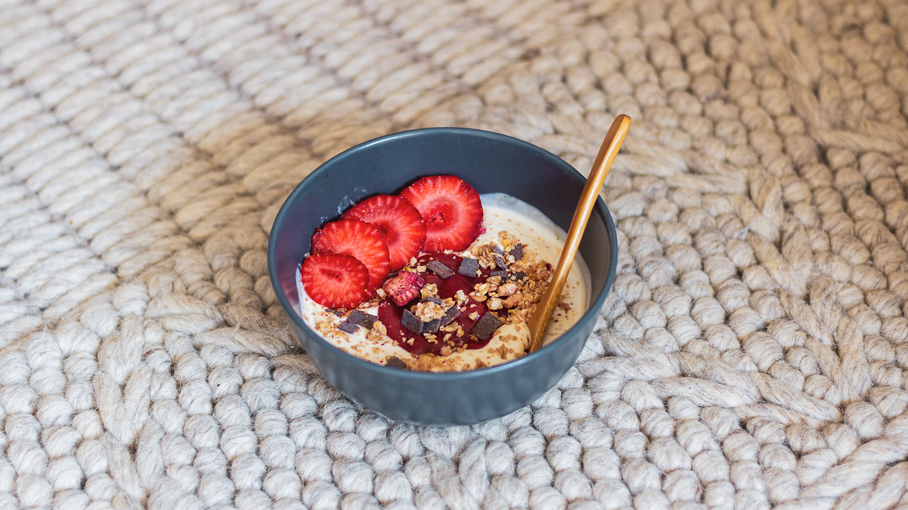

Bonjour vous ! Nous voici déjà dans un mois de juin bien entamé, mais quel joli mois de mai nous avons eu ! Pas de pluie, de la douceur, de la chaleur même et pleins de belles journées ensoleillées. C’est définitivement le meilleur mois selon moi pour visiter les Pays-Bas. Le joli mois de mai marque le retour des délicieux fruits d’été. Et, **la Rhubarbe**. Ce légume souvent confondu avec un fruit, revient sur les étales dès le mois d’avril avant de disparaître à nouveau vers la fin du mois de juillet. Alors, au mois de mai, j’en ai profité pour tester des nouvelles recettes toute simple à base d’une compote de fraises - rhubarbe maison, que je viens partager avec vous aujourd’hui !

### Compote maison de Fraise - Rhubarbe

Pour réaliser cette compote, il n’y a rien de plus simple. Moitié de rhubarbe, moitié de fraise. (300g de chaque environ). Pour plus de gourmandise, j’ai parfois ajouté des framboises fraiches ou congelées. Pour la rhubarbe, je la coupe en gros cube, verse 2 cuillères à café de sucre de coco et les laisse dégorger une petite heure dans une passoire. Une fois la rhubarbe prête, je verse tous les fruits dans une casserole et je laisse compoter le tout, sans même ajouter de sucre. Enfin, pour une compote ultra lisse, je verse dans le blender et mixe 30 seconde environ. Voilà, c’est prêt !

### 

### Tarte façon crumble à la compote maison de Fraise - Rhubarbe

Voici un dessert 100% fait maison et 100% fait maison ! De la pâte jusqu'à la compote. Alors, ça prend forcément un peu plus de temps que d’utiliser une pâte toute prête, mais le plaisir de manger ce dessert n’en est que meilleur ! Pour la recette de base, je me suis inspirée de [celle-ci](https://lacuisinedelaetitia.wordpress.com/2015/06/10/tarte-crumble-aux-fraise-et-rhubarbe/), simplement, j’ai remplacé la farine de blé par de la farine d’épeautre. Une fois la pâte prête et étalée, j’étale une belle dose de compote, émietté de crumble et enfourne le tout pour 20-30 min. Ça sentait tellement bon dans la cuisine !

Et très franchement, la tarte est aussi belle que bonne. L'association fraise-rhubarbe est parfaite. C’était un vrai régale et je ne regrette pas d’avoir passer du temps en cuisine pour la préparer.

### 

### Panna Cotta Vanille et coulis de compote

Une autre idée de dessert super facile à faire et quasiment inratable : le panna cotta. Il faut juste être un peu patient que la crème prenne avec la gélatine. J’ai modifié la recette traditionnel en remplacer la crème et le lait de vache par de la crème de soja et du lait de coco / amande.
Pour 4 ramequin, la réalisation est très simple : 1. faire bouillir 20cl de crème avec le lait de coco, 60g de sucre de coco et 2-3 feuilles de gélatine. 2. Verser le mélange dans des ramequins et mettre au frigo une fois tiède au minimum 4 heures.
Au moment de servir, ajouter de la compote de rhubarbe sur le dessus ainsi que quelques fraises et des feuilles de basilic fraiches.

Un dessert frais, pas trop sucré et très gourmand.

### Fromage blanc, granola et compote de fraise-rhubarbe

Enfin, s’il vous reste de la compote de rhubarbe, vous pouvez très simplement la mélanger avec du fromage blanc et de vous créer de délicieux bowl de granola. Cela aura été mon petit-déjeuner pendant plusieurs jours et c’était un régal à chaque fois.
Il existe plein de déclinaisons possibles : banane, fruits sec, fromage blanc, yaourt de soja, fraises, framboise, chocolats. À vous d’être créatif 😉

---

Voilà déjà trois fois que je fais cette recette de compote fraise-rhubarbe et je ne m'en lasse pas du tout. Je compte bien en refaire d'ici la fin du mois de juin avant de jeter mon dévolu sur les pêches, les abricots et les cerises ! **♥**
