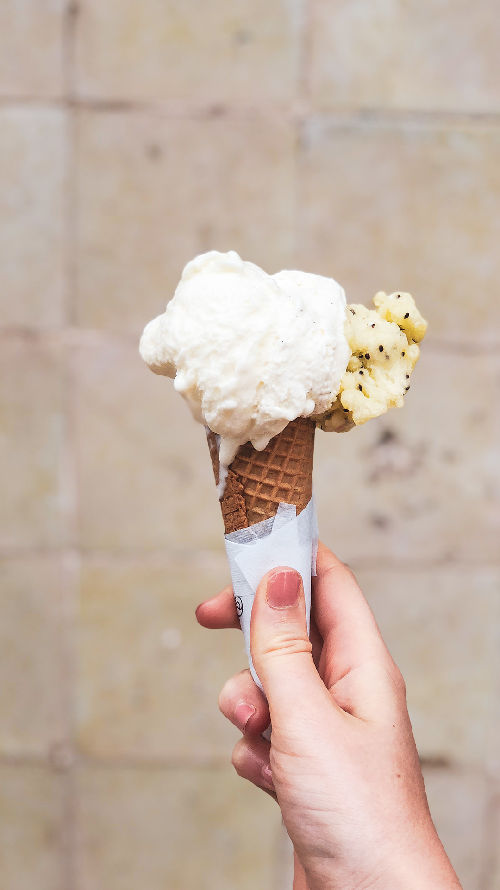
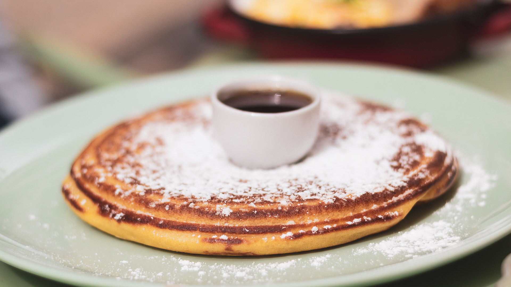
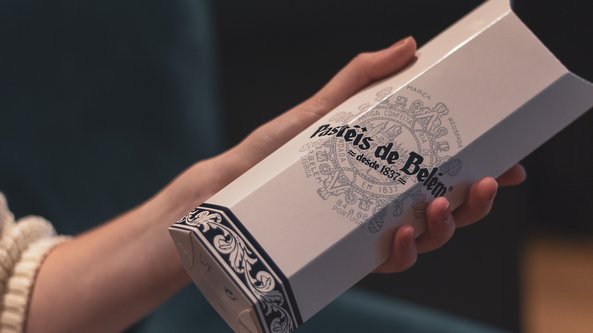
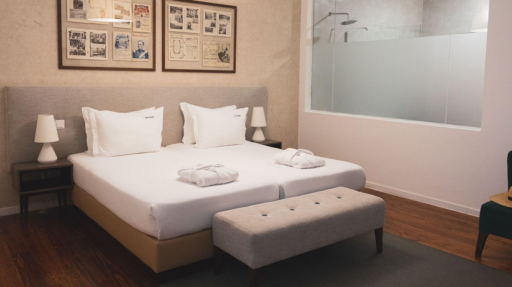

Bom dia!

J’espère que les photos de notre long week-end à Lisbonne vous auront donné envie de découvrir cette si jolie capitale. Pour ceux qui les auraient manquées, retrouvé la [partie 1 ici](lisboa-meu-amor/) et [partie 2 là](lisbonne-2-de-calme-et-de-pasteis-de-nata/) de ce joli week-end. Et si les photos ne vous ont pas totalement convaincues ou bien si vous êtes un fana de l’organisation, voici aujourd’hui un article dans lequel je vous partage une liste de bonnes adresses et de quelques astuces histoire que votre séjour soit aussi chouette que le notre, la belle météo en plus 😉

## Où manger

**• [Time Out Market](http://www.timeoutmarket.com/)**
En bas du Bairro Alto, à quelques minutes à pied de la Praça Do Comercio, se trouve le Mercado Da Ribeira. Rénovées récemment, ces grandes halles sont un temple de la nourriture et cuisine portugaise. D’un côté, vous trouverez un grand marché ouvert chaque matin où les Lisboètes viennent y acheter leurs fruits, légumes et poisson frais ! De l'autre, une grande “cantine” huppée regroupant plus de 30 restaurants différent, certains étant même signés par les plus importants chefs portugais. Mélangeant moderne et traditionnel, vous y trouvera tous, en passant de la gastronomie portugaise à la pizza et autres cuisines du monde (thaïe, japonaise, française). Pour ceux qui connaissent, c’est l’équivalent des FoodHallen à Amsterdam et actuellement The place to Be pour manger dans la capitale !

Nous y avons diné un soir et nous vous conseillons de ne pas arriver trop tard ou bien de venir en semaine, au risque de ne pas trouver de place pour s’asseoir. Au menu, des plats 100% portugais, pour mon plus grand plaisir : arroz de pat (riz au canard), sardines grillées mon amour et pastis de Nata de chew Mantegaria. C’était excellent et nous vous le conseillons vivement !

**• Pour une bonne Glace - [Gelato Davvero](https://www.gelatodavvero.com/)**
Les journées chaudes sont faites pour manger de bonnes glaces. Pour en déguster des bien délicieuses, rdv chez Gelato Davvero. Ce glacier, dont le nom signifie en italien “vraie glace” possède plusieurs adresses dans la capitale. Et lorsque vous entrez, c’est exactement ce que vous trouvez, des glaces confectionnées à la mode romaine, avec des techniques artisanales de production. Chez Davvero, les glaces sont servies comme à Rome, avec une spatule et non pas avec l’habituelle cuillère à glace. Parmi les parfums au sommaire : noix, cacahuètes, biscuits, chocolat-menthe, chocolat-orange, chocolat, , fragola (fraise), kibana (banane-kiwi) et nocciola (noisette), tous étant élaborés à partir d’ingrédients naturels et fruits de la saison, sans ajout de colorants ni de conservateurs.

Je suis personnellement reste dans les classiques en choisissant un cornet 3 saveurs vanille, kiwi-banane et “crème”. Alexis a vu triple en choisissant le maxi cornet 5 saveurs. Je crois que la photo se passe de tout commentaire. C’était franchement drôle et surtout très bon 😉

**•  Bruncher en plein coeur do Baixa do Chiado chez [Nicolau Lisbonne](http://www.ilovenicolau.com/fr/)**
Pour un bon brunch ou tout simplement une pause gouté en plein coeur de Lisbonne, vous pouvez vous rendre chez Nicolau Lisbonne. La déco intérieure est vraiment chouette, mais s'il fait beau, demandez à être installé dehors sur la petite terrasse. Repéré grâce à mon réseau social préféré Instagram, ce lieu branché sert pleins de bonnes gourmandises toutes plus ou moins healthy: pancakes, banana bread, avocado toast, milk shake, smoothie, acaï bowl...

Je pense que les photos parlent d’elles-mêmes, c’était délicieux. L’acaï bowl était très frais, je recommande, et les pancake sont géant ! À tester sans hésiter !

<gallery>

</gallery>

**[• Pasteis de Belem](http://pasteisdebelem.pt/fr/)**
Impossible de visiter Lisbonne, sans goûter la pâtisserie traditionnelle locale, le Pasteis de Belém ou Pasteis de Nata, comprendre “petite tarte à la crème”. Un équivalent français serait la tarte au flan, mais en fait non, c’est complètement different et 100 fois meilleur! Pour déguster les meilleurs de la capitale, rdv à Belem, à Pasteis de Belém. Cette boutique confectionne et sert les Pasteis de Belém depuis 1837, d’après une ancienne recette du Monastère des Hiéronymites, et toujours dans les mêmes procédés artisanaux.

Nous avons comparé et je peux vous le dire, ce sont vraiment les meilleurs de la capitale ; leur pâte feuilletée croustillante et caramélisée, la crème encore tiède et fondante. Miam, j'en re-demande ! Foncez les yeux fermés, demandez un pack de 6 et allez les déguster aux calme, un peu plus haut, dans le jardin Tropical, à quelques minutes de là à pied.

<gallery>

</gallery>

**• [Segundo Muelle](http://www.segundomuelle.com/portugalsite/index.html)**
Excellent restaurant pour diner le soir.

En descendant vers les quais, nous l’avions repéré grâce à son intérieur moderne et élégant et une carte très appétissante. Le Segundo Muelle est un “bistro” proposant une cuisine mixe entre les spécialités portugaises et péruviennes. Étonnant et intriguant mélange, cela donne des plats dépaysant, savoureux et raffinés. Ce fut un vrai plaisir de découvrir ces recettes inédites : Risotto aux crevettes et safran pour ma part, pièce de viande accompagnée de linguine crémeuse pour monsieur ! En plus de cela, le service fut rapide et la personne s’occupant de notre table, très attentionné. Ce fut un vrai régal !

**• [Bar Porter](http://www.corposantohotel.com/restaurante-bar)**
Découvert en flânant dans les rues de Lisbonne, nous avons mangé au Bar Porter le dernier soir de notre week-end. Lundi soir, le cadre était chic, agréable et surtout très calme. Le service, impeccable, est fait par un serveur attentionné, parlant un anglais parfait. La carte, restreinte, se veut cuisine gastronomique, mais avec des prix franchement raisonnable. Nous avons gouté au bacalhau (Lisbonne oblige !), la pièce de viande entrecôte, le panacotta et la mousse au chocolat. Tout était délicieux. En accompagnant, nous avons gouté un excellent Vinho Verde recommandé par le serveur : un Quinta do Ameal Loureiro de 2016. Recommandation parfaite, le vin était excellent !

## Où dormir

**• [Feels like home - Bica](http://www.feelslikehomeprimesuites.com/)**
Pour ce long week-end de 4 jours dans la capitale portugaise, nous avons séjourné 3 nuits à l’hôtel Feels Like Home Prima Suites Bica.

Nous étions dans la suite numéro 1, au rez-de-chaussée. La chambre est extrêmement spacieuse, ainsi que la salle de bain, qui possède une très grande douche. Les lits étaient très confortables. Le seul défaut serait le bruit extérieur la nuit, car proche d'une rue et d'un quartier très animé le soir. Il y a aussi une petite terrasse intérieur très calme, accessible toutes la journée. La décoration est simple mais très belle ! Enfin, l’hôtel met à disposition, dans le salon, en continue du thé / café / eau ainsi que du gâteau fait maison, parfait si vous avez envie d’une petite gourmandise.

Le petit-déjeuner (très important le petit-déjeuner !) propose un choix relativement restreint comparé à d’autre hôtel mais tout est extrêmement bon et cela est finalement très copieux. Mention spéciale pour les fruits frais coupés et particulièrement le melon portugais ! Petit conseil, venez prendre votre petit-déjeuner dès 8h pour vous sentir comme chez vous, au calme 😉

L’hôtel est très bien situé : juste au sud du Bairro Alto et à quelques minutes à pied du métro Baixa Chiado. Tout peut se faire à pied depuis l’hôtel, c’est extrêmement pratique ! À notre arrivée, l’hôtel nous a proposé d’organiser un service de taxi depuis l’aéroport pour 30 euros. Ce fut très pratique, surtout avec les valises ! Le personnel fut d’ailleurs très accueillant.

Bref, nous recommandons chaudement cet hotel discret mais charmant, en plein coeur de Lisbonne. **Bénéficier de 10%** sur votre séjour en réservant sur booking via [ce lien](https://www.booking.com/s/35_6/clem0t46).

<gallery>

</gallery>

---

Pour les plus fanas de AirBnb, nous n’avons malheureusement aucune recommandation à vous partager pour l’instant, mais n’hésitez pas à [cliquer ici](http://www.airbnb.fr/c/ctaillez1) pour gagner **25 euros de crédit** sur votre premier voyage !

## Bon à savoir

**• Ticket de transport / métro**
La ville se visite en majeur partie à pied mais parfois, le tram ou le métro est bien pratique pour se rendre à Belem ou bien au Parque Das Nacoes. De plus, Lisbonne est une ville très bien desservie par son réseau de transports en commun. Ses métros, ses tramways, ses bus, ses funiculaires ont en plus l’avantage d’être peu coûteux.

Pour vos déplacements sur le réseau de transport en commun, nous vous conseillons d’acheter des cartes individuelles rechargeables « Viva viagem » valables un an, que l’on peut acheter aux stations de métro dans le centre-ville (au prix de 0,50 €), mais aussi à la station de métro de l’aéroport « Aeroporto ». Vous pouvez les acheter à une borne automatique, à un guichet du métro ou bien dans les différents points de vente de la Carris. Les cartes individuelles rechargeables « Viva viagem » et « 7 Colinas » sont équivalentes et possèdent la même utilité et les mêmes fonctions. Elles ne sont pas remboursables. Sur ces cartes, vous pouvez charger soit : « L’option Zapping », « Le pass 24h – Ticket 1 jour CARRIS/METRO », ou des tickets unitaires.

**• Aéroport**
L’aéroport est très facilement accessible en métro. Pour l’aller, un taxi de l’hotel nous attendais à l’arrivée. Pour le retour, nous y en sommes allé en métro. Compter environ 30 min depuis le centre de Lisbonne.

**• Sintra en train**
Sintra se trouve à 42 min en train de Lisbonne. Les trains partent de la gare du Rossio, tous les jours, environ un train toutes les demi-heures. Un conseil, prévoyez la journée entière pour profiter de la visite et des châteaux de Sintra !

## Quelques astuces :

• Le couvent des carmes est fermé le dimanche

• En revanche, le monastère des Hiéromites est fermé le lundi. Il faut donc bien prévoir ses visites si vous ne voulez pas vous faire avoir comme nous 😉

• Si monter dans l’ascenseur ne vous intéresse pas mais seulement la vue depuis le haut de la tour de Santa Justa, vous pouvez prendre un ascenseur gratuit dans le magasin ... et simplement payé 2 euros ?? Pour monter sur la plateforme et admirer la vue 360 sur Lisbonne.

• Acheter des pasteis de Belém et aller les déguster dans le jardin botanique tropical au calme 🙂

• Réserver votre restaurant le samedi et dimanche soir, car ils sont souvent tous très remplis le week-end !

• Au lieu de prendre le tram 28 et ne voir que depuis le tram. Longer les rails à pied et faire le même parcours et prendre le temps de s’arrêter à chaque point de vu !

---

Sur ce, je vous souhaite une belle (re)-découverte de Lisbonne ! ❤️
