Hello, après une petite pause écriture suite à beaucoup d’investissement dans mon travail, je reviens aujourd’hui pour vous parler de notre dernier week-end en vadrouille. Il y a quelques semaines de cela, nous avons pris l’avion en direction du sud-ouest de la France pour 2 jours de repos, bien mérités, à **Bordeaux**.

---

Pour une fois, nous avons choisi de partir le vendredi soir pour en profiter au maximum avant de reprendre l’avion le dimanche soir. Cette fois-ci, point d’hôtel, mais AirBnb. Un très [charmant T1](https://www.airbnb.fr/rooms/17917184) en plein cœur de Bordeaux, sur la rue Sainte-Catherine. Celle-ci est une rue très commerçante (la plus longue rue piétonne d’Europe d’ailleurs !) mais le bruit ne se fait pas du tout sentir grâce à la chambre donnant sur une petite court. L’appartement était parfait pour un week-end en amoureux à Bordeaux et surtout idéalement situé pour une découverte de Bordeaux. Comme a notre habitude, nous avons fait pratiquement tout à pied.

Je n’avais jamais vraiment entendu parlé de Bordeaux avant d’aller habiter sur Paris. Il est vrai que je connais très peu le sud-ouest de la France. Ayant grandi dans les Hautes-Alpes, mes parents avaient plus pour habitude de nous emmener en vacances sur la côte méditerranéenne et non vers l’océan. Et puis avec le succès Instagram et les collègues “parisien”, cette ville m’a de plus en plus intriguée. Qu’a-t-elle tant de particulier pour faire parler d’elle ? Bordeaux, c’était donc une première pour tous les deux.

Ce furent deux belles journées où nous avons pris le temps d’apprécier la chaleur. Après Lisbonne sous la grisaille, nous avons eu à Bordeaux un temps magnifique. Du ciel bleu, en veux-tu en voilà et un beau soleil réchauffant la peau. C’est que l’on est pas habitué aux 33 degrés nous, mais qu’est ce que cela fait du bien ; de la chaleur. J’adore Amsterdam — nous avons eu un printemps et début d’été splendides — mais soyons honnête un instant, la météo des Pays-Bas, ce n’est pas non plus la météo du Sud de la France. Alors, le temps d’un week-end, on en a bien profité.

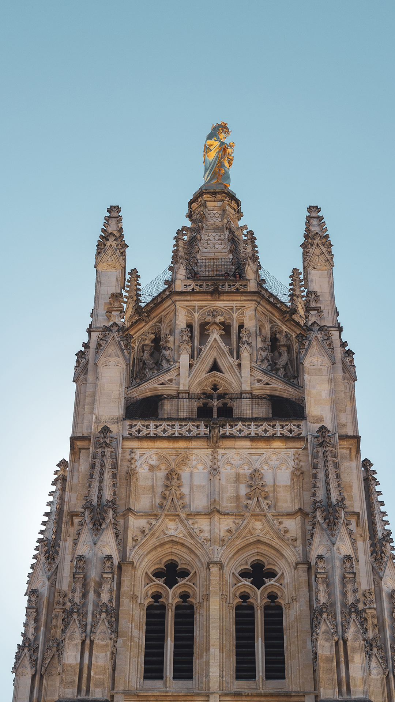
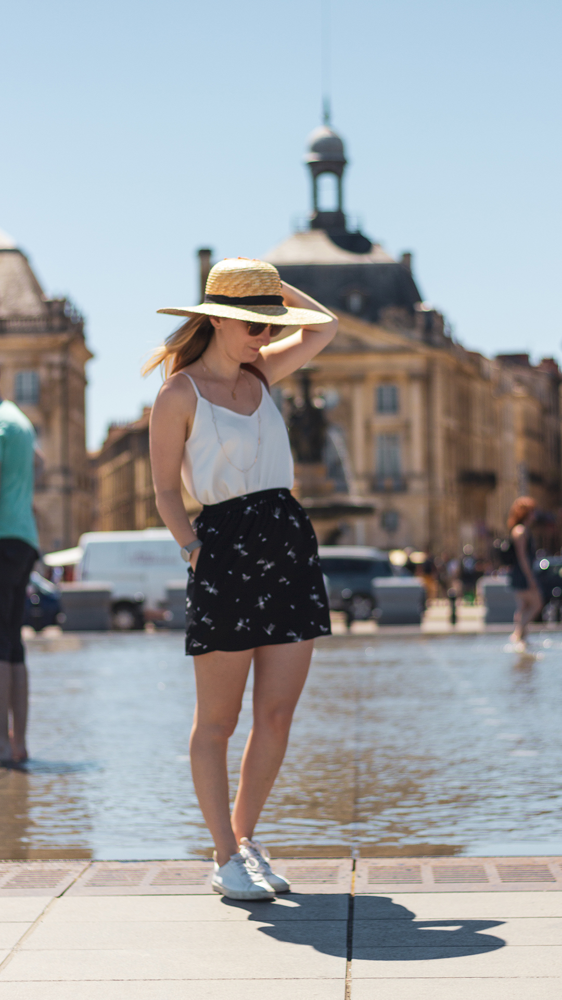

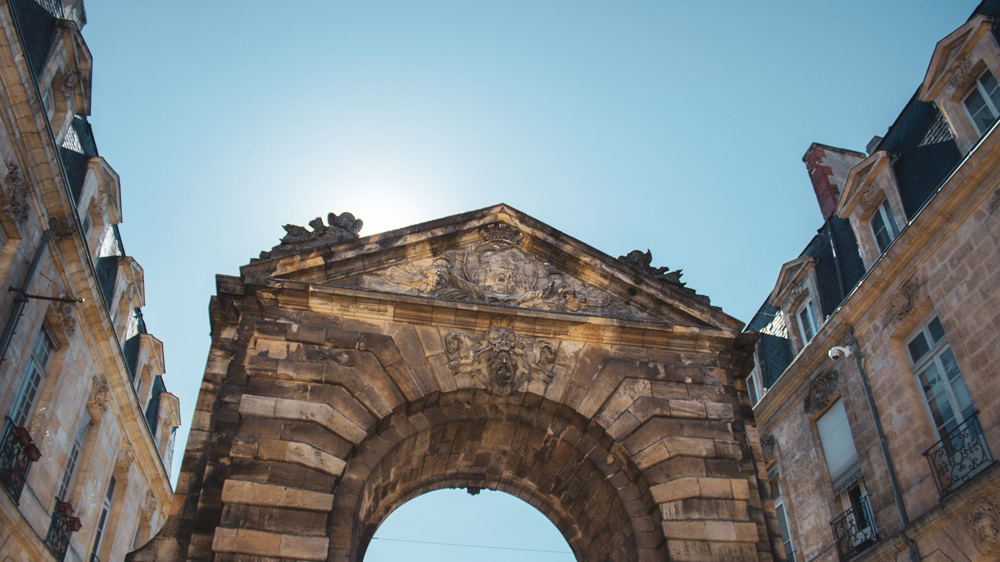
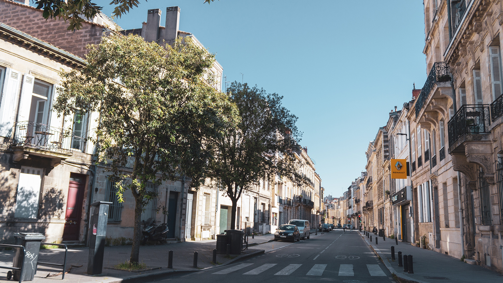
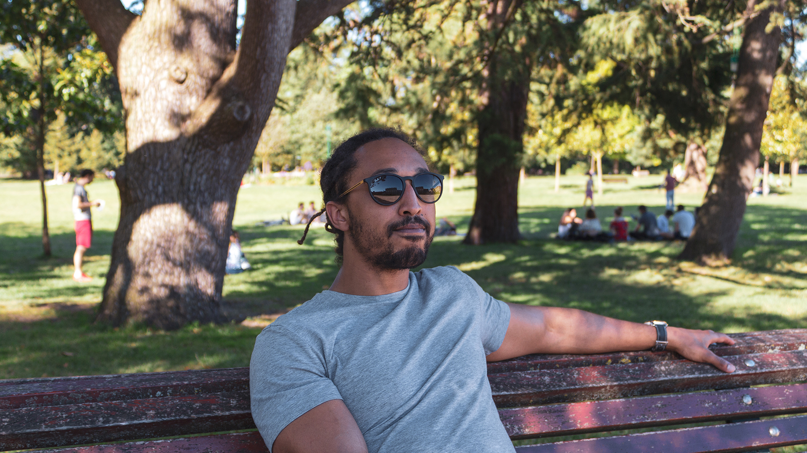

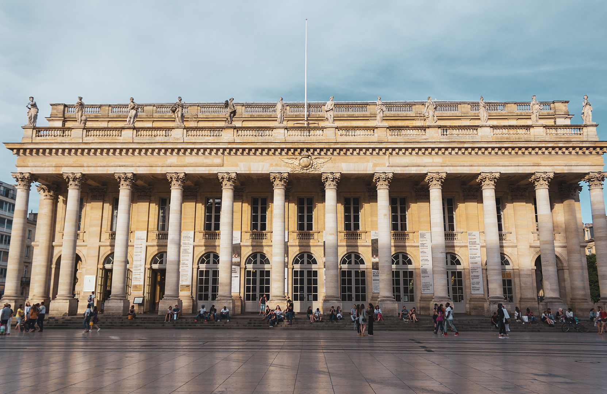

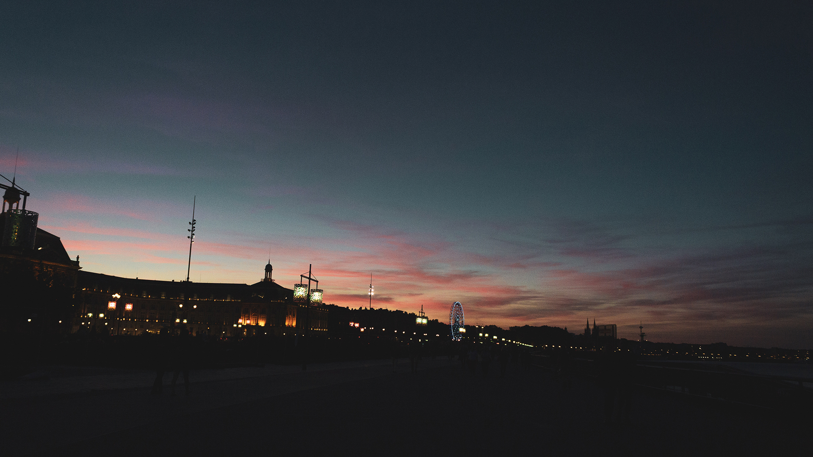

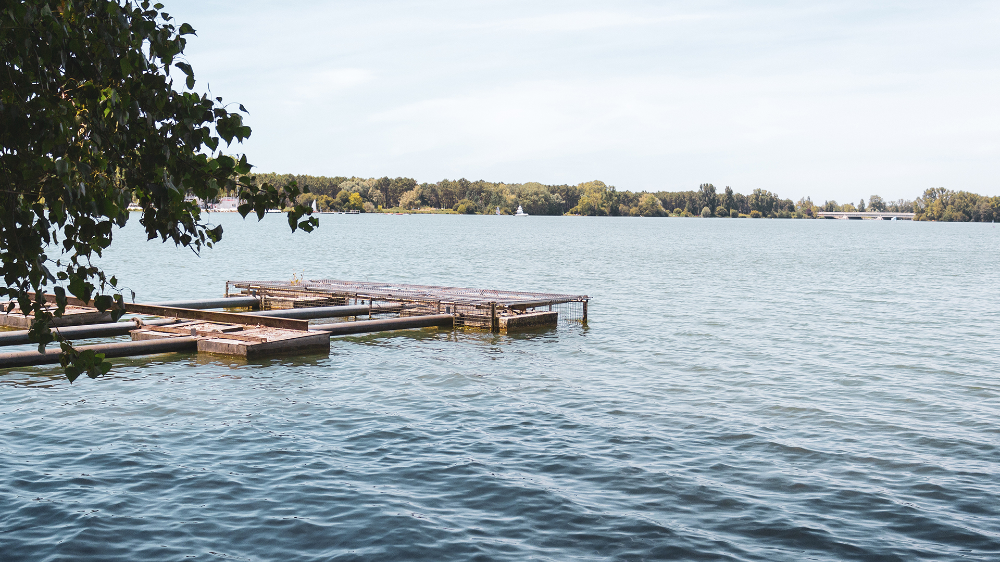

Comme à chaque fois que nous visitons une ville, je prépare une liste de points remarquables sur une carte pour avoir quelques repères. Pour Bordeaux, j’avais repéré les lieux les plus connus des touristes et glané quelques bonnes adresses sur divers blogs. Ensuite, une fois sur place, nous aimons déambuler au gré des rues, des envies et des découvertes ! Comme à chaque, ça ne rate et nous découvrons le vrai visage de chacune des villes que nous parcourons. Bordeaux a la réputation d’être un petit Paris. C’est vrai que l’architecture de la ville est fortement ressemblante à la capitale. En ville, nous avons été agréablement surpris par le nombre incroyable de cyclistes. Jamais nous n’aurions imaginé que Bordeaux soit une ville vélo-friendly. On a même vu passer des vélo hollandais avec des racks en bois pour les enfants ! On se sentait presque à la maison 🙂 

Deux jours suffirent pour découvrir les principaux aspects de la ville — la Place de la Bourse et son miroir d’eau, la place des Quinconces, la vieille ville et ses nombreux les bars à vin, les quais, et même Bordeaux-Lac. Deux jours seulement, et ce fut un véritable coup de coeur pour tous les deux. Ce n’est pas la même ambiance qu’à Amsterdam et pourtant, on s’y sent bien. C’est bien simple, j’adore le Sud de la France. Encore plus en été, ne serait-ce que pour une seule chose : les fruits ! Quel bonheur de déguster des abricots frais dans la rue, des cerises et des fraises du marché. Le simple fait d’y penser me donne l’eau à la bouche. Et puis, Bordeaux, ville de gastronomie ! Nous nous sommes régalé autour de planches de fromages, rillettes et charcuteries, de cannelés bordelais, de magret de canard et de verre de vins blanc et rosé. Bref, on en bien profité.

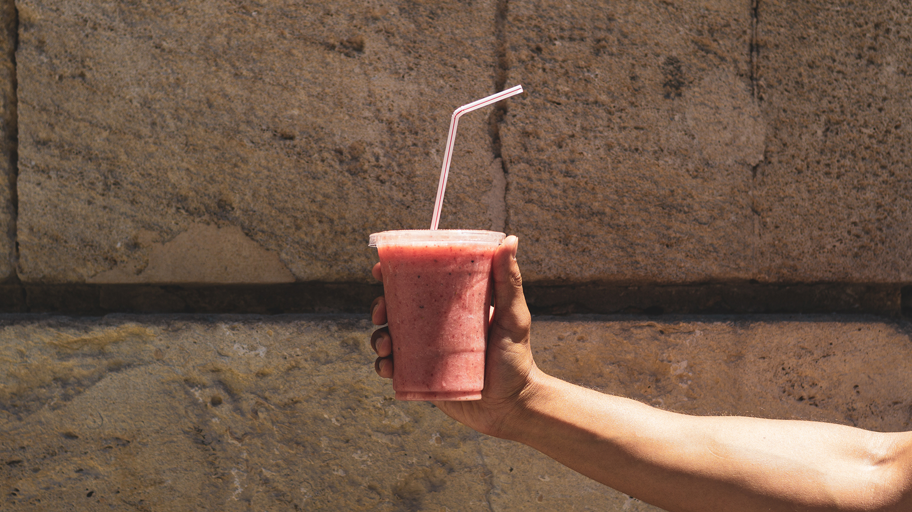
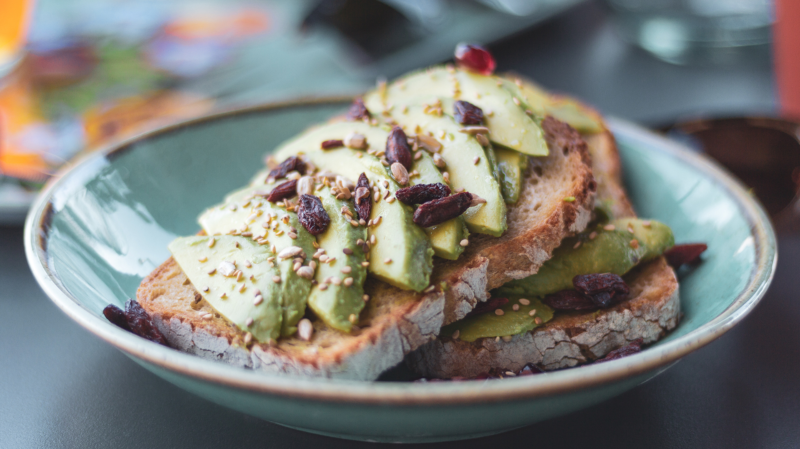
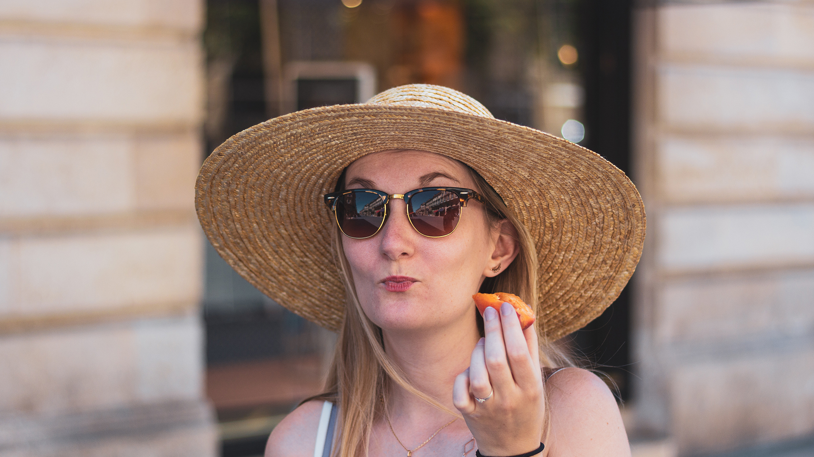

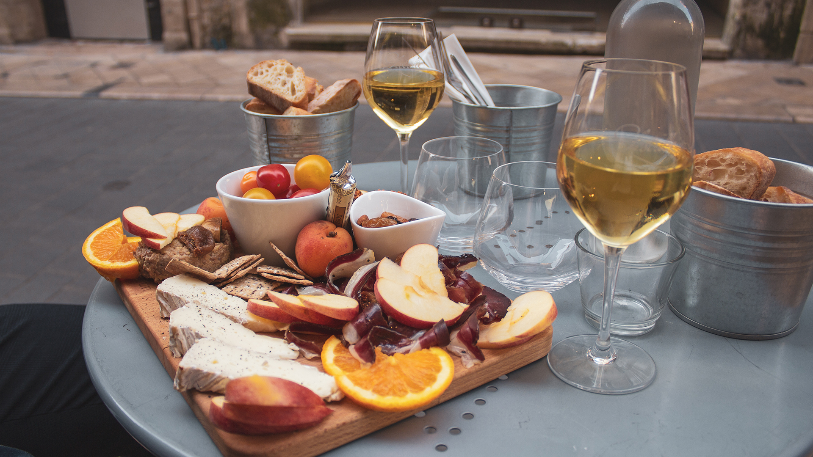

On nous demande souvent combien de temps nous pensons rester à Amsterdam. Comme à chaque fois, la réponse reste assez vague, nous ne savons pas vraiment. Il n’y a pas de date limite pour le moment. Mais s'il y a bien une chose de sûre, c’est que si nous partons, Bordeaux fait définitivement parti de notre top 3 !

---

_Ps: Si l’envie vous en dit, n’hésitez pas à réserver [ce joli AirBnb](https://www.airbnb.fr/rooms/17917184), et profitez même d’un crédit de 25 euros sur votre premier voyage en passant par ce lien ! _

_Pps: Si vous passer par Bordeaux, on vous recommande chaudement d’aller bruncher au [Monologue](https://www.tripadvisor.fr/Restaurant_Review-g187079-d13173606-Reviews-Le_Monologue-Bordeaux_Gironde_Nouvelle_Aquitaine.html) (réservation plus que conseillée). Leur buffet à volonté est délicieux !_
