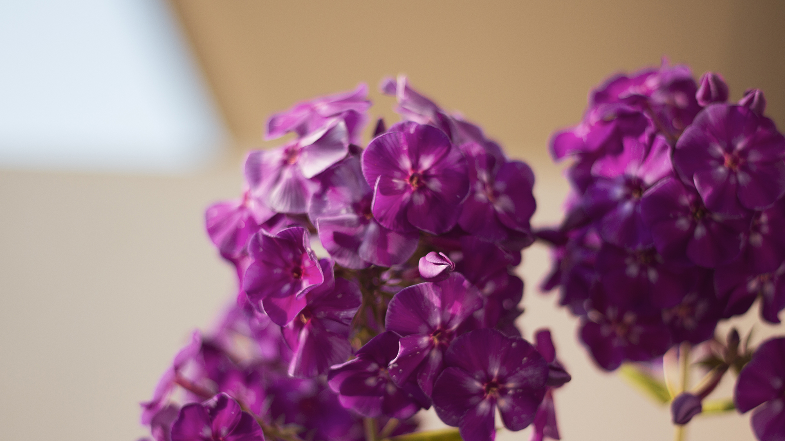
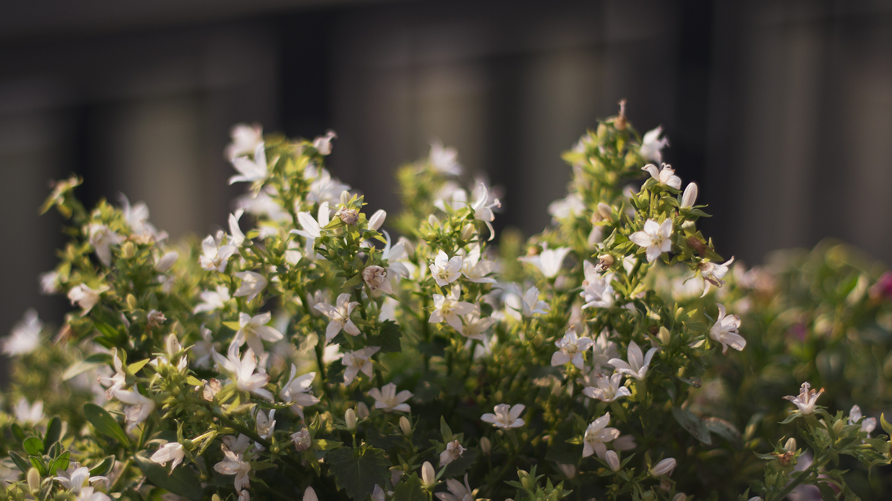
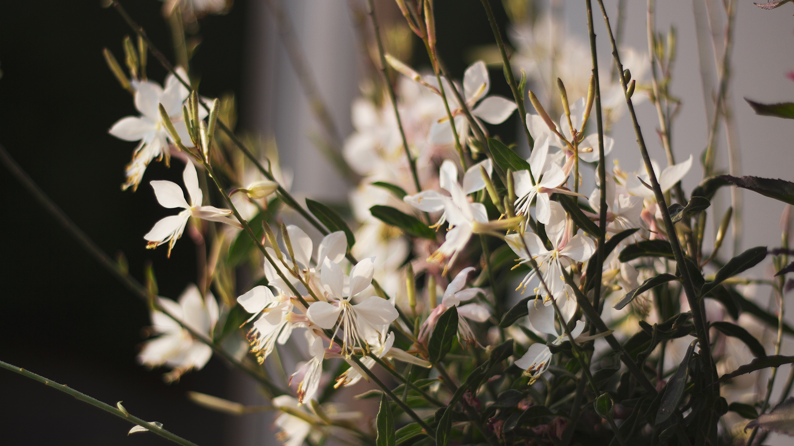
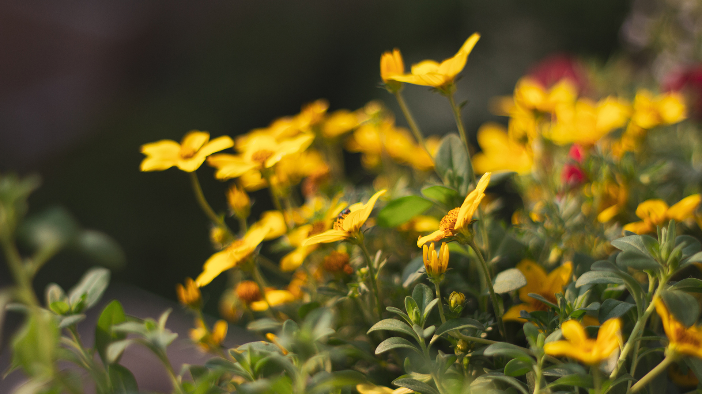

Ces jours-ci nous vivons sur notre balcon — Entre moi qui prends soin des petites plantes tout en essayant de bronzer et Alexis qui recherche un peu de fraîcheur et l’ombre extérieure l’après-midi, je crois d’ailleurs ne l’avoir jamais vu autant profiter du balcon, ces jours-ci, nous vivons sur notre balcon ! Il faut dire, la météo de cet été est vraiment généreuse ! Cette semaine, ce fut même caniculaire avec des températures approchant les records de chaleur au Pays-Bas.

Du coup, du temps sur le balcon j’en passe ! D’autant plus qu’il s’est encore vu agrémenter de jolies choses depuis la dernière fois. Souvenez-vous, il y a plusieurs semaines déjà, je vous faisais un [petit tour d’horizon](/dans-mon-petit-potager-34/) de mes expérimentations green et potagères. Pour ceux qui auraient raté l'avant-après du balcon, vous êtes libre de lire l’article(/balcon/). Des ratés, il y en a eu. Des belles surprises et des réussites aussi ! Retour en détails sur le balcon Adeux-Cestmieux, version 2018.

---

Je me plaignais que notre balcon restait assez très vide malgré les nombreuses graines plantées. Désormais, il y a une partie plus “potager” à gauche, et une partie “jardin” - détente à droite. Je pense que nous avons réussi à combler un peu le vide ambiant, mais à nous écouter, ce ne sera jamais assez, toujours plus de fleurs et de verdure !

---

## La partie potager

**• Les radis - le bilan**
Les radis seront, je crois, la plus grande réussite de ce balcon. Après un échec total, back in the days, à Alfortville, je crois que j’ai pris le coup de main, ou bien devrais-je dire le coup de radis. 😉 Pour tout vous dire, j’en suis à mon troisième semis après deux récoltes réussies et il me reste encore bien assez de graines pour faire une quatrième, voire une cinquième plantation d’ici la fin de l’été. En plus, avec la chaleur de ces jours-ci, les graines germes en un temps record ! À peine semées le samedi, que le lundi, on aperçoit déjà des petites feuilles vertes perçant le terreau.

Je n’ai pas pesé, mais j’ai récolté l’équivalent de 3 bottes de radis, telle que l’on pourrait en trouver sur un marché. Ils étaient piquant, mais pas trop, croquant à souhait. Et quel ne fut pas le plaisir de grignoter à l’apéro des radis du balcon ! Une chose est sûre, l’année prochaine, je replanterai des radis-chéris !

**• Les tomates cerises**
Une autre belle surprise fut les tomates cerises. Alors, elles ne sont pas sur le balcon, mais ça fait quand même parti du potager ! Je ne pensais pas qu’il serait aussi facile de récolter des tomates en appartement. Il faut simplement un peu de patience et beaucoup de lumière. Depuis la mi-juin, nous en récoltons plusieurs chaque semaine. Nous en sommes déjà à plus de 200g. Pas grand chose d’un point de vu rendement / production, mais cette jolie grappe reste ma plus grande fierté.

**• Le basilic & La menthe & La ciboulette.**
Tout n’est pas rose au pays du jardinage. Des ratés, il y en a aussi ! La ciboulette par exemple. RIEN DU TOUT. Même pas un petit bout de vert. J’en ai semé à nouveau pensant que j’avais loupé quelque chose. Et bien non, je pense que mon lot de graine est tout simplement foireux et ne germera jamais. C’est dommage car on adore la ciboulette. La prochaine fois, je choisirais sûrement la facilité en achetant un petit pot que je rempoterais pour être sûre d’obtenir des résultats. Ce n’est que partie remise.

Concernant la menthe et le basilic, je reste plutôt mitigée, cela étant sûrement dû à mon impatience. Faire pousser de la menthe et du basilic à partir de graines est un processus assez lent. Les deux aromates poussent, mais je n’ose pas encore couper des feuilles de peur de les dénuder plus vite que ce qu’ils ne poussent. Du coup, on fait avec les deux pots du balcon que j’avais légèrement délaissé et qui ne sont pas en super état, mais en attendant, ça fait l’affaire de mes petites eaux infusées.

**• Concombre & Carotte**
Et enfin, clou du potager, le concombre & la carotte. La carotte à l’air de bien se porter. Je n’ai simplement aucune idée de quand je dois la récolter. Du coup, j’attends encore, peut-être d’ici la fin du mois d’août, la carotte étant d’avantage un légume d’automne que d’été.

Du côté concombre, c’est légèrement plus complexe que les tomates. Il y a en effet des fleurs mâles (la graine) et des fleurs femelles (le fruit), qui sont, sans politisation par les insectes, complètement improductives. Et des abeilles ou des bourdons, ce n’est pas ce qui court du côté de mon balcon malheureusement. J’ai bien tenté le coup en utilisant un coton tige, mais ça n’aura pas été très concluant. Pour l’instant, un seul minuscule concombre (cornichon ?) se trouve au compteur et je me demande bien quel goût il aura au moment de sa récolte ! Pour l’instant, je laisse pousser et la nature faire son travail. 😉

## La partie jardin fleurie

Je vous parlais d’insectes pollinisateurs plus haut, qui, à mon grand désespoir, ne sont pas tant attirés que ça par les fleurs jaunes du concombre. Pour remédier à cela, nous avons décidé d’investir dans des plants fleuris, colorés et “abeilles-friendly”.
Je voulais depuis longtemps de la lavande sur mon balcon, histoire de me rappeler la douce Provence. C’est désormais chose faite avec ces deux grands pots. Ce n’est pas le type de lavande que l’on a l’habitude de voir ; celle-ci est une “Lavandula stoechas”, aussi connue sous le nom de « Lavande Papillon ». Le résultat était sans appel, dès l’instant même où les pots ont été posés sur le balcon, les bourdons sont venus le butiner. C’est assez incroyable l’effet, positif, qu’une simple plante puisse avoir ! C’est un vrai plaisir que de voir chaque jour, depuis la fenêtre de la cuisine, des petits corps noir et jaune voler, d’une branche à une autre.

Dernièrement, nous avons découvert une jardinerie pas très loin de la maison et dont les prix ne sont vraiment pas cher du tout. De fait, nous avons posé deux jardinières et repeuplé la grande jardinière verte de fleurs décoratives. Nous avons donc un mix de [pétunia](https://www.google.nl/search?q=p%C3%A9tunia&source=lnms&tbm=isch&sa=X&ved=0ahUKEwj7-_f1i8XcAhUE4YUKHa_GDWYQ_AUICigB&biw=1437&bih=716), [biden ferulia](https://www.google.nl/search?q=Bidens,+ferulifolia&source=lnms&tbm=isch&sa=X&ved=0ahUKEwjho6vDi8XcAhVQQBoKHSRoBWUQ_AUICigB&biw=1437&bih=716) , des [lobelia](https://www.google.nl/search?biw=1437&bih=716&tbm=isch&sa=1&ei=qhteW7GvBIO2a_esl4AE&q=lobelia+f1&oq=lobelia+f1&gs_l=img.3..0j0i24k1.24852.26042.0.26201.4.4.0.0.0.0.150.541.0j4.4.0....0...1c.1j2.64.img..0.4.541....0.VTV5Y_N-CGo) et des [phlox](https://www.google.nl/search?biw=1437&bih=716&tbm=isch&sa=1&ei=xRteW_OLFIK0abm6ltAC&q=phlox+z&oq=phlox+z&gs_l=img.3..0l2j0i30k1j0i24k1l7.22347.28664.0.32867.6.6.0.0.0.0.290.828.1j3j1.5.0....0...1c.1.64.img..1.5.827...0i67k1.0.aAqAeyiB-pA) entre autres. C’est joli et coloré, ça donne envie de rester sur le balcon, et surtout d’avoir encore plus de fleurs sur la rambarde.

Le petit plus d’Alexis, un pot de lierre Hédéra Helix. Son rêve ? Le faire courir tout au long de la rambarde et recréer un petit “cache-voisin”. On verra ce que ça donne. 😉

---

Le tour du balcon s'arrête ici. Je prends plaisir chaque week-end à les arroser et surtout les observer s'épanouir. On est content d'avoir enfin pu mettre à profit nos 2 portes jardinières acheté l'année dernière. Dans l'idéal, on aimerait avoir un second Balkon Bar afin de poser plus de fleurs. Je suis ravie aussi d'avoir de nombreuses insectes butinant les fleurs en pot. Comme le dit si bien Alexis, à default d'avoir un jardin, nous avons participé à (re)-créer un petit éco-système sur le balcon et qu'il suffit de pas grand chose pour aider les petites abeilles.

Prochain challenge du printemps prochain : les fraises, le persil et pourquoi pas un pied de framboises ! ♥
