Pour nos vacances d’été de cette année, nous avons mis le cap sur la **Sardaigne du Nord**.

## La Sardaigne, pour commencer ...

### La préparation

Après avoir écumé internet en quête d’inspiration en février, nous avons choisi de partir en **Sardaigne du Nord** début Septembre. Cela fait désormais trois étés que nous décidons de partir à cette période-ci. On profite de ne plus avoir de contraintes “rentrée des classes” pour fuir la haute-saison, ses prix et sa foule ! De plus, les mois de juin-juillet-août sont les mois les plus doux à Amsterdam, où le soleil brille et les journées sont chaudes. On trouve donc un peu dommage de s’enfuir de la ville à cette période lorsqu’on peut l’apprécier d’avantage encore ! Enfin, début Septembre autour de la Méditerranée, la météo est encore très clémente et les grosses chaleurs d’été étouffantes généralement passées. Bref, des conditions au top pour profiter des vacances après tout le monde !

Nous avions adoré le format de notre voyage en Croatie, il y a deux ans, à savoir une location AirBnb et une voiture pour pouvoir se rendre aisément dans différents lieux. Nous sommes donc partis sur le même schéma pour la Sardaigne, à la différence que nous avons réservé trois logements sur différents lieux plutôt qu’un seul.

### S’y rendre, se déplacer

Se rendre en Sardaigne est plutôt facile. Il existe des vols Amsterdam - Olbia directs et réguliers avec Easy Jet. Nous sommes arrivés un vendredi en début d’après-midi pour un retour le samedi en toute fin de soirée. Pour une fois, aucun retard ou soucis d’avion à signaler, nous avons voyagé sans encombre !

La Sardaigne étant une destination touristique, l’aéroport d’Olbia dessert donc une bonne partie du continent sans soucis avec plusieurs compagnies aériennes.

Comme à notre habitude, nous avons loué une voiture chez Sixt à l’aéroport. L’agence est en revanche un peu en deçà du niveau de qualité dont nous pouvons avoir l'habitude, mais nous obtenons la voiture réservée et le check-out se fait en moins de 15 min.

## Olbia, point de départ de tous les voyages

### Profiter de la piscine et se relaxer

Pour ces trois premiers jours de vacances en Sardaigne, nous avons décidé de réserver un hôtel sur Olbia histoire de commencer les vacances en douceur. Nous voulions vraiment prendre le temps de ne rien faire ! Nous avons donc profité de la piscine de l’hôtel une bonne partie du séjour et c’était tout simplement parfait ! J’ai adoré passer l’après-midi à jongler entre mon transat, la piscine, mon livre, mon téléphone et dormir !

### L'hôtel

Notre choix s’est arrêté sur le Jazz Hotel, un hôtel 4 étoiles en bordure d’Olbia, extrêmement proche de l’aéroport et répondant à tous nos critères : piscine, zone “spa”, excellent petit-déjeuner et chambre spacieuse. La piscine était vraiment parfaite et l’hôtel super calme malgré la proximité de l’aéroport.

Leur petit-déjeuner-buffet est excellent. Vous connaissez mon amour pour les petits-déjeuners d'hôtel ! Je suis d'ailleurs capable de manger le double des portions d’Alexis le matin tant j’ai l’appétit ouvert pour le petit-déjeuner. Celui du Jazz Hotel était à la hauteur et je me suis bien régalée !

Nous avons aussi mangé au restaurant de l'hôtel, le Bacchus, le premier soir. La carte faisait vraiment saliver les papilles. Les plats avaient tous l'air aussi bon les uns que les autres. C'était délicieux et nous n’avons pas été déçu. Nous le recommandons vraiment pour un beau dîner en amoureux.

### Porto Istana

Bon, je vous rassure, nous n’avons pas passé notre vie à l’hôtel et bien que nous n’ayons pas visité Olbia, nous nous sommes rendu à Porto Istana, une plage plus au sud de la ville. Malgré le monde pour une fin d’été, la beauté de l’eau est à couper le souffle. Ce lieu ravi déjà toutes mes attentes en matière de plage de sable fin, mer turquoise et eau transparente ! On ne peut que vous conseiller d’arriver tôt pour profiter d’une plage encore vide et de pouvoir vous trouver un joli spot !

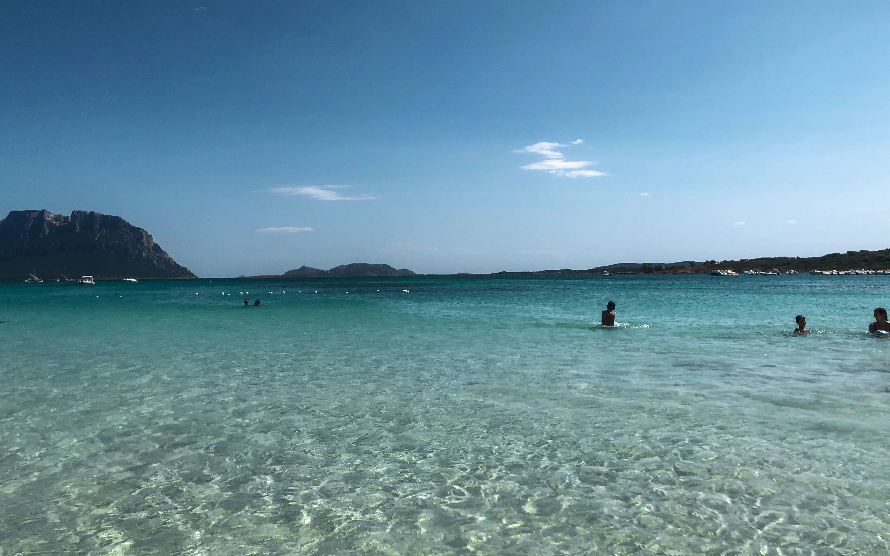
<gallery>
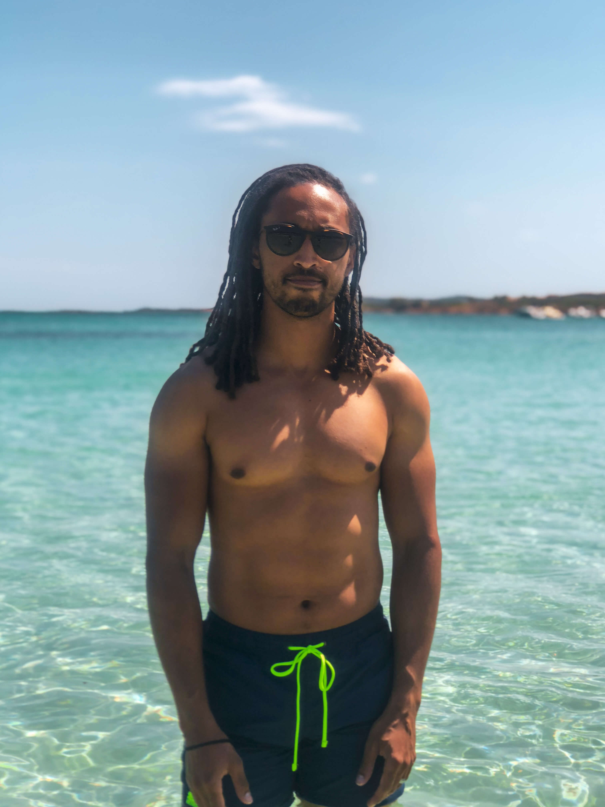

</gallery>

## Siniscola, vers le sud

### Loger à Nioleo, turismo rurale

Pour la suite, nous avons pris la route en direction de Siniscola, une commune dans la province de Nuoro. Nous longeons au _Nioleo Turismo Rural_, un AirBnb vraiment canon, situé en pleine campagne à la sortie de Siniscola et avec pour seuls voisins des moutons. Les logements sont quasiment neufs et décorés sobrement, dans un style sarde. Les terrasses privées, les douces lumières du soir et les petits rideaux blancs rendent l’ambiance super chaleureuse. Cerise sur le gâteau, la piscine avec une vue splendide sur la baie de Siniscola. C’est l’endroit idéal pour se couper du monde et simplement profiter.

<gallery>

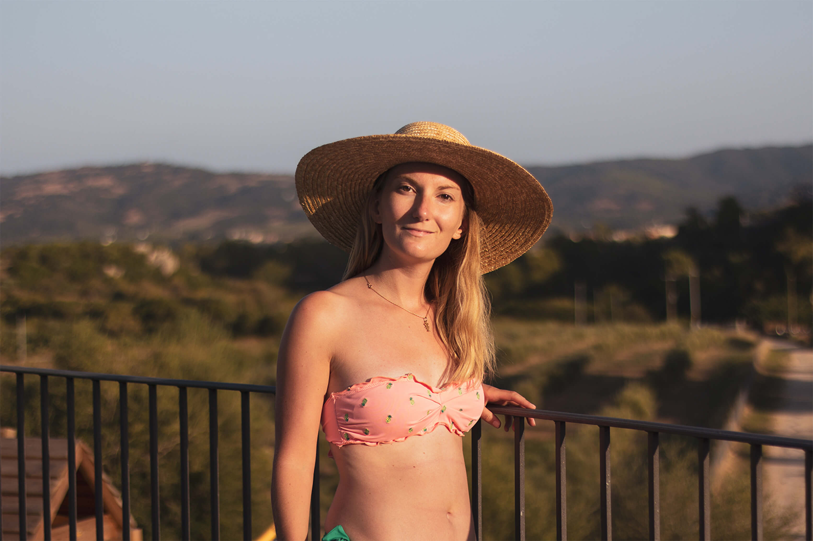
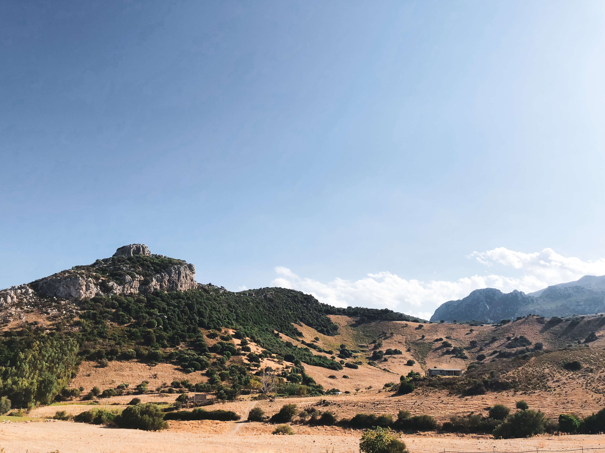
</gallery>

### Faire du snorkeling à Cala Gonone

Au delà de ses plages magnifique, la Sardaigne est réputée pour avoir une faune et flore marine assez exceptionnelle en Méditerrannée. Bien que ces vacances furent placée sous le signe de la détente et du farniente, nous en avons aussi profité pour faire du snorkeling. Nous avons trouvé, via la plateforme AirBnb Expérience, une monitrice de plongée proposant des séances découvertes de snorkelling en groupe à Cala Gonone, non loin de la très, très fameuse plage de Cala Luna.

C’était génial ! Nous avons nagé environ 1h jusqu’à une grotte, tout en prenant le temps d’observer l’environnement autour de nous. Je n’ai jamais vu autant de poissons de ma vie ! Le plus mignon fut s'en doute les nombreuses girelles paons. C’était une belle expérience et cela nous a permis d’appréhender la “nage en eau libre” avec beaucoup de calme. En plus, la monitrice, Sinzia, fut pleine de conseils et d’info très intéressantes. Vraiment, on recommande !

<gallery>

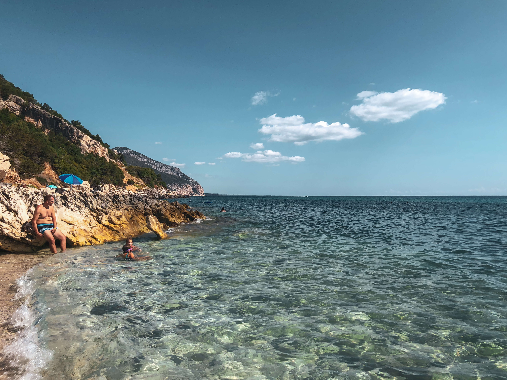

</gallery>

### Spiaggia La Caletta

Les journées passent et ne se ressemblent pas et avec chacune une nouvelle plage à découvrir ! Une matinée, nous nous sommes rendus à La Caletta, la plage la plus proche de Siniscola.

La Caletta, c’est 5 km de sable fin et doré, une eau clair, turquoise et peu profonde, le tout bordé d’une jolie pinède. Il y a de la place pour tout le monde, c’est vraiment agréable. Nous en avons même profité pour nager en eau libre avec nos palmes et lunettes de piscine et c’était franchement chouette (bien que difficile avec les vagues et le courant).

<gallery>

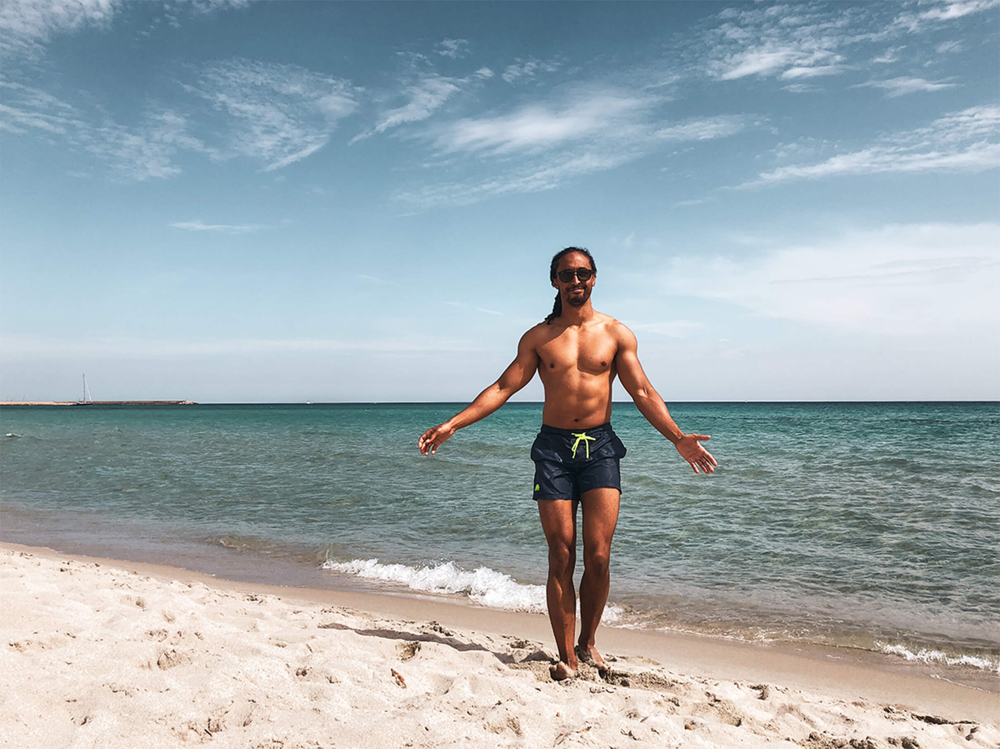
</gallery>
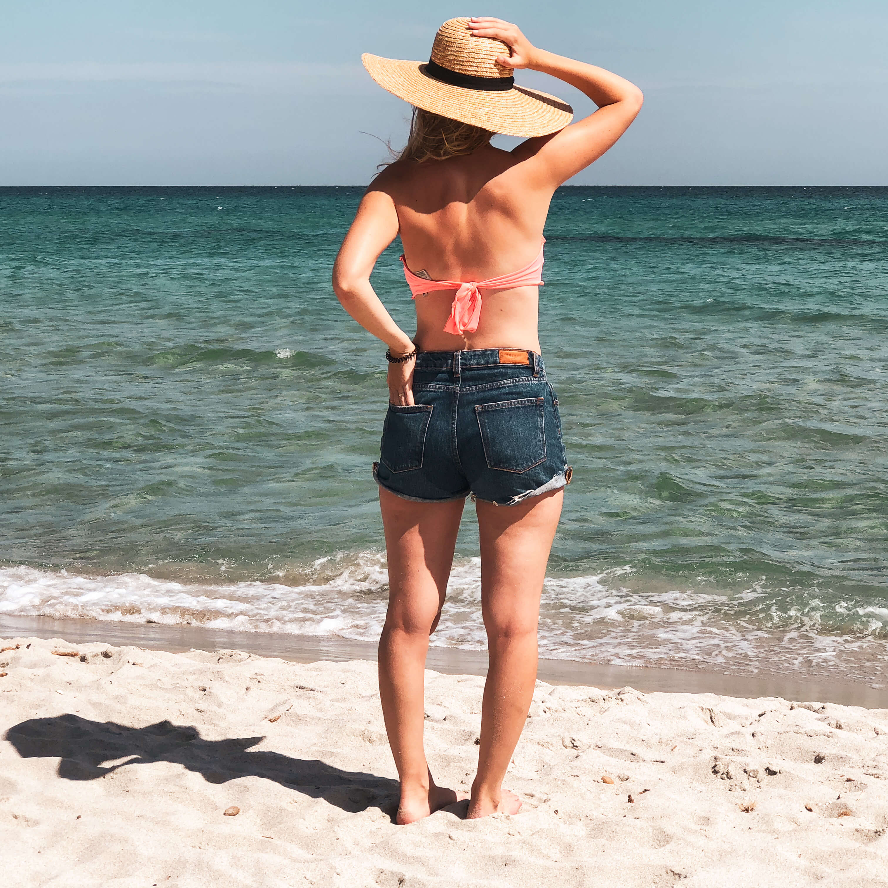

### Spiaggia Cala Brandinchi

Une simple recherche google sur les plus belles plages de Sardaigne vous montrera à quel point cette île regorge de criques, calanques et plages toutes aussi belles les unes que les autres. Parmis celles qui ressortent très souvent dans les classements se trouve la **Spiaggia Cala Brandinchi**, aussi surnommée la “Tahiti de la Méditerrannée”. Cela nous a intrigué et nous l’avons donc mise sur notre “beach to-do list” du jour !

Très honnêtement, c’est vrai qu'elle est belle cette plage ! Située dans une grande crique, elle a vue sur l’île de Tavolora. Le sable doré est très fin, l’eau turquoise, complètement limpide. Et surtout, vous avez pied jusqu’à plus de 100m, sans rochers. En revanche, la plage est assez étroite, ce qui en fait son seul défaut ; étant extrêmement fréquentée par les familles en été, on ne peut que conseiller d’arriver tôt !

<gallery>

</gallery>

### Golfo d'Aranci

Sur la route en direction du Nord de l’île, nous avons fait un croché par le Golfo d’Aranci pour une pause pic-nic au bord de la plage ! Malheureusement, j’ai trouvé celle-ci plutôt sale, cela étant dû, je suppose, à la proximité d’un port de plaisance. Le sable est parsemé de mégots, déchets et parfois morceaux de verre. C’est dommage, car l’eau est d’un bleu turquoise toujours aussi magnifique !

<gallery>

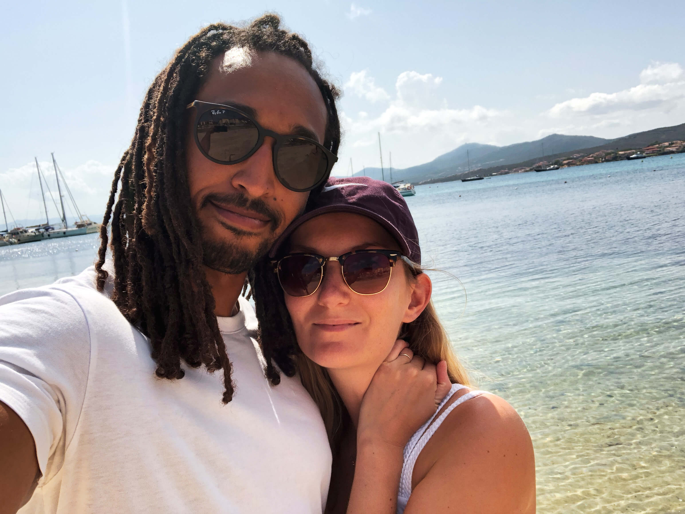
</gallery>

## Palau, porte d’accès à l’archipel de la Maddalena

### Le AirBnb parfait à San Pasquale

Palau est le dernier lieu de notre voyage en Sardaigne et nous longeons encore en AirBnb. Je crois bien que ce fut mon préféré de tous ! La propriété est composée de 4 maisonnettes, chacune possédant une terrasse privée ayant vu sur l’énorme jardin et la baie de Palau.

Le lieu est ultra charmant, les hamacs sous les oliviers tout simplement parfait ! Les propriétaires habitant juste au dessus, Maria nous a gentiment accueillis avec ces deux chiens, un petit pot de confiture d’abricots et un de sauce tomate entièrement faite maison. C’était délicieux ! En plus, les logements sont vraiment bien entretenus et surtout la cuisine est super fonctionnelle avec à disposition tous les produits de “première nécessité”. Vraiment le top !

Le lieu en lui-même est propice à la relaxation. Je n’ai pas résisté à me faire une petite séance de yoga au coucher de soleil ainsi que de la méditation dans le hamac ! On ne regrette même qu’il n’y ait pas de piscine tant l’endroit se suffit à lui-même !

<gallery>

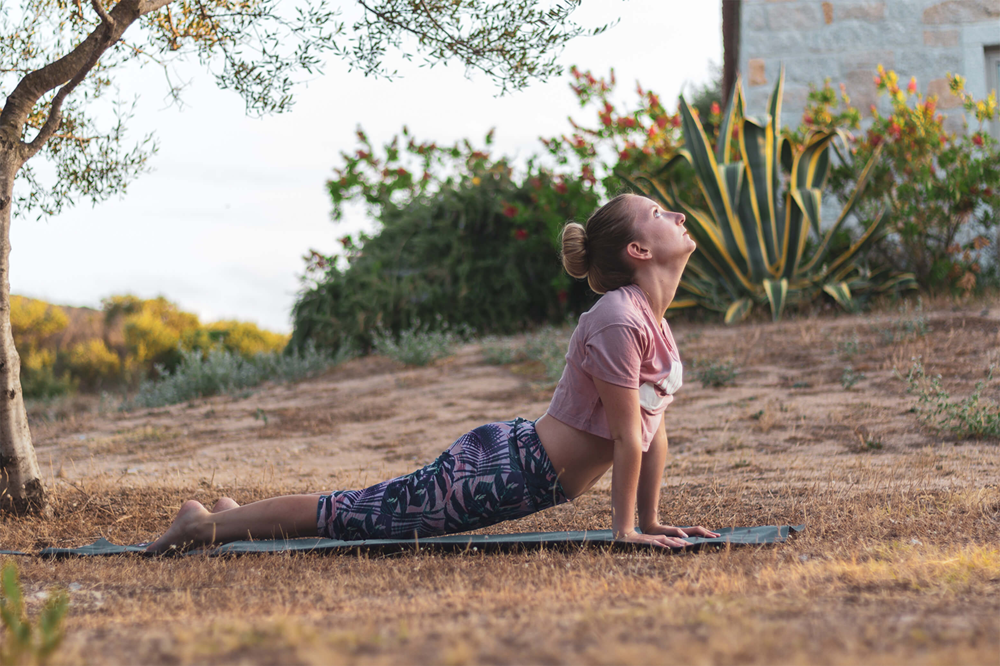
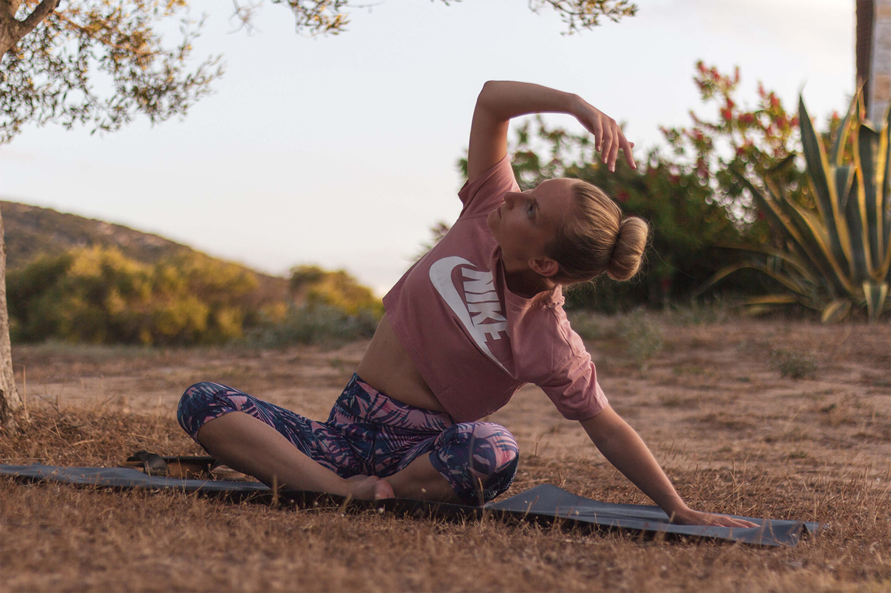
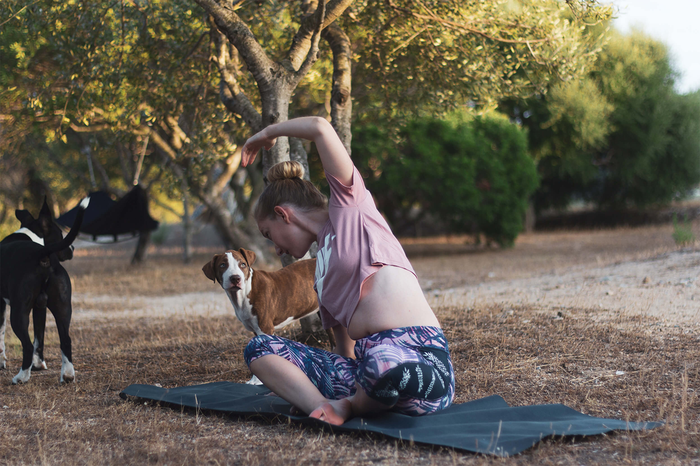
</gallery>

### Santa Teresa Gallura

Nous avons conduit jusqu’à Santa Teresa Gallura, ville à la pointe nord de la Sardaigne. Nous avons déambulé dans les ruelles, marché le long de rempart et observé les ferries en partance pour la Corse. Les côtes de Bonifacio, situées à 12km seulement, sont d'ailleurs très bien visible par beau temps ! J’ai même découvert que, des milliers d’années auparavant, la Corse et la Sardaigne ne formait qu’une seule et même île. J’ai été agréablement charmée par les bâtiments très colorés dans le centre-ville qui donnent une ambiance très chaleureuse, me rappelant beaucoup la Toscane et Nice !

<gallery>

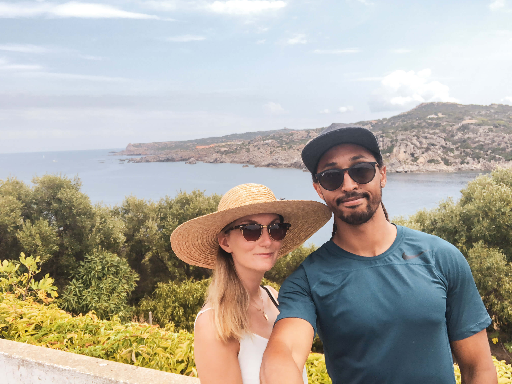

</gallery>
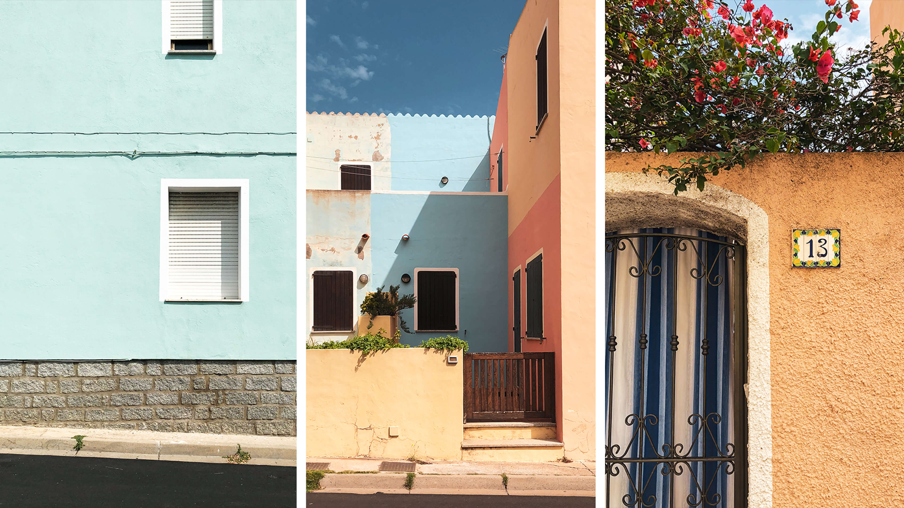

### Couché de soleil à Capo Testa

Nous avons passé une après-midi et fin journée à Capo Testo, une presqu’île remarquable pour ses impressionnants blocs granitiques sculptés par l’action conjuguée de la mer et du vent. Posés au bord d’une petite crique, nous avons admiré les étonnants rochers et paysages autour de nous. Nous avons nagé aussi et c’était incroyable la faune marine présente aussi dans cette petite calanque !

C’était aussi l’endroit idéal pour admirer le coucher de soleil en fin de journée. D'ailleurs, c’est toujours aussi beau, un coucher de soleil. Et ce paysage si mystérieux autour de nous rendait la scène tant « contemplative » !

<gallery>
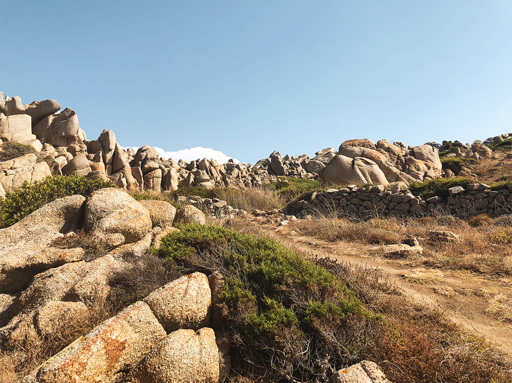
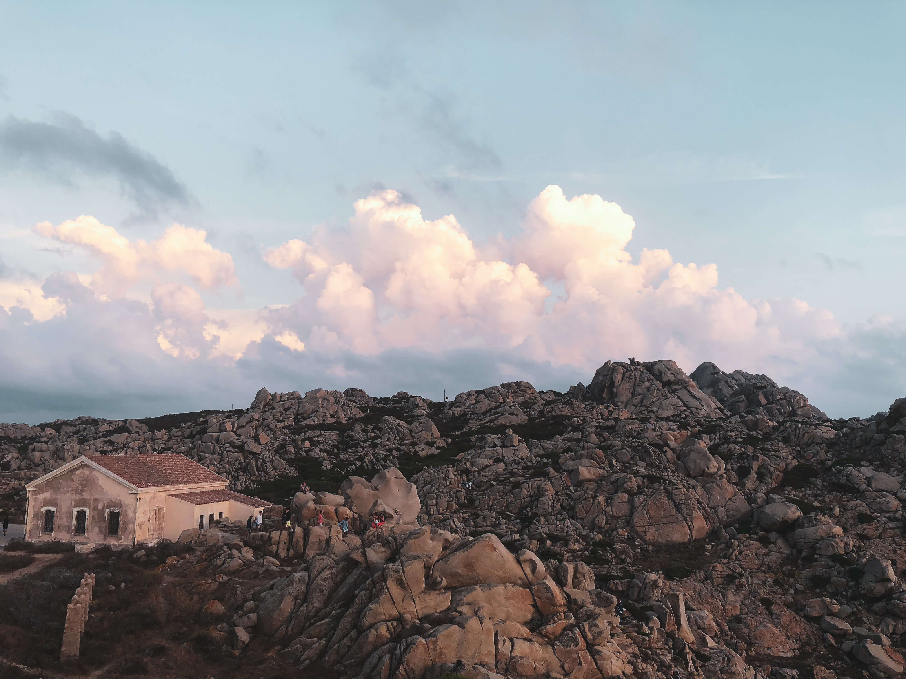
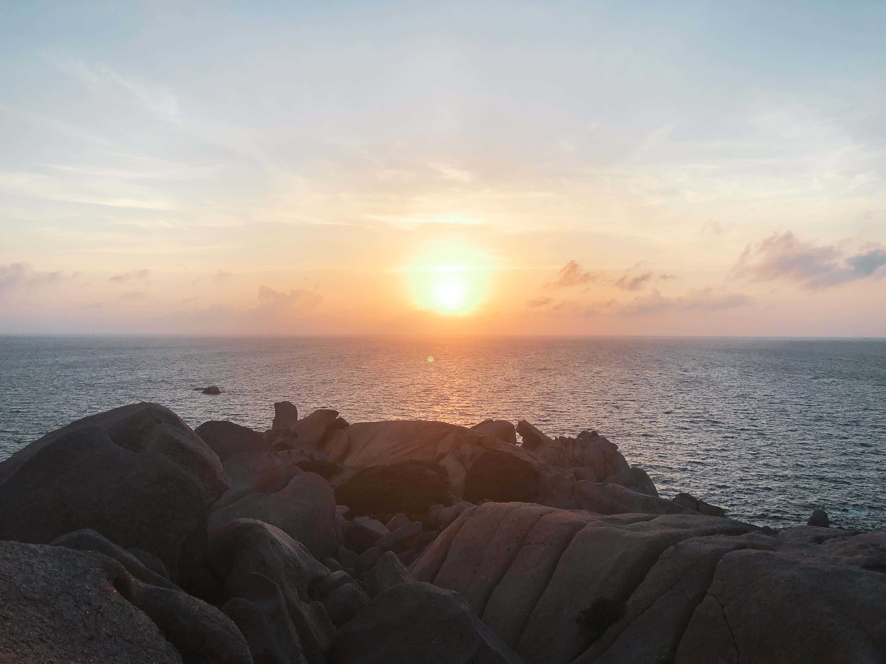
</gallery>

### L’archipel de la Maddalena ; Maddalena et Caprera

Logeant sur les hauteurs de Palau, nous avons profité d’une journée pour aller sur les fameuses îles de l’archipel de la Maddalena, accessible en seulement 20 min de ferry. Nous y avons visité le village de Maddalena, mignon, mais très touristique, fait le tour le l’île en voiture puis traversé le pont en direction de l’île de la Caprera, beaucoup plus nature. Le but était de trouver une jolie petite plage (abandonnée, coquillage et crustacées ...). Nous nous sommes finalement arrêtés au bord d’une crique très calme, à rivaliser avec les Maldives ou les Seychelles 😉 Et bien que nous étions assez éloignés de la foule, ce ne fut pas ma préférée de toutes.

Les deux îles regorgent de mini-criques ou plus grandes plages, toutes plus uniques les unes que les autres. Certaines sont plus fréquentées, mais chacun y trouvera son bonheur. Il existe aussi des tours en bateau autour de l’archipel, mais cela reste très chronométré et parfois un peu attrape-touristes. Le mieux reste tout de même de pouvoir naviguer en bateau privé afin de se rendre sur les criques ou plages inaccessibles depuis l’intérieur des terres comme bon vous semble et de se sentir seul au monde (ou au paradis).

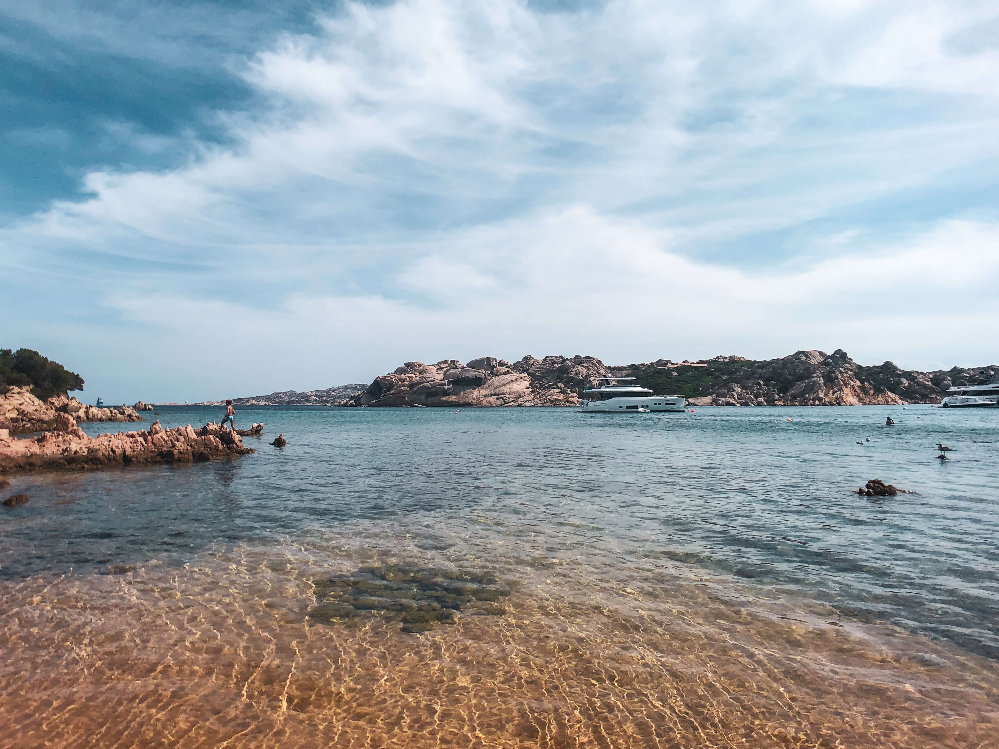

### Les grandes de Spiagga Rena Majore

Pour finir cette randonnée des plages, nous mettons cap encore plus à l’ouest, vers **Spiagga Rena Majore**. Et c’est un tout autre paysage qui s’offre à nous. La plage de sable est bordée de falaises, l’eau d’un bleu toujours aussi fascinant, mais surtout de grosses vagues nous attendent ! Après quelques recherches, il semblerait que le spot soit en fait bien connu des surfeurs et on comprend pourquoi !

C’était littéralement trop drôle. J’étais tel un enfant à braver les vagues. J’ai tout de même réussi à me baigner et nager. Mais la mer ne se laisse pas dompter aussi facilement, et au moment même où j’étais en train de sortir, une vague puissante m’a complètement retournée et tournée-boulé dans l’eau telle une machine à laver. Alors, sur le coup j’ai eu peur mais ensuite j’ai explosé de rire de moi-même en voyant mon état et surtout mon haut de maillot de bain désormais au milieu de mes fesses.

<gallery>
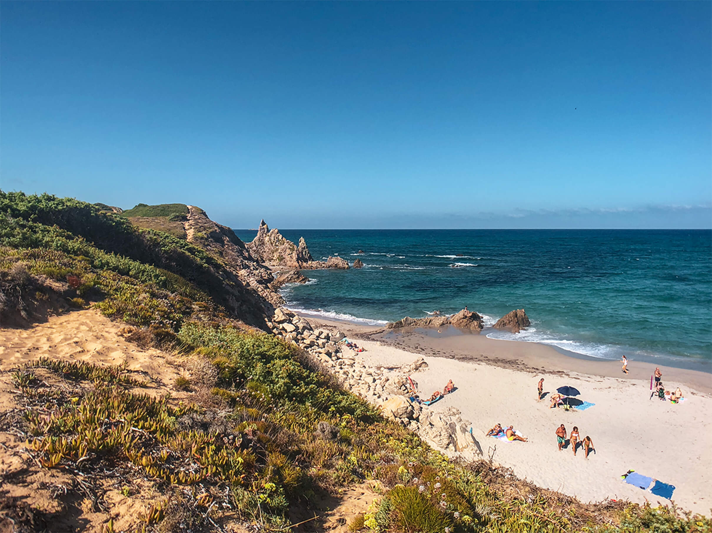

</gallery>

## Pour finir

Notre découverte de la Sardaigne s’arrête ici. Ce ne fut pas de grandes vacances sportives ni culturelles mais on espère tout de même vous avoir donné envie de visiter cette magnifique île aux 1000 plages très prochainement.

Avec Alexis, nous rêvons souvent des plages et eaux turquoise du Mexique. Mais la Sardaigne est une île magnifique nous rappelant finalement que nous n’avons pas besoin de voyager à l’autre bout du monde pour découvrir des paysages paradisiaques digne des Caraïbes ou des Seychelles. Les beaux paysages de la Sardaigne sont à seulement 2h d'avion, sans décalage horaire ni saison des ouragans ! On recommande clairement !

Ce qui nous a désolé en revanche, c’est de voir à quel point la Sardaigne est en réalité polluée et très sale par certains endroits. C’est désolant de voir les tonnes de déchets et sacs plastiques jetés dans la nature et sur le bord des routes !!!! Mégots, clopes, emballage, canettes de coca, bouteilles de bière, j’en passe et des meilleurs ! Il y a la beauté des paysages sur les photos des cartes postales. Et il y a l'envers du décor ... malheureusement. C’est rageant et l’incompréhension est totale face à de tels comportements.

Alors, oui voyager, c’est bien, c’est beau. Les vacances au soleil entre amis, c’est chouette, les pic-nic à la plage, trop génial. Mais prenez conscience de l’environnement autour de vous. Réalisez à quel point il peut être fragile et surtout ne jetez jamais vos déchets ailleurs que dans un emplacement dédié. Ce sont ces petits gestes qui, mine de rien, protègent notre si belle planète.

---

D’un point de vu pratique, vous pouvez retrouver les logements et activités avec nos avis ici:

- **[Jazz Hotel à Olbia](https://www.booking.com/hotel/it/jazz.fr.html)**
- **[AirBnb à Siniscola](https://www.airbnb.fr/rooms/16524650)**
- **[AirBnb à Palau](https://www.airbnb.fr/rooms/6284976)**
- **[Snorkelling à Cala Gonone](https://www.airbnb.fr/experiences/249530)**

À très vite
