_Edimbourg — Nos must-see sur un week-end_

Depuis que j’ai découvert l’univers Outlander, je ne rêvais que d’une chose : visiter l’Écosse et les Highlands. À défaut de pouvoir réaliser mon rêve de road trip, je souhaitais, au moins cette année, visiter la capitale d’Ecosse, Edimbourg.

Il se trouve qu’Olafur Arnorlds, l’un des artistes préféré d’Alexis, a commencé sa tournée européenne pour son nouvel album. Fin mars dernier, nous avons sauté sur l’occasion de prendre des billets pour son concert à Edimbourg fin septembre tout en profitant des prix bas pour les vols Amsterdam - Edimbourg avec EasyJet.

Quoi de mieux que d’allier visite d’une ville et concert sur un même week-end ?

<gallery>
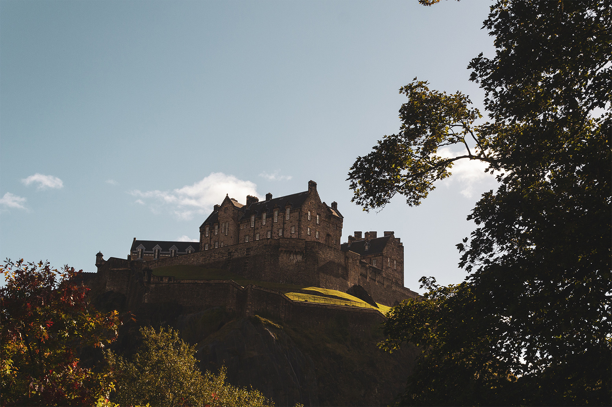
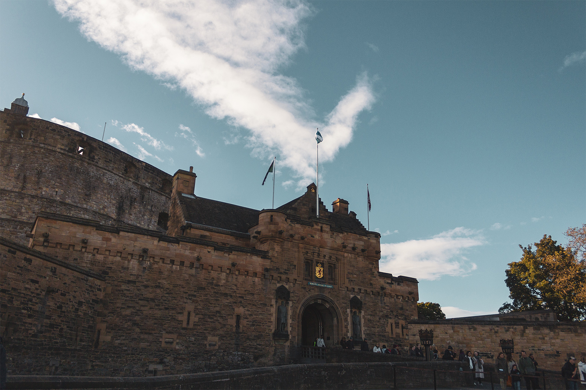
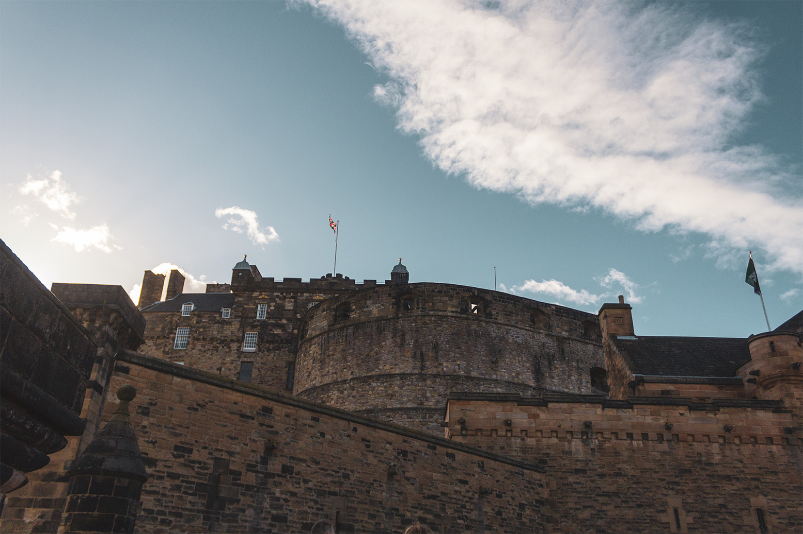
</gallery>

---

L’avantage (et l’inconvénient) de l’Écosse (et du Royaume Unis en général), c’est qu’il y a une heure de décalage. Nous sommes partis vendredi en milieu d’après-midi et nous étions déjà dans Edimbourg aux alentours de 17h ; à temps pour admirer la lumière de fin de journée sur la ville. Bon, au retour, on apprécie un peu moins de rentrer à 23h. Mais on est content d’avoir pu profiter de la ville d’Edimbourg et du week-end à fond !

Nous avons eu une météo vraiment parfaite : très peu, voir aucune pluie sur 3 jours et parfois même un grand ciel bleu et beau soleil. Les températures étaient tout de même fraiches fin septembre, avec un vent soufflant de belles bourrasques glaciales par moment. Cela ne nous a pas empêché de déambuler dehors pendant 3 jours.

De plus, Édimbourg est une capitale relativement petite. De part l’emplacement très avantageux de notre hôtel sur le Royal Mile, nous avons aisément visité la ville entièrement à pied. Les seules fois où nous avons emprunté les transports en commun furent les connexions pour rejoindre l’aéroport.

Et sans plus attendre, voici un petit aperçu de ce que nous avons vu et découvert pendant 48h à Édimbourg :

## Edimbourg : Holyrood House

Je recommande à 200% pour tous les fans de la « Royal Family » ! Pour les moins fan, je trouve la visite tout aussi intéressante. Personnellement, j’ai trouvé génial de visiter des lieux encore utilisés aujourd’hui par la Reine d’Angleterre. Il règne souvent un voile sur les familles royales et leur “vie privée”. Découvrir l’intérieur d’un bâtiment officiel est vraiment cool, je trouve. On en apprend d’avantage sur la fonction du palais, son histoire et ses passages marquants, notamment à l’époque de Marie Stuart.

Bien sûr, les vrais appartements privés restent inaccessibles. Cependant la visite nous permet tout de même de découvrir la totalité du premier étage du palais composé de grandes salles de réception, l’historique chambre du Roi et les anciens appartements de Marie Stuart.

La visite du palais à l’aide d’un audio-guide est de 1h30 environ. Il est ensuite possible de flâner un peu dans les jardins, aux couleurs d’automne magnifiques à cette époque de l’année.

<gallery>
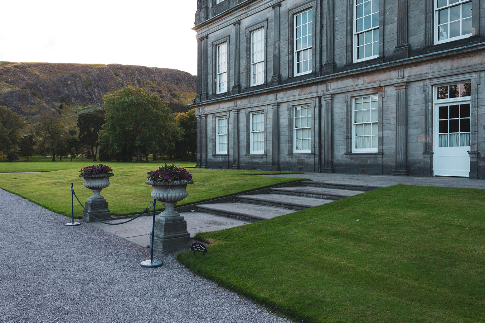
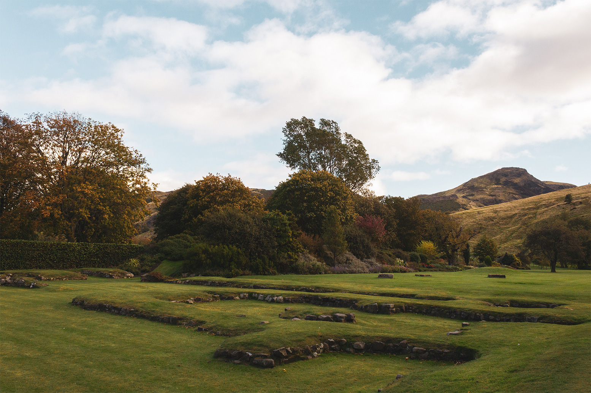

</gallery>

## Edimbourg : Artur’s Seat

Edimbourg est construite entre plusieurs collines, toutes offrant un point de vue sur la ville. Le plus connu et sûrement le plus mérité est Artur’s Seat ; un ancien volcan éteint depuis plusieurs milliers d’années. Cette colline, située dans le Holyrood Parc, culmine à 251 mètres de hauteur et offre une vue à 360 degrés sur la capitale écossaise. On aperçoit le Château surplombant la ville, Holyrood Palace évidemment, mais aussi Carlton Hill, Leith et la mer du nord au loin.

Nous avons eu la chance de faire la randonnée un jour de beau temps. Et, une fois arrivés au sommet, la vue vaut vraiment l’effort ! Le soleil baignait la ville d’Edimbourg d’une lumière dorée, c’était beau !

L’ascension est relativement aisée, quoiqu’il existe différents chemins pour atteindre le sommet, de difficultés variable. En revanche, je conseille à quiconque souhaitant faire cette balade de porter de bonnes chaussures, qui accrochent, car la dernière partie du chemin reste très accidentée. Avec mes Timberland, aucun souci, mais j’ai trouvé les personnes, en petites chaussures de ville et fine semelle, un peu ridicules ...

Attention aussi, car c’est très venté là-haut. C’en est même presque apeurant ! Les rafales soufflant très, très fort. On hésite longuement (et on reste prudent) avant de s’approcher du rebord de la falaise !

<gallery>
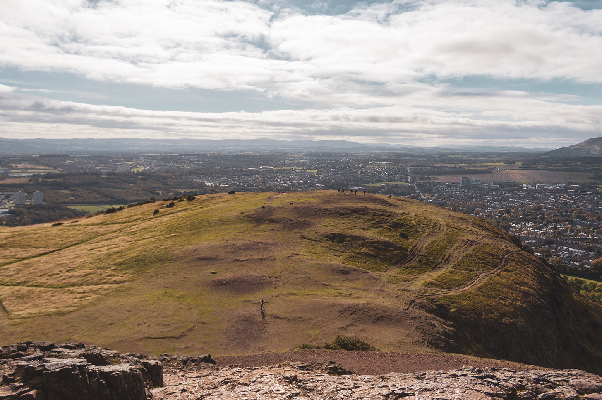
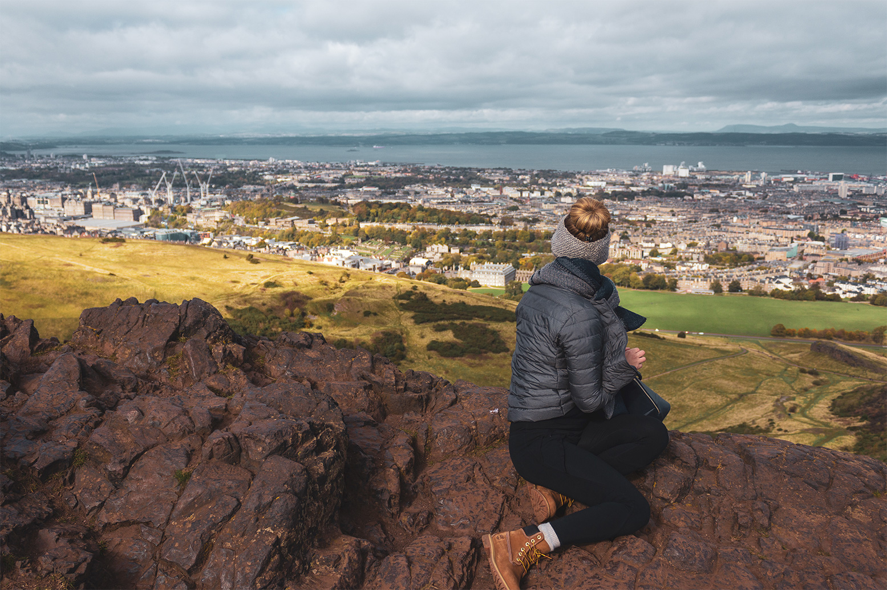
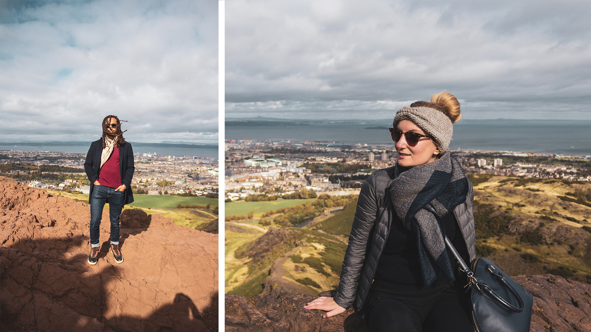
</gallery>

## Edimbourg : La Old Town

La vieille ville d’Edimbourg est la partie la plus connue et visitée de la capitale, car elle a conservée presque la totalité de son aspect médiévale et des bâtiments d’époque. Elle est d’ailleurs inscrite au patrimoine mondial de l’UNESCO !

C’est dans la Old Town que l’on trouve le fameux Royal Mile, cette grande rue centrale de 1,6 km de long, reliant le Chateau d’Edimbourg à Holyrood House. Le Royal Mile est LA rue pour faire ses emplettes touristiques : cashmere, fudge, souvenir écossais, j’en passe et des meilleurs !

Perpendiculaires au Royal Mile, vous verrez de nombreuses longues et étroites ruelles intitulés “ ... close”. Ces passages rappellent les Traboules Lyonnaises et forment un véritable petit labyrinthe. La plus connue et plus ancienne est “Mary Kings Close”, aujourd’hui devenu un sous-terrain après la construction d’un bâtiment du gouvernement par-dessus. La visite du passage (payante) permet d’en apprendre d’avantage sur la vie à Edimbourg au XVIIe siècle ainsi que la terrible période de peste qui a ravagé la ville !

Les closes. Mais aussi, Cockburn Steet, Victoria's Street, Grass Market, Candlemaker Row ... Se balader dans la Old Town, c’est finalement avoir le sentiment de se retrouver dans un décor de film à chaque coin de rue ! Je pense personnellement à Harry Potter et son “Chemin de Traverse” aux nombreuses boutiques en tout genre et aux milles couleurs. D’ailleurs pour les fans, on est passé devant le « Elephant House », sans pour autant rentrer à l’intérieur, mais simplement pour le clin d’œil.

On recommande vraiment de simplement déambuler et se perdre dans le quartier pour en apprécier toute sa splendeur.

<gallery>

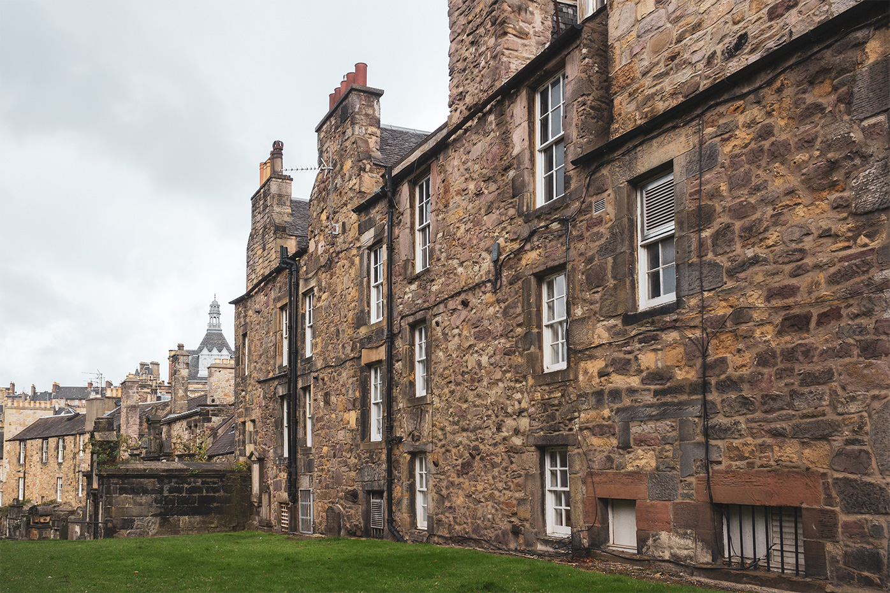

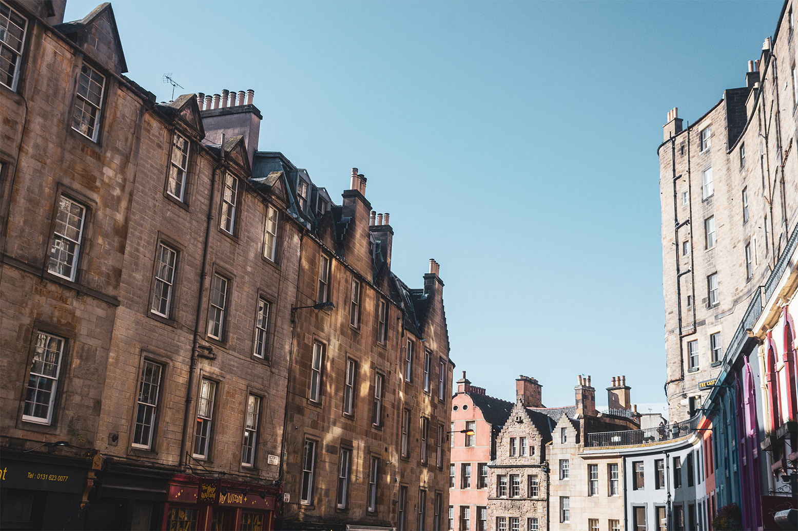
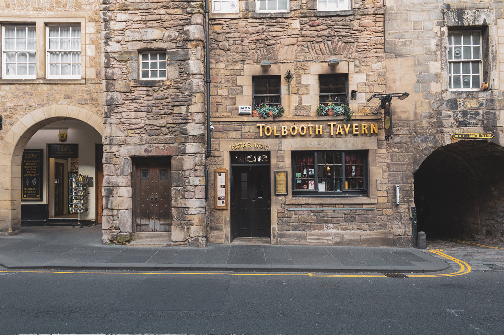
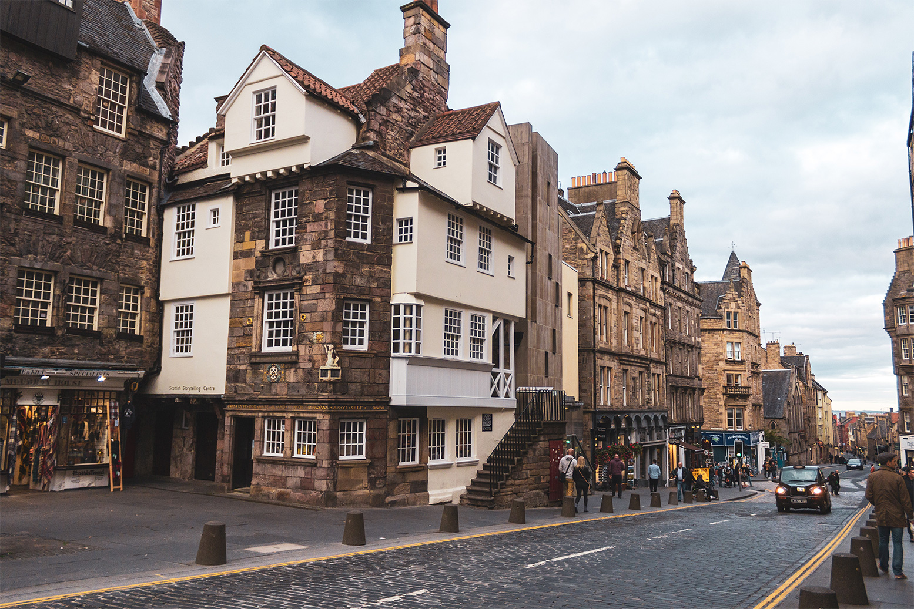
</gallery>

## Edimbourg : La New Town

Comme toute capitale, Edimbourg a subit un plan de restructuration urbain au 18e siècle, à la suite à une expansion massive de la population. C’est ainsi qu’est né le quartier de “New Town, désormais partie centrale de la capitale écossaise. La New Town a, elle aussi, gardé en grande partie ses bâtiments au style néo-classique et géorgiens ; elle fait, aussi, partie du patrimoine mondial de l’UNESCO.

Les rues les plus connues sont Princes Street, qui fait face au splendide château d’Edimbourg, Georges Street ainsi que Rose Street. C’est aussi dans cette zone que l’on retrouve les grandes enseignes commerciales.

<gallery>
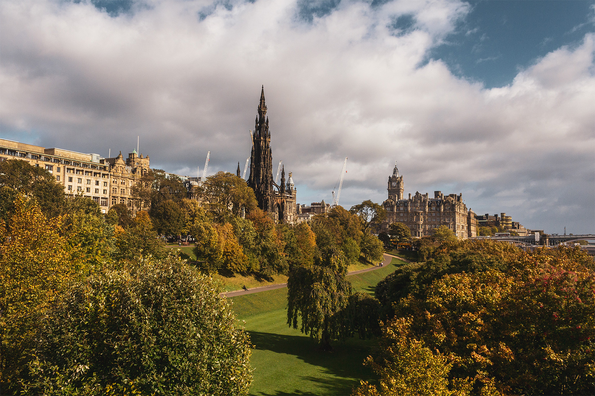

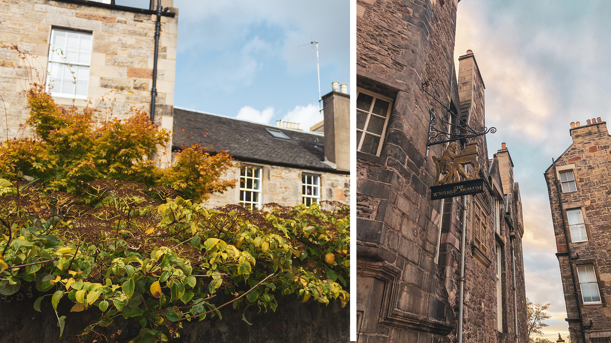
</gallery>

## Edimbourg : Deans Village

Si l’on continu en direction du Nord-Ouest après New Town, vous trouverez l’un des plus beaux endroits (la ville entière est belle de toute façon !) de la capitale : Dean Village. Ce quartier d’Edimbourg est une véritable oasis de verdure, de calme et de tranquillité, à quelques pas du centre-ville seulement !

On se retrouve plongé au cœur d’un village écossais du XVIIe siècle. En se promenant de long de « Water of Leith Walkway », on en oublierait presque que l’on se trouve à Edimbourg ! C’était tout simplement apaisant. Il n’y a pas grand chose d’autre à dire hormis que nous ayons adoré cette “pause” au vert et que nous nous y attendions pas vraiment. Ce fut une belle surprise. Il est possible de continuer le chemin pendant 13 km environ et de rejoindre Leith et la plage sur la mer du Nord. Je suppose que cela doit être un grand classique pour les habitants d’Edimbourg les week-ends de beaux temps, encore plus à cette période de l’année, quand la nature nous offre une palette de couleurs resplendissantes.

<gallery>
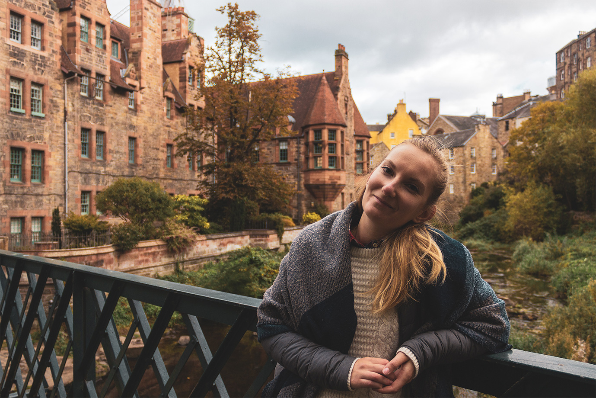
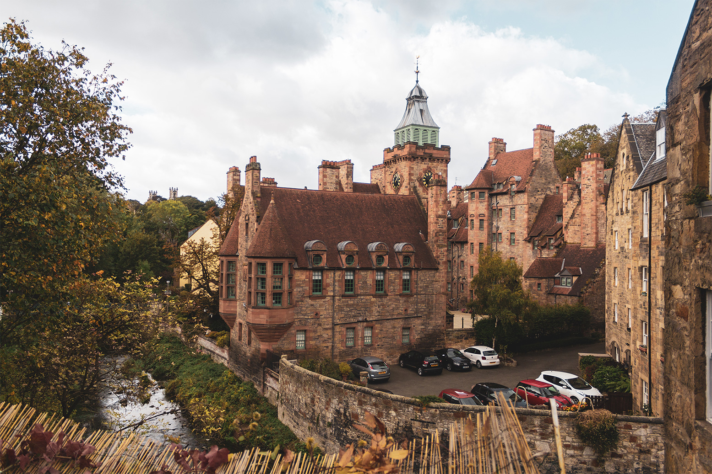

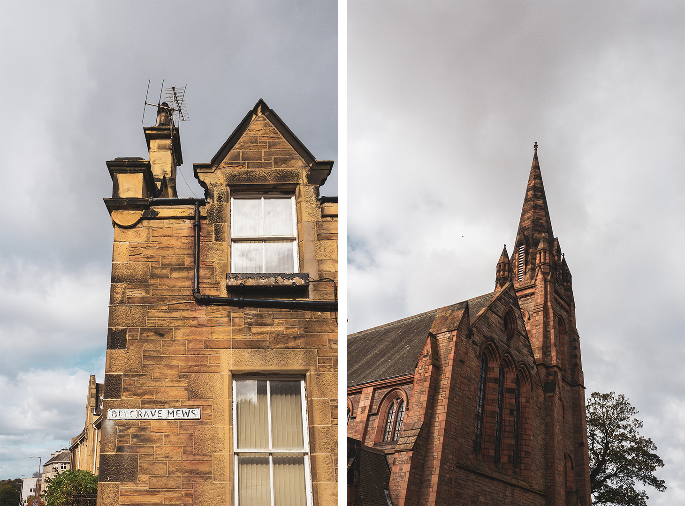
</gallery>

## Edimbourg : quelques addresses:

- Pour dormir  : [Radisson Blue Hotel](https://www.booking.com/hotel/gb/radisson-sas-edinburgh.fr.html)
- Pour la pause goûter / le brunch : [Fredericks Coffee & Wine](https://www.frederickscoffeewine.com/)
- Pour les fans d'Harry Potter : [The Boy Wizard ](https://www.facebook.com/The-Boy-Wizard-169220787227833/)
- Pour prendre l’apéro / dinner :[ Veeno, Italian Wine Cafe](http://www.theveenocompany.com/)
- Pour une spécialité typique : [Fudge Kitchen](https://www.fudgekitchen.co.uk/en)

---

## Pour finir ...

Visiter Edimbourg fin septembre fut selon moi l’une des meilleures décisions. 😉 La météo fut vraiment en notre faveur et nous a permis d’apprécier au maximum la ville et ses paysages. Et puis, nous sommes arrivés à la plus jolie période de la saison, quand les arbres se revêtent doucement de couleurs rouges & dorées. (Et je crois bien que je ne dirais jamais assez que j’adore l’automne !)

On a d’ailleurs été agréablement surpris de voir à quel point il est facile de s'évader du brouhaha de la ville à Edimbourg. Entre les nombreux parcs et jardins, Artur’s Seat et Dean Village, entre autres, cela ressemblait presque, à mon grand plaisir, à un week-end à la campagne.

L’architecture de la ville est tout simplement magnifique. C’est un doux mélange entre style architecturale gothique, géorgiens avec une grande inspiration de l’antiquité grecque. La ville est d’ailleurs surnommée l’Athènes d’Écosse ; tel un véritable carrefour de culture, d'échanges et de savoir.

De plus, la culture écossaise fait partie intégrante de la ville. C'est surtout l'attrait littéraire qui transparaît le plus en visitant Édimbourg. Là-bas, on est fier de ce patrimoine. On est fier d'avoir vu naître ou d'avoir accueilli de grands auteurs. En nous baladant dans les ruelles, on imagine combien cela à pu être inspirant pour des écrivains telle que J.K. Rowling (Harry Potter) ou bien Arthur Conan Doyle (Sherlock Holmes) : l’ambiance mystique des “close” — ces petites ruelles dans la Old Town, les nombreuses légendes et histoires de fantômes liées à la culture celtique, les bâtiments d’inspiration Gothique et antiques — tout est fait pour trouver l’inspiration.

---

Cette ville fut pour moi un véritable coup de coeur. Mon amour pour l’Écosse n’en est que grandit ! Je rêve déjà de revenir fouler les pavés du Royal Mile, pourquoi pas m’acheter un vrai Cashmere et surtout d’en découvrir d’avantage sur cette ville au patrimoine culturelle, littéraire et architectural si riche !
