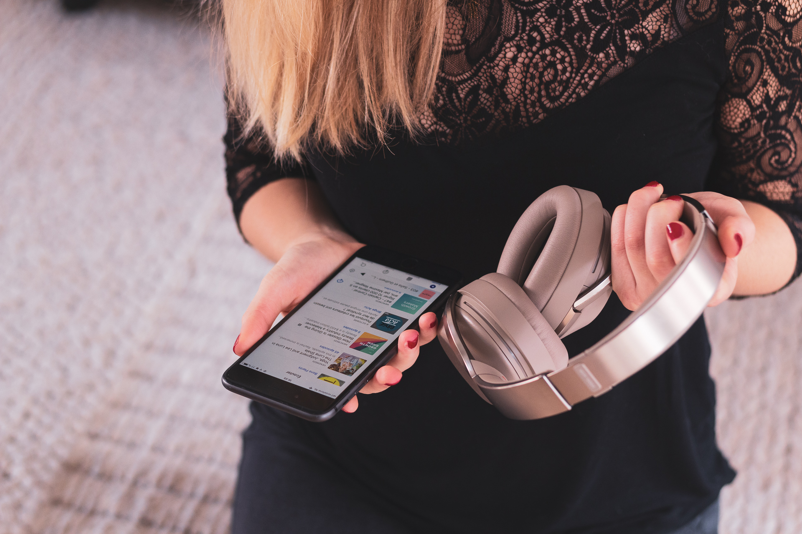
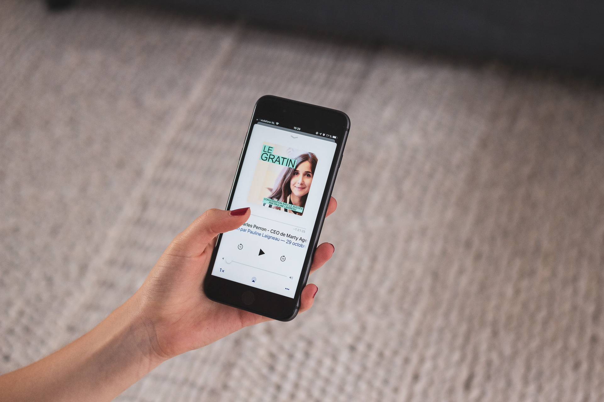
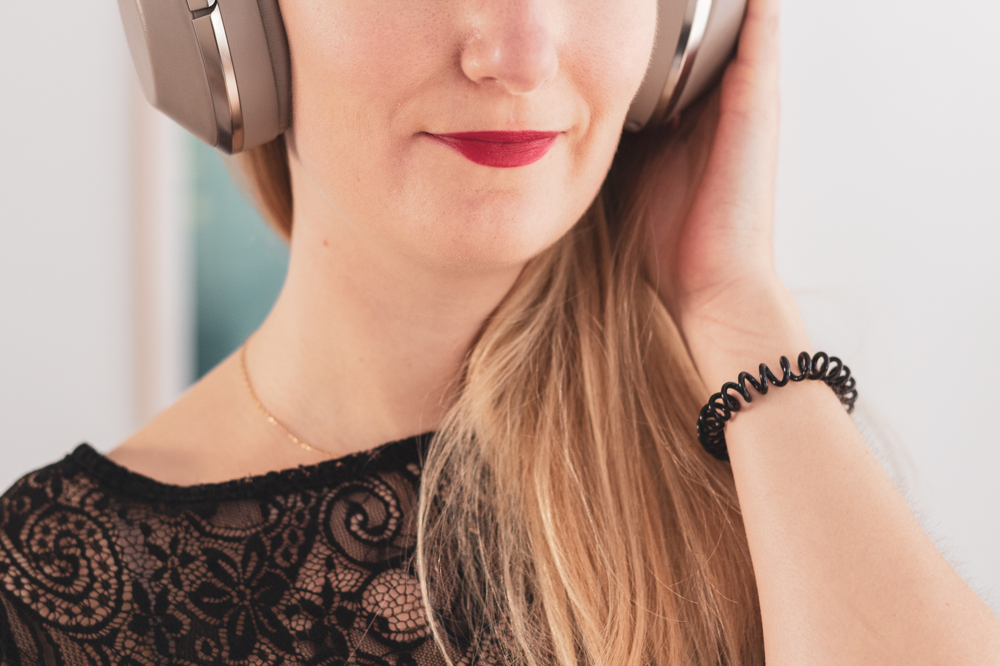

_Aujourd’hui, on se retrouve pour un article lifestyle puisque je voulais partager avec vous mes podcasts favoris du moment._

## La découverte des podcasts

L’année dernière, j’avais découvert les livres audios. J’étais tombée amoureuse du concept en écoutant la saga Harry Potter. Je les écoutais pour la plupart du temps lors de mes trajets à vélo. Quel grand plaisir s’était ! Je me souviens avoir explosé de rire ou bien presque pleuré en écoutant certains passages.

Mais aujourd’hui ce n’est pas de livres audios dont nous allons parler, mais bien de **podcasts** !

Très récemment, je me suis aussi mise à écouter des podcasts, ces formats audios diffusés librement sur le web. Au début, quand j’ai entendu parlé des podcasts, j’avais peur de me retrouver à écouter une “banale” émission de radio en décalé. À force de voir certaines recommandations de personnes que je suis sur Instagram, je me suis finalement laissée tenter. Ce fut une fantastique découverte ; tout un nouveau monde qui s’ouvrait à moi !

Tout comme les livres, il est existe des podcasts pour tous les goûts. Littérature, culture, lifestyle, histoire, fiction, information, j’en passe et des meilleurs.

### Mon expérience personnelle

Tout d'abord, je me suis orientée vers des podcasts pouvant m’apporter de la connaissance. Ayant déjà mes livres et ma kindle à la maison, je n’ai pas trop cherché du côté des podcasts racontant des histoires ou des mystères. Je me suis surtout intéressée à des thématiques professionnelles : l’expérience utilisateur, la vie en startup, le Growth Marketing etc.. Manquant cruellement le temps pour lire des blogs, je me suis dit que le podcast pouvait être une bonne alternative.

Puis, de recommandations en recommandations, je me suis dirigée vers des thématiques plus personnelles : le yoga, le minimalisme et le green, la réussite pro & perso, le jardinage, etc..

---

_J’espère qu'au moins l’un de ces podcasts résonnera en vous ou bien, à défaut d’en trouver un qui vous plaise, que cet article saura éveillé votre curiosité quant à ce format encore peu populaire en France._

<gallery>

</gallery>

## Les podcasts — Mode d’emploi

En cherchant une définition simple du Podcast, je suis tombée sur cette citation que je trouve très pertinente :

> Le podcast est aux média d’aujourd’hui ce que la radio libre était à la radio d’état dans les années 80.

Ainsi, les podcasts sont des émissions audios produites de manière indépendantes par des passionnés, dans un ton unique et convivial. Ce sont des conversations, telles que l’on pourrait en avoir avec des amis autour d’un café.

À l’instar d’une série TV, les podcasts fonctionnent sous forme de saisons, aux quelles vous vous abonnez, gratuitement, afin de recevoir les nouveaux épisodes dès leur parution.

Il existe de nombreuses plateformes et application pour écouter des podcasts, les plus connues étant “Podcast” (iOS), Soundcloud, Spotify et Podcast Addict (Android). De plus, le créateur du podcast propose très souvent un site web sur lequel vous pouvez retrouver très facilement les liens des épisodes vers les différentes plateformes de diffusion.

## Podcast : Bons plants

### Le thème

**[Bons Plants](https://www.bonsplants.com/)** est un podcast bimensuel ayant pour thème général “la Nature en Ville” et “l’agriculture urbaine”. Toutes les deux semaines, Thibaut Schepman, journaliste spécialisé sur l’environnement, part à la rencontre de cultivateur urbains, amoureux de la nature, vivant en ville. Bons Plants, ce n’est pas qu’un podcast, mais aussi une newsletter bien chouette remplies de petites astuces et autres infos bien pratiques en rapport avec la thématique du podcast du moment.

Bons Plants est proposé librement par Upian et Binge.Audio. Enfin, chaque épisode dure une vingtaine de minutes environ.

### Ce que j'aime

Bons Plants, c’est une petite bouffée d’air frais et de nature. De part le format assez court, c’est le podcast parfait pour mon trajet au Yoga. Grâce à Bons Plants, j’ai découvert qu’il possible d’avoir des abeilles sur son balcon, que les poules sont attachantes, que le compost, ce n'est pas si compliqué, que moins on en fait, mieux la nature se porte. Bref, pour tous les apprentis jardiniers, ce podcast est une petite mine d’or d’idées et d’astuces green. Sans prétention, ce sont des conversations uniques et très personnelles, avec des acteurs de la nature, comme vous et moi.

### Mon épisode favori

L'épisode #05 - intitulé [« A Paris, Diane cueille et élève des abeilles au naturel”](https://us17.campaign-archive.com/?u=ef4ab8055f74b4823ac7e4653&id=47f776628a) est l’un de mes favori. Je n’avais aucune idée qu’il était possible d’avoir des ruches d’abeilles à titre “personnel”, encore moins en ville, ni même à Paris ! Je trouve la conversation avec Diane fascinante. De plus, cela nous rappelle à quel point les abeilles sont des petits être formidables dont il faut prendre grand soin !

## Podcast : Chalalove

### Le thème 

**[Chalalove](https://www.gemmyo.com/chalalove.html)**, comme son nom l’indique si bien, parle d’amour. Pas l’amour des petits chats, non l’amour avec un grand A ! À chaque épisode, Pauline Laigneau, co-fondatrice de la maison de Joaillerie _Gemmyo_, invite un couple pour parler, durant une vingtaine de minutes, de leur histoire, leur expérience et leur conseil.

Chalalove c’est avant tout une conversation légère et joyeuse avec des couples qui nous ressemblent, plus ou moins, et qui tente de dévoiler ce qui fait que l’on tombe amoureux ou que l’on reste ensemble pour toute la vie.

Chalalove est produit gratuitement par _Gemmyo_, avec un nouvel épisode disponible proposé le mardi tous les 15 jours.

### Ce que j'aime

Chalalove, c’est le genre de podcast feel-good qui met du baume au coeur. C’est mon petit côté romantique, je suppose. Chalalove nous rappelle que chacun à sa manière d’aimer, d'appréhender l'amour, de le communiquer, de le vivre. L’amour n’est pas un, mais plusieurs !

De plus, le format court est, je trouve, très pratique. Cela permet d’écouter l'épisode d’une traître, le temps d’un trajet ou bien que le gâteau dans le four finisse de cuir !

### Mon épisode favori

Mon épisode favori est aussi le plus long étonnamment ! Dans cet épisode, Pauline invite Fab & Cath, 23 ans d’amour au compteur ! Si vous connaissez le site [madmoizelle.com](http://madmoizelle.com), alors vous connaissez sûrement Fab, fondateur de ce webzine féminin en ligne. Sans trop rentrer dans les détails, j’ai trouvé la conversation très honnête et personnelle, les expériences faisant plus ou moins écho aux nôtres. Bref, c’est attachant et surtout sujet à introspection vis-à-vis de son propre couple.

## Podcast : Le Gratin

### Le thème

**[Le Gratin](https://podcast-cremedelacreme.com/)** (ex Crème de la crème) est “une conversation sur le succès.” Chaque épisode, qui dure une grosse heure, ont pour objectif de nous partager les clés du succès. Cela peut aller de la simple astuce au véritable état d’esprit en passant par le simple coup de bol, mais aussi, et surtout, la vraie poursuite de l’effort. L’idée de ces conversations est de tirer les enseignements de chaque invité, de s’en inspirer, et pourquoi pas, à son tour, lancer ses propres projets.

Présenté par Pauline Laigneau (encore !), le Gratin est mon petit favori français ayant pour thème la réussite au sens large. Le podcast est relativement tourné entrepreneuriat, mais explore de nombreuses thématiques différentes : le sport, la gastronomie, la médecine, la santé, le blogging, le design, le journalisme, etc..

Chaque semaine, Pauline propose des invités aux histoire uniques, tous plus intéressants les uns des autres !

### Ce que j'aime

Bon vous l'aurez compris, j’aime bien Pauline Laigneau. 😉J'ai découvert le podcast Le Gratin en écoutant son interview sur [Growth Makers,](https://growthmakers.fr/) un podcast focus sur la “growth” et les start-up française (l’un des rares en français ceci dit !). J’avais beaucoup aimé son histoire et surtout pourquoi son mari et elle ont décidé de lancer leur propre maison de Joaillerie Gemmyo en 2011.

J’ai aussi trouvé le thème de son podcast très intéressant, sans trop de prétentions. Comme si finalement, avec les bons conseils, la réussite était plus ou moins accessible à tous. Pas besoin d’avoir envie de monter une boite pour s’intéresser à ce podcast. Je pense que les grands principes et les conseils partagés peuvent s’appliquer à de nombreux domaines de notre vie, pro ou perso !

### Mon épisode favori

Choix difficile ! Je dirais que l’épisode avec [Stéphanie Gicquel](https://podcast-cremedelacreme.com/2018/08/21/19-stephanie-gicquel-sportive-de-lextreme/) m’a beaucoup impressionnée, non tant par le discours tenu, mais par l’audace et le courage de cette aventurière de l’extrême ! J’ai aussi beaucoup aimé la conversation de Pauline avec [Guillaume Gibault](https://podcast-cremedelacreme.com/2018/05/22/11-guillaume-gibault-ceo-du-slip-francais-la-fabrique-a-idees/), CEO du Slip Francais ou encore [Katalin Berenyi](https://podcast-cremedelacreme.com/2018/10/01/25-katalin-berenyi-entrepreneur-malgre-elle/) fondatrice de d’Erborian.

Je n’ai encore pas écouté l'intégralité les épisodes disponibles. Le format étant assez long, cela me prend plusieurs trajets de yoga pour finir un épisode ! Mais je suis persuadée que chaque épisode puisse parler à tout le monde.

## Podcast : Yoga Girl (en anglais)

### Le thème

Pour finir, un podcast en anglais, celui de la très populaire Rachel Brathen aka Yoga Girl. Rachel a décidé de lancer en mars 2017 son podcast **“[From The Heart — Conversation With Yoga Girl](https://www.yogagirl.com/listen)”.**Dans ce podcast Rachel partage ses expériences et explore différentes thématiques qui lui sont chères ; l’image de soi, la confiance, la vulnérabilité, le bonheur, avoir un impact positif sur le monde.Parfois seule, parfois accompagnée d’invité surprise, les conversations avec Yoga Girl sont diffusées chaque vendredi et durent en moyenne 1h15.

### Ce que j'aime

Si vous suivez Yoga Girl sur les réseaux sociaux, vous savez à quel point Rachel aime partager son expérience de la vie, du yoga, de la maternité, de l’entrepreneuriat, de l’amour et beaucoup d’autres choses encore. Les sujets abordés durant son podcast sont parfois très, très personnels (elle raconte par exemple tous les détails de son accouchement), mais cela reste toujours sur un ton joyeux et avec une honnêteté sans précédent.

J’aime la manière dont Rachel raconte. Ce n’est pas chiant, ni trop égocentrique. Et puis, les épisodes avec son mari Dennis sont parfois dignes d’un épisode d’une série comique et toujours très drôles à écouter.

### Mon épisode favori

Pas d’épisode favori en soi. J’aime écouter un épisode de temps à autre, simplement pour me redonner le sourire ou bien me divertir. Conversation From The Heart, c’est mon Friends version audio.

---

En bref, je suis vraiment conquise par les podcasts. Ce format audio est vraiment pratique. Consommer une information, écouter une histoire, découvrir un nouvel univers est tout à coup très simple. Et contrairement à une vidéo, un article de blog ou bien même un livre papier, je peux écouter un épisode un peu n’importe où, n'importe quand : en cuisinant, en pédalant, en marchant, et même en ne faisant rien du tout !

Comme je vous le disais plus haut, il existe des centaines de podcasts librement à disposition sur le net, et encore plus si vous comprenez l'anglais ! J’ai encore moi-même de nombreux podcasts à découvrir ! D’ailleurs, n’hésitez pas à partager vos podcasts favoris du moment, je me ferais un plaisir d’aller les écouter !

Pour finir, j’espère que cette sélection vous aura plu, du moins que j’aurais su, à mon tour, vous convaincre d’écouter des podcasts.

Et vous, vous écoutez des podcasts ?
