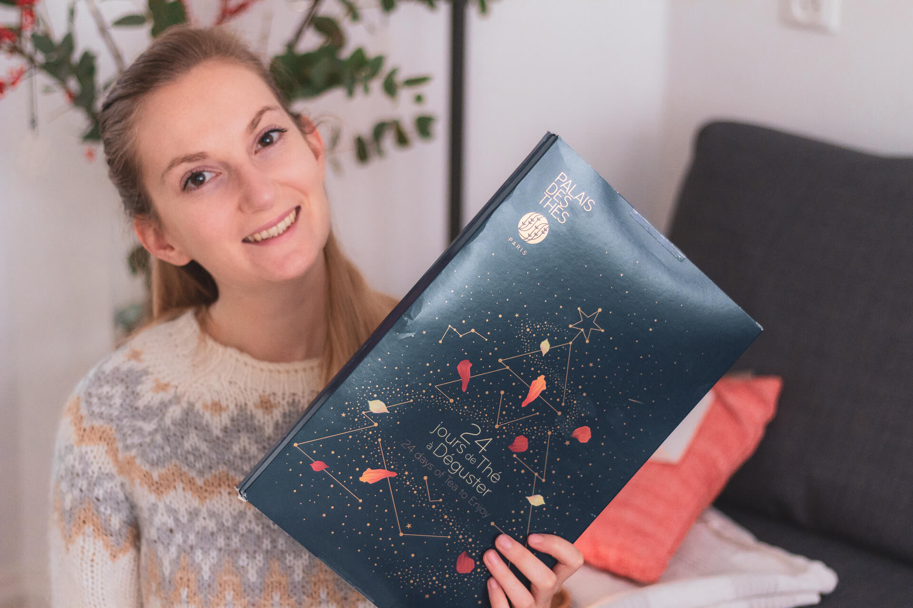
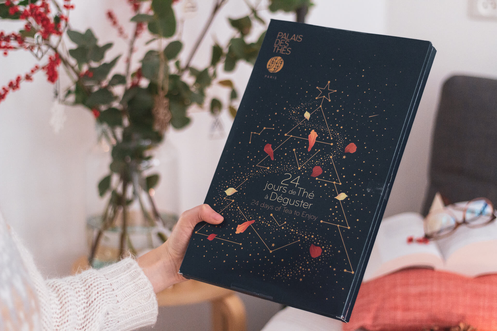
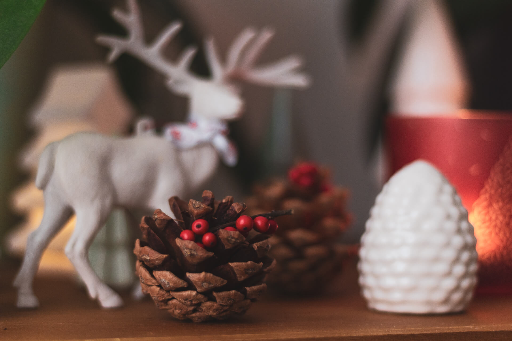
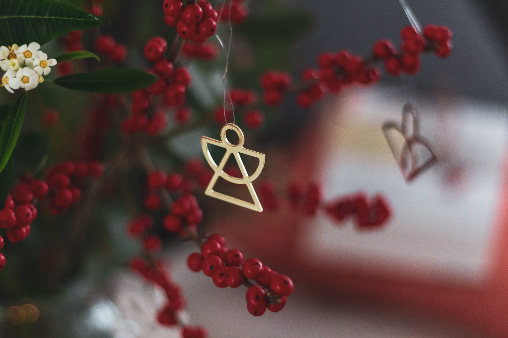
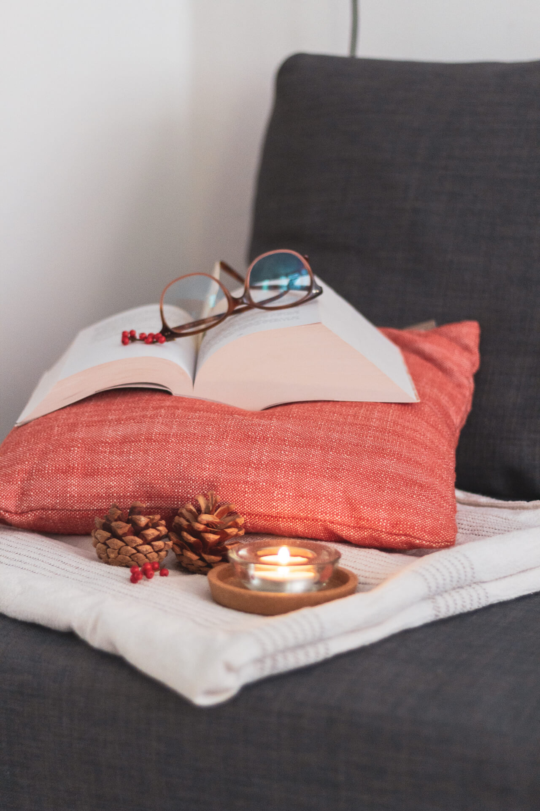
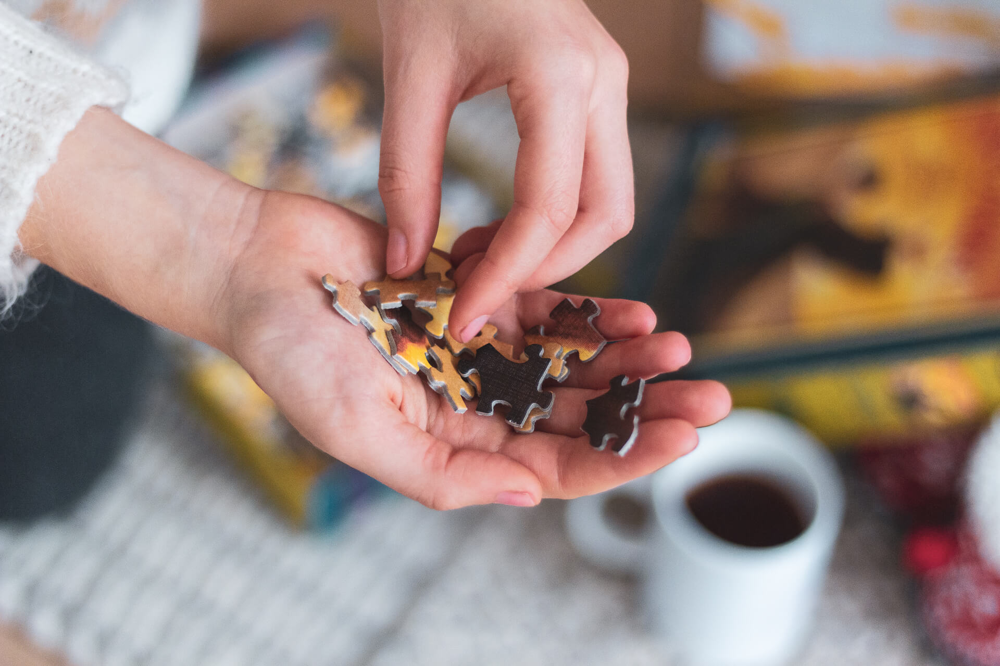
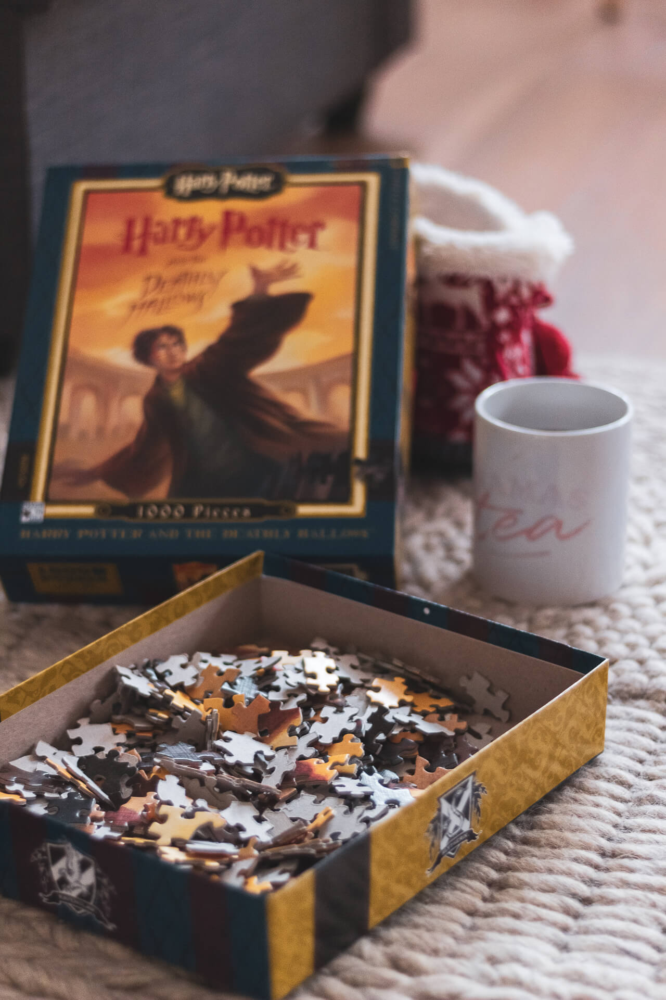
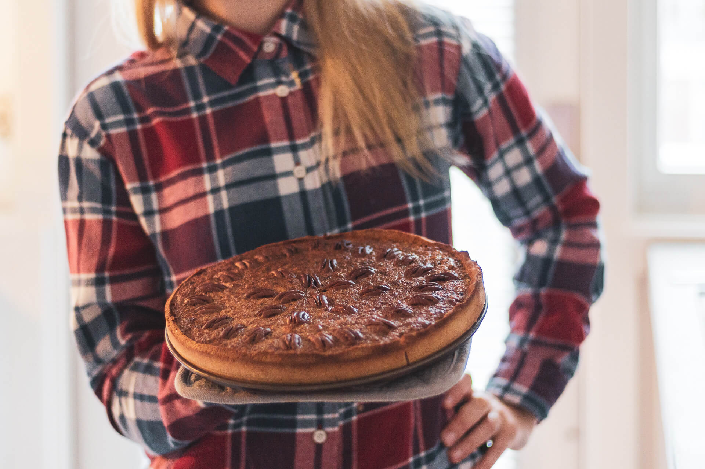

Nous voici déjà à la fin du mois de novembre ! Les journées raccourcissent et le temps défile un peu à toute vitesse. Ce n’est pas métro-boulot-dodo mais presque, et l’automne laisse peu à peu place à l’hiver et son manteau d’air bien froid.

---

De notre côté la **routine hivernale** s’installe aussi tout doucement. On a ressorti notre bouillotte mais cette dernière, après de bons et loyaux services, a décidé de prendre sa retraite : elle fuit. Je ne suis que tristesse depuis. Mon monde entier du cocooning s’est effondré. Enfin, non je rigole (à moitié quand même), mais c’est vrai qu’on l’aimait bien cette bouillotte, le soir à nos pieds, sous la couette, dans le lit !

Enfin, bouillotte ou non, la saison du cocooning est plus qu’ouverte et c’est tout en buvant une tasse de Thé « [Vive les Fêtes](https://www.palaisdesthes.com/fr/vive-les-fetes.html) » bien chaude que je vous écris cet article aujourd’hui, et je ne peux que vous conseiller d’en faire autant, le temps de votre lecture 🙂

<gallery>

</gallery>

## Noël J-30

Nous sommes le dernier week-end de novembre. Cela veut dire que la semaine prochaine, on ouvre la première case du traditionnel **Calendrier de l’Avent !** 😄 Cette année encore, point de chocolats, mais bien du thé à déguster chaque matin au petit déjeuner. Cela fait la troisième année que nous achetons le [Calendrier de l’Avent](https://www.palaisdesthes.com/fr/calendrier-avent-2018.html) du Palais des Thés, et nous en sommes toujours ravis.

<gallery>

</gallery>

Il reste donc **30 jours avant Noël**! Comme nous ne restons pas sur Amsterdam pour les fêtes (je m’envole dès le 15 décembre pour les Hautes-Alpes), j’ai toujours un peu de mal avec le fait de décorer l’appartement. Je rêverais de mettre un sapin, mais quand bien même, ce n’est pas franchement raisonnable et surtout pas très sympa pour la planète de couper des petits sapins simplement pour 15 jours de décoration (quand bien même un sapin naturel reste toujours moins impactant qu’un sapin artificiel — [Voir l'article sur le blog Santaisgreen](https://santaisgreen.com/2018/11/13/limpact-ecologique-du-sapin-de-noel/).

À défaut, j’ai transformé le “meuble aux orchidées” en petite forêt de Noël miniature. J’ai accroché plein de guirlandes lumineuses dans la maison et j’ai une consommation un peu excessive de bougies. Un bouquet de saisons est posé dans le salon, auquel j’ai ajouté quelques petites décorations. Et voilà qu'avec peu de choses, j’arrive finalement à créer une ambiance de Noël cosy et chaleureuse !

<gallery>

</gallery>

## Home Sweet Home

Comme nous sommes moins en vadrouille ces derniers mois, nous passons davantage de temps **à la maison** le week-end. C’est comme ça, que voulez-vous. L’hiver venant, je n’ai qu’une envie, rester chez moi, au chaud à boire du thé, faire (manger) des gâteaux et lire des livres. _Mamie Clémence, bonjour !_

On en a aussi profité avec Alexis pour effectuer un grand tri. Ce n’est pas le ménage de printemps mais presque. On vous explique tout d’ailleurs dans cet article “[Désencombrer pour mieux ranger - Nos 5 conseils](desencombrer-nos-5-conseils/)”. C’est tellement agréable de vivre dans une maison rangée, surtout quand on y passe beaucoup de temps comme nous !

Après des derniers mois riche en découverte, c’est l’occasion désormais de lever un peu le pied et, comme la nature, de passer en mode “hibernation”. J’ai ressorti mes gros pulls doudou depuis un moment déjà et je me réjouis de re-porter mes Timberlands ! J’ai aussi fait un stock de Thé de saison spécial Noel du Palais des Thés. D’ailleurs, leur création 2018 « [Thé des Étoiles](https://www.palaisdesthes.com/fr/the-des-etoiles.html) » est un vrai délice ! J’ai aussi des envie de films de Noël, de me (re-)faire l’intégralité des Harry Potter, et surtout, j’ai un bon petit stock de livres dans ma bibliothèque !

## Des livres ... Et des puzzles

#### Outlander

En parlant de livres, je me suis à nouveau plongée dans **Outlander**. Je suis désormais au Tome 5,**La Croix de feu**. Je suis tellement contente de retrouver les personnages de Claire et Jamie. C’est en partie dû à cette série de romans fantaisie (et Harry Potter) que j’ai toujours rêvé de découvrir l’Écosse. D’ailleurs, n’hésitez pas à (re-)lire le récap de notre "[long week-end à Édimbourg](week-end-48h-edimbourg/)".

Outlander est un véritable pavé de 1524 pages. J’en suis pour l’instant à peine à la 346 pages. Je crois que je n’ai jamais lu un livre aussi épais !

Comme c’est un véritable pavé et que je ne veux pas me sentir “blasée” de l’histoire, je prends mon temps. J'alterne donc avec des lectures plus “pro”, des livres en rapport direct avec mon travail.

Sur [Goodreads](https://www.goodreads.com/user/show/63307481-cl-mence), le réseau social dédié à la lecture, j’avais mis mon “Challenge Lecture” de 2018 à 25 livres. J’en suis à peine à 12. Je suis quasiment certaine que je n’arriverais pas à terminer le challenge, mais ce n’est pas très grave. J’ai quand même l’impression d’avoir lu régulièrement (et puis Outlander devrait compter pour 3 livres tant il est gros !).

<gallery>

</gallery>

#### Harry Potter

En plus de lire, je me suis ramenée un souvenir un peu spécial d'Édimbourg. Nous étions passés à une boutique Harry Potter et, ne voulant pas acheter un objet inutile, j’ai opté pour un **puzzle**. En plus, ceux-ci sont fait entièrement en carton recyclé, “localement” aux USA.

C’est un puzzle de 1 000 pièces d’une illustration de Mary GrandPré pour la couverture originale du tome 7 « Les reliques de la mort ». Je pensais qu’il serait terminé assez rapidement. Oh malheur, aurais-je parlé trop vite ? Je n’ai jamais vu un puzzle aussi difficile : les pièces, déjà qu’elles sont petites, sont toutes irrégulières, à tel point que je n’ai toujours pas réussi à finir le contour. Mais j’avance, petit à petit. Et je dois dire que c’est une activité très relaxante bien que très chronophage si on ne fait pas attention au temps qui passe !

En bref, un puzzle parfait pour les longues soirées d’hiver et après une bonne journée de travail.

<gallery>

</gallery>

## On reste actif

Bon, on ne passe pas notre temps à glandouiller non plus, on fait aussi du **sport** ! Cela n’en a pas tout l’air dit comme ça, mais ces deux derniers mois je n’ai jamais été autant active ! Depuis que nous sommes rentrés de Sardaigne, nous avons repris de **très** bonnes habitudes sportives. Comme expliqué dans cet article « [On a testé les piscines à Amsterdam](piscines-amsterdam-test-avis/)”, nous allons nager une fois par semaine. En plus de cela, il y a le yoga, la salle de sport et la séance running du week-end. Cela fait au total une activité physique chaque jour de la semaine.

Moi qui ait tendance à me considérer comme non-sportive, je me surprends moi-même à être capable de faire autant et surtout de sentir mon corps devenir bien plus fort au fil des semaines !

## On fête Thanksgiving entre amis

En ce dernier week-end du mois de novembre, je ne pouvais pas ne pas vous parler de **Thanksgiving**. Mon ancienne collègue américaine, Cayci, nous a invité pour une soirée “Friendsgiving”.

L’idée de Thanksgiving étant avant-tout de bien manger et de passer un moment en famille / amis, chacun avait pour mission de ramener un plat préparer par leur soin. Pour rester dans la tradition, j’ai préparé une délicieuse tarte aux noix de pécan, la fameuse “Pecan Pie” sur une base de pate sablé sans gluten. Elle était parfaite !

---

J’adore **Amsterdam** la période des fêtes venant. Même si ici la saison de Noël ne démarre pas avant la Saint-Nicolas, le 5 Décembre, on aperçoit petit à petit les maisons décorées et les sapins illuminés.

Bien sûre, les journées raccourcies, la pluie et le manque de lumière naturelle ne sont pas toujours agréable, mais hors de question de céder à la déprime hivernale. Je trouve au contraire que c’est une période parfaite pour justement nous tourner progressivement vers l’intérieur, le confort, la chaleur ; bref, prendre du temps pour soi, pour les autres et accueillir doucement la magie des Fêtes.

D’ailleurs, on se retrouve la semaine prochaine pour un article spécial Fêtes de Noël et fin d’années à Amsterdam, pour les chanceux venant visiter la capitale en cette période magique 😉

En attendant, je vous souhaite une jolie semaine.
