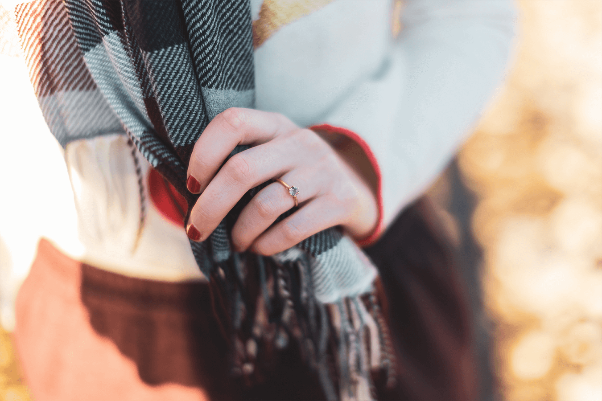

Bonjour à toutes et tous,

Je vous écris en cette période un peu latente, entre Noël et Jour de l’an, lorsque nous sommes encore en train de digérer le marathon de Noël, tout en commençant déjà les préparations des prochaines festivités.

Le passage à la nouvelle année est, pour moi, moins marquant que la “rentrée” de septembre. Je crois que je suis encore très attachée au rythme scolaire, que j’ai quitté depuis 2 ans déjà ! Pourtant, j’aime me prêter à l’exercice du traditionnel bilan de l’année passée. Faire le point. Et dresser les objectifs de l'année à suivre. Je me suis d’ailleurs bien amusée à relire mes précédents bilans, [ici](dnew-year/) et [là](hello2018/), partagés avec vous depuis plus de 3 années de suite maintenant !

Tout d’abord, Alexis et moi vous souhaitons une merveilleuse année 2019 à venir. Merci d’être là, de suivre nos quelques aventures et de nous lire ponctuellement. Nous continuerons à les partager avec vous en 2019 et on espère que vous serez là pour les découvrir. Enfin, nous vous souhaitons une année calme et sereine, pleines de curiosités, de découvertes, de sourires et de nombreux petits bonheurs.

---

Côté blog, nous allons vous partager d'avantage de contenus sur Amsterdam et j'espère même avoir la chance de vous proposer des visites guidées en français, ce dès le printemps prochain !

Pour nous, la fin de l’année 2018 ne semble pas si différente que la précédente. J’avais même écrit :

> _Une année 2017 placée sous le signe du travail et j’espère que 2018 sera placée sous celui de la stabilité !_

Je n’avais finalement pas si tord en affirmant cela. Alexis et moi avons tout deux étaient renouvelés, plusieurs fois, dans nos travails respectifs. Non pas que cela soit un grand exploit, simplement, nous avons passés une année 2018 sans grands changements, ni chamboulements. Nous avons suivi notre routine qui nous sied si bien. Et finalement, ce n’est pas si mal.

Pour autant, l’année 2018 ne fut pas de tout repos non plus. Elle fut, pour ma part, intense professionnellement parlant. Je crois que je me suis beaucoup investie dans mon travail, peut être même un peu trop parfois. Mais, j’ai beaucoup appris aussi ! Aussi, j'espère que j'apprendrais encore beaucoup en 2019, car c'est cela finalement qui m'intéresse. Apprendre, encore, et toujours !

Nous n'oublions pas non plus qu’en 2018, nous avons aussi beaucoup voyager. C’était d’ailleurs l’un de nos souhaits ; moins loin, plus souvent. [Lisbonne](lisbonne-meu-amor/), [Bath](fall-in-love-with-bath/), [Bordeaux](une-pause-a-bordeaux/), [la Sardaigne](vacances-sardaigne-nord-septembre/), [Édimbourg](week-end-48h-edimbourg/). Autant de belles découverte. Mon coup de coeur fut sans nul doute Édimbourg et je ne rêve plus que d’une chose désormais : partir à nouveau à la découverte de l’Écosse et de la si belle région des Highlands. J’ai aussi, sans grande surprise, adorée redécouvrir les rues le Lisbonne.

Mais, en 2019, j'aimerais prendre davantage le temps de découvrir les Pays-Bas, car il y a finalement tant à voir si proche de chez soi. Et pourquoi même, prendre le temps de découvrir à nouveau Amsterdam.

---

Et, comme en chaque fin d'année, je fais aussi le point lecture. 12 livres (et 2 en cours) au compteur de mon challenge lecture. Nous sommes loin des [25](https://www.goodreads.com/user/show/63307481-cl-mence) initialement prévus. Mais qu’importe, la lecture reste mon petit plaisir de fin de journée. Mon petit rituel dodo 😄 Aussi, j’espère, malgré la fatigue, malgré les obligations, les envies et les nombreux projets, continuer à prendre le temps de lire en 2019.

---

Enfin bref, 2018 : du sport, des voyages, le travail, les projets. Je pense que nous sommes satisfaits de cette année passée. Et j'espère que la votre fut aussi douce.

Mais finalement, la plus grande surprise de 2018 fut la belle et la plus inattendues des surprises : **Alexis et moi allons nous marier !** Vous ne pouvez deviner ma joie derrière ces quelques mots. Rien n’est prévu encore. Rien de bien défini. Mais une chose est bien sûre, 2019 (et 2020 même !) seront sous le signe de l’amour, soyez-en sûre ! Parce qu'**à deux, c’est mieux** ❤️

