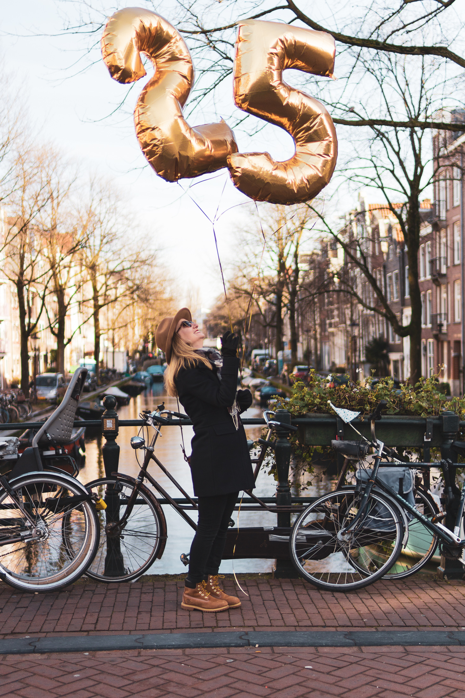
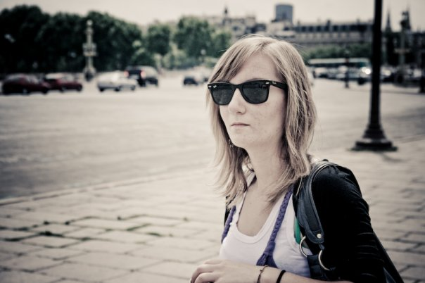
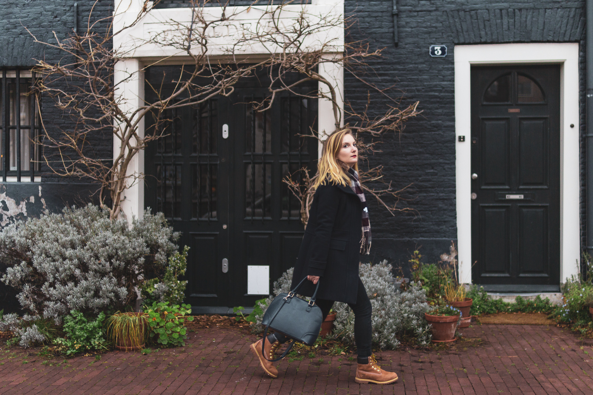

## Birthday Girl

Aujourd’hui nous sommes le 29 janvier 2019 et je fête aujourd’hui mes 25 ans !

---

Vous avez surement entendu parler du “10 year Challenge”, que ce soit sur Facebook ou bien Instagram. Cette “tendance” du début de l’année 2019 consiste simplement à poster une photographie de soi datant d’il y a 10 ans, et de la comparer à une photo très récente.

Futile ou pas, j’ai vu passer des dizaines de photos dans mon flux, tantôt drôles, tantôt inutiles ... La plus choquante fut certainement cette photo d’Iceberg. Comparer l’état de la banquise polaire en 2009 avec aujourd’hui est tout simplement effrayant !

En ce jour de célébration, je trouvais finalement que le “10 years Challenge” se prêtait finalement bien à la situation.

## En 2009, j'avais 15 ans

<gallery>

</gallery>

**En 2009, j’avais 15 ans.**Fort heureusement (ou pas), Facebook existait déjà, il ne fut pas compliqué de retrouver quelques photos, (parfois génantes soyons honnêtes !)

À 15 ans, période ingrate de l'adolescence, je ne souriais pas trop. Caractère de râleuse-éternelle insatisfaite.

Mais à 15 ans, j’avais déjà de grands rêves dans la tête. Et surtout Paris. Paris me fascinait. Paris me faisait vibrer. Je ne rêvais que d’une chose, partir à Paris.

À 15 ans, je savais aussi que l’anglais ferait parti de mon avenir. J’en étais déjà à mon deuxième séjour linguistique en Angleterre. La culture anglo-saxonnes me fascinait. Je ne jurais que par les USA et tout ce que les séries TV et films Hollywoodiens nous laissaient transparaitre. Ce pays, cette culture me captivait tant. Les Frères Scott, Gossip Girl, Hight School Musical. Je voulais, moi aussi, vivre le rêve à l'américaine.

À 15 ans, je jouais au Handball. Ah ! Le hand. Loin d’être une prodige (le sport n’a jamais été ma tasse de thé, du moins je n’ai jamais étais très performante), les années handball sont sûrement un des meilleurs moments du collège et lycée. Le club, le hand, les copines, le sentiment d'appartenances, la passion, les amitiés. Des souvenirs que l'on chérit encore.

## Et puis ... 25 ans !

### Le fameux quart de siècle.

Aujourd’hui, en 2019, **j'ai 25 ans**.

Lorsque l’on me demande mon âge (cette question n’étant pas encore considérée comme mal-polie), les gens sont souvent surpris de la réponse. Bien souvent même, ils ne me pensent pas aussi jeune. Pas très sympa .. Et pourtant, je ne me vexe jamais vraiment, (enfin, j’espère que cela va tout de même s’arrêter un jour ahah). Mes amies étaient toujours plus âgées que moi, j'ai toujours préféré que l'on me trouve plus vieille, d'une certaine manière.

Aujourd'hui, j’attribue cela d’avantage à ma maturité personnelle (comprendre « je suis une mamie dans ma tête ») et professionnelle. À 25 ans, il est vrai que mon parcours scolaire & professionnelle peut être considéré comme un sans faute ou bien que je suis quelqu’un “qui a eu de la chance” _(allez savoir ce que cela veuille dire)_. De mon point de vue, chance ou pas chance, j’ai tout simplement toujours, plus ou moins, su ce que je souhaitais faire de ma vie. Et, je me suis toujours donner les moyens pour y parvenir.

### 25 ans.

Ainsi, je célèbre mes 25 ans aujourd'hui. Mais si vous me demandez mon âge, grandes sont les chances que je vous réponde 22 ! Pour des raisons que j’ignore, mon cerveau est resté bloqué sur ce chiffre.

Alors, quand même 25 ans pourraient paraitre effrayant, je les vois comme une véritable nouvelle étape. Je pense avoir définitivement quitté les bancs d’école (ne jamais dire jamais !) et dire enfin au revoir à l’adolescence.

À 25 ans, je me sens plus sûre de moi. Et quand je repense à mes 15 ans, je me dis finalement, que je ne m'en suis pas si mal sortie. Le handball fait parti du passé mais il m'a appris l'esprit d'équipe. Avec le recul, je réalise aussi qu'on ne nous montre que ce que l'on souhaite. Les USA ne sont pas ce pays de rêve que l'on peut nous faire croire. Aussi, vivre là-bas n'est plus quelque chose que je désire de tout mon être. Voyager en revanche, oui. Je rêve toujours autant de découvrir ce pays aux paysages si emblématiques.

À 25 ans aujourd’hui, je suis d’avantage une femme, plus qu’une jeune fille. avec des convictions et des grand principes qui se sont dessinés pendant ces 10 dernières années. Des projets aussi !

J'ai 25 ans, je vis à Amsterdam, je prépare mon mariage et je travail dans une super startup. Je me dis, finalement, il n’y a pas d’autre endroit où je souhaiterais être.

-25. Le chiffre ne fait finalement pas si peur. Il me reste encore bien des années à vivre devant mois ! Finalement, je m’étonne d’avantage d'Alexis qui aura lui 30 ans dans 2 semaines ! Merde 30 ans quoi. Ça me fait presque un coup de vieux rien que d’y penser. Enfin bon, on y est pas encore. Et pour ma part, il me reste encore cinq années avant de devoir y penser.

Allez, vive les 25 ans. Vive les projets. Vive la vie !
