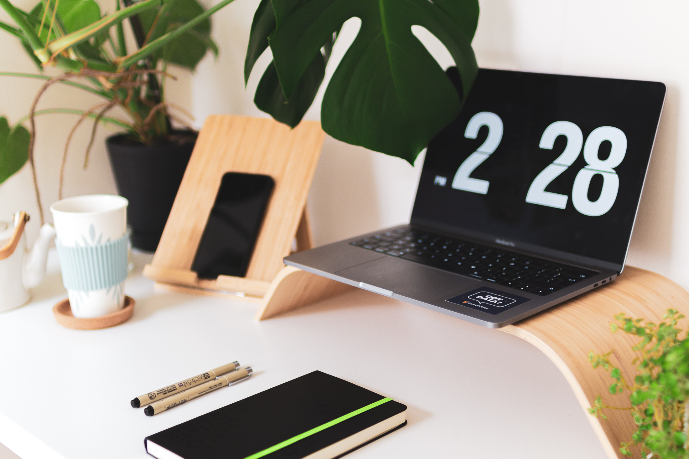

_Ecrit par Alexis cette fois-ci..._

Vous vous êtes déjà créé un dossier _“A trier”_ sans jamais vous en être occupé ? Fait la remarque que votre téléphone n’a bientôt plus de place ?

Bienvenue au club ! Cela fait 15 ans que je rempli ma vie de fichiers numériques, sans jamais vraiment prendre le temps de les trier.

Mais si au lieu de trier, on désencombrait ? Supprimer des fichiers... pour mieux ranger. Si cette idée vous plait, tant mieux, car c’est bien de cela que nous allons discuter dans cet article !

## Comment j’en suis venu au désencombrement numérique

Suite à notre phase de désencombrement physique expliqué dans l’article [Désencombrer pour mieux ranger – Nos 5 conseils](/desencombrer-nos-5-conseils/), une grosse étape m’attendait : jeter l’ordinateur que je n’avais pas allumer depuis des mois, si ce n’est pas une année !

La galère ! Il va falloir l’allumer, regarder ce qu’il y a dedans, mettre sur un disque dur tout ce qu’il contient... Et idéalement trier tous ces vieux fichiers ! Ou pas ? Je peux juste tout rapatrier, mettre dans un coin, et voir plus tard. Plus simple sur le coup.

Mais bon, pour être honnête, c’est ce que j’avais déjà fait avant ! Quand au moment de sauvegarder tout ce qu’il y a dans votre ordinateur, vous constatez qu’il existe déjà un dossier _“Sauvegardé de l’ancien PC”_... Gloups ! L’histoire semble se répéter... Le trie jamais effectué !

Avec Clémence, nous avions décidé de désencombrer pièce après pièce, placard après placard, boîte après boîte... Alors pourquoi pas appareil après appareil, dossier après dossier, e-mail après e-mail, ?

Finalement, rien de bien différent quand on y pense !

## 3 raisons de désencombrer numériquement

### Retrouver et protéger

Clairement, désencombrer pour ensuite ranger nous permet de mieux voir et retrouver beaucoup plus vites nos fichiers. Oui, retrouver les fichiers du quotidiens ou récemment créés reste facile. Retrouver ces photos du ski de l’année X, ou la fiche de paie du mois Y, possiblement moins...

Cela permet aussi de mieux protéger ces fichiers. Quand on a moins de choses, quand on sait où sont ces choses, et quand en plus elles sont numériques : on peut beaucoup plus facilement sauvegarder !

Et si en plus vous êtes comme moi quelques qui n’a pas peur de mettre ses fichiers dans un système de _“cloud”_ comme _Dropbox_, tous vos fichiers sont sauvegardés sur des serveurs et les chances de les perdre deviennent quasiment nulles.

### Économiser

Payer pour stocker des ordures, ça ne viendrait à l’idée de personne, ? Pensez de même pour votre vie numérique !

Envie d’un nouveau téléphone ? D’un nouvel ordinateur ? Bien que je ne suis pas forcément pour l’idée de changer souvent ce type d’appareil pour l’impact écologique que ça a, l’impact sur le porte monnaie ou l’esprit consumériste, il faut tous y passer à un moment.

La question de la puissance se pose, la couleur, la taille et... l’espace de stockage ! Que ce soit ordinateur ou téléphone, il est facile de se dire que notre ancien modèle est archi plein à craquer et que prendre un modèle avec plus de places nous facilitera la vie. Mais _“plein à craquer”_ de quoi ? Si 80% sont des éléments inutiles, ou que l’on peut les ranger ailleurs, le coût supplémentaire est-il vraiment justifié ? En supprimant des fichiers, je me suis rendu compte que finalement, je n’avais besoin que de très peu de place pour tout stocker.

Il en va de même pour les services de stockage en ligne / _“cloud”_. Supprimer des fichiers, c’est réduire la place nécessaire sur ce type de services et donc réduire sa facture.

### Un geste pour la planète

On n’y pense pas toujours, mais désencombrer sa boîte e-mail, c’est limiter son impact environnemental.

Schématiquement, chaque e-mail stocké prend de la place sur un serveur situé quelque part dans le monde. Et ces serveurs sont également connectés à d'autres serveurs de sauvegarde, au cas où. Donc chaque e-mail non supprimé définitivement qui se trouve dans votre boîte prend un peu de place sur plusieurs serveurs situés quelques part dans le monde.

Maintenant, multipliez cet impact d’un seul e-mail par le nombre d’e-mails inutiles que vous avez dans votre boîte. Multipliez ensuite ce nouveau nombre par le nombre que nous sommes à avoir des e-mails inutiles... Vous pouvez un peu imaginer le nombre de données inutiles sauvegardées et hébergés sur des serveurs !

Bien entendu, tout ces serveurs qui sont alimentés en électricité et maintenus au frais dans des pièces climatisées ! Hum... Il y a comme un gaspillage collectif dans l’air. Un gaspillage totalement opaque et auquel on ne pense même pas !

## 3 lieux numériques à désencombrer

Une fois qu’on est convaincu que vider pour mieux... ranger / retrouver / gérer son impact environnemental ... c’est cool, reste à savoir numériquement où s’attarder.

Je pense que vous avez naturellement une petite idée, mais peut-être pas encore. Du coup, voici une petite liste des zones que j’ai faite par ordre de priorité et complexité.

Attention, par contre !

Je donne cette liste, mais ça ne veut PAS dire que j’ai fait ça fait comme une _“check list”_ où je ne suis passé qu’à l’étape 2 après la 1, etc, etc..

Non, non, non !

Vous avez sur un sujet, passez à un autre, revenez sur le premier pour encore affiner, etc, etc...

Du coup, voici quelques pistes où un ménage peut s’avérer bénéfique :

- Dossiers : Bureau / Téléchargements / Documents où on a l’habitude de stocker des choses qui aurait du être temporaires mais qui sont là depuis des mois et années
- Dossiers photos où vous retrouvez 20 fois les mêmes photos parce que vous avez essayé de vous prendre avec le mode _“rafale »_
- Adresse e-mail : boîte de réceptions et tous les dossiers que vous avez créé dans le temps
- Adresse e-mail : se désinscrire de chaque newsletter inutile en cliquant sur le lien situé en bas
- Dossier photos du téléphone où vous avez pris des trucs _“pour vous en souvenir”_
- Logiciel pour prendre des notes qui se retrouve remplis de note inutiles
- SMS et Contacts inutiles
- Comptes sur des sites web que vous n’utilisez plus

## Comment désencombrer numériquement

### Logique vs Sentiments

Commençons facile :

Attaquez vous à ce qui semble le plus logique à supprimer avant de vous attaquer aux choses les plus sentimentales. 

Choisir quelle photo vous allez choisir sur les 20 prises en mode rafale, ça peut prendre du temps, et dans une optique de bon départ, ça ralenti pour pas grand chose. Pour cela, j’ai une méthodologie juste après.

Préférez plutôt supprimer ce fichier PDF qui contient le QR code d’un billet d’avion datant d’il y a plusieurs mois, cette newsletter e-mail qui ne vous intéresse pas ou encore la vieille liste de course enregistrée dans votre logiciel de note.

Bref, vous l’aurez compris, rien qui émotionnellement ou juridiquement soit important. Juste des suppressions totalement logiques.

### Regrouper pour mieux trier

Que faire des choses sentimentales ou officielles ?

Pour ma part c’est un tri non encore fini à l’heure où j’écris ces lignes car ces l’effort qui demande le plus... d’effort !

Après avoir supprimé les fichiers qui n’avait plus lieu d'exister, après avoir supprimé un peu de choses sentimentales _(les étaient elles vraiment ?)_, j’ai regroupé toutes mes photos dans un dossier _“Souvenirs à trier”_.

Pour les documents, j’ai déjà certains sous dossiers, mais sinon, certains vont à la racine du dossier _“Documents officiels”_ pour le moment en attendant un tri plus fin. Au moins, j’applique déjà le principe qu’on applique au monde matériel : à chaque lieu sa fonction. Lisez ici du coup : à chaque dossier sa fonction.

Mais attention !

On garde en tête que désencombrer, c’est limiter son nombre de dossiers, pour ne pas être perdu, rendre trop compliquer le futur rangement et, à nouveau, oublier quoi est où et si l’on a encore tel fichier ou tel fichier !

Personnellement, une hiérarchie qui se limite à un dossier principal et un sous-dossier suffit. Faire un sous-dossier dans un sous-dossier c’est commencer à enterrer les choses.

Pour _“Documents officiels”_ un dossier _“Impôts”_ peut suffire à regrouper les différentes choses relatif à ce sujet, pas besoin d’encore dispatcher.

Pour _“Photos souvenir”_, un dossier par date / événement suffit aussi.

**Astuce en plus :**

Préférer renommer vos documents avec la date au formation Américain, à savoir par exemple le 29 novembre 2018 écrire _2018-11-29_NomDuFichier_.

Les fichiers seront regroupés par ordre chronologique si vous classez par nom : plus facile à retrouver pour les documents officiels, plus plaisant pour les souvenirs car on peut remonter facilement le temps

**Astuce pour les e-mails :**

J’ai remarqué que je gardais des e-mails “au cas où” ou parce qu’ils ont une valeur juridique ou sentimentale. Histoire d’avoir une boîte e-mail la plus vide possible et d’avoir tout au même endroit, à savoir un dossier sur mon ordinateur, j’ai trouvé une technique. Tout simplement, _“j’imprime”_ au format PDF l’e-mail en question et le met dans le dossier qui correspond. Ainsi, tout est strictement au même endroit, et je retrouve tout beaucoup plus vite !

### Se donner le temps

Trier, jeter, ranger demande du temps. Beaucoup...

Et au delà du temps, c’est une implication émotionnelle très forte. Faire le tri dans ses souvenirs, prendre la décision de garder ou jeter, c’est (extrêmement) dur et fatiguant.

D’ailleurs...

C’est pour cela qu’on ne peut pas finir une zone avant d’en commencer une autre. On commence par un endroit, on laisse reposer en se disant que c’est déjà ça de fait, on passe un autre, un autre, puis on revient au premier et on pousse le raisonnement encore un peu plus loin cette façon.

Concrètement :

J’ai pris le pli de faire un peu chaque jour. 50 photos supprimés par ci, 5 e-mails par là, un dossier ici, etc...

Parfois c’est très peu, ça peut être juste un fichier ou deux. Mais au delà du fait que chaque jour j’avance, ça me met dans une attitude global qui me permet de continuer facilement et sans (trop) d’effort mon désencombrement.

Et en plus,

Ca me rappelle qu’il faut que je fasse attention à faire rentrer moins de choses dans mon ordinateur que je n’arrive à en sortir.

> Vider un peu chaque jour, limiter ce que l’on fait entrer. Voilà les bases du _“désencombrer pour mieux ranger”_ !

---

#### Désencombrer pour mieux ranger :

- [Partie 1 — Nos 5 conseils pour désencombrer](/desencombrer-nos-5-conseils/)
- Partie 2 — Aller plus loin ; le désencombrement numérique
- Partie 3 — Mon approche de la penderie minimaliste (à venir)

