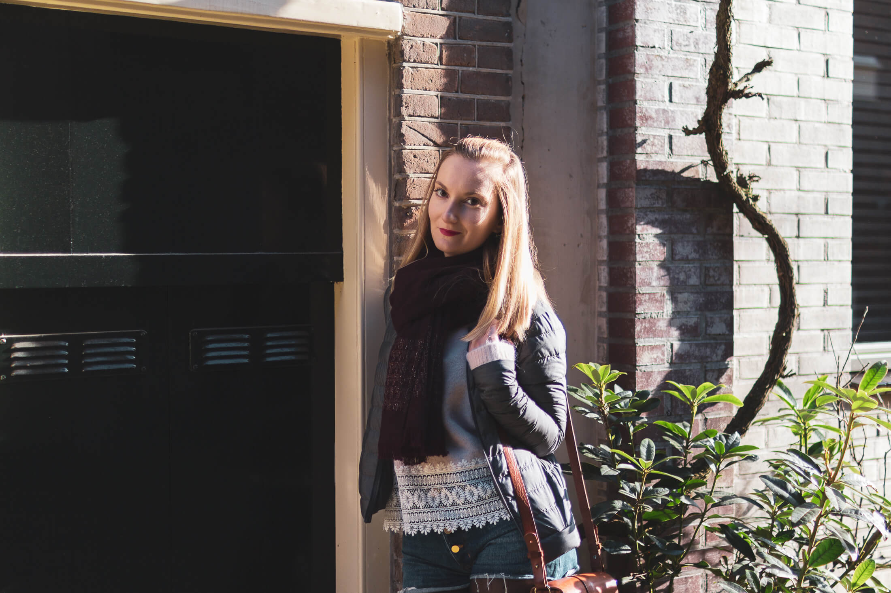

_**Amsterdam Life #42**._

_Une chronique au fil du temps et des envies. Des looks, du papotage, des découvertes et du partage._

## Le soleil revient ☀️

Pour le plus grand bonheur de tous, il a fait une météo magnifique à Amsterdam. Du soleil, un grand ciel bleu et même un peu de douceur. Autant de signes annonciateur du printemps ! D’ailleurs, cela fait aussi plusieurs semaines maintenant que l’on constate à nouveau les jours qui rallongent. Je n’ai désormais plus besoin d’allumer mes lampes de vélo pour aller au yoga le soir vers 17h30.

Après une période hivernale partiellement grisâtre, c’est tellement agréable de profiter à nouveau de la lumière, de voir, petit à petit, les bourgeons bourgeonner, et les premières fleurs sortir le bout de leur nez ! C’est incroyable l’effet positif du soleil et de la luminosité sur le moral.

_• [Pull Sézane Alexia](https://www.sezane.com/fr/product/collection-hiver/pull-alexia) • Short en jean Sézane (collection été 2018) • [Sac Claude Sézane](https://www.sezane.com/fr/product/collection-hiver/15751-sac-claude) • [Écharpe Moly Sézane](https://www.sezane.com/fr/product/collection-hiver/echarpe-molly) • [Doudoune Ultra Légère Uniqlo](https://www.uniqlo.com/fr/fr/product/doudoune-ultra-legere-transportable-femme-409116.html?dwvar_409116_color=COL07&dwvar_409116_size=SMA001)_ • Collant plumetis Comptoir des Cotonniers

Samedi dernier, nous avons donc profité du soleil et des rues encore désertes au petit matin pour aller nous balader dans le centre. Quand les chats sont encore endormis. Et les bars vidés de leurs clients nocturnes. Un samedi matin à 9h ; c’est un tout autre visage d’Amsterdam !

Ce fut je crois l’un des premiers week-end de très beau temps depuis la nouvelle année. Le printemps n’est pas encore tout à fait là et les matinées restent encore bien fraiches, mais, c’est comme un véritable avant-gout de la nouvelle saison à venir. Quel bonheur de porter à nouveau ses lunettes de soleil et de dénuder légèrement les chevilles !

Mais je ne me fais point berner. Il fait beau et doux mais pas assez chaud pour ne pas sortir sans veste ni écharpe. Il nous faudra encore patienter quelques semaines (voire mois !) avant de réellement remettre les gros pulls au fond du placard.

J’en profite donc encore pour étrenner mon joli pull [Alexia](https://www.sezane.com/fr/product/collection-hiver/pull-alexia) Sézane offert par ma maman d’amour pour mes 25 ans. Et comme à chaque fois avec [Sézane](https://www.sezane.com/fr), je ne suis pas déçue. Le pull est d’une douceur incroyable et, malgré son dos ouvert, tient délicieusement chaud ! Je l’adore tout simplement et j’espère pouvoir le porter encore un peu d’ici la fin de l’hiver.

## A Star is Born

Quand nous habitions à Paris (Alfortville), nous avions l’habitude Alexis et moi d’aller régulièrement au cinéma le week-end. Mais depuis que nous avons investie dans une TV à la maison, on a tendance à se faire beaucoup de plateau-TV le vendredi soir ou le week-end.

Et du coup, on découvre souvent les films un peu après la majorité des gens. Dernièrement nous avons regardé A Star is Born de et avec Bradley Cooper et Lady Gaga. Quel film ! J’ai passé un moment incroyable. Le synopsis de base pourrait paraître banal et prévisible (le film est un remake) et pourtant, le montage et le rythme du film sont captivant. Surtout, c’est une véritable montagne russe des émotions et je suis littéralement passé du grand sourire aux larmes.

J’ai trouvé l’interprétation de Lady Gaga en tant qu’actrice plus que convaincante. Et Bradley Cooper en chanteur de country addict et drogué est incroyablement vrai.

Rien que pour la Bande son le film est une pépite. Le film aborde aussi la question du “star-business” mais aussi de l’alcoolisme, en tant que maladie réelle et non simple passe-temps de chanteur populaire. Bref, à voir mais aussi écouter !

## Withings Steel HR

Alexis m’avait offert l’[Activité Pop](https://dyw7ncnq1en5l.cloudfront.net/optim/produits/683/23133/withings-activite-pop_c8b752bf24e10340.jpg) pour les 21 ans et j’en ai toujours était satisfaite. Malheureusement, avec le temps, le mécanisme des aiguilles commençait à faiblir. Alors, après plusieurs années de bon et loyaux services, j’ai récemment décidé de la remplacer par un de leur modèle plus récent, la [Steel HR](https://www.withings.com/fr/fr/steel-hr). Elle me faisait de l’oeil depuis plusieurs mois, avec son boitier blanc et « rose gold » ! (Et elle se marie tellement parfaitement avec ma bague de fiançailles 😀 )

J'ai commandé le bracelet en cuire rose pale en addition du bracelet gris souris en silicone. Cela me permet de changer selon les humeurs et surtout de ne peux abimer le cuir lorsque je vais courir ou faire du sport.

En plus des fonctionnalités de base de suivis d’activités, la Steel HR permet de suivre son rythme cardiaque et de recevoir certaines notifications de son téléphone grâce à petit l’écran LED intégré et le système de vibration.

Tout comme la précédente, j’en suis super contente. Je trouve ces montres connectées hybrides très élégantes, loin des Apple Watch très ostentatoires. Au contraire, les Withings sont méconnaissables. Si vous ne le précisez pas, les gens ne se doutent pas que se sont des montres connectées. Et ça, j'adore !

---

À très vite ❤️
