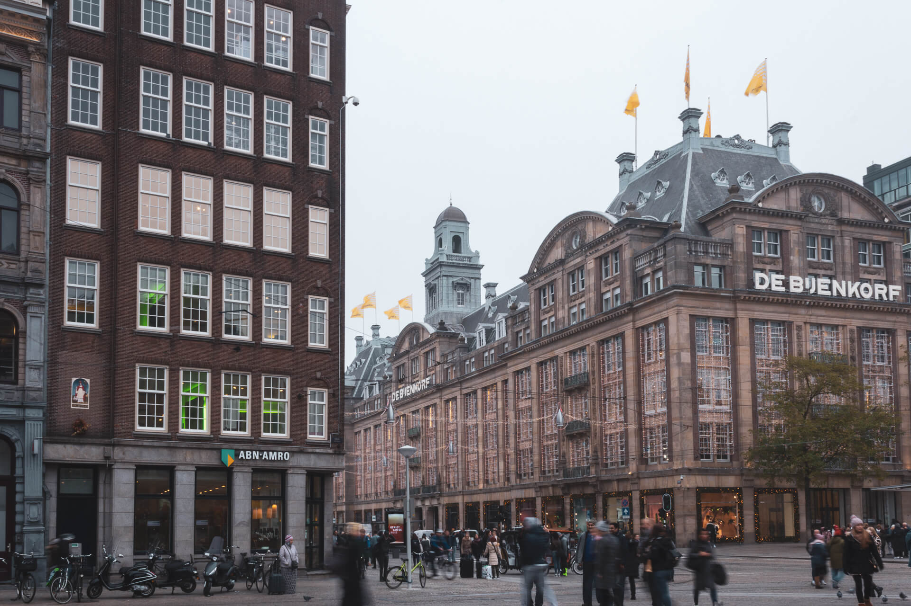
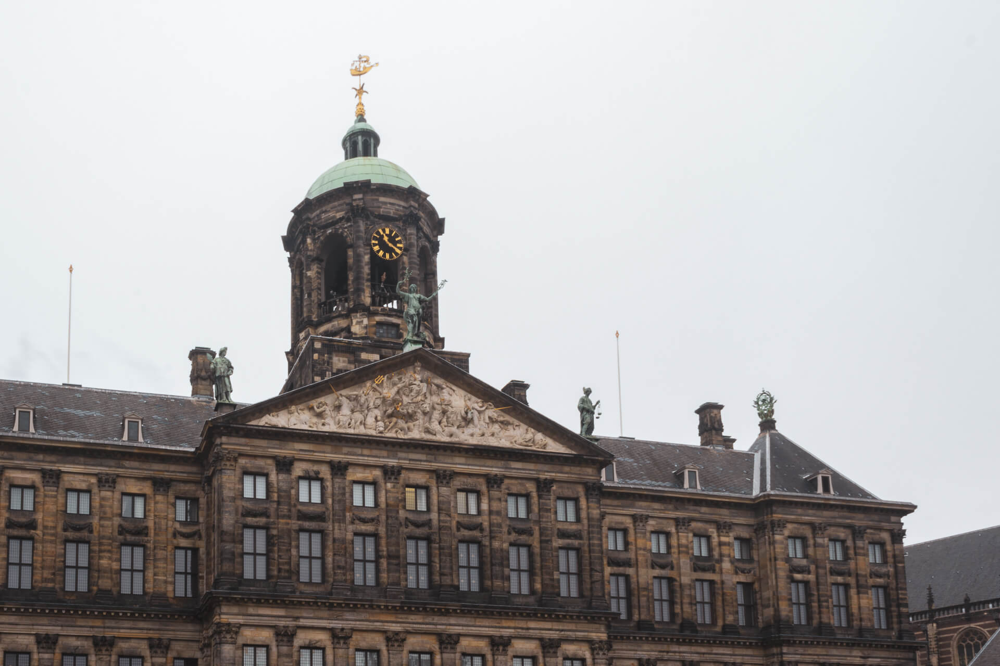
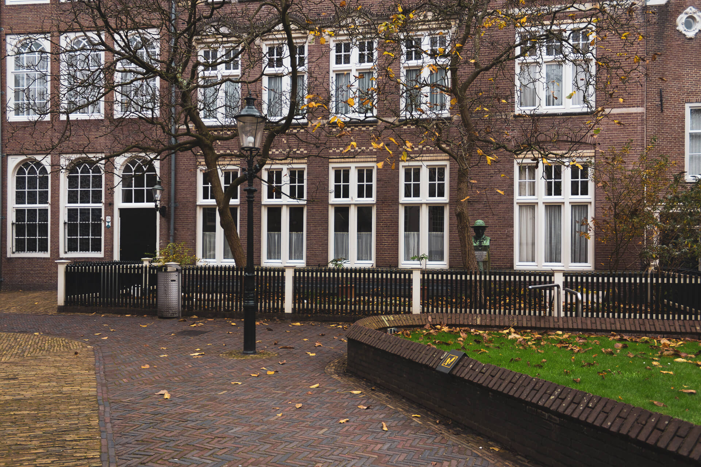
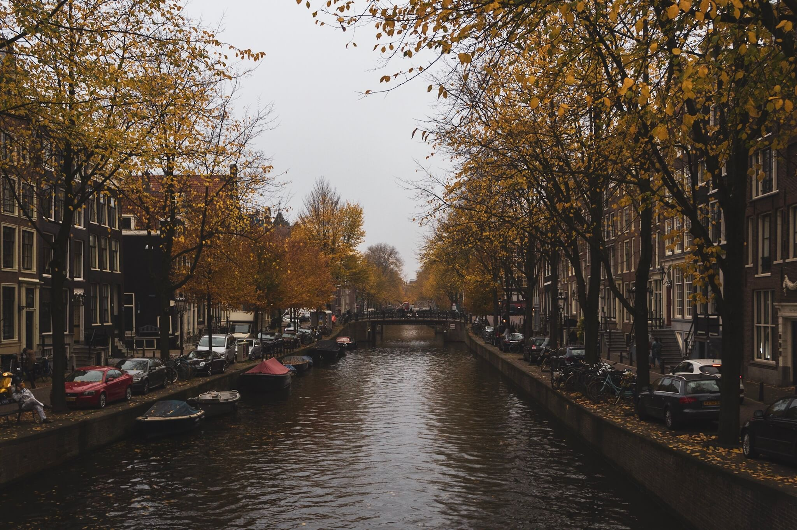
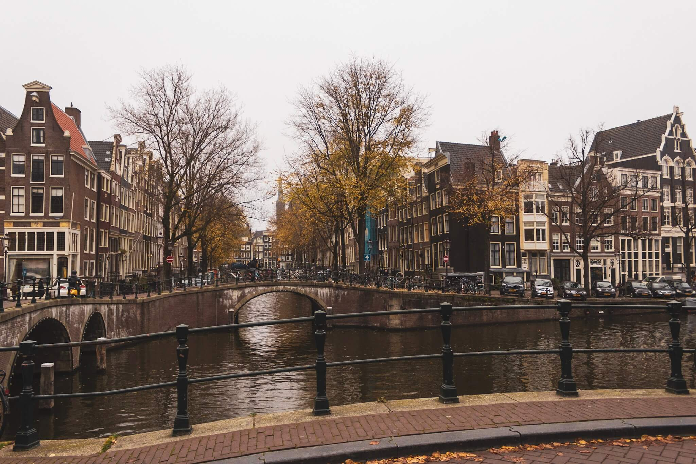

_Notre sélection de 10 lieux à voir ou visiter dans le centre-ville Amsterdam, selon notre point de vue de Français vivant à Amsterdam._

---

Vivant sur Amsterdam depuis 2016, Alexis et moi, Clémence, commençons à bien connaître chaque quartier la capitale néerlandaise. Il est vrai que nous évitons beaucoup le centre d’Amsterdam, qui pour nous est synonyme de foule, de coffee shop en pagaille et de magasins de “souvenirs » tous les cinq mètres... Même si ce n’est clairement pas notre partie favorite, le centre-ville d’Amsterdam est la première chose qu’un voyageur découvre en arrivant ici ; nous avons su l'apprivoiser au gré de nos différentes visites entre amis ou en famille.

Le centre-ville d’Amsterdam reste un “incontournable », et quand bien même nous pensons que la ville a bien plus à offrir en dehors du Centrum, nous partageons avec vous aujourd’hui notre **sélection de 10 endroits à voir** lors de votre prochaine **visite du centre-ville d’Amsterdam**, qui, on espère pour certains, sortent un peu des sentiers battus.

## Le centre-ville d'Amsterdam : petit point historique

**Le Centrum** — hyper-centre d’Amsterdam, est majoritairement constitué de deux quartiers historiques : le Nieuwe Zijde et l'Oude Zijde, littéralement le « Nouveau Côté » et « le Vieux Côté ». Ces deux zones sont les plus anciennes de la ville et abritent historiquement les plus vieilles maisons d’Amsterdam. Ces quartiers sont délimités, entre autres, par le Damrak, le Dam, le Rokin, le Singel et le Prins Hendrikkade ou bien encore le Nieuwmarkt et l’Amstel.

À l’époque médiévale, Amsterdam n’était qu’un village de pêcheurs installé autour du fleuve Amstel, à l’endroit même où celui-ci se divise en deux bras venant se jeter dans l'Ij. C’est aux cours des deux siècles suivant que le village se transforma en une importante place commerciale au XIV siècle, en partie grâce à son port prospère.

Ainsi, vers 1385, la ville d’Amsterdam était séparée par l’Amstel en deux parties de taille à peu près égale. D’un côté le Nieuwezidje, qui signifie le “nouveau côté”, de l’autre l’Oudezijde le “Vieux côté”, chacun des quartiers étant nommés d’après leur église. Le Nieuwe Zijde tire son nom de la Nieuwe Kerk (nouvelle église), construite au début du XVe siècle et se situe à l’angle nord-ouest de la place du Dam. La Nieuwe Kerk, construite dans un style gothique flamboyant, incarnait l’émergence et la prospérité de la ville. De l’autre côté, dans l’Oudezijde, se situe l'Oude Kerk (la « vieille église »), considérée comme l’un des bâtiments les plus anciens de la ville d’Amsterdam, puisque construite vers 1250. Située aujourd'hui sur l’Oudekerksplein, elle fut construite sur les vestiges d'une chapelle en bois.

_Cette sélection se concentre, pour le moment, principalement sur la partie Ouest du Centrum, le Nieuwezijde._

##  10 choses à voir dans le centre-ville d'Amsterdam

### 1. Centraal Station & l’arrière vue sur l’IJ

**Centraal Station** est, comme toute gare, LE point de départ et d’arrivée de la ville. Travailleurs ou touristes, il y a toujours du monde sur le parvis de la gare. En visitant Amsterdam, vous avez de fortes chances de transiter par Centraal Station au moins une fois, puisque situé en plein centre-ville. Au-delà de son aspect très fonctionnel, Centraal Station est aussi un splendide bâtiment en pierre de taille et brique rouge aux inspirations renaissance et gothique.

Construite à la fin du XIXe siècle (entre 1881 et 1989) par Pierre J.H. Cuypers, le plus grand architecte de l’époque, elle se situe à l’endroit où autrefois les vaisseaux et grands voiliers prenaient le large en direction des Indes ou de l'Amérique. Sur la tour Ouest, on aperçoit une horloge tandis ce que sur la tour Est, c’est une rose des vents dont l’aiguille ne cesse de bouger. Entre deux, sur le front, de nombreux bas-reliefs et ornementations représentent des scènes d’Amsterdam à l’époque marchande. Enfin, à l’Est de la gare se trouve le pavillon royal, autrefois lieux où était garé le carrosse royal.

La gare cache aussi une très belle vue à l’arrière. Pour s’y rendre, il suffit d’emprunter **l’IJ Passage**, une galerie commerçante située au centre de la gare et accessible sans tickets. À l’arrière de gare, vous trouverez le port où il est possible d'embarquer sur les ferrys pour la partie Nord de la ville. D’ici, vous pouvez admirer la vue sur les docks d’Ouest en Est. Si l’envie vous en dit et que vous êtes suffisamment téméraire, n’hésiter pas à traverser pour rejoindre l’Adam Tower, très connue pour son restaurant “d’altitude” et sa balançoire offrant une vue imprenable sur le centre-ville.

_La dernière fois que nous sommes venus, un brouillard épais recouvrait la ville et offrait un paysage très mystérieux  !_

### 2. Sint Nicolaas Kerk

Outre sa splendeur architecturale, **Sint Nicolaaskerk / l'église Saint-Nicolas** est remarquable par le fait d’être une église catholique, à la différence de la grande majorité des lieux de cultes de la ville qui sont protestants. Cette église néo-romane, construite entre 1884 et 1887 et conçue par l’architecte Adrianus Bleijs, fut bâtie en l’honneur de Saint-Nicolas, le Saint Patron des marins. Elle possède de grandes colonnes de marbre noir ainsi qu’une voûte en bois. À l’intérieur, vous pourrez admirer et écouter un orgue du XIXe, sur lequel des concerts sont régulièrement donnés. Elle fut rénovée intégralement (son orgue compris) en 1999.

Saint-Nicolas est aussi le “Père Noël” du Nord, de l’Est et du Centre de l’Europe. De nombreuses célébrations ont lieu dans la ville le 5 décembre venant. Pour en savoir plus sur la tradition de Sinterklaas, vous pouvez lire notre article : [Sinterklaas! #29](/sinterklaas/).

_Cette année, Sint Nikolaas fait sa parade dans Amsterdam le 18 novembre 2018._

### 3. Bassin à flot du Damrak

Ce lieu, situé à **l’entrée du Damrak**, n’a pas vraiment de nom officiel. Ce petit bassin, où de nombreux bateaux-mouches sont à quais, est en réalité un vestige du Damrak, cours inférieur de l'Amstel (en néerlandais, « rak » signifie le cours d'une rivière quand il est rectiligne et « dam » un barrage).

J’aime vraiment cet endroit car, en plus de pouvoir admirer des maisons néerlandaises typiques donnant directement sur l’eau, on a une vue à 360 degrés sur le centre-ville d’Amsterdam : la gare et les Smits Koffiehuis, l’église Saint-Nicolas, le Damrak et la place du Dam en fond.

À l'extrémité à droite, vous apercevrez aussi **le café Grasshopper**. Observer le lettrage en caractères gras qui figurent sur le haut de devanture. La devise, _“De Cost Gaet For de Baet Uyt”_, qui signifie “Qui ne risque rien, n’a rien”, fait directement écho à l’esprit marchand de la ville en plein XVIIe siècle.

### 4. De Beurs Passage

Le Damrak n’a, selon nous, que très peu d’intérêt, mais il existe un petit passage couvert rejoignant une autre rue très commerçante (la Nieuwendijk). Ce passage s’appelle **le Beurpassage** et il est très facile de passer à côté sans le voir.

Rouvert en 2016, ce passage est un petit bijou caché en plein centre de la ville. Couleurs, mosaïques, chandeliers, miroir, bas-reliefs ... Tous les objets posés ici font références aux canaux, symbole d’Amsterdam et certains objets sont même directement inspirés de ceux retrouvés dans les canaux d’Amsterdam (principalement des vélos  !). Le plafond, par exemple, est une mosaïque réalisée en verre aux teintes vertes émeraude, créant ainsi l’illusion de marcher le long d’un tunnel sous-marin. Le passage regorge de détails esthétiques remarquables et d’ornementations faisant référence à l’eau mais aussi l’histoire d’Amsterdam et le commerce néerlandais. C’est un passage un peu hors du temps, qui est encore plus surprenant à voir de nuit  !

_Ps : Prêtez attention au poisson à la gueule ouverte, vous serez surpris de trouver une fontaine d’eau potable_ 😉

### 5. Le Palais Royal sur la place du Dam

Soyons honnête, **la place du Dam** en elle-même n’a rien de très charmant. Mais, elle est un incontournable puisque c’est à cet endroit précis qu’est né Amsterdam lorsque l'on décida, en 1270, de construire un barrage sur l’Amstel.

La bâtisse imposante dominant la place est **le Palais Royal**. Construit entre 1648 et 1665 par l'architecte Jacob van Campen, ce palais servit tout d’abord à abriter l’hôtel de ville d’Amsterdam. Ce n’est qu’en 1808 qu’il prit le statut officiel de palais après l’accession au trône de Hollande par Louis Napoléon Bonaparte. À sa construction, ce bâtiment fut pendant des années le plus grand bâtiment administratif au monde. Symbolisant la gloire et la puissance d’Amsterdam durant le siècle d’or, les habitants n’hésitèrent pas à le renommer la “huitième merveille du monde”, en toute honnêteté. 🙂

Bien qu’Amsterdam soit la capitale des Pays-Bas, ce n’est pas le lieu de résidence officiel de la famille Royale, ni des sièges des institutions politique. Ainsi, lorsqu’il n’est pas réquisitionné par la famille royale pour des réceptions, le Palais Royal est ouvert au public. On peut y admirer les sols en marbre, de magnifiques tableaux, de délicates sculptures, des lustres monumentaux ainsi qu'une exposition annuelle sur l’héritage néerlandais et l’histoire des Pays-Bas.

### 6. Kalverstraat, rue commerçante à Amsterdam

**Kalverstraat** est loin d’être la rue la plus calme de tout Amsterdam. S’étalant sur une distance de presque 750m, Kalverstraat est une des rues commerçantes la plus connue de la capitale. Située en plein cœur de la ville historique, elle compte plus de 150 boutiques et grandes enseignes.

_Quelques petites anecdotes :_

### 8. L’Amsterdam Museum / Musée d'Amsterdam

**L’Amsterdam Museum** est le musée sur l'histoire de la capitale néerlandaise, situé au cœur de la ville dans les murs de l’ancien orphelinat municipal. C'est LE musée que nous recommandons à chacun de nos amis venant habiter Amsterdam !

Si vous êtes un tant soi peu curieux de connaître l’histoire de la ville mais n’êtes pas super fan des récits d’histoire parfois ennuyants, ce musée est fait pour vous  ! Nous avons tout simplement adoré notre visite ! On ne voit pas le temps passer tant la visite est captivante et fait presque appel à tous nos sens.

Le parcours, complet et très interactif, est un véritable voyage dans le temps à travers de sept siècles d’histoire. Objets de la vie courante, peintures de l’Age d’Or, découvertes archéologiques, armures bijoux, mobilier, porcelaines, photographies et mille autres trésors nous racontent l’histoire politique, religieuse, économique, démographique, sociologique et géologique d’Amsterdam. En 01h30 de visite environ, vous apprendrez comment la ville d’Amsterdam a vu le jour, son évolution, ses valeurs et ce qu’il fait qu’Amsterdam soit aujourd’hui une ville libérale et très ouverte d’esprit.

Et même si vous n’habitez pas Amsterdam, ce musée reste somme toute très ludique et reste une bonne option si le temps extérieur ne vous permet pas de profiter à fond des jolies ruelles. 🙂

### 9. Marcher le long du Singel

Si vous visiter le musée d’Amsterdam, vous saurez alors comment la ville s’est étendue au fil du temps. Vous saurez alors que **le Singel** fut le premier canal construit servant à délimiter les frontières de la ville médiévale dans les années 1580. Depuis, la ville s’est largement étendue et le Singel est aujourd’hui le canal situé le plus à l’intérieur de la ceinture de canaux. Il se jette à l'Est dans l'Amstel au niveau du Muntplein et au Nord-Ouest dans l’IJ.

Ainsi, en vous baladant le long du Singel, vous remarquerez la beauté et la singularité des maisons bordant les quais. Souvent, les gens se perdent entre les canaux, sous prétexte que tout se ressemble. Mais à y regarder de plus près, vous remarquerez que chaque maison à sa particularité unique. Que ce soit un pignon plat ou en escalier, une couleur de brique plus foncée, des carreaux de fenêtres, ... Chaque maison se différencie. Certaines maisons sont plus remarquables, c’est sûre. Notamment, celle située au Singel 7, réputée pour être la plus étroite d’Amsterdam. En réalité, il s’agit de l’arrière d’une maison située sur l’autre côté de la rue.

### 10. Bloemenmarkt / Marché aux fleurs d'Amsterdam

**Le Bloemenmarkt, le marché aux fleurs** (ou devrait on dire “aux bulbes”), est une institution à Amsterdam. Datant de 1862, il se trouve le long du Singel. Il fut pendant longtemps un véritable marché flottant où les marchants venaient s’amarrer à la berge, le long des quais du marché, quelque chose d’unique au monde. Aujourd'hui, les embarcations sont fixées mais restent sur l’eau.

Ce marché, très connu pour sa vente des bulbes de Tulipes, symbole même des Pays-Bas, n’a pourtant rien d’extraordinaire comparé à un fleuriste, puisque vous y trouverez principalement des bulbes de toutes sortes, et pas tellement de fleurs coupées. En plus des tulipes, vous y trouverez des bulbes d'amaryllis, des tournesols, des orchidées, jonquilles, narcisses, crocus, des cactus et plantes vertes, ainsi que des babioles et nombreux souvenir (parfois plus que les bulbes eux-mêmes) à l’effigie des Pays-Bas et d’Amsterdam. Mais, en dépit de cela, le marché reste un chouette endroit pour faire des emplettes de plantes vertes à prix peu élevés !

---

On espère que cette sélection vous inspirera à découvrir Amsterdam centre sous un nouveau regard.

Si une petite faim se fait sentir, retrouvez notre article de bonnes addresses spécial centre-ville d’Amsterdam ici : [Les bonnes adresses d’Alexis & Clémence – Amsterdam centre #1](/city-guide-bonnes-adresses-amsterdam-centre/)
