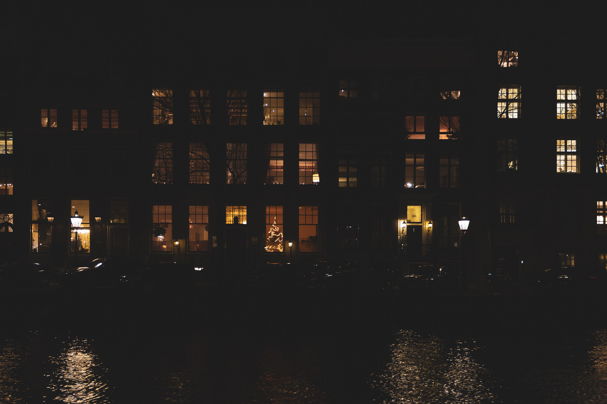
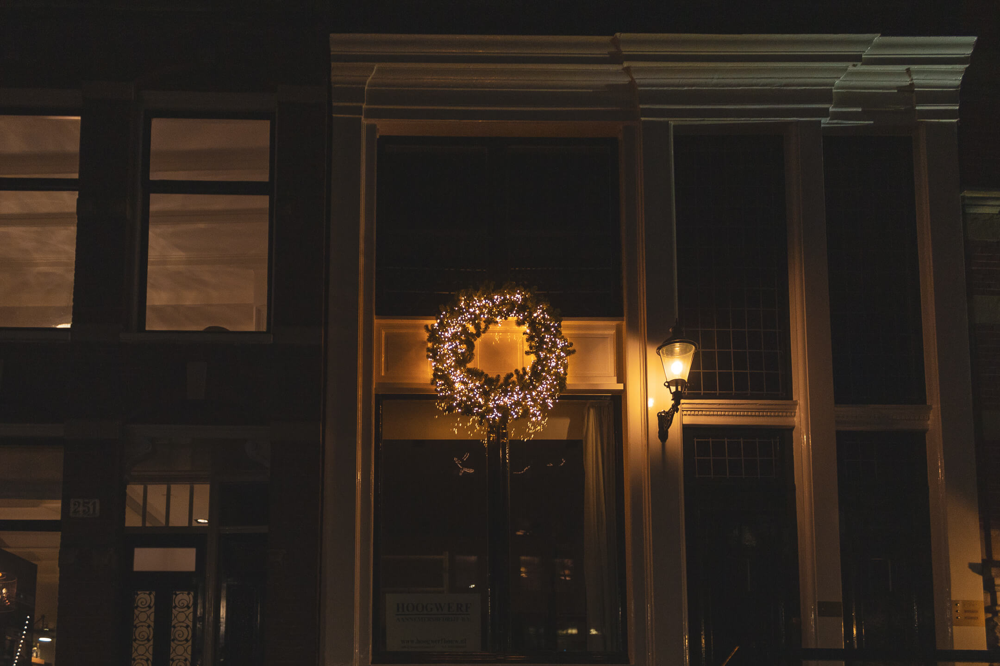
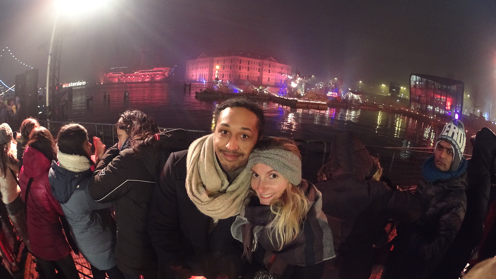
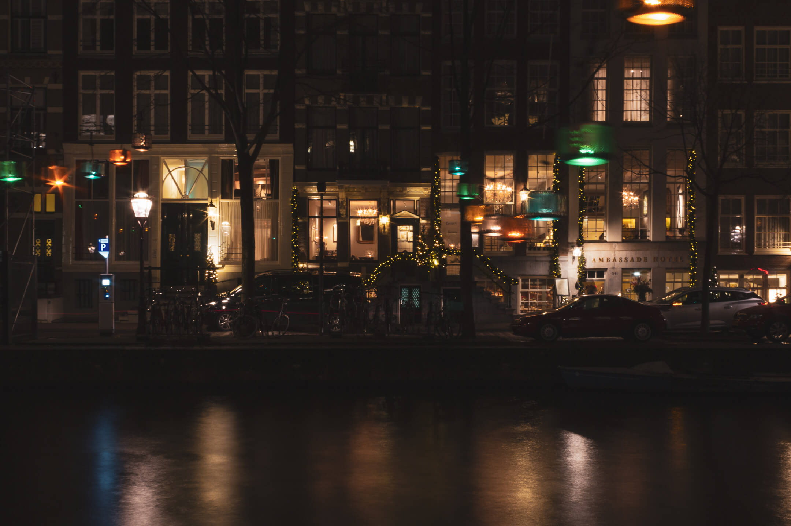

**Amsterdam en décembre** nous plonge dans une atmosphère magique, digne d’un film de Noël. Au moment des fêtes venues, les canaux se parent de mille et une lumières et les grandes places revêtent leur plus beau sapin. C'est un véritable spectacle à ciel ouvert venant réchauffer nos cœurs en ces journées sombres et froides.

En cette période de fêtes de fin d’année, la petite Venise du Nord promet de nombreuses activités saisonnières, à partager en famille ou entre amis ! Voici une sélection de choses à voir ou à faire à Amsterdam en décembre pour en profiter au maximum.

<toc>
- [La Saint-Nicolas](#amsterdam-decembre-saint-nicolas)
- [Noël à Amsterdam](#noel-amsterdam)
    - [Les marchés](#marche-noel)
    - [L'Amsterdam Light Festival](#amsterdam-light-festival)
- [Le jour de l'an](#jour-de-lan-amsterdam)
- [Hortus By Night](#hortus-by-night)
- [Que manger en décembre](#gourmandise-noel-amsterdam)
- [Infos pratique](#infos)
    - [La méteo en décembre]((#meteo-decembre-amsterdam))
- [La magie d'Amsterdam en décembre](#magie-amsterdam)
</toc>

## Amsterdam en décembre : Spécial Saint Nicolas ((#amsterdam-decembre-saint-nicolas))

Avant Noël, les Néerlandais fêtent **Sinterklaas**, la Saint-Nicolas, le 6 décembre. Les célébrations de Sinterklaas débutent très souvent dès la mi-novembre avec l’arrivée de Saint-Nicolas et la grande parade en ville. Cette année elle avait lieu le 16 novembre 2019. Les célébrations prennent ensuite fin le 5 décembre au soir, après un traditionnel repas en famille. Enfin, le 6 décembre, c’est l’ouverture des cadeaux reçus pendant la nuit !

Les Néerlandais ont vraiment à cœur cette fête, surtout les enfants, la plupart recevant leur cadeau à ce moment-là et non le 25 décembre. Il existe même un “[journal de Sinterklaas](https://sinterklaasjournaal.ntr.nl/)” quotidien pour suivre les aventures du grand Monsieur à la barbe blanche et ses zwarte pieten avant la grande distribution de cadeaux. C’est assez drôle à regarder et ça fait patienter les enfants !

Si vous visitez Amsterdam en cette période, on vous conseille de gouter aux « *specuulas »*, aux « *pepernotten »* & « *kruidnoten »* — de petits biscuits à la cannelles et aux 4 épices ; l’équivalent de nos papillotes françaises ! Les enfants reçoivent aussi traditionnellement une _“chocolade letter”_ ; une tablette de chocolat en forme de lettre correspondant à la première de leur prénom.

Enfin, si vous souhaitez en savoir davantage, on vous explique tout de cette tradition culturelle dans cet article spécial **[Sinterklaas !](sinterklaas/)**

## Amsterdam en décembre : spécial Noël ((#noel-amsterdam))

### Les marchés de Noël ((#marche-noel))

Amsterdam regorge de **marchés de Noël**. Il y en a sur la majorité des grandes places de la ville.

#### Dam Square

Chaque année, **Dam Square** est transformée en marché de Noël avec des cabanons en bois ainsi qu'un gigantesque sapin de Noël. Ensemble, avec les illuminations du Bijenkorf, la place du Dam symbolise l'esprit des fêtes. D'ailleurs, ne manquez surtout l’illumination du sapin qui aura lieu le 14 décembre 2019 cette année.

_4 km de luminaires !_ Le sapin, véritable, provient traditionnellement des Ardennes en Allemagne. Le sapin est tellement grand ; 20 mètres de haut ; qu’il faut plus de 40 000 lampes LED à économies d’énergie pour l’illuminer en entier. Cela correspond à une guirlande de 4 km de long ! Ainsi, durant toute la période du mois de décembre, le sapin sera illuminé dès le couché du soleil.

#### MuseumPlein

Si vous êtes fan de patin à glace, nous vous conseillons d'aller à **MuseumPlein** où un petit village de Noël est installé autour d’une patinoire.

Du 16 novembre 2019 au 2 février 2020, c’est l’occasion parfaite de se retrouver entre amis ou en famille et apprécier quelques gourmandises de saison. La patinoire offre une vue sur le splendide Rijskmuseum. Pour compléter le cliché parfait, il est possible de patiner sous une réplique si romantique _“Magere Brug”_.

## Amsterdam en décembre : L'Amsterdam Light Festival ((#amsterdam-light-festival))

Chaque année depuis 2012 a lieu l’**[Amsterdam Light Festival](https://www.tiqets.com/en/amsterdam-c75061/amsterdam-light-festival-historic-boat-experience-p975197?partner=adeuxcestmieux).** Des artistes néerlandais et internationaux sont invités à créer des installations ou sculptures lumineuses autour d’un thème. Ces créations sont ensuite exposées tout au long de la ceinture des canaux, du Prinsengracht, et de l’Amstel. Au total, 30 installations lumineuses sont exposées.

_Retrouvez notre article spécial [Amsterdam Light Festival 2019](/amsterdam-light-festival-2018-2019) pour en découvrir d’avantage._

Il est possible de les découvrir à pied ou en bateau, tout au long des canaux. On recommande d’ailleurs [Amsterdam-bateau](https://www.amsterdam-bateau.com/fr/tours/6/light-festival) qui, pour l’occasion, propose des [visites en bateau](decouvrir-les-canaux-avec-amsterdam-bateau/) spéciales avec vin chaud, cocktail et boissons chaudes à volonté ! Le plus ? Des guides en français et des bateaux couverts et chauffés !

## Amsterdam en décembre : Spécial Jour de l'an ((#jour-de-lan-amsterdam))

### Oud en Nieuw

La Saint-Sylvestre, _“**Oud en Nieuw”**_ en néerlandais est largement célébrée dans la capitale. Pour accueillir la nouvelle année, Amsterdam foisonne d’événements et de soirées qui sauront en ravir plus d’un.

D'ailleurs, Bonne Année en néerlandais se dit _“Gelukkig Nieuwejaar”_. Je vous conseille de pratiquer un minimum la prononciation avant le jour-j !

### Feu d'artifice du nouvel an

Chaque année, un grand **feu d’artifice** avec compte à rebours officiel est retransmis en direct sur les chaines de TV néerlandaises. Cette année, il aura lieu à « Kop van Java” et le compte à rebours officiel sera fait depuis La Haye.

En réalité, il y a du monde célébrant la nouvelle année à chaque coin de rue, buvant des toasts et ... tirant des feux d’artifice ! Car oui, la vente de feux d’artifice est exceptionnellement autorisée pour le 31 décembre. Ainsi, dès 23h le 31 décembre à Amsterdam, c’est un gigantesque spectacle coloré qui anime le ciel. La première fois, c’est assez impressionnant car Amsterdam est littéralement transformée en “war-zone”. Un conseil, si vous n’aimez pas les explosions, restez bien au chaud chez vous ! Pour les autres, je dirais qu’il faut avoir vécu ça au moins une fois dans sa vie tant c’est assez impressionnant !

### Où faire la fête ?

Pour les plus fêtards d’entre vous, sachez que la plupart des clubs sont ouverts ce soir-là. En revanche, prévoyez d’acheter vos tickets à l’avance car beaucoup d’événements sont sold-out dès la mi-décembre !

Nieuwemarkt, Leidseplein, Rembrandtplein ainsi que Damsquare sont les place-to-be populaires pour **faire la fête** ce soir-là. Le site [iamsterdam](https://www.iamsterdam.com/en/see-and-do/whats-on/major-events-and-celebrations/new-years-eve-celebrations/new-years-eve-amsterdam) répertorie aussi une liste de soirées ayant lieu dans la capitale. Pour notre part, on vous recommande le **[Chin Chin Club](https://www.facebook.com/events/1003667433175356/)**, en plein centre parfait pour bien manger et danser !

## Amsterdam en décembre : Musée & Exposition ((#musees))

### Hortus By Night ((#hortus-by-night))

**Nombreux musées** sont ouverts durant le mois de décembre, sauf exception. Au-delà des classiques Risjkmuseum et Van Gogh Museum, nous vous recommandons d’aller faire un tour du côté de **l’Hortus Botanicus**, le jardin botanique d’Amsterdam. Du 19 décembre 2019 au 5 janvier 2020, le jardin organise des visites nocturnes « [Hortus by Night](https://www.dehortus.nl/programma/activities/?lang=en)« . Vous avez alors l’occasion de découvrir les plantes exotiques dans un jardin illuminé, tout en dégustant un verre de vin chaud. Certaines visites guidées sont aussi organisés pour une expérience encore plus enrichissante !

## Gourmandises de saison ((#gourmandise-noel-amsterdam))

**Oliebollen**

Noël c’est avant tout se faire plaisir ! En plus des friandises traditionnelles de Sinterklaas, les **Oliebollen** sont des beignets à base de pommes et raisins secs uniquement proposés en cette saison. Pour en trouver, il suffit de se rendre dans l’un des nombreux marchés de Noël de la ville, il y a toujours un stand de Oliebollen. À déguster tiède avec un peu de sucre glace dessus !

**Cookie Van Stapele**

Pour un biscuit un peu plus raffinés, direction le magasin **Van Stapele** pour déguster leur délicieux cookies fourrés à la crème, dont eux seuls possèdent la recette. Alexis m'a fait la surprise d'en rapporter un soir et c'était dure de ne pas tous les manger !

## Amsterdam en décembre : informations pratique ((#infos))

### La météo à Amsterdam en décembre ((#meteo-decembre-amsterdam))

_Décembre à Amsterdam ; le mois le plus sombre et pluvieux de l'année._

Le soleil se lève aux alentours 8h30 et se couche dès 16h30 l’après-midi ! C'est aussi le mois bénéficiant d’un temps d’ensoleillement le plus faible avec environ 1h / jour. L’avantage c'est que l'on peut profiter plus tôt des décorations et illuminations. De plus, la moyenne est estimée à 21 jours de pluie pour le mois de décembre. Les températures, quant à elles, oscillent entre 2°C et 6°C, et compte-tenue de la semaine passée, je dois dire que ces moyennes sont exactes.

Ne vous attendez-donc pas à voir les canaux gelés ou recouvert d’un joli manteau blanc. Amsterdam étant une ville assez humide et relativement proche de la mer de Nord, le climat est très humide et il neige très rarement en hiver, sauf météo “exceptionnelle”

### Jours fériés nationaux.

Comme en France, le 25 décembre et le 1er janvier sont des **jours fériés** aux Pays-Bas. Le 26 décembre est aussi férié : c'est le **« tweede kerstdag »**. Cette année, c'est un mercredi : autant dire que cela vaut le coup de prendre un congé le lundi 23 décembre ! ;-)

Quand bien même la Saint-Nicolas est une fête traditionnellement célébrée la veille du 6 décembre aux Pays-Bas, ce n’est pas un jour férié officiel. Simplement, les entreprises décident souvent de fermer plus tôt dans l’après-midi afin de laisser du temps aux familles pour préparer un bon repas.

### Horaires

La plupart des magasins sont ouvert tout au long du mois de décembre, avec une plage horaire étendue généralement jusqu'à 21h. En revanche, le 25 décembre, la plupart sont fermés pour ré-ouvrir ensuite le lendemain.

_À noter, le Rijksmuseum et le Van Gogh reste ouvert durant cette période._

---

##Pourquoi Amsterdam en décembre ? ((#magie-amsterdam))

Décembre à Amsterdam est magique. Illuminations, patinoires, marchés de Noël, vin chaud, oliebollen, feu d’artifice ; la ville est tellement animée pendant la période de Noël et du réveillon.

Si vous visitez Amsterdam en cette période, n'hésitez pas à partager vos questions ou anecdotes en commentaire, nous nous ferons un plaisir d'y répondre.

