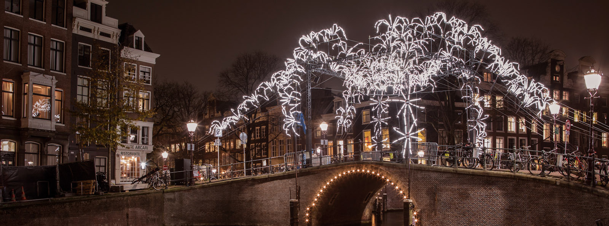
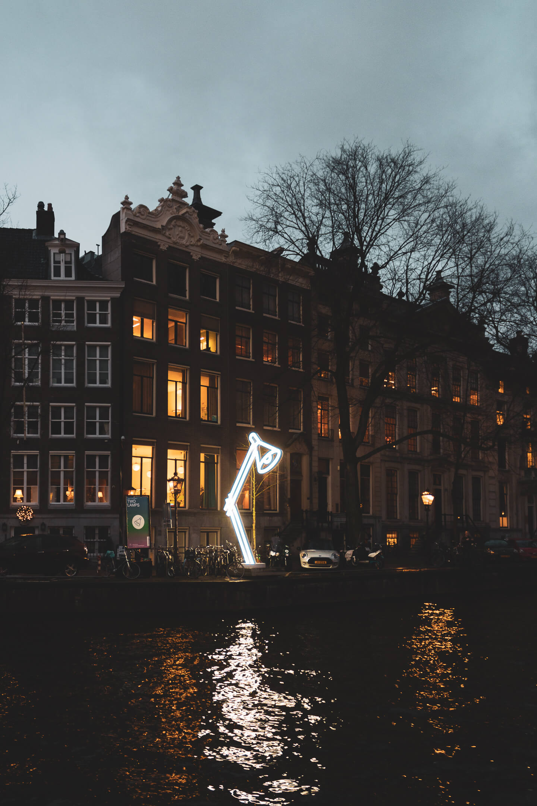
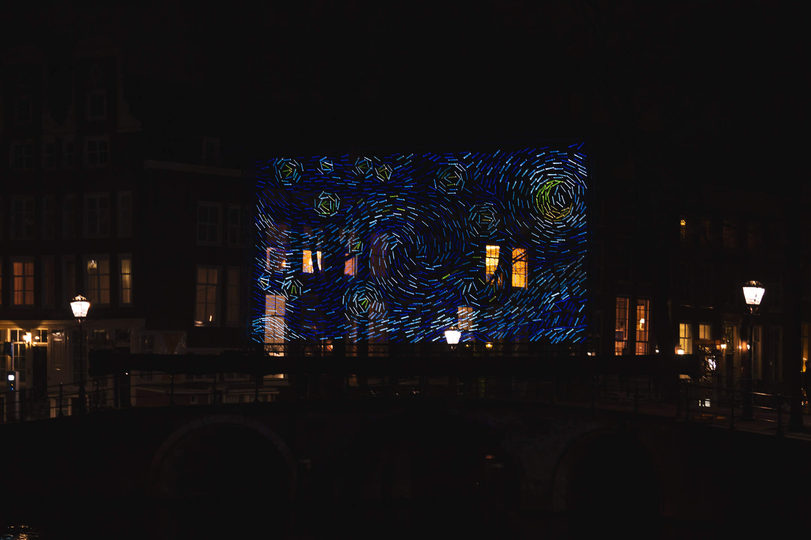

**[L’Amsterdam Light Festival](https://amsterdamlightfestival.com/en)** — Festival de Lumière d’Amsterdam — a lieu chaque année de mi-Novembre à mi-janvier. Prenant son inspiration de la célèbre Fête des Lumières lyonnaise, ce festival est devenu un événement très populaire et très attendu dans la capitale néerlandaise, avec plus de 900 000 visiteurs pour l’édition 2017-2018.

Cette année **l’Amsterdam Light Festival** revient illuminer la ville et ses canaux du 29 Novembre 2018 au 20 janvier 2019. Retour sur cet événement haut en couleurs !

## L’Amsterdam Light Festival : petite histoire

Ce festival a vu le jour pour la première fois en 2012, et depuis, chaque édition est un véritable succès. Pour la 7e édition, des artistes ont été conviés à réfléchir autour du thème **“The Medium is the Message”** ; _Le Support / moyen de communication est le message_, d’après une citation du scientifique canadien Marshall McLuhan. Ce thème questionne alors le rôle de la lumière dans notre communication ; _le support de communication ne serait-il pas aussi important que le message lui-même ?_ ; avec Amsterdam pour terrain de jeu central de cette réflexion. Avec ses installations, c’est un véritable regard différent sur la ville que nous propose l’Amsterdam Light Festival !

> The role of light in conveying a message and the city of Amsterdam as a medium for telling stories are central to this edition.

Un comité de sélection décide des 30 oeuvres présentées pour la première lors de l’Amsterdam Light Festival. Dès la tombée de la nuit, vous pourrez alors découvrir 30 installations lumineuses spécialement créées par des artistes, designers ou architectes contemporains internationaux.

## Les installations de l'Amsterdam Light Festival

Les installations lumineuses de l’Amsterdam Light Festival éclaire les rues et les canaux. L’exposition met en scène des projections lumineuses sur les bâtiments historiques, des installations interactives dans les parcs ou bien des sculptures lumineuses sur l’eau. Le tout est donc à découvrir tout au long d’une ballade sur ou bien autour des canaux, (aussi appelé “lIlluminade”). De plus, durant le festival, de nombreuses visites guidées sont organisées, à pied, à vélo ou en bateau.

### Présentation d'une oeuvre : Two Lamps

Deux énormes lampes de bureau sont installées sur une partie du « Golden Bend », la partie la plus prestigieuse du canal Herengracht. Cette installation fut créée par Jeroen Henneman, précisemment pour cet endroit, historiquement lieux de résidence des habitants les plus aisées de la ville ; maintenant remplacés par des cabinets d'avocat, des banques et des assurances.

Les deux lampes semblent d'être échappées d'un des nombreux bureaux nous entourant. Mais, très vite, le spectateur s'aperçoit que ce ne sont qu'en faite de simple icônes de lampes plates, créées par des néons lumineux.

Ainsi, dans son oeuvre, Henneman mélange objet et dessin et use de l'environnement réel comme toile de papier. De plus, selon qu'il fasse jour ou nuit, les sculptures apparaissent sous deux angles différents. En journée, elles sont clairement perçues tel un dessin graphique, tandis qu'à la nuit tombée, elles deviennent de véritables silhouettes de lumière, tels de réels objets, posés là, sur le bord du canal.

Henneman a pour habitude de valoriser les objets du quotidien dans son oeuvre. Il voit de beauté et de la poésie en chacun des objets que nous utilisons quotidiennement ; une boite, une paire de ciseaux, un stylo ... En les positionnant hors de leur contexte habituel, il les ramène à leur essence pure. Ainsi, à travers son oeuvre pour l'Amsterdam Light Festival, il tente de nous rappeler l'importance d'un objet aussi simple qu'une lampe de bureau ; objet nous permettant de travailler, lire un livre ou bien même jouer, n'importe où, n'importe quand ! Et, finalement il vient à nous questionner : _que ferions-nous sans cet objet ?_

_Analyse traduite du [site officiel](https://amsterdamlightfestival.com/en/artworks/two-lamps)_

## Visiter l’Amsterdam Light Festival

Plusieurs choix s’offre à vous pour découvrir le festival.

Si vous aimez marcher à votre rythme, il est tout à fait possible de faire [une boucle de 8km](https://amsterdamlightfestival.com/en/map) environ. Cette option est alors idéalle pour prendre le temps de faire des photos et d’admirer les lumières sous tous leur angles. Cette option présente aussi l’avantage d’être 100% gratuite !

Pour en profiter au maximum et vivre une expérience typique, nous vous recommandons une des nombreuses visites en bateaux sur les canaux. Vous pourrez ainsi admirer les oeuvres d’art illuminées d'au plus près. En plus, la ville offre un point de vue tellement particulier depuis l’eau, encore plus lorsque le soleil est couché et les rues et les maisons toutes illuminées en moment de Noël !

Pour des visites 100% française mais toujours pleines de bonnes anecdotes néerlandaises, on vous recommande [Amsterdam-Bateau](https://www.amsterdam-bateau.com/fr/tours/6/light-festival).

---

Nous vous souhaitons une belle découverte. N'hésitez pas à faire part de vos retours en commentaires, nous nous feront un plaisir de les lire.

Enfin, si vous venez visiter Amsterdam en décembre, sachez que la ville regorge d’activités. Vous pouvez retrouver notre sélection dans cet article : [Amsterdam en Décembre : Que voir, que faire ?](amsterdam-en-decembre-que-voir-que-faire/)

Passez de belles fêtes.

