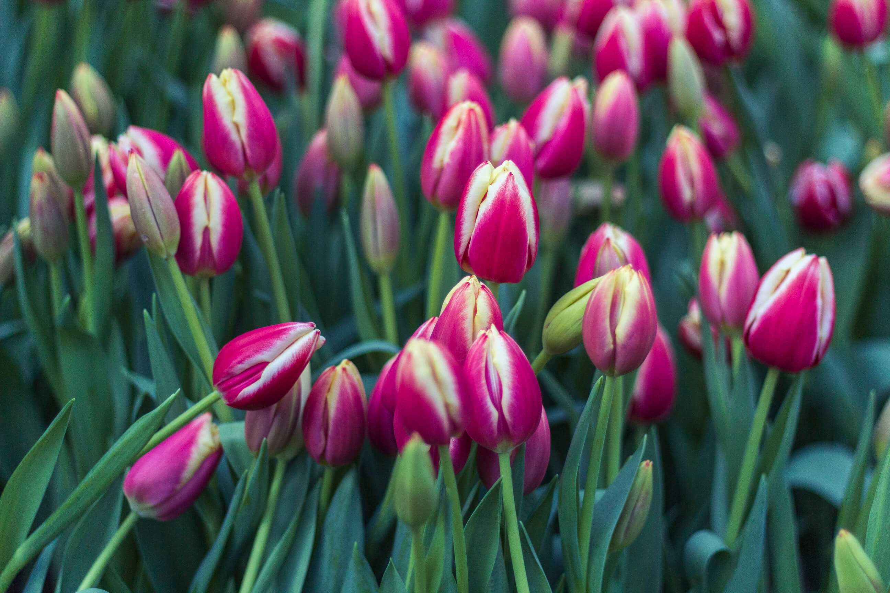

**La Journée Nationale de la Tulipe** a lieu chaque année au mois de janvier. Organisée par des producteurs hollandais, cette journée marque le coup d’envoi officiel de la saison des Tulipes coupées !

Lors de votre visite à Amsterdam, impossible de les rater, les tulipes font partie de la ville. En plus de décorer les parcs et les canaux au printemps, vous trouverez de nombreux souvenirs en forme de tulipe. Il existe des dizaines d’histoires basées sur cette tradition, mais, d’où vient cet engouement pour la célèbre tulipe ?

## La Tulipe, icône néerlandaise

### Les Origines

La Tulipe est aux Pays-bas ce que la baguette est à la France. En somme, cette fleur est un véritable symbole hollandais depuis plusieurs siècles déjà ! Cette fleur n’est pourtant pas originaire des Pays-Bas. Les premiers bulbes de tulipe venant de l’Empire Ottoman furent introduits par le botaniste Carolus Clusius au début du 17e siècle par des marchands néerlandais. La Tulipe prend place à l’Age d’Or des Pays-Bas et a ainsi profondément marqué le commerce néerlandais.

### La Tulipomanie

Au XVIIe siècle, durant l'Age d’Or, période de grande prospérité aux Pays-Bas, la tulipe devient un article de luxe convoité ainsi qu'un signe de richesse. Cette passion pour la tulipe se retrouva même dans la peinture néerlandaise et flamande de l’époque. Favorisant le commerce et l’économie, l’engouement soudain pour cette fleur, la Tulipomanie, fut aussi responsable de la première grande crise économique des Pays-Bas, appelé “bulle des tulipes”. Ses couleurs et sa beauté avaient réussi à convaincre les gens que les tulipes étaient un bon investissement, le voyant comme un marché à la hausse comportant finalement que très peu de risques (erreur !). D’ailleurs, beaucoup de personnes décidèrent de quitter leur emploi afin de devenir cultivateurs. C’est à ce moment là que les prix commencèrent à augmenter.

Ainsi, cette tulipomanie entraina une augmentation démesurée du cours des bulbes de tulipe, à tel point qu’une fleur pouvaient être vendue pour 10 fois plus que le salaire annuel d’un artisan spécialisé.

Cette augmentation phénoménale atteignit un pic en février 1637, puis c’est toute l’économie qui s’effondra du jour au lendemain. Certains historiens ont ainsi qualifié cette crise de « première bulle spéculative » et véritable krach boursier de l’histoire.

### Aujourd'hui

Aujourd’hui, la Tulipe reste un symbole fort des Pays-Bas mais la spéculation qui a pu régner autour des bulbes n’est plus depuis bien longtemps ! Il faut savoir que chaque année désormais, environ 1,7 milliard de Tulipes sont exportées mondialement au moment du printemps. La tulipe reste toujours autant apprécié et nombreux sont les touristes repartant avec un sac de bulbes provenant du marché aux fleurs ou bien d’un petit souvenir en forme de tulipe !

En visitant Amsterdam au printemps, vous découvrirez aussi des rues et des parcs décorés de tulipes ! Aussi, n’hésitez pas à aller visiter les jardins du Keukenhof pour en découvrir davantage grâce à leur exposition permanente “Tulpomania”.

## La Journée Nationale de la Tulipe

Ainsi, le 19 janvier 2019 aura lieu la traditionnelle Journée Nationale de la Tulipe, sur la place du Dam à Amsterdam. Cette dernière est, pour l’occasion, transformée en un grand jardin bigarré à l’aide de plus de 200 000 tulipes de toutes les couleurs. Tous les habitants sont alors invités à venir cueillir des tulipes gratuitement pendant toute une après-midi, soit plus de 10 000 personnes chaque année !

<gallery>

</gallery>

### Le temps des tulipes !

Cette journée inaugure le lancement officiel de la saison des tulipes (coupées). Le temps des tulipes marque la période allant de janvier à fin avril quand la plupart des variétés de tulipes sont disponibles chez les fleuristes, au supermarché ou sur les stands des marchés. C’est aussi à ce moment là que plus d'un millier de tulipes dans toutes les couleurs partent des ventes aux enchères hollandaises pour décorer toutes sortes de vases à travers le monde. La tulipe est donc une vraie carte de visite pour la Pays-Bas.

Le jardin de la place du Dam ouvre ses portes à 13h et ferme lorsque la totalité des fleurs auront été ramassées. Comptez en moyenne 1h d’attente (Il y a deux ans, nous avions attendu 1h30 environ). Avec un peu de chance, le soleil sera au rendez-vous. Cependant, nous vous conseillez de prévoir des vêtements chaud et des chaussures étanches afin de ne pas transir de froid.

Aussi, à l’entrée, les bénévoles distribuent des sacs en plastique biodégradable, ce n’est donc pas la peine de prévoir le vôtre.

Il est toléré une vingtaine de tulipe par personne, soit l’équivalent d’un sac. Cependant, ne vous étonnez pas de la virulence de certaines personnes ... Mais ne vous inquiétez pas, il y en aura pour tout le monde ! D’ailleurs, la première année, nous avions eu les yeux un peu plus gros que le ventre à tel point que nous en avons donnés à notre voisin tant nous en avions !

### Quelques conseils pour profiter de vos tulipes plus longtemps.

- Recoupez toute partie blanchie de la tige pour permettre à la fleur de mieux absorber l’eau. Mettez ensuite immédiatement les fleurs dans un vase propre rempli d’eau clair.
- Assurez-vous qu’aucune feuille ne trempe dans l’eau, seule la tige doit être immergée.
- Tous les 2 jours, recoupez légèrement la tige d’1 ou 2 centimètres pour maintenir l’absorption de l’eau.
- Complétez régulièrement le niveau d’eau dans le vase. Le secret de longévité d’une tulipe, c’est toujours beaucoup d’eau fraîche.
- Évitez un soleil direct. Les tulipes aiment la lumière, mais sans excès. Le vase ne doit donc pas être placé en contact direct avec le soleil. Évitez également de l’exposer trop près d’une source de chaleur, comme un radiateur, ou dans un courant d’air.

---

*Plus d’info sur la Journée Nationale de la Tulipe [sur leur site internet](https://tulpentijd.nl/en/)* ou sur _[Instagram](https://www.instagram.com/Tuliptime.info/)_.

---

Et vous, connaissiez-vous cette journée Nationale de la Tulipe ? N’hésitez pas à partager vos photos de tulipes avec nous. Et rdv sur [Instagram](https://www.instagram.com/_clemsss/) pour en découvrir davantage !

