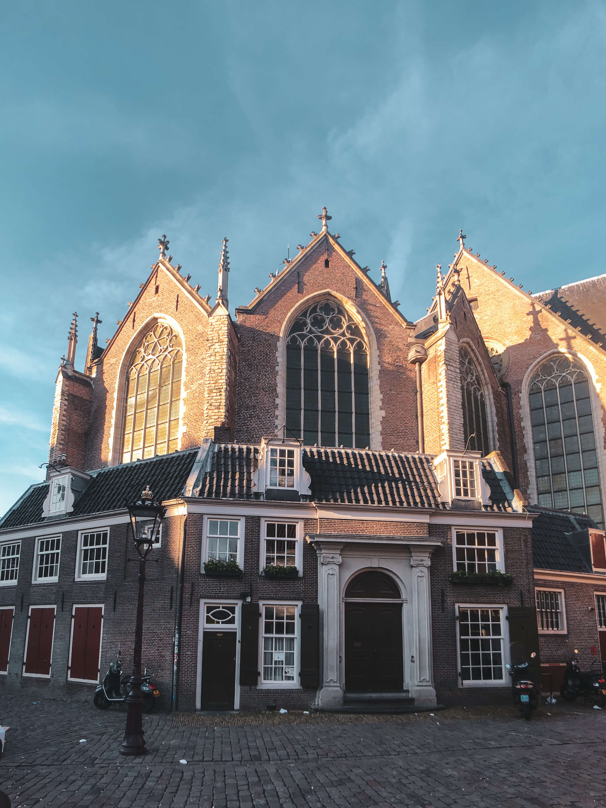
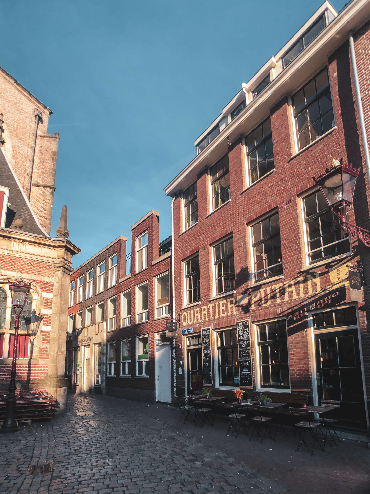
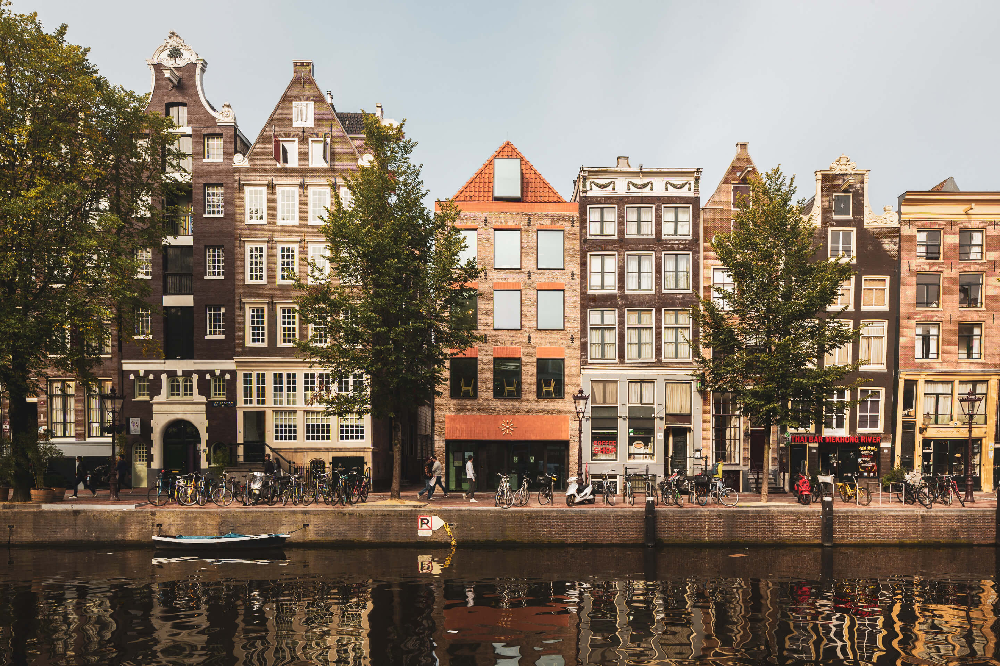
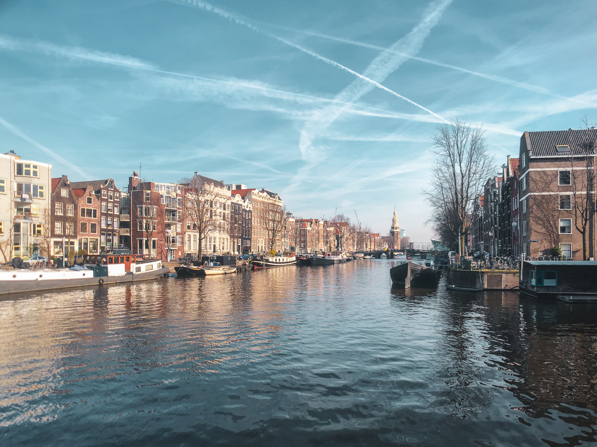
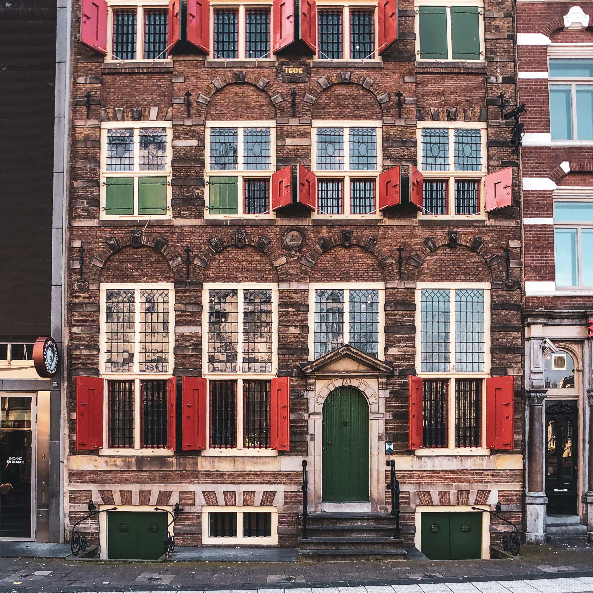
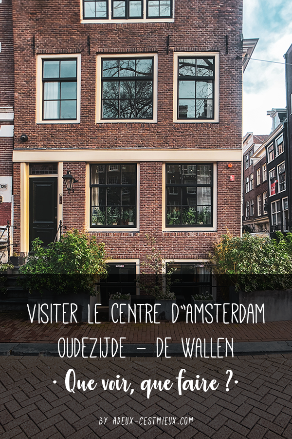

_Notre sélection de 6 lieux à visiter dans le centre-ville Amsterdam Oudezijde selon notre point de vue de Français vivant à Amsterdam._

---

Le quartier de l’Oudezijde, situé dans le centre d’Amsterdam, est l'un des plus touristique de la ville : en cause le “fameux” Quartier Rouge et les nombreux Coffee Shop. Pourtant, l’Oudezijde est la partie historiquement la plus vieille d’Amsterdam. Vous y trouverez les plus belles églises, les plus beaux monuments et parmi les plus belles maisons. Aussi, voici aujourd’hui **une sélection de 6 endroits à voir dans le quartier**, on espère autre que le sexe, de la bière et des drogues, mais qui sauront tout de même vous ravir.

_Cette sélection se concentre principalement sur la partie Est du Centrum, l’Oudezidje. Retrouvez notre sélection sur la partie Ouest, le Nieuwezijde ici : [Visiter Amsterdam — le centre-ville : 10 choses à voir ou visiter](visiter-amsterdam-centre-ville/)_.

---

## Amsterdam centre : l’Oudezijde

À l’instar de son homologue Nieuwezijde, **Oudezijde** signifie le _“Vieux Côté”_ en néerlandais. Ils forment à eux deux le _“binnenstad”_ le centre-ville historique d’Amsterdam.

Oudezijde forme la partie Est de la ville médiévale. C’est historiquement l’un des plus vieux quartiers de la ville puisqu’il fut construit au Moyen Âge, entre le XIIIe siècle et le XVe siècle. La principale construction de l'époque fut la Oude Kerk, dont les travaux débutèrent vers 1300. Jusqu'à la Réformation en 1578, le quartier était également connu pour accueillir de nombreux couvents, églises ou autre établissement religieux. Aujourd’hui les bâtiments centenaires de l’Age d'Or, remplis d’histoire, côtoient les vitrines lumineuses du quartier rouge.

Oudezijde est délimité par le _Damrak_, le _Dam_, le _Rokin_, _l'Amstel_, le _Kloveniersburgwal_, le _Nieuwmarkt_, le _Geldersekade_ et enfin le _Prins_ _Hendrikkade_. À noter, le _Red Light District_ ne représente en réalité qu’une portion du quartier.

---

## Nos 6 recommandations à Amsterdam centre — Oudezijde

### 1. De Oude Kerk

**De Oude Kerk**, en français “Vieille Église” est, comme son nom l’indique, la plus ancienne église d’Amsterdam. Sa construction aurait débuté aux alentours de 1300, soit plusieurs années avant la fondation de la ville. Comme indiqué en introduction, le nom du quartier fait directement référence à ce bâtiment historique.

Première église catholique bâtie par des pêcheurs, elle fut initialement dédiée à Saint-Nicolas, saint-patron des marins. Cependant, elle fut convertie au culte protestant après la réforme iconoclaste de 1578. Une grande parties des objets religieux furent alors détruits et seules demeurent encore aujourd’hui les peintures des grandes voutes. Malgré cela, l’architecture reste splendide et mélange différents styles. Le bâtiment est aussi imposant en regard de la place sur laquelle il se situe. C’est aussi drôle de constater comment d’autres bâtiments se sont construit tout autour.

Pour la petite anecdote, c’est dans cette église que serait enterrée Saskia, la femme de Rembrandt. Lui serait enterré dans une fosse commune de la Westerkerk.

Ne manquez pas de vous arrêter au petit restaurant attenant à l’église, le _[Koffieschenkerij](http://koffieschenkerij.com/)_. En été, nous trouvons leur terrasse mi-ombragée parfaite pour boire un verre au calme.

### 2. De Wallen : Le Red Light District

_(plus must-see que recommendation ...)_

Souvent les premières choses aux quelles nous pensons en parlant d'Amsterdam sont les canaux et le **Red Light District**, aka, **le Quartier Rouge**. Cette partie d’Amsterdam a fait la renommée “narcotique & sexuelle” de la ville. _Sex shop_, _peep show_, _cinéma pornographique_, _live porno_, _théâtre pour adulte_, _musée du sexe_, _magasins de préservatifs_ en tout genre, ... Certains clichés n’en sont pas. Vous avez sûrement déjà entendu parlé de ce quartier et la plupart de ce que vous avez entendu est, en fait, sûrement vrai ! Le lieu n’est comparable à aucun autre dans la ville. Mais attention, réduire Amsterdam au quartier rouge serait comme réduire Paris à Pigalle...

#### Le quartier rouge, pourquoi ? Comment ?

Il doit son nom, entre autre, aux nombreuses vitrines allumées de rouge ; des lanternes à l’époque, des néons aujourd’hui. Les petites loupiotes servaient à l’époque, à guider les marins dans la nuit noire revenus sur terre pour faire leurs affaires ...

Ainsi, la prostitution à Amsterdam est autorisée et réglementée depuis « toujours ». Aujourd’hui il est estimé à environ 200 vitrines dans _le quartier rouge_. Mais, derrière des apparences très libérales, cela ne veut pas dire que le traffic n’existe pas ... Les jeunes femmes sont très souvent forcées, se faisant promettre une carrière de danseuse et se retrouvant, à la place, derrière une vitrine. Aussi, depuis plusieurs années, la mairie d’Amsterdam a lancé un plan de réhabilitation du centre-ville, notamment du quartier rouge ; l’objectif étant avant tout de réduire la criminalité au profit de la des monuments historiques, nombreux dans le quartier. Cela passe notamment par une réglementation plus ferme de la prostitution et une réduction du nombre de coffee shop.

Le quartier Rouge fait parti des _must-see_ cités dans les guides d'Amsterdam. Avec Alexis, nous préférons nous y balader de jour, et pourquoi pas au petit matin lorsque la foule est encore endormie. Mais il faut avouer que toutes les lumières rouges procurent une ambiance toute particulière aux lieux la nuit. Par curiosité, _sans pour autant y rester une éternité_, faites un tour du quartier à la tombée de la nuit. Vous y découvrirez un visage d'Amsterdam particulier et très different !

#### Quelques petites règles tout de même.

- Sachez qu’il est interdit de prendre en photos les vitrines et les travailleuses derrière. Cela est d’ailleurs passible d’une amande ! Et on vous déconseille franchement d’essayer ...
- Aussi, quand bien même le quartier est en vidéo surveillance 24h/24, cela n’empêche pas les pickpocket de sévir. Faite bien attention à vos affaires personnelles.
- Enfin, n’oubliez pas que des gens et des familles vivent dans ce quartier au départ résidentiel, alors respectez les alentours et ne soyez pas à l’origine de tapage nocturne après une nuit bien (trop) arrosée..

### 3. Museum Ons' Lieve Heer op Solder

Si vous vous trouvez dans Oudezijde en pleine journée, **[Ons’ Lieve Heer op Solder](https://www.opsolder.nl/fr)** est LE musée que nous vous recommandons absolument de faire.

Ce musée, dont l’entrée se situe au Oudezijds Voorburgwal 38-40, n’est pas une simple maison de maitre en plein coeur historique. Cette habitation datant du Siècle d'Or abrite une église ! Et oui, la visite de cette maison et ses pièces à vivre est un petit labyrinthe de couloirs et d'escaliers nous menant finalement au grenier de cette demeure. Littéralement haut lieu du musée, une véritable église, catholique, y fut aménagée dès la fin du XVIIe siècle. C’est d’ailleurs cette église qui donna le nom au musée ; “Ons’ Lieve Heer op Solder” signifiant « Notre seigneur au grenier ».

La découverte de l’église est impressionnante, tant le lieu est grand ! C’est un peu plus de 150 places et un autel aux allures de théâtre italien qui s’étendent devant nos yeux.

#### Pourquoi une telle église dans un grenier me direz-vous ?

Et bien, après la guerre des religions qui secoua les Pays-Bas vers 1578, le protestantisme fut déclaré religion officielle. Tous les autres cultes, notamment le catholicisme, furent ainsi interdits. Dès lors, interdit de messe, les catholiques firent vivre leur foi dans la clandestinité, de la fin du XVIe jusqu'au milieu du XIXe siècle. Leur culte devait donc rester très discret. C’est à ce moment-là que de nombreuses églises catholiques clandestines virent le jour à Amsterdam. Elles se trouvaient la plupart du temps cachées dans les greniers de quelques riches catholiques prêts à ouvrir leur maison aux fidèles. Jan Hartman, riche marchand, en faisait partie. Il acheta cette maison et les deux voisines à l’arrière afin de transformer les trois greniers en une extraordinaire église en plein coeur de la ville !

Ces églises n’étaient pour autant pas inconnues des autorités. Mais, de cette manière, le culte catholique était tout à fait toléré. Aujourd’hui encore, **Notre seigneur au Grenier** est un véritable exemple des anciennes églises clandestines. Elle est aussi devenue un symbole national de la liberté religieuse et de la tolérance aux Pays-Bas.

### 4. L’improbable architecture des maisons amstellodamoises.

Amsterdam et son centre-ville sont réputés pour leur **architecture unique**. Le centre d'Amsterdam est typique pour **ses maisons relativement étroites et toute tordues**. Souvenez-vous [ici](visiter-amsterdam-centre-ville/), je vous parlais même de la plus petite facade d’Amsterdam. Oudezijde est un bel exemple de cette architecture aux dimensions rocambolesques. Il suffit simplement de se balader le long des canaux du quartier de Wallen.

#### La Trippenhuis - Plus grande maison d'Amsterdam

En marchant le long de _Kloveniersburgwal_, vous serez notamment surpris en arrivant au numéro 29, où se situe la “**Trippenhuis**”. La facade de cette maison mesure 22 mètres, ce qui en fait la plus large d’Amsterdam. Cette maison fut construite en 1666 par deux frères, Lodewijk et Hendrick Trip, d’où le nom “TrippenHuis”, Maison Trip.

Si vous regardez en face, de l’autre côté du canal, vous serez surpris d’y voir une toute petite maison, contrastant très fortement avec la Trippenhuis. La légende raconte que les frères Trip ont fait construire cette maison pour leur cocher après qu’il se soit exclamé « Oh mon dieu, je serais vraiment heureux si j’avais une maison aussi large que la porte d’entrée de mon maître. »

#### Trompettersteeg - Plus petite ruelle d'Amsterdam

Amsterdam regorge d'espaces urbains inhabituels et plus ou moins étroit, et ce, encore plus dans le centre historique. Non loin de là, se trouve ainsi **la Trompettersteeg**. Vous êtes peut-être passés à côté sans même vous en rendre compte. Cette rue, ou bien devrais-je dire ruelle, est la plus étroite, mais certainement la plus connue, d’Amsterdam. Elle fait tout juste un mètre de large. Gare à vous de vous y engager au risque de vous retrouver dans un véritable embouteillage au milieu ! La ruelle ne désemplit jamais vraiment, en cause, les vitrines, sûrement les plus vues de la ville, bordant à droite et gauche de la rue.

### 5. Se promener le long du Oudezijds Achterburgwal

La partie “Quartier Rouge” mis de côté, une **ballade le long des canaux** de permet de capturer simplement la beauté de la ville. **Kloveniersburgwal**, **Oudezijde Achterburgwal** ou bien **Geldersekade** sont tous très charmants.

<gallery>

</gallery>

#### Kloveniersburgwal et la Compagnies des Indes Néerlandaises

Sur **Kloveniersburgwal**, vous trouverez notamment un ancien et magnifique bâtiment de la VOC, **la Compagnie Néerlandaise des Indes Orientales**, première multi-nationale de l’époque ! C’est aujourd’hui un bâtiment universitaire qu’il est seulement possible d’admirer depuis l’extérieur.

#### Den Waag & Schreierstoren : vestige des fortifications médiévales

Amsterdam, comme de nombreuse cités médiévale, était une ville fortifiée. Aujourd’hui les remparts n’existent plus, mais il reste des monuments témoignant de cette époque. Sur le Nieuwemarkt se trouve ainsi un petit chateau, **Den Waag** qui est l’une des plus anciennes pièces maîtresses des fortifications d’Amsterdam. Den Waag fut construite en 1488 et était l’une des trois portes permettant l’accès à Amsterdam. Mais, la ville grandissant rapidement, cette fortification se retrouva à l’intérieur de la cité qui devint alors la résidence pour des administrations publiques.

Un peu plus loin, en remontant Geldersekade, au croisement avec le Prins Hendrikkade, se trouve un autre vestige de l’époque médiévale :**la Schreierstoren**. Tout comme Den Waag, cette ancienne tour de défense faisait partie intégrante du système de fortification d’Amsterdam. Elle est la seule tour de défense de la ville à avoir survécu à travers le temps.

Schreierstoren, signifie “Tour des pleureuses”, probablement en référence aux nombreuses femmes de marin de la Compagnie des Indes Néerlandaise qui faisaient leurs adieux à leurs époux à cet endroit précis.

### 6. Musée de la Maison de Rembrandt

Rembrandt, célèbre artiste néerlandais, vécu toute sa vie à Amsterdam. La maison dans laquelle il vécut de 1639 à 1656, est aujourd’hui un musée témoignant du lieu de vie de l’artiste à l’époque : **le Musée de la maison de Rembrandt**

Malgré son succès de l’époque, notamment grace à la _[Ronde de Nuit](https://www.google.com/search?q=ronde+de+nuit&source=lnms&tbm=isch&sa=X&ved=0ahUKEwjtrJTvlILgAhWMUlAKHRzTD_EQ_AUIDigB&biw=1440&bih=798)_, Rembrandt n’avait pas les moyens de payer en une seule fois une telle demeure. Il fit un crédit qu'il traina tel un boulet pendant vingt années, avant de faire banqueroute. Il dut alors s’installer dans une petite maison minable du Rozengracht. Ainsi, tous les nombreux objets et possessions de l'artiste furent vendus aux enchères afin de rembourser sa dette.

Grâce aux nombreux registres, des notaires réussirent à retrouver la totalités des biens. Aujourd’hui, le musée reconstitue les lieux dans les lesquelles le plus célèbre artiste-peintre des Pays-Bas a vécu, dessiné et peint ses plus grands tableaux.

Ainsi, la visite nous invite à découvrir de pièce en pièce à quoi ressemble la vie d’un artiste peintre du XVIIe siècle. Loin des grandes galleries des musées traditionnels, c’est une visite intimiste que nous propose la Maison de Rembrandt. De plus, les différents ateliers de démonstration, proposés pendant de la visite, sont très intéressant. Ce musée permet véritablement de s’immerger dans l’œuvre de l’artiste.

---

Vous l’aurez compris, Amsterdam fourmille de lieux surprenants. Même après avoir visiter plusieurs fois le centre, il est toujours possible de découvrir quelque chose que l’on avait pas vu la première fois. C'est fascinant !

Nous espérons que cette sélection vous aura plus. N'hésitez pas à faire part de vos suggestions en commentaires, nous nous ferons un plaisir de les découvrir.

À très vite ❤️

