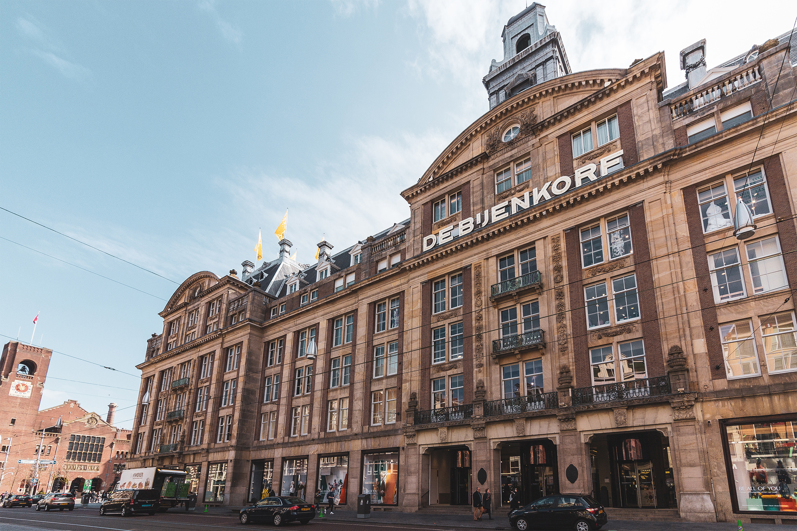
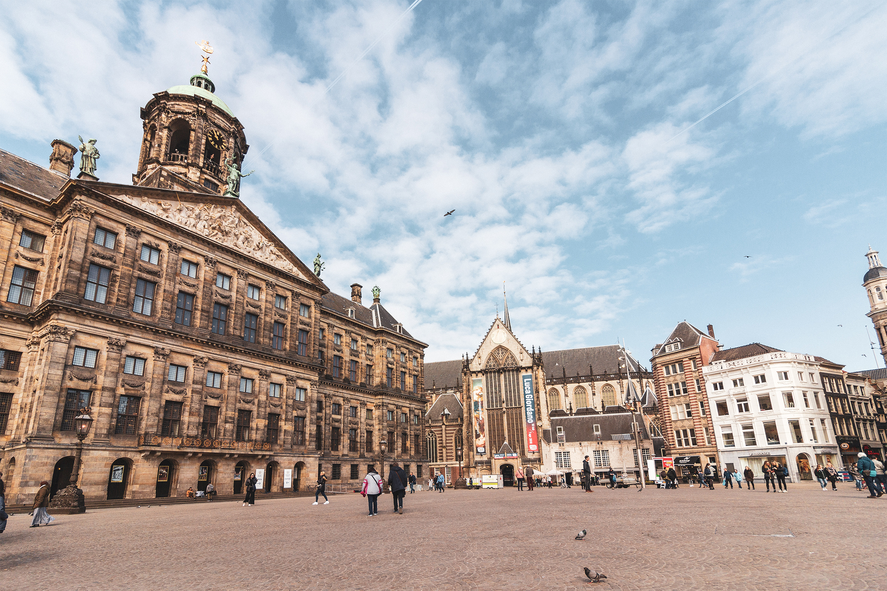
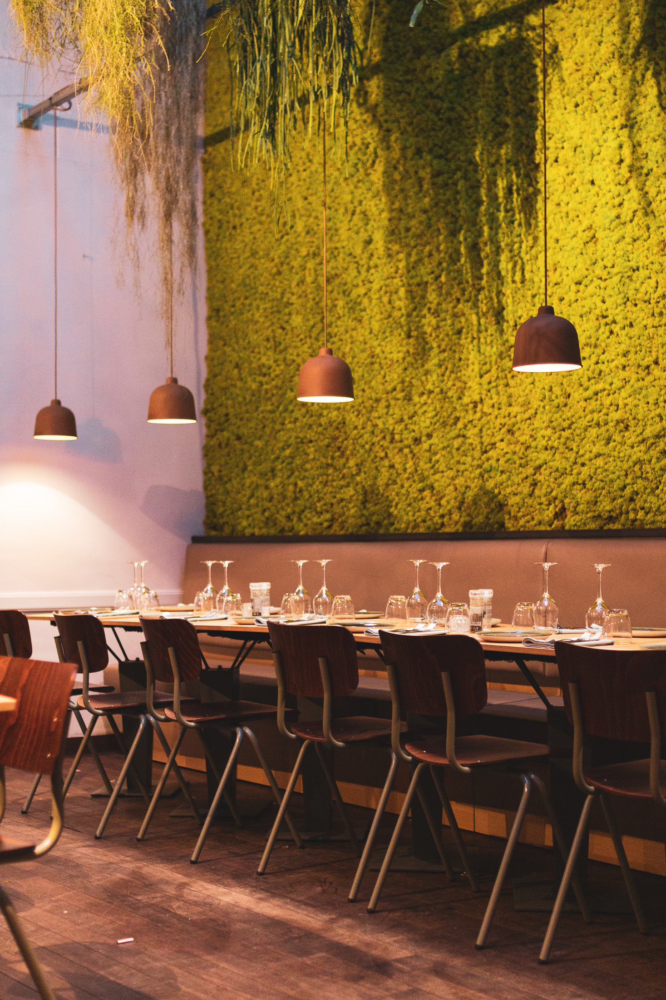

_Visiter Amsterdam en 1 jour peut paraître challengeant. Il y a tant à faire. Que voir ? Que faire ? Quoi privilégier ? Voici notre sélection d'essentiels à voir en un jour, selon notre point de vue de Français vivant à Amsterdam depuis 2016._

---

## 24h à Amsterdam

Nous vous proposons un **itinéraire piéton** qui vous permettra de découvrir les essentiels d’Amsterdam en une journée. Vous serez surpris de voir tout ce que vous pouvez découvrir d’Amsterdam **en 24 heures seulement** !

Au programme, le centre historique, le quartier rouge et les canaux. Vous aurez même le temps de faire quelques achats de souvenirs en fin de journée. Cet itinéraire d’une journée est parfait si, en plus, vous venez pour la première fois à Amsterdam.

Petit conseil, armez-vous d’une bonne paire de chaussures, car c’est à pied qu’Amsterdam se découvre le mieux !

_Attention :_

Vous partez pour 9 km de marche, répartis sur une journée entière, avec de nombreuses pauses. Si, pour certaines raisons, marcher n’est pas une option à privilégier pour vous, il est aussi tout à fait possible de se rendre d’un point à un autre en utilisant les transports en commun. Simplement, vous risqueriez de passer à côté de certains points de vue. Nous vous déconseillons aussi de louer des vélos, surtout lorsque vous ne connaissez pas du tout la ville. Votre visite d’Amsterdam se transformerait en grosse frayeur plutôt qu’en un moment de détente ! Enfin, Amsterdam est un véritable musée à ciel ouvert, réputée aussi pour sa météo capricieuse. N’oubliez donc pas de vous adapter à la météo du moment afin de profiter au maximum de cette visite extérieur.

<article slug='visite-guidee-amsterdam' cta='En savoir plus' excerpt></article>

## Itinéraire pour visiter Amsterdam en une journée

<iframe src="https://www.google.com/maps/d/embed?mid=1TPFkAQWuNOm38hkjyw1WjtKh7oViM13u" width="640" height="480"></iframe>

### Départ de Amsterdam Centraal

Grandes sont les chances que vous arriviez à Amsterdam par la gare **Amsterdam Centraal**, aussi appelée **Centraal Station**. C'est de ce point central de la ville que nous vous proposons de commencer votre visite.

> Construite à la fin du XIXe siècle (entre 1881 et 1989) par l’architecte Pierre J.H Cuypers, le plus grand architecte de l’époque, Amsterdam Centraal se situe à l’endroit où autrefois les vaisseaux et grand voiliers prenaient le large en direction des Indes ou de l'Amérique. Aujourd’hui, la gare d'Amsterdam est un véritable carrefour de la ville où des milliers de voyageurs transitent chaque jour.

### Amsterdam : le centre-ville historique

Depuis la gare, il est très facile de rejoindre la vieille ville ; il vous suffit de remonter le _Damrak_, directement jusqu’à la place du _Dam_.

#### Het Damrak

Le **Damrak** est une des principales artères du centre d'Amsterdam. Cette avenue commerçante est aussi très fréquentée. Lorsque le Damrak fut comblé _(voir explication plus bas)_, de nombreux bâtiments se sont construits. Les plus remarquables sont le **Beurs Van Berlage** — la bourse — et le **Bijenkorf** — l’équivalent des Galeries Lafayette françaises.

> À l'époque, le Damrak était en réalité une rivière - l'Amstel - qui rejoignait l'Ij, situé derrière la gare centrale. C'est ici que les premiers pêcheurs vinrent s'installer et construire une digue pour former un village. Vous remarquerez ainsi que le nom Amsterdam vient de l'ancien nom néerlandais _Amstelredamme_ évoquant les origines de la ville : la digue (qui se dit _« Dam »_ en Néerlandais) sur l'Amstel.

#### De Dam : la place du Dam

Lieu incontournable à Amsterdam, **le Dam** est une immense place pavée dominée par le **Koninklijk Paleis**, ancien Hôtel de Ville aujourd’hui bâtiment royal officiel, **la NieuweKerk**, le **musée Madame Tussauds** et le **National Monument**, monument aux morts de la Seconde Guerre mondiale.

Le Dam est une place très visitée et animée. Des artistes de rue s’y produisent, des manifestations y commencent ou s’y terminent et de nombreux évènements s’y déroulent tel que des fêtes foraines ou encore [la fête de la Tulipe](journee-nationale-de-la-tulipe).

> C’est à cet endroit précis qu’est né Amsterdam en 1270. Haut lieu d’activité économique, la place du Dam devient aussi le centre politique d’Amsterdam en 1655 de part la construction de l’Hôtel de Ville néoclassique, siège du gouvernement devenu Palais Royal sous Napoléon Bonaparte.

Le palais fut lui construit entre 1648 et 1665. D'abord Hôtel de Ville d'Amsterdam, il prit le statut officiel de palais en 1808 après l’accession au trône de Hollande par Louis Napoléon Bonaparte.

<gallery>

</gallery>

#### Het Begijnhof : le béguinage

_Depuis la place du Dam, rejoignez la Kalverstraat et repérez l’entrée du Begijnhof._

Véritable havre de paix, caché en plein centre-ville, **le Begijnhof** est l'une des plus anciennes cours intérieures de la ville. C’était un lieu pour femmes pieuses. Les béguines qui habitaient l’endroit étaient des femmes catholiques, célibataires, faisant preuve de piété et de charité auprès des déshérités. Aujourd’hui, il n'y a plus de femmes béguines et la plupart des habitations sont des habitations privées.

Datant du Moyen Âge, le béguinage d'Amsterdam est situé à environ un mètre en dessous du niveau du reste de la ville !

> Le _Begijnhof_ est composé d’un ensemble de maisons traditionnelles en pierre et d'une chapelle. Il abrite également une église cachée. À l’époque les bâtissent étaient en bois. Mais, après plusieurs grands incendies dans la ville, ce type de construction fut prohibé en 1521. Ce sont donc des maisons traditionnelles en pierre datant du XVIIIe siècle que vous y trouverez, exceptée **Het Houten Huys**, la maison de Bois, datant de 1470 et considérée comme l’une des plus vieilles maisons d’Amsterdam.

<gallery>

</gallery>

### De Bloemenmarkt : le marché aux fleurs

Amsterdam ne pourrez se visiter sans un détour le **Bloemenmarkt**, le marché aux fleurs, véritable institution de la ville.

Ce marché est très connu pour sa vente des bulbes de tulipes, symbole même des Pays-Bas. En plus des tulipes, vous y trouverez des bulbes d'amaryllis, jonquilles, narcisses ou crocus mais aussi des tournesols, des orchidées, des cactus et plantes vertes, ainsi que des babioles et nombreux souvenirs (parfois plus que les bulbes eux-mêmes) à l’effigie des Pays-Bas et d’Amsterdam.

> Datant de 1862, il se trouve le long du Singel, l'un des plus anciens canal d’Amsterdam. Il fut pendant longtemps un véritable marché flottant où les marchant venaient s’amarrer à la berge, le long des quais du marché, quelque chose d’unique au monde. Aujourd'hui, les boutiques sont toujours sur l'eau mais restent fixées.

<gallery>

</gallery>

### Rembrandtplein : la place Rembrandt

**Rembrandtplein** est certainement au top 3 du classement des plus jolies places d'Amsterdam.

#### Amsterdam, muse de Rembrandt.

Amsterdam comptait beaucoup pour Rembrandt qui s’y installa à l’âge de 20 ans. Depuis, la ville est très fière de ce lien particulier qu’elle entretenait avec le grand Maître du siècle d’or néerlandais.

> Depuis 1668, la place Rembrandt rend hommage à l’artiste. La statue de Rembrandt, située au centre de la place, est entourée depuis 2006 d’une reproduction physique de [La Ronde de Nuit,](https://i.f1g.fr/media/figaro/680x382_crop/2015/04/03/XVM137df492-cd70-11e4-8fd8-941b4a457061.jpg) un de ses plus grands Chef-d’œuvres. N’hésitez pas à comparer cette reconstitution avec le tableau original se trouvant au Rijksmuseum.

<gallery>

</gallery>

### Pause déjeuner

À ce stade de votre visite, vous êtes dans le lieu parfait pour **une bonne pause déjeuner**. La place _Rembrandtplein_ et la rue _Utrecthstraat_ offrent de nombreuses options de restauration, toutes plus ou moins bonnes... Nous vous recommandons les 3 endroits suivants :

#### Meat & Greek

**[Meat & Greek](https://www.meat-and-greek.com/)** propose d’excellentes Pitas souvlaki comme à Athènes, en version pain ou assiette. Vous pouvez aussi composer vous-même votre pita. Ils proposent aussi une alternative vegan qui est, à s’y méprendre, très ressemblante à de la viande et surtout excellente ! Attention par contre, il y a peu de place pour manger à l’intérieur. S’il fait beau, n’hésitez à prendre à emporter et à vous installer sur le bord d’un canal pour manger.

#### SLA

[**SLA**](https://ilovesla.com/) est une chaîne de restauration possèdant plusieurs adresses dans Amsterdam. Ici, vous pourrez composer votre salade de A à Z ou bien opter pour une composition de leur menu. Servi dans de grands bols, ces salades sont hyper complètes et très rassasiantes. Ici aussi, vous trouverez de nombreuses options vegétariennes et vegan.

#### Burgermeester

Si vous êtes des adeptes du combo frites - burger, oublier le MacDo d’en face et rdv chez **[Burgermeester](https://www.burgermeester.eu/)**.

<gallery>

</gallery>

### Amstel & Magere Brug

Une fois bien repu, vous êtes seulement à quelques pas de l’Amstel. Rejoignez alors le pont-levis, **le Magere Brug** aussi connu sous le nom de **Point Maigre**.

D’ici, vous aurez une belle vue sur **l’Opera National** mais aussi le très renommé **Théâtre Carré** ou encore le **musée de l’Hermitage**. C’est très certainement l’une des vues les plus photographiées de la ville.

> Amsterdam compte 1281 ponts ! Le Pont Maigre est sans aucun doute parmi les plus beaux de la ville. Mais c’est à la tombée de la nuit que le charme s’opère, car les centaines de lumières qui l’illuminent à la tombée de la nuit en font aussi l’un des ponts les plus romantiques.

<gallery>

</gallery>

### Reguliergracht

Vous l’aurez compris, Amsterdam est une ville de pont. Après le Pont Maigre, les plus remarquables sont ceux situés sur **Reguliergracht**.

Ce canal secondaire coupe à travers la Ceinture de canaux et offre l’une belle perspective avec une enfilade de sept ponts franchissant, tous parfaitement alignés. Pour cela il vous suffit de vous positionner à l’une ou l’autre extrémité du canal.

La vue la plus intéressante est sûrement à l’embranchement du _Herengracht_ d’où il est aussi possible d’apercevoir une quinzaine de ponts au total à la ronde !

> La maison au numéro 57-59 est très particulière. Elle fut construite en 1879 par l'architecte Isaac Gosschalk, celui-là même qui dessina la brasserie Heineken à l'entrée du Pijp. Sa facade est l'une des rares à combiner brique, bois et pierre dans Amsterdam.

<gallery>

</gallery>

### Ballade sur les canaux

La vue de _Reguliergracht_ est encore plus impressionnante depuis l’eau et non la route. Remontez donc en direction de Leidseplein pour **une ballade en bateau-mouche sur les canaux d’Amsterdam**.

Pour une première visite d’Amsterdam, nous recommandons toujours la marche à pied. Plus simple, plus agréable et surtout moins dangereux que le vélo lorsque l’on ne connaît pas la ville. Mais, au-delà de la randonnée citadine, il est absolument obligatoire (oui, oui, obligatoire !) de découvrir Amsterdam depuis les canaux, qui offrent un point de vue totalement différent sur l’architecture et surtout un petit aperçu de la vie locale amstellodamoise !

Plusieurs compagnies proposent des tours en bateau un peu partout dans Amsterdam. **[Blue Boat Company](https://www.blueboat.nl/)** proposent des départs réguliers de Leidseplein chaque jour de la semaine. La visite, avec audio-guide en français, dure environ 1h15.

> Les canaux d'Amsterdam s'étendent sur un total de plus de 100 kilomètres, avec quelque 1 200 ponts qui les traversent, reliant environ 90 îles.

Les trois principaux canaux sont le _Herengracht_, le _Keizersgracht_ et le _Prinsengracht_. Construits aux XVIIe siècle pendant l’Âge d’or néerlandais, ils forment ce que l'on appelle la « ceinture des canaux».

Le 14 juin 2010, les canaux d'Amsterdam ont obtenu le label patrimoine mondial de l'Unesco.

### Les Negen Straatjes

Une fois la ballade terminée, nous vous proposons de rejoindre le quartier des **9 Straatjes** ou **9 ruelles** en français. Les 9 Straatjes se trouvent toutes entre le _Rozengracht_, _Leidsestraat_, _Prinsengracht_ et _Singel_.

> Ces rues parallèles sont nommées d’après des termes rappelant le commerce des peaux qui était très en vogue au XVIIIe siècle.

- _Reestraat_: Rue du cerf
- _Hartenstraat_: Rue des chevreuils
- _Berenstraat_ : Rue des ours
- _Huidenstraat_ : Rue de la peau
- _Runstraat_ : Rue du tannage

Aujourd’hui seuls les noms des rues ont à voir avec cette activité. La plupart des commerces ont été remplacés par des petits cafés et restaurants, des boutiques de vêtements créateurs ou vintage, ou bien des galeries d’art. Leurs vitrines sont toutes plus photogéniques les unes que les autres et c’est vraiment l’endroit en ville pour chiner et faire des trouvailles surprenantes, loin des grandes chaînes de magasins que l’on croise dans toutes les métropoles du monde.

C’est le moment idéal pour faire une pause shopping. Nos coups de coeurs ? [Pluk](http://www.pluk-amsterdam.com/nl/), [Urban Cacao](https://www.facebook.com/UrbanCacao/) ainsi que [Scotch & Soda](https://www.scotch-soda.com/fr/fr/home), marque de vêtements 100% amstellodamoise

<gallery>

</gallery>

### Diner chez Spingaren

Pour le repas du soir, nous vous proposons d'aller chez **[Spingaren](https://spingaren.nl/en)**. Ce restaurant se situe sur le magnifique Herengracht, entre les _9 Straatjes_ et le quartier du _Jordaan_. Ici, vous pourrez manger de délicieux plats, entièrement fait maison à base de charcuterie préparée sur place ou bien partager une très grande planche. Plusieurs options végétariennes sont aussi disponibles.

Spingaren propose aussi un bon choix de vins et même des séances de dégustation dans une salle dédiée si cela vous plait.

Le lieu est très grand mais très charmant et surtout relativement vide en pleine semaine !

Enfin, n'hésitez à réserver à l'avance via leur site internet afin de bénéficier d'une réduction sur votre addition totale, en fonction de votre horaire d'arrivée.

### Quartier rouge de nuit

Enfin, une visite d’Amsterdam ne serait sans doute pas complète sans un détour par le quartier rouge.

Cette partie d’Amsterdam a fait la renommée “narcotique & sexuelle” de la ville. Sex shops, peep show, cinémas pornographique, live porno, théâtres pour adulte, musée du sexe, magasins de préservatifs en tout genre, certains clichés n’en sont pas..

Nous préférons nous y balader au petit matin lorsque la foule est encore endormie, mais il faut avouer tout de même que toutes ces lumières rouges procurent une ambiance particulière aux lieux la nuit. Par curiosité, sans pour autant y rester une éternité, faites un tour du quartier. Vous découvrirez une image assez différente d’Amsterdam.

> C'est Napoléon qui légalisa la prostitution à Amsterdam. On dit qu’il avait perdu une bataille parce que trop de ces soldats avaient attrapé la syphilis. Légaliser la prostitution permettait alors d’exercer un contrôle sur l’hygiène des prostituées. Ainsi étaient-elles obligées de s’inscrire sur un registre à la police. Toutes les 2 semaines, elles devaient en outre se faire examiner par un médecin.

Aujourd’hui il est estimé à environ 200 vitrines / cabines dans le quartiers rouge.

Mais derrière les apparences de ville romantique et très libérale, cela ne veut pas dire que le traffic n’existe pas... Un collectif n'hésite d'ailleurs pas à dénoncer une triste réalité : certaines, voir beaucoup, de ces jeunes femmes sont forcées et n'ont pas choisi de se prostituer. Après s'être fait promettre une carrière de danseuse dans leur pays d'origine, elles se retrouvent finalement à travailler dans les vitrines du quartier contre leur gré.

<iframe width="560" height="315" src="https://www.youtube.com/embed/y-a8dAHDQoo" frameborder="0" allow="accelerometer; autoplay; encrypted-media; gyroscope; picture-in-picture" allowfullscreen></iframe>
_Derrière cette performance artistique se cache un vrai message..._

Aussi, depuis plusieurs années, la mairie d’Amsterdam a lancé un plan de réhabilitation du centre d’Amsterdam et notamment du quartier rouge ; l’objectif étant avant tout de réduire la criminalité au profit des monuments historiques, nombreux dans le quartier. Cela passe notamment par une réglementation plus ferme de la prostitution, une réduction du nombre de coffre shop ainsi que des enseignes de restauration rapide.

### Retour à Centraal Station — Une nuit dans la ville.

Depuis le quartier rouge, il est très facile de revenir vers _Amsterdam_ _Centraal_. De là, vous pourrez rejoindre votre logement pour une nuit de sommeil bien méritée après toute cette marche, ou bien continuer s’il vous reste encore de l’énergie pour découvrir les trésors nocturnes de la ville. Amsterdam abrite une grande variété de bars et de clubs — à vous de choisir l’ambiance qui vous convient le mieux.

_Bien sûr, ceci reste une suggestion de parcours. Nous l’avons voulu optimisé afin de couvrir la majorité des points à voir en seulement 1 journée. Aussi, n’hésitez pas à inverser certaines activités, si la météo est capricieuse._

## Visiter Amsterdam en 1 jour : des idées supplémentaires

Parce qu’il est difficile de prévoir trop à l'avance question météo à Amsterdam. Il est possible que la pluie ou bien la grisailles soit au RDV lors de votre visite. Si le temps pluvieux vous empêche réellement de marcher à pied, pensez aux transports en commun, présents en grand nombre dans Amsterdam même. Il vous est aussi possible en cas de pluie de prendre un tram en direction de _Museumplein_ afin de visiter l’un des grands musées incontournables de la ville tel que le Van Gogh Museum ou le Rijksmuseum. Pour plus d’idée en cas de mauvais temps, n’hésiter à (re)-lire notre article [“Visiter Amsterdam sous la pluie”](visiter-amsterdam-sous-la-pluie).

Enfin, bien que le parcours proposé soit relativement le même et intéressant à faire, quel que soit le moment de l’année, Amsterdam propose de nombreuses activités saisonnières supplémentaires. Pour en découvrir davantage, voici nos différentes sélections saisonnières :

- [Visiter Amsterdam au mois de Décembre](amsterdam-en-decembre-que-voir-que-faire)
- [Visiter Amsterdam au Printemps](visiter-amsterdam-printemps-2019)
- [Que faire, que voir en automne à Amsterdam](que-faire-voir-automne-amsterdam)

<article slug='visite-guidee-amsterdam' cta='En savoir plus' excerpt></article>

## Visiter Amsterdam en 1 jour : bon à savoir

Enfin, si vous prévoyez un voyage dans la capitale très prochainement, n’hésitez pas à lire ou à relire notre [« Kit de survie pour visiter Amsterdam »](kit-survie-visiter-amsterdam-ultimate-guide) ainsi que notre article [« Comment venir à Amsterdam »](comment-se-rendre-a-amsterdam) afin de connaitre toutes les options possibles pour vous rendre à Amsterdam.

Visiter Amsterdam, même en une journée, reste un vaste programme ! Amsterdam mériterait que l’on s’y consacre au moins 2 jours afin d’en apprécier toute sa splendeur. Une journée, c’est un peu court. Mais l’itinéraire que nous proposons vous offre un bel aperçu de la ville et, nous l’espérons, vous donnera envie de revenir et de rester plus longtemps.

_N’hésitez pas à nous faire part de vos retours sur nos suggestions afin de nous puissions constamment l’améliorer. Enfin, dites-nous si ce genre de parcours vous plait et si vous aimeriez en voir davantage, sur différentes thématiques ou période de temps par exemple !_

---

