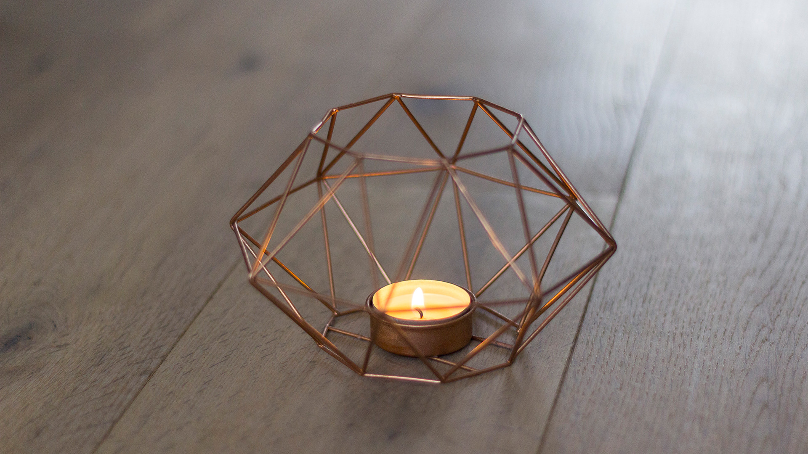
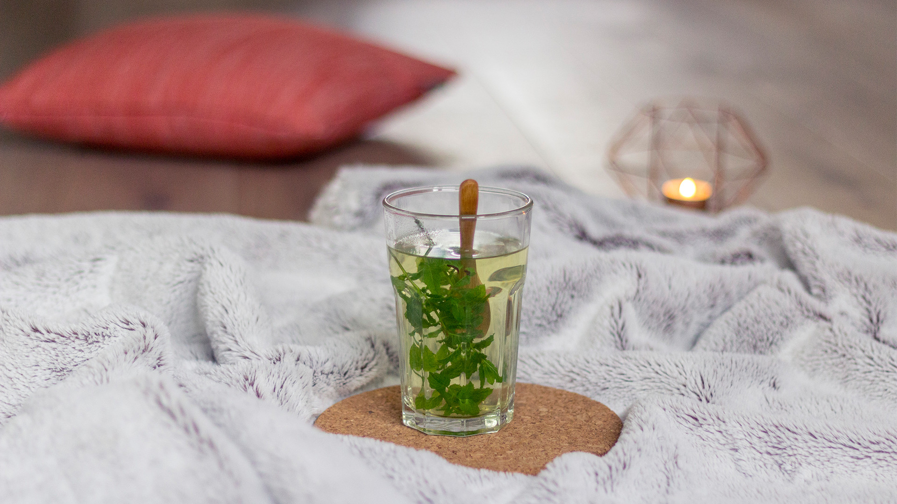
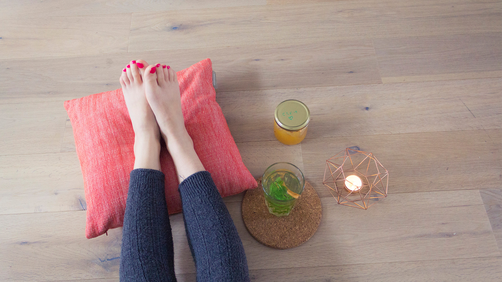
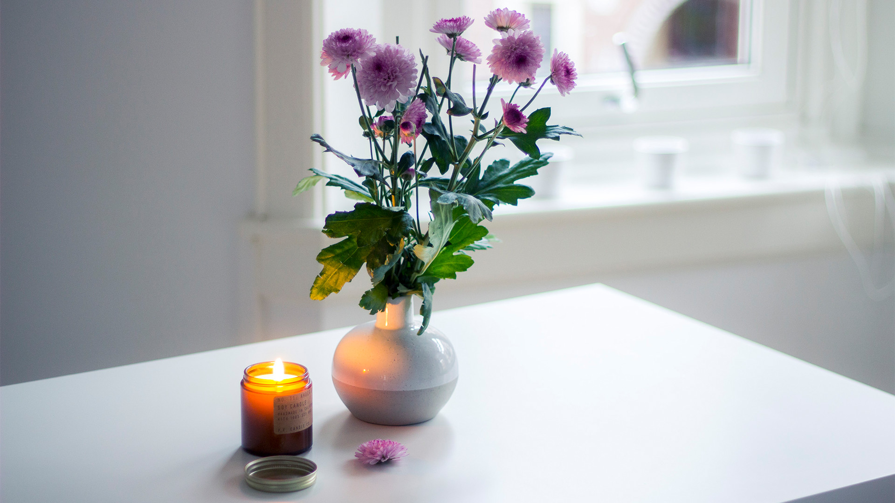

_Saviez-vous que les Pays Bas sont classés 7e sur l’échelle du bonheur, derrière, entre autre, le Canada, la Norvège et le Danemark ? Par comparaison, la France est classée 32e._

_Il y existe ce petit truc dans ces pays que, manifestement, les autres n’ont pas._

**Hygge** pour les Danois, **Lagom** pour nos amis suédois, **Gemütlichkeit** du côté de l’Allemagne, **Cwtch** chez les gallois, **Koselig** en Norvège et enfin **Gezellig** ici-même au Pays-Bas.

Ces mots peuvent sembler barbares à première lecture et chaque terme possède sa propre signification, unique. Pourtant, ils représentent tous une véritable culture nordique, celle d’un art de vivre plus doux ; centré sur la convivialité, la bonne humeur et le réconfort. Aucun ne connait de véritable équivalent en français. Ce sont des concepts abstraits qu’il est impossible de traduire au risque de perdre une partie de leur signification. C’est un peu comme vouloir traduire “la Saudade” portugaise en français. Littéralement impossible. Pour autant, cela ne veut pas dire qu’il est impossible d’en comprendre sa signification.

**Gezellig** _(prononcer “reuzéleir”)_ signifie “quelque chose” comme sympa, confortable, chaleureux, conviviale, agréable, accueillant, tout à la fois. Gezellig, c’est un sentiment de joie et d’appartenance, d’”être ensemble”. C’est lorsque vous ressentez cette petite chose difficilement descriptible — qui pourrait s’apparenter à de la joie, mais pas que — lorsque, par exemple, vous retrouver une amie de longue date pour prendre un café, ou bien que vous passiez un dimanche matin à paresser en pyjamas, un livre dans une main, un thé dans l’autre. C’est ce sentiment d’extrême satisfaction lorsque vous allumez une bougie par simple plaisir d’allumer une bougie. C’est ce petit plaisir lorsque vous confectionnez des biscuits et en offraient à vos collègues le lendemain. _Tout cela, c’est gezellig._

Finalement, **Het Gezelligheid** est une notion abstraite qui englobe une partie de ce qui rend la culture Dutch si “douce à vivre”. Le Gezellig, il faut le vivre pour le comprendre. Il semblerait d’ailleurs que le mot en lui-même dérive de “gezel”, signifiant compagnon, ami. **Gezellig** c’est donc un concept à propos de “être ensemble”, partager, offrir, profiter d’un moment avec soit-même, mais aussi avec quelqu’un. En discutant avec une collègue, on en est venu à la très simple définition qui est que le gezellig, c’est ce qui nous permet de rendre le temps moins pénible. C’est une façon de cheer up et de garde une attitude positive pendant les jours les plus longs de l’année ou bien les journées pluvieuses.

> Gezellig c’est _“s’approprier une portion d’herbe dans le parc, en le décorant de guirlande et de la fanions, préparer un barbecue et pic-niqué, assis par-terre sur une grande couverture”_.

### Ce sont des choses simples et spontanées.

- Prendre l’apéro en tirasse au moindre rayon de soleil (emmitouflé sous une couverture)
- Pédaler le long des canaux
- Se balader dans le Jordaan
- Aller au marché
- Se retrouver dans un café brun pour boire une bière
- Prendre l’apéro sur les canaux
- Aller à une fête
- Découvrir de nouveaux endroits
- Prendre un café avec un ami
- Faire du bateau sur les canaux
- Ne rien faire et rester chez soi avec son amoureux
- Cuisiner
- Marcher dans le parc

C’est pour chacun différent. Et très personnel. Mais c’est aussi ce qui y fait la beauté d’Amsterdam. C’est que chacun y vit comme bon lui semble, sans en gêner les autres.

**Le gezellig**, c’est ce qui rend si spécial la vie ici. Lorsque nous sommes arrivés pour la première fois au Pays-Bas, notre petit regard d’étranger a été surpris par la douceur de vivre qu’il puisse y régner ici. Personnellement, je ne cesse de me réjouir de la beauté de l’architecture et des canaux. J’ai envie de rentrer dans chaque petit café aillant installé des bougies sur leur terrasse, décoré leur fenêtre de guirlande lumineuse et proposant une petite panoplie de tartes et gâteaux réconfortant & fait maison lorsqu’il fait tout gris et tout pluvieux dehors. Je ne cesse de trouver mignons tous ces coins de maison en fleurs. J’aime Amsterdam pour toutes ces petites choses [toutes ces petites choses](petites-choses-amsterdam/), car tout simplement Amsterdam est **gezellig** ♥.

